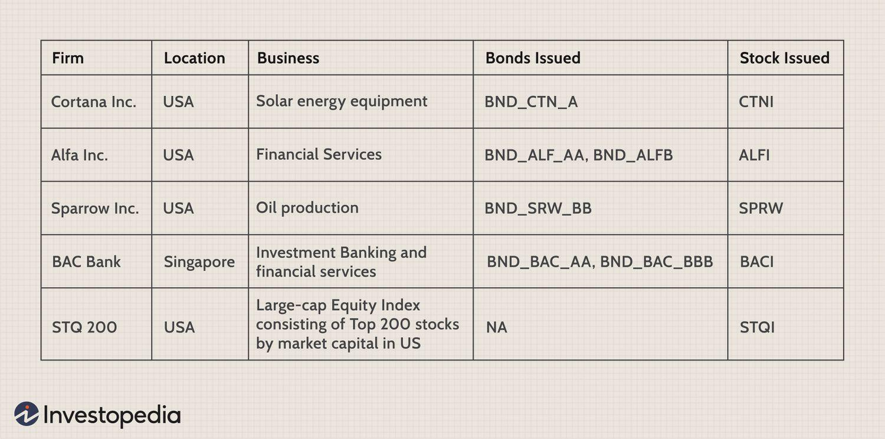

## Table of Contents

## What is wrong way risk?

Wrong way risk is when the risk of something going bad increases at the same time as the thing you are betting on goes down. Imagine you lend money to a friend who owns a coffee shop. If the coffee shop does badly and your friend can't pay you back, that's wrong way risk. The risk (your friend not paying you back) goes up when the thing you bet on (the coffee shop) goes down.

This kind of risk can be very dangerous because it can make losses much bigger. For example, if a bank lends money to a company and the company's business gets worse, the bank might lose the money it lent. If many companies the bank lent to are doing badly at the same time, the bank could lose a lot of money. That's why it's important to be careful and understand wrong way risk when making decisions about money.

## How does wrong way risk differ from right way risk?

Wrong way risk and right way risk are opposite ideas. Wrong way risk happens when the risk of losing money goes up at the same time as the thing you bet on goes down. For example, if you lend money to a friend who owns a coffee shop, and the coffee shop does badly, your friend might not be able to pay you back. This means the risk of not getting your money back goes up when the coffee shop's business goes down.

Right way risk is the opposite. It happens when the risk of losing money goes down when the thing you bet on goes down. Using the same example, if you had a deal with your friend where you get a part of the coffee shop's profits, and the coffee shop does well, you make more money. But if the coffee shop does badly, you lose less money because there are fewer profits to share. So, the risk of losing money goes down when the coffee shop's business goes down.

## Can you provide an example of wrong way risk in financial markets?

Imagine a bank that lends money to an oil company. The bank thinks the oil company will do well and be able to pay back the loan. But if the price of oil goes down a lot, the oil company might not make enough money to pay back the loan. This is wrong way risk because the risk of the bank losing money goes up at the same time as the oil company's business goes down.

This kind of risk can be very dangerous for banks because if many companies they lend to are doing badly at the same time, the bank could lose a lot of money. For example, during a big drop in oil prices, many oil companies might struggle to pay back their loans. If the bank has lent money to a lot of these companies, it could face huge losses. That's why banks need to be careful and understand wrong way risk when they lend money.

## What are the main causes of wrong way risk?

Wrong way risk happens when the risk of losing money goes up at the same time as the thing you bet on goes down. One main cause of wrong way risk is when the thing you bet on is closely linked to the risk. For example, if a bank lends money to an oil company and the price of oil goes down, the oil company might not make enough money to pay back the loan. The risk of the bank losing money goes up because the oil company's business goes down.

Another cause of wrong way risk is when big events affect many things at the same time. For example, during a big economic crisis, many companies might struggle to pay back their loans. If a bank has lent money to a lot of these companies, it could face huge losses. This is wrong way risk because the risk of the bank losing money goes up at the same time as the businesses of many companies go down.

Understanding these causes can help people and banks be more careful when they make decisions about money. By knowing about wrong way risk, they can try to avoid big losses and make smarter choices.

## How can wrong way risk impact a financial institution?

Wrong way risk can hurt a financial institution a lot. Imagine a bank that lends money to many oil companies. If the price of oil goes down, these oil companies might not make enough money to pay back their loans. This means the bank could lose a lot of money because the risk of not getting paid back goes up at the same time as the oil companies' business goes down. If the bank has lent money to a lot of oil companies, the losses could be huge and could even make the bank struggle to stay open.

This kind of risk can also make people trust the bank less. If people see that the bank is losing money because of wrong way risk, they might worry about their own money in the bank. They might take their money out, which can make the bank's problems even worse. So, it's really important for banks to understand and manage wrong way risk to keep their business safe and make sure people trust them.

## What are some common strategies to mitigate wrong way risk?

One common way to lower wrong way risk is by spreading out the risk. Instead of lending all their money to one type of business, like oil companies, a bank can lend to different kinds of businesses. This way, if one type of business does badly, the bank won't lose all its money. For example, if the bank also lends to tech companies and food companies, it can still make money from those loans even if the oil companies can't pay back.

Another way to reduce wrong way risk is by using special agreements called collateral. Collateral is something valuable that the borrower gives to the lender as a promise to pay back the loan. If the borrower can't pay back the loan, the lender can take the collateral instead. This helps the bank because even if the business goes down, the bank can still get something back. It's like having a safety net that catches the bank if things go wrong.

Banks can also use special tools called derivatives to manage wrong way risk. Derivatives are like bets on how things will go in the future. If a bank thinks the price of oil might go down and hurt the oil companies it lent money to, it can use derivatives to bet against oil prices. If oil prices do go down, the bank can make money from the derivatives, which can help cover the losses from the loans. This way, the bank can balance out the risk and protect itself better.

## How do regulatory bodies address wrong way risk?

Regulatory bodies, like the ones that watch over banks, know that wrong way risk can be very dangerous. They make rules to help banks manage this risk better. For example, they might tell banks to keep more money on hand, just in case things go wrong. They also ask banks to do special checks to see how much wrong way risk they have. This helps banks understand their risks better and be ready for problems.

Another way regulatory bodies help is by making banks share information about their risks. This way, everyone can see if a bank is taking too many chances. If a bank is not managing wrong way risk well, the regulators can step in and make the bank fix it. By doing these things, regulatory bodies try to keep the whole financial system safe and stop big problems from happening.

## What role does correlation play in assessing wrong way risk?

Correlation is very important when looking at wrong way risk. It means how much two things move together. If the thing you bet on and the risk of losing money move in the same way, that's a big problem. For example, if a bank lends money to an oil company and the price of oil goes down, the oil company might not make enough money to pay back the loan. The risk of the bank losing money goes up because the oil company's business goes down. This is wrong way risk, and it's worse when the correlation is high.

Understanding correlation helps banks see how much wrong way risk they have. If they know that the price of oil and the oil company's ability to pay back the loan are closely linked, they can be more careful. Banks can use this information to make better choices about who to lend money to and how much to lend. By paying attention to correlation, banks can lower their chances of big losses and keep their business safe.

## How can wrong way risk be quantified in risk management models?

To measure wrong way risk in risk management models, people often use something called "stress testing." This means they imagine bad things happening, like the price of oil dropping a lot, and see how it affects the bank's loans. They look at how much money the bank might lose if the bad thing happens. By doing this, they can understand how big the wrong way risk is and plan for it. They also use numbers called "correlation coefficients" to see how closely linked the thing they bet on and the risk of losing money are. If the numbers show a strong link, it means there's more wrong way risk.

Another way to measure wrong way risk is by using something called "[value at risk](/wiki/var-value-at-risk)" (VaR). This is a way to guess the most money a bank might lose over a certain time. When figuring out VaR, people think about how the thing they bet on, like the price of oil, might change and how it could affect the bank's loans. They use math to find out how much money the bank could lose if things go wrong. By doing this, banks can see how much wrong way risk they have and make plans to lower it.

## What are the differences between wrong way risk in credit and market risk contexts?

Wrong way risk in credit happens when the risk of someone not paying back a loan goes up at the same time as the thing the loan is based on goes down. For example, a bank lends money to an oil company, and if the price of oil falls, the oil company might not make enough money to pay back the loan. The bank's risk of losing money goes up because the oil company's business goes down. This kind of risk is tricky because it can make losses bigger if many borrowers are in the same situation at the same time.

In market risk, wrong way risk happens when the value of something a bank owns goes down at the same time as the risk of losing money goes up. Imagine a bank has bought stocks in a tech company, and if the tech industry has a big problem, the stock price might drop a lot. If the bank also has other investments that go down because of the same problem, the risk of losing money goes up as the stock price goes down. This kind of risk can be dangerous because it can affect many parts of the bank's investments at the same time.

## How does wrong way risk affect counterparty credit risk?

Wrong way risk makes counterparty credit risk worse. Counterparty credit risk is the chance that the other person in a deal won't be able to pay you back. For example, if a bank lends money to a company and the company can't pay back the loan, that's counterparty credit risk. When wrong way risk is added, it means the risk of the company not paying back goes up at the same time as the thing the loan is based on goes down. Like if the company is an oil company and the price of oil falls, the oil company might not make enough money to pay back the loan. This makes the bank's risk of losing money even bigger.

To manage this, banks need to be careful about who they lend money to and understand how the things they bet on might change. If a bank knows there's a high chance of wrong way risk, it can try to lower that risk by spreading out its loans to different kinds of businesses or asking for something valuable as a promise to pay back the loan. By doing this, the bank can protect itself better from big losses and keep its business safe.

## What advanced techniques are used to model and manage wrong way risk at an expert level?

To model and manage wrong way risk at an expert level, people use something called Monte Carlo simulations. These are like playing out many different stories of what could happen in the future. They use a computer to imagine lots of different ways the price of oil or the value of a company could change. By looking at all these different stories, experts can see how often wrong way risk might happen and how bad it could be. This helps them understand the risk better and plan for it.

Another advanced technique is using something called copulas. Copulas help experts see how different things are linked together. For example, they can show how the price of oil and the chance of a company not paying back a loan are connected. By understanding these links, experts can make better guesses about wrong way risk. They can use this information to make smarter choices about lending money and to set up ways to protect against big losses.

## What is Counterparty Risk and How is it Defined?

Counterparty risk, commonly referred to as default risk, encapsulates the potential hazard that a counterparty involved in a financial transaction may fail to fulfill its contractual obligations. This risk component became particularly pronounced following the 2007–2008 financial crisis, which underscored the pervasive implications of counterparty defaults across global financial systems.

In essence, counterparty risk forms an integral part of the overall credit risk spectrum. It is inherent in diverse financial instruments and operations, including derivatives, loans, and bonds. The intricate nature of these financial activities means that a default by one entity can trigger a chain reaction, impacting numerous other stakeholders. For instance, in derivative markets, if a counterparty defaults, the covered risk transforms from merely a market risk to a realized loss. This makes accurate measurement and management of counterparty risk critical for mitigating systemic threats.

Assessing counterparty risk involves evaluating the creditworthiness of the involved entities, which is statistically quantified using credit ratings and credit default swap (CDS) spreads. Moreover, techniques like Value at Risk (VaR) and Potential Future Exposure (PFE) are employed to gauge risk levels. The formula for calculating the expected exposure (EE), which is fundamental to understanding counterparty credit risk, can be expressed as:

$$
EE = \sum_{i=1}^{n} P(t_i) \times E(t_i)
$$

Where:
- $P(t_i)$ is the probability of counterparty i's default at time $t_i$
- $E(t_i)$ is the exposure at time $t_i$

Post the financial crisis, counterparty risk has become a focal point for financial institutions aiming to maintain structural stability and health. Regulations, such as the Basel III framework, emphasize strengthening the risk management apparatus by promoting higher capital and resilience requirements.

By thoroughly understanding and managing counterparty risk, institutions can better safeguard their financial health and limit exposure-related vulnerabilities, ensuring more resilient economic operations.

## References & Further Reading

[1]: Brigo, D., & Morini, M. (2010). ["Counterparty Credit Risk, Collateral and Funding: With Pricing Cases for All Asset Classes."](https://onlinelibrary.wiley.com/doi/book/10.1002/9781118818589) Wiley.

[2]: Gregory, J. (2015). ["The xVA Challenge: Counterparty Credit Risk, Funding, Collateral, and Capital."](https://onlinelibrary.wiley.com/doi/book/10.1002/9781119508991) Wiley.

[3]: Hull, J. (2012). ["Risk Management and Financial Institutions."](https://books.google.com/books/about/Risk_Management_and_Financial_Institutio.html?id=1J1QDwAAQBAJ) Wiley Finance.

[4]: Lopez de Prado, M. (2018). ["Advances in Financial Machine Learning."](https://books.google.com/books/about/Advances_in_Financial_Machine_Learning.html?id=oU9KDwAAQBAJ) Wiley.

[5]: Danielsson, J. (2011). ["Financial Risk Forecasting: The Theory and Practice of Forecasting Market Risk with Implementation in R and Matlab."](https://link.springer.com/article/10.1057/jdhf.2011.21) Wiley.