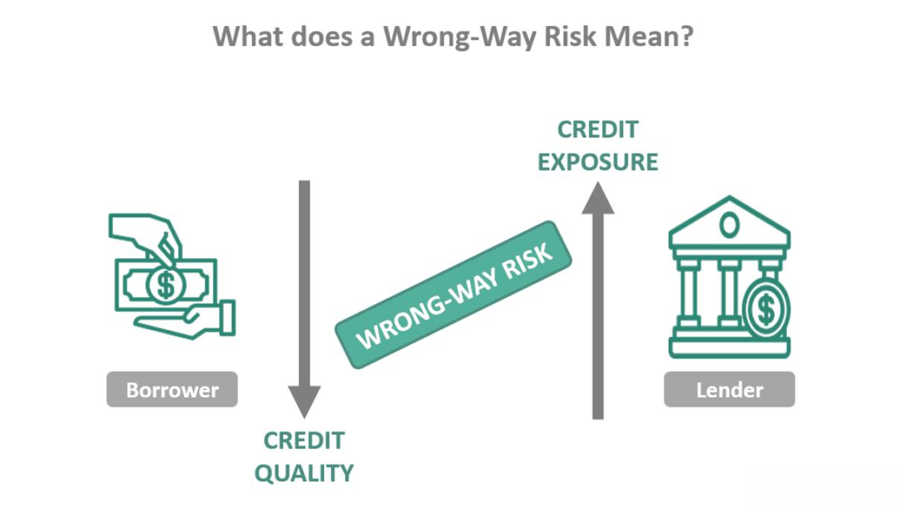

In the intricate landscape of finance, understanding the complexities of financial risks is essential for both financial institutions and investors. Financial risks can manifest in various forms, including wrong way risk, counterparty risk, and a broader spectrum of financial hazards. These risks are particularly pronounced in the domain of algorithmic trading, where rapid technological advancements have transformed the speed and complexity of transactions.

Wrong way risk occurs when the exposure to a counterparty is negatively correlated with the creditworthiness of that counterparty, leading to increased financial vulnerability. This type of risk can severely impact financial institutions if not identified and managed effectively. Counterparty risk, or default risk, refers to the possibility that one of the parties involved in a financial transaction may fail to meet its obligations. This risk gained prominence following the 2007-08 financial crisis, underscoring its significance in evaluating an institution's financial health and risk exposure.



Financial risk is a broader category that encompasses market risk, credit risk, and liquidity risk, among others. Algorithmic trading, which utilizes complex computer algorithms to execute trades at high speeds and volumes, introduces unique risks. While algorithmic trading offers benefits such as reduced costs and minimized human errors, it also heightens the exposure to market and counterparty risks. Consequently, rigorous risk assessment and management become even more imperative within this context.

This article aims to clarify these risks by exploring their definitions, types, and examples, while also discussing techniques for mitigating them. In doing so, it hopes to provide insights that will aid financial institutions in developing robust risk management strategies to protect against potential financial losses.

## Table of Contents

## Understanding Wrong Way Risk

Wrong way risk is a specific type of counterparty risk where there is an adverse correlation between the exposure to a counterparty and the creditworthiness of that counterparty. This risk can create substantial financial implications for institutions and investors, especially when it remains unidentified or is inadequately mitigated.

To illustrate, consider a scenario in which a financial institution has a significant exposure to a counterparty that is heavily reliant on a particular commodity. If the price of this commodity drops, not only does the exposure increase due to potential defaults, but the counterparty's credit quality deteriorates simultaneously, leading to wrong way risk. This adverse correlation can exacerbate the situation, potentially resulting in amplified losses.

Wrong way risk is further classified into two categories:

1. **Specific Wrong Way Risk (SWWR)**: This occurs when the correlation between exposure and creditworthiness is direct and identifiable. For instance, a bank providing a loan to a mining company could face specific wrong way risk if the repayment obligation is tied closely to the price of coal, where both the company's financial health and the bank’s exposure deteriorate with a fall in coal prices.

2. **General Wrong Way Risk (GWWR)**: This type of wrong way risk is not directly linked to an explicit contractual relationship but results from broader market factors. An example might be a broader macroeconomic downturn that affects both exposure levels and counterparty credit standing, without a direct one-to-one correlation.

Correct identification and timely mitigation of wrong way risk are critical to limiting potential adverse financial outcomes. This typically involves comprehensive stress testing, implementing rigorous credit evaluation processes, and enhancing risk management frameworks to identify correlation patterns that may signify wrong way risk.

## Defining Counterparty Risk

Counterparty risk, commonly referred to as default risk, encapsulates the potential hazard that a counterparty involved in a financial transaction may fail to fulfill its contractual obligations. This risk component became particularly pronounced following the 2007–2008 financial crisis, which underscored the pervasive implications of counterparty defaults across global financial systems.

In essence, counterparty risk forms an integral part of the overall credit risk spectrum. It is inherent in diverse financial instruments and operations, including derivatives, loans, and bonds. The intricate nature of these financial activities means that a default by one entity can trigger a chain reaction, impacting numerous other stakeholders. For instance, in derivative markets, if a counterparty defaults, the covered risk transforms from merely a market risk to a realized loss. This makes accurate measurement and management of counterparty risk critical for mitigating systemic threats.

Assessing counterparty risk involves evaluating the creditworthiness of the involved entities, which is statistically quantified using credit ratings and credit default swap (CDS) spreads. Moreover, techniques like Value at Risk (VaR) and Potential Future Exposure (PFE) are employed to gauge risk levels. The formula for calculating the expected exposure (EE), which is fundamental to understanding counterparty credit risk, can be expressed as:

$$
EE = \sum_{i=1}^{n} P(t_i) \times E(t_i)
$$

Where:
- $P(t_i)$ is the probability of counterparty i's default at time $t_i$
- $E(t_i)$ is the exposure at time $t_i$

Post the financial crisis, counterparty risk has become a focal point for financial institutions aiming to maintain structural stability and health. Regulations, such as the Basel III framework, emphasize strengthening the risk management apparatus by promoting higher capital and resilience requirements.

By thoroughly understanding and managing counterparty risk, institutions can better safeguard their financial health and limit exposure-related vulnerabilities, ensuring more resilient economic operations.

## Interplay with Financial Risk

Financial risk in financial markets is a comprehensive term that includes various types of sub-risks such as market risk, credit risk, and [liquidity](/wiki/liquidity-risk-premium) risk. These risks can significantly impact an institution's financial stability, and their interplay often complicates risk management efforts. Wrong way risk, a sub-category of counterparty credit risk, presents a unique challenge within this framework, as it arises when exposure to a counterparty is unfavorably correlated with the creditworthiness of that counterparty.

Market risk involves the possibility of financial losses due to market fluctuations, which can affect the value of investments. Credit risk refers to the risk of loss from a counterparty's failure to meet its contractual obligations. Liquidity risk is the risk that an entity might not be able to meet short-term financial demands due to an inability to convert assets into cash without a significant price concession. These risks are interconnected; for example, a market downturn (market risk) can exacerbate liquidity issues (liquidity risk) and increase the probability of defaults (credit risk).

Wrong way risk amplifies these financial risks by introducing a scenario where adverse conditions are compounded. For instance, during an economic downturn, a counterparty's creditworthiness might deteriorate just when a financial institution is most exposed to it. This wrong way risk scenario can lead to cascading effects: a reduction in market value (market risk), increased probability of default (credit risk), and potential liquidity challenges if assets need to be liquidated quickly.

Effective management of these intertwined risks requires well-structured financial strategies. This includes robust risk assessment frameworks that consider potential correlations and stress testing for extreme market scenarios. Institutions must ensure adequate capital reserves as prescribed by regulatory frameworks like Basel III, which recommend maintaining capital buffers to absorb potential losses.

Furthermore, diversification of investment portfolios and counterparty exposures can reduce concentration risk, which is key to mitigating wrong way risk. Implementing risk management systems that continuously monitor financial markets and counterparty relationships allows institutions to adapt strategies dynamically in response to changing market conditions. These proactive measures are essential to safeguard against the compounded effects of financial risks, ensuring long-term stability and resilience in the financial sector.

## Algorithmic Trading and Risks

Algorithmic trading refers to the use of computer algorithms to automate the process of trading securities. This technology enables the execution of transactions at speeds and volumes that would be impossible for human traders to achieve. While [algorithmic trading](/wiki/algorithmic-trading) offers several benefits, such as reducing transaction costs and minimizing human error, it also introduces distinct risks that need careful consideration.

One of the primary risks associated with algorithmic trading is market risk. Market risk, the possibility of financial loss due to fluctuations in market prices, is exacerbated in algorithmic trading because of the speed and [volume](/wiki/volume-trading-strategy) at which trades are executed. Algorithms can react to market events in milliseconds, potentially leading to extreme [volatility](/wiki/volatility-trading-strategies). For instance, the Flash Crash of May 6, 2010, highlighted the vulnerabilities of automated trading systems when the Dow Jones Industrial Average plummeted nearly 1,000 points in minutes before rebounding.

Counterparty risk is another significant concern in algorithmic trading. This risk arises from the possibility that the other party in a trading transaction may default on its obligations. Algorithmic trading can increase exposure to counterparty risk due to the sheer volume of transactions and reliance on complex financial instruments, such as derivatives, which inherently [carry](/wiki/carry-trading) higher counterparty risk.

The implementation of rigorous risk assessment and management strategies is critical for mitigating these risks. Effective risk management involves stress testing algorithms under various market conditions to identify potential weaknesses. Additionally, real-time monitoring of algorithm performance is essential to identify anomalies quickly and halt trading if necessary.

To ensure stability and security, many financial institutions employ a layered approach to risk management, combining risk limits, real-time oversight, and post-trade analysis. This comprehensive approach helps in identifying and addressing unusual trading patterns that could indicate underlying problems.

Overall, while algorithmic trading provides significant advantages in terms of efficiency and cost-effectiveness, the associated risks necessitate a thorough and proactive risk management strategy. Institutions must continually assess and refine their risk management practices to adapt to the evolving nature of financial markets.

## Mitigating Wrong Way and Counterparty Risks

Financial institutions employ a variety of strategies to mitigate wrong way risk and counterparty risk, which are integral to maintaining financial stability. One of the primary approaches is collateralization, a process where counterparties provide assets to secure their obligations. This reduces the potential loss in case of a counterparty default. The collateral acts as a buffer, allowing the non-defaulting party to recover a portion or entirety of its exposure.

Netting arrangements are another crucial strategy. Through netting, obligations between two counterparties are consolidated, so that only a single net payment is made. This can significantly reduce credit exposure. For example, if two counterparties have multiple transactions, instead of settling each transaction individually, they calculate the net exposure and settle the payment. Mathematically, if $A$ owes $B$ a total of $X$ and $B$ owes $A$ $Y$, the net amount to be settled is $X - Y$, assuming $X > Y$.

Stress testing is an essential tool for evaluating how financial portfolios can withstand extreme market conditions. Institutions simulate adverse scenarios to assess their impact on risk exposures. Python's simulation capabilities can be leveraged to construct such stress tests. Consider a simple stress scenario analysis using Python:

```python
import numpy as np

def stress_test(portfolio, shock_factor):
    stressed_portfolio = portfolio * shock_factor
    return stressed_portfolio

# Example usage
portfolio_value = np.array([100, 200, 150])  # in millions
shock_factor = 0.85  # Represents a 15% market shock
new_portfolio_value = stress_test(portfolio_value, shock_factor)
print(new_portfolio_value)
```

Adopting Basel III guidelines is pivotal for risk mitigation. Basel III mandates financial institutions to maintain higher capital reserves, enhancing their ability to absorb financial shocks and sustain operations during economic downturns. By increasing capital requirements, institutions are better equipped to handle unexpected losses and reduce systemic risk.

Continuous monitoring is necessary to adapt to macroeconomic changes. This involves real-time tracking of market conditions and credit exposures, allowing institutions to respond swiftly to evolving risks. Advanced analytics and [machine learning](/wiki/machine-learning) models are often employed to identify emerging trends and potential vulnerabilities in portfolios.

Overall, effective risk mitigation requires a combination of these strategies, underscoring the need for a proactive and adaptive approach to risk management in an ever-changing financial landscape.

## Conclusion

Understanding and managing wrong way risk, counterparty risk, and financial risk in algorithmic trading is crucial for the stability of financial markets. These risks are intricately linked, each capable of exacerbating the others if not properly addressed. Wrong way risk occurs when exposure to a counterparty negatively correlates with its creditworthiness, thus intensifying potential losses. Similarly, counterparty risk, especially highlighted after the 2007-08 financial crisis, reflects the danger of a counterparty defaulting on obligations, impacting the overall risk profile significantly.

To safeguard against potential financial losses, financial institutions must implement robust risk management practices. Techniques such as collateralization, netting arrangements, and stress testing are pivotal in creating a buffer against unforeseen market fluctuations. The adoption of Basel III guidelines is also critical; they mandate maintaining adequate capital reserves, which act as a financial cushion during crises.

Moreover, the constantly shifting macroeconomic environment necessitates a proactive approach to risk management. Institutions must continuously monitor and adapt their strategies to align with market changes. This might involve integrating advanced analytics and machine learning algorithms to predict and mitigate risks promptly. For example, modeling the correlation between asset values and counterparty creditworthiness could be implemented using Python libraries like NumPy and Pandas to process and analyze large datasets effectively.

By evolving these risk management practices, financial institutions can ensure a stable trading environment, thereby contributing to broader market stability. This evolution is an ongoing process, reflecting changes in regulation, technology, and market conditions. Ultimately, the goal is to create a resilient financial system capable of withstanding and adapting to various shocks and uncertainties.

## References & Further Reading

[1]: Brigo, D., & Morini, M. (2010). ["Counterparty Credit Risk, Collateral and Funding: With Pricing Cases for All Asset Classes."](https://onlinelibrary.wiley.com/doi/book/10.1002/9781118818589) Wiley.

[2]: Gregory, J. (2015). ["The xVA Challenge: Counterparty Credit Risk, Funding, Collateral, and Capital."](https://onlinelibrary.wiley.com/doi/book/10.1002/9781119508991) Wiley.

[3]: Hull, J. (2012). ["Risk Management and Financial Institutions."](https://books.google.com/books/about/Risk_Management_and_Financial_Institutio.html?id=1J1QDwAAQBAJ) Wiley Finance.

[4]: Lopez de Prado, M. (2018). ["Advances in Financial Machine Learning."](https://books.google.com/books/about/Advances_in_Financial_Machine_Learning.html?id=oU9KDwAAQBAJ) Wiley.

[5]: Danielsson, J. (2011). ["Financial Risk Forecasting: The Theory and Practice of Forecasting Market Risk with Implementation in R and Matlab."](https://link.springer.com/article/10.1057/jdhf.2011.21) Wiley.