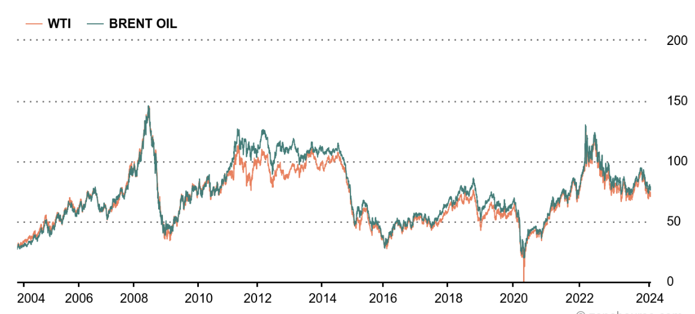
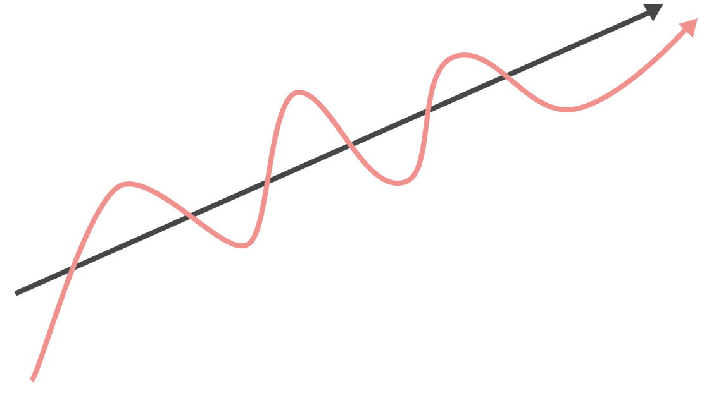
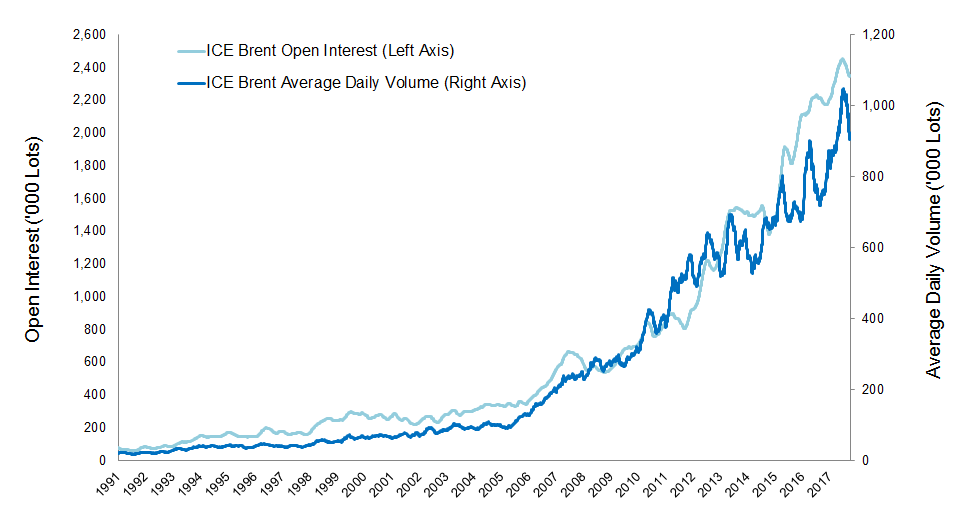

The WTI-Brent Spread represents the price difference between West Texas Intermediate (WTI) crude oil and Brent crude oil. This spread is a critical financial indicator for traders and analysts because it reflects regional variations in oil supply and demand, differences in transportation costs, and geopolitical factors that affect oil pricing. The volatility of this spread can lead to significant trading opportunities as it affects decisions in the energy sector, influences investor sentiment in commodity markets, and impacts global economic indicators.

The significance of the WTI-Brent Spread lies in its ability to indicate the health of the oil market, serve as a benchmark for pricing crude oil worldwide, and act as a barometer for geopolitical tensions that can disrupt supply chains. Traders monitor this spread closely, as shifts can signal changes in market dynamics and prompt strategic trading moves. For instance, a widening spread might suggest oversupply in the U.S. market or transportation bottlenecks, while a narrowing spread could signal increasing demand for WTI or potential supply issues with Brent.

Understanding the nuances of this spread is essential for trading strategies as it influences futures contracts and options pricing in the oil markets. Furthermore, the spread's volatility offers a fertile ground for arbitrage opportunities, enabling traders to profit from price discrepancies between these two major crude benchmarks.

## Understanding WTI and Brent Crude

West Texas Intermediate (WTI) crude is a light and sweet oil stream produced in North America, primarily extracted from oil fields in Texas, Louisiana, and North Dakota. Its low density and sulfur content make it ideal for refining into gasoline and diesel. As a benchmark, WTI is used to price oil predominantly consumed in the Americas.

Brent Crude, on the other hand, is sourced from the North Sea and is a combination of crude oil from 15 different oil fields in the Brent and Ninian systems. It is slightly heavier and less sweet than WTI, suitable for the production of diesel fuels and gasoline. Brent acts as the benchmark for African, European, and Middle Eastern oil and is used to set the price for two-thirds of the world's traded oil supply.

The quality differences influence production costs and market prices, with Brent typically commanding a higher price due to its greater utility in making transport fuels, though this can vary based on market dynamics. The extraction cost for WTI is generally lower due to the onshore resources, whereas Brent's offshore extraction can be more expensive.

## Historical Analysis of the WTI-Brent Spread

The WTI-Brent spread, the price difference between West Texas Intermediate (WTI) and Brent crude oils, has been a critical metric for traders and analysts since the crude oils were established as benchmarks. Historically, the spread has been influenced by a variety of factors, including regional production volumes, geopolitical tensions, and changes in transportation infrastructure.

Graphically, the spread's evolution shows a story of market dynamics and global events. For instance, the spread was relatively stable in the early 2000s but began to widen significantly in 2007 and 2008 during the financial crisis due to a drop in U.S. crude demand and a simultaneous increase in Middle Eastern and North Sea production, which set Brent prices on a different trajectory from WTI.

Another notable period was the early 2010s when the spread reached historical highs. The American shale revolution led to a surge in WTI production, while geopolitical disruptions in countries like Libya and sanctions against Iran tightened Brent supplies, resulting in a wide spread that reflected a glut of WTI and a scarcity of Brent on the global market.

Conversely, in the mid-2010s, the spread narrowed again as U.S. export restrictions were lifted, allowing the overflowing American oil to reach the global market, balancing the scales between WTI and Brent.

The historical analysis is not just a reflection of past price movements but also a contextual study that incorporates the impact of events such as wars, natural disasters, and policy changes. Each peak and trough tells a story of disruption and adaptation within the oil markets.

For a comprehensive understanding, traders often refer to seminal works such as "The Pricing of Crude Oil" by Bassam Fattouh, which delves into the complexities of oil benchmarks and their pricing mechanisms, offering insights into the intricacies of the WTI-Brent spread over time[1].

## Factors Influencing the WTI-Brent Spread

Geopolitical risk is a significant factor affecting the WTI-Brent spread. Events such as political instability in oil-producing regions, sanctions, and conflicts can disrupt supply chains, affecting the availability and cost of oil. For instance, tensions in the Middle East can lead to a spike in Brent prices due to fears of supply disruptions, widening the spread if WTI prices remain stable.

Transportation costs also play a crucial role. With WTI primarily landlocked and requiring transportation from Cushing, Oklahoma, to refining markets, logistical constraints can lead to a glut in supply at the storage hub, depressing WTI prices. Conversely, Brent, with its waterborne advantage, can be shipped relatively easily to different markets, keeping its prices comparatively stable or higher.

The dynamics of supply and demand exert perhaps the most direct influence on the spread. An increase in shale oil production in the United States can lead to an oversupply of WTI, causing its price to drop relative to Brent. On the demand side, a surge in global industrial activity can push up Brent prices more than WTI, as Brent is the benchmark for international oil prices.

Market sentiment, driven by traders' perceptions and speculative activity, can cause rapid changes in the spread. For example, if traders anticipate a significant change in the oil supply from either the U.S. or OPEC countries, they might bid the prices up or down, impacting the spread before the physical supply is affected.

Case studies highlighting these factors include the 2011 Arab Spring, which led to concerns about supply disruptions from the Middle East and North Africa and caused Brent to trade at a premium to WTI. Another is the U.S. shale oil boom in the early 2010s, which saw increased WTI production leading to a significant domestic surplus and thus a narrower spread.

Understanding these factors is crucial for traders who seek to capitalize on fluctuations in the WTI-Brent spread. By closely monitoring geopolitical developments, transport cost variations, supply and demand changes, and shifts in market sentiment, traders can make informed predictions about the movement of the spread and adjust their strategies accordingly.

## Pricing Models and Theoretical Framework

The pricing models applied to decipher the WTI-Brent spread are integral to understanding not just the current state but also the predictive trends that can be harnessed for trading. Central to these models is the **mean-reversion theory**, which posits that prices will tend to move towards the average over time. This theory is particularly applicable to the WTI-Brent spread, which historically has shown periods of significant divergence from the mean, followed by a gradual return. Mean-reversion models capture this cyclical behavior by identifying the historical average and the speed at which prices revert to it.

Another critical model is the **affine function model**, which introduces variables such as storage costs and convenience yield to describe the spread. These models provide a more nuanced view by incorporating the cost of carry and the benefits of having physical possession of oil. By using these inputs, affine models can offer a framework that adjusts to short-term deviations caused by logistical changes or shifts in storage demand.

Both models, while powerful, come with their own set of assumptions and limitations. Mean-reversion assumes that prices will always tend to return to the historical average, which may not hold true in the face of structural market changes. Additionally, it may not adequately capture the speed and unpredictability of short-term market shocks.

The affine function model's accuracy is highly dependent on the correct estimation of its variables, which can be difficult to ascertain. Moreover, it may not fully account for sudden geopolitical shifts or policy changes that can drastically alter the supply-demand dynamics, and by extension, the spread.

In essence, while these models are indispensable tools for traders and analysts, they must be employed with an understanding of their constraints and the recognition that no model can fully encapsulate the complex and ever-changing nature of oil markets. Their greatest utility lies in their ability to serve as baselines from which deviations can be analyzed for potential trading opportunities.

## Trading the Spread - Strategies and Risks

Trading the WTI-Brent spread involves a range of strategies that traders employ to capitalize on the price differential between these two benchmarks. Statistical arbitrage is a popular approach, where traders look for discrepancies between the expected and the current spread, betting on the convergence to the historical mean. This method relies on complex algorithms and quantitative models to identify profitable opportunities.

Pair trading is another common strategy that involves taking a long position in one benchmark while shorting the other, effectively betting on the change in the price difference rather than the price of oil itself. This approach is predicated on the idea that the prices of WTI and Brent will move towards each other, and profits are made on the relative change rather than absolute price movements.

Risks in trading the spread are multifaceted, including leverage risks. Many traders use leverage to amplify their trading capacity, which can lead to significant gains but also to magnified losses if the market moves against their positions. Liquidity risk is also a concern, as sudden market shocks can lead to a lack of market depth, making it difficult to exit positions without affecting the market price.

Risk management is critical in spread trading. Traders often set predefined limits on losses to safeguard their capital. They also monitor a wide array of market indicators to manage and hedge their positions effectively, ensuring that they are not overexposed to adverse market moves. Diversification across different commodities, geographical exposure, and temporal horizons can also mitigate risks.

In sum, while the potential returns of spread trading can be lucrative, they come with significant risks that need to be carefully managed. A disciplined approach to risk management and a deep understanding of market dynamics are essential for traders operating in this space.

## Econometric Analysis and Predictive Models

Econometric analysis provides a quantitative backbone for assessing and forecasting the WTI-Brent spread. By applying statistical methods to economic data, these tools help in identifying patterns, testing theories, and making predictions. Time-series analysis is particularly prevalent, utilizing historical price data to forecast future movements of the spread. Models such as Autoregressive Integrated Moving Average (ARIMA) are commonly used, capable of capturing the nuances of volatility and trends over time.

Cointegration models are another important tool, particularly in assessing the long-term relationship between WTI and Brent prices. These models are based on the principle that while the spread may fluctuate, the prices of WTI and Brent should move together over time if they are indeed cointegrated. This relationship is essential for traders who are betting on the convergence of the spread.

Predictive modeling often incorporates variables beyond historical prices, such as production figures, consumption data, and inventory levels. Machine learning algorithms have also been introduced, leveraging large datasets to improve the accuracy of predictions. For example, neural networks can detect complex nonlinear patterns in the spread that might be invisible to traditional econometric models.

However, the effectiveness of these models is subject to the quality of data and the stability of the underlying economic relationships. Structural breaks in the market, such as the 2020 pandemic's impact on oil demand, can render models based on past data less reliable. Therefore, while econometric tools and predictive models are powerful, they must be used with caution and in conjunction with a broader analysis of market conditions.

## The Role of Derivatives and Futures Contracts

Derivatives and futures contracts play a pivotal role in the dynamics of the WTI-Brent spread. Futures contracts, agreements to buy or sell oil at a predetermined price at a specified time in the future, allow traders to speculate on the direction of oil prices. The prices of these futures are a reflection of market expectations of future supply and demand, as well as traders' sentiment about global economic factors.

For WTI and Brent, the futures markets are the primary arenas where the spread is observed and traded. The difference between the futures prices of WTI and Brent directly constitutes the spread. When the market expects the supply of WTI to be higher relative to Brent, the futures price of WTI will be lower than that of Brent, resulting in a wider spread, and vice versa.

The term structure of futures contracts, or the shape of the futures curve, can indicate the market's perception of future supply and demand balances. A contango market, where future prices are higher than spot prices, may suggest an expected increase in supply or a decrease in demand for oil. In contrast, a backwardated curve, where spot prices are higher than future prices, indicates a tight supply situation or rising demand prospects. Movements in this curve can impact the spread as they reflect changing market sentiments about the balance between WTI and Brent crude oils.

The futures curve can also be influenced by storage costs, interest rates, and expectations of future market volatility. If the market expects significant volatility in the prices of WTI or Brent, this can be reflected in the premium traders are willing to pay for futures contracts, thus affecting the spread.

In essence, derivatives and futures contracts are not just financial instruments for hedging and speculation; they are also information mechanisms that reflect and influence the underlying market conditions that determine the WTI-Brent spread.

Derivatives and futures contracts play a pivotal role in the dynamics of the WTI-Brent spread. Futures contracts, agreements to buy or sell oil at a predetermined price at a specified time in the future, allow traders to speculate on the direction of oil prices. The prices of these futures are a reflection of market expectations of future supply and demand, as well as traders' sentiment about global economic factors.

For WTI and Brent, the futures markets are the primary arenas where the spread is observed and traded. The difference between the futures prices of WTI and Brent directly constitutes the spread. When the market expects the supply of WTI to be higher relative to Brent, the futures price of WTI will be lower than that of Brent, resulting in a wider spread, and vice versa.

The term structure of futures contracts, or the shape of the futures curve, can indicate the market's perception of future supply and demand balances. A contango market, where future prices are higher than spot prices, may suggest an expected increase in supply or a decrease in demand for oil. In contrast, a backwardated curve, where spot prices are higher than future prices, indicates a tight supply situation or rising demand prospects. Movements in this curve can impact the spread as they reflect changing market sentiments about the balance between WTI and Brent crude oils.

The futures curve can also be influenced by storage costs, interest rates, and expectations of future market volatility. If the market expects significant volatility in the prices of WTI or Brent, this can be reflected in the premium traders are willing to pay for futures contracts, thus affecting the spread.

In essence, derivatives and futures contracts are not just financial instruments for hedging and speculation; they are also information mechanisms that reflect and influence the underlying market conditions that determine the WTI-Brent spread.

## The WTI-Brent Spread and Global Economic Indicators

The WTI-Brent spread is closely watched by market participants as it can be an indicator of global economic health. Correlation analysis between the spread and various economic indicators can reveal insights into global economic trends. For example, a widening spread may indicate a stronger demand for Brent, which could be associated with robust global economic activity, as Brent crude is tied to the international market. Conversely, a narrowing spread could suggest a regionalized discrepancy, such as increased production in the United States affecting WTI more than Brent.

The spread can act as both a leading and lagging indicator. It is a leading indicator when it moves based on traders’ expectations of future economic conditions. For instance, if traders anticipate a global economic slowdown, the spread might widen as the demand for Brent, tied to international commerce, may be expected to decline relative to WTI. As a lagging indicator, the spread reflects current disparities in regional oil supply and demand which have already been impacted by economic conditions.

Analysts often look at the spread in conjunction with other indicators such as GDP growth rates, industrial production, and the Purchasing Managers' Index (PMI) to gauge economic health. A consistent correlation between these indicators and the spread can provide a more comprehensive view of economic trends and help inform investment decisions.

The relationship between the spread and economic indicators is not static and can be influenced by a myriad of factors, including policy changes, technological advancements in oil extraction and processing, and shifts in the geopolitical landscape. Therefore, continuous monitoring and analysis are essential for understanding the current state of the economy and the oil markets' role within it.

## Future Outlook and Emerging Trends

Future movements of the WTI-Brent spread will continue to be shaped by evolving market dynamics, including shifts in global energy supply and demand, technological advancements in extraction and production, geopolitical developments, and changes in transportation infrastructure and costs.

Current market analysis suggests that as U.S. shale oil production remains robust and export infrastructure improves, the WTI may experience downward pressure, potentially widening the spread. Conversely, any tension in oil-producing regions that supply Brent crude could cause the spread to narrow.

Emerging market trends also indicate increasing environmental concerns and a shift towards renewable energy sources which could alter the long-term demand for crude oil. This transition may impact the spread as different regions adapt at varying paces, affecting the relative demand for WTI and Brent.

Additionally, the adoption of new maritime regulations, like the International Maritime Organization's sulfur cap, can affect shipping costs and the demand for different types of crude oil, potentially influencing the WTI-Brent spread.

Investors and traders must remain vigilant, adapting to these trends and incorporating them into their predictive models to anticipate future movements of the spread. The use of advanced analytics and continuous market monitoring will be key in navigating the complexities of the WTI-Brent spread in the years to come.

## Conclusion

The WTI-Brent spread is a complex and dynamic aspect of the global oil market, providing valuable insights into economic health, geopolitical stability, and supply-demand shifts. This guide has underscored the spread's significance as a benchmark for traders, reflecting factors from transportation costs to geopolitical risks. It has highlighted the necessity of understanding the underpinnings of WTI and Brent crude, from their properties and production costs to the intricacies of their price movements over time.

Strategies for trading the spread require a solid grasp of various pricing models and an acute awareness of the associated risks, underpinned by rigorous risk management practices. The role of derivatives, the impact of global economic indicators, and the influence of market sentiment have been dissected to offer traders a multifaceted view of the spread.

💡 **Read more:**

- Trading strategies papers with code on [Equities](https://wiki.paperswithbacktest.com/trading-strategies/equities), [Cryptocurrencies](https://wiki.paperswithbacktest.com/trading-strategies/cryptocurrencies), [Commodities](https://wiki.paperswithbacktest.com/trading-strategies/commodities), [Currencies](https://wiki.paperswithbacktest.com/trading-strategies/currencies), [Bonds](https://wiki.paperswithbacktest.com/trading-strategies/bonds), [Options](https://wiki.paperswithbacktest.com/trading-strategies/options)
- [A curated list](https://github.com/paperswithbacktest/awesome-systematic-trading) of awesome libraries, packages, strategies, books, blogs, and tutorials for systematic trading
- [A bunch of datasets](https://huggingface.co/paperswithbacktest) for quantitative trading
- [A website to help you](https://paperswithbacktest.com/) become a quant trader and achieve financial independence

## References & Further Reading

[1]: ["The Pricing of Crude Oil"](https://www.oxfordenergy.org/wpcms/wp-content/uploads/2011/03/WPM40-AnAnatomyoftheCrudeOilPricingSystem-BassamFattouh-2011.pdf) by Bassam Fattouh

## Glossary

**WTI (West Texas Intermediate):** A grade of crude oil used as a benchmark in oil pricing. It is sourced primarily from U.S. oil fields.

**Brent Crude:** The major trading classification of sweet light crude oil that serves as a major benchmark price for purchases of oil worldwide.

**Spread:** The price difference between Brent crude and WTI.

**Benchmark Crude:** A crude oil that serves as a reference price for buyers and sellers of crude oil.

**Contango:** A market situation where futures prices are higher than current spot prices, typically indicating an expectation of higher future prices.

**Backwardation:** A market situation where current spot prices are higher than futures prices, suggesting tight supply or high immediate demand.

**Futures Contract:** A legal agreement to buy or sell a commodity at a predetermined price at a specified time in the future.

**Spot Price:** The current market price at which a particular commodity can be bought or sold for immediate delivery.

**Arbitrage:** The simultaneous purchase and sale of the same asset in different markets to profit from unequal prices.

**Pair Trading:** A market-neutral trading strategy enabling traders to profit from virtually any market conditions: uptrend, downtrend, or sideways movement.

**Geopolitical Risk:** The risk associated with political instability or changes in a country's political environment that can affect its economic prospects or the markets.

**Liquidity:** The degree to which an asset or security can be quickly bought or sold in the market without affecting the asset's price.

**Leverage:** The use of borrowed capital for (an investment's) the expectation of profitable returns.

**Term Structure:** The relationship between the yields of long-term and short-term bonds.

**Futures Curve:** A line that plots the prices of futures contracts for oil over different delivery dates.

**Hedge:** An investment to reduce the risk of adverse price movements in an asset.

**Volatility:** The degree of variation of a trading price series over time as measured by the standard deviation of returns.

**API Gravity:** A measure of how heavy or light a petroleum liquid is compared to water.

**Sweet Crude:** Oil with a low sulfur content.

**Sour Crude:** Oil with a high sulfur content, which requires more refining to meet current product specifications.

**OPEC (Organization of the Petroleum Exporting Countries):** An intergovernmental organization of 13 oil-exporting developing nations that coordinates and unifies petroleum policies among Member Countries.

**EIA (Energy Information Administration):** A principal agency of the U.S. Federal Statistical System responsible for collecting, analyzing, and disseminating energy information.

**Derivative:** A security with a price that is dependent upon or derived from one or more underlying assets.