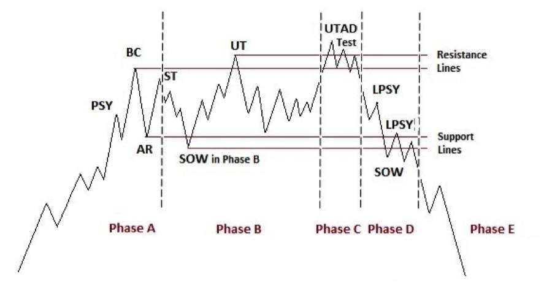

The Wyckoff Method, developed by Richard D. Wyckoff in the early 20th century, is a robust framework for technical analysis in financial markets. This method offers valuable insights into the mechanics of market cycles, making it a compelling tool for investors aiming to make informed decisions. At its core, the Wyckoff Method seeks to demystify how and why prices move in specific patterns over time, offering a systematic approach to understanding the market's underlying dynamics.

The significance of the Wyckoff Method lies in its ability to dissect market cycles, which consist of distinct phases: accumulation, markup, distribution, and markdown. The accumulation and distribution phases are particularly crucial, serving as the foundational stages where market trends begin and end. Accumulation refers to periods where major players, such as institutional investors, gather positions in anticipation of future price increases. In contrast, the distribution phase is characterized by large-scale selling, often resulting in price declines. Recognizing these phases is essential for investors as they provide clues about upcoming market movements and potential opportunities to enter or exit trades.



Employing the Wyckoff Method involves analyzing price and volume data to identify the phases of accumulation and distribution effectively. This analysis can guide investment decisions by signaling optimal times for market entry or exit, thus enhancing potential returns while managing risks. Furthermore, the Wyckoff Method's structured approach offers a foundation for integrating technical analysis into algorithmic trading. In algorithmic trading, these principles can be leveraged to develop strategies that automatically detect these phases, execute trades, and manage positions with precision and efficiency, adapting to ongoing market conditions.

By understanding and applying the Wyckoff Method, traders and investors can gain an edge in navigating market complexities and improve their investment outcomes. As markets continue to evolve with technology, the integration of Wyckoff's insights into automated systems could reshape trading strategies, making technical analysis more accessible and actionable than ever.

## Table of Contents

## The Wyckoff Method Overview

The Wyckoff Method is a seminal framework in technical analysis developed by Richard D. Wyckoff. It is renowned for its systematic approach to understanding and interpreting market behavior, which is pivotal for making informed trading decisions. The method's foundation is built on the premise that the market operates in cycles, driven by the dynamics of supply and demand, reflected through price and volume.

At the core of the Wyckoff Method are four principal phases that compose the market cycle: accumulation, markup, distribution, and markdown. 

1. **Accumulation Phase**: This phase is characterized by the acquisition of large volumes of an asset by informed participants, often referred to as "smart money." During accumulation, prices are relatively stable, trapped within a trading range, as large players gradually build positions without significantly affecting the market price. This phase sets the stage for an upward trend, as the latent demand eventually exceeds supply.

2. **Markup Phase**: Following accumulation, the market enters a markup phase where prices begin to rise as the demand established in the previous phase starts to influence the market. The release of upward pressure often results from increased public participation, driving prices higher. It is during this phase that trends are most visible, with the emergence of ascending trend lines and notable breakouts.

3. **Distribution Phase**: The distribution phase occurs when major holders of an asset begin to sell their positions into market strength. This phase mirrors accumulation but in reverse, characterized by increased supply met with steady demand. Price action typically forms another trading range, with distinct volatility spikes as larger investors offload their shares.

4. **Markdown Phase**: The final stage of the cycle is markdown, where the market witnesses a downward trend as the supply that was built during distribution outweighs demand. Prices decrease sharply, often below support levels established during accumulation, leading to significant declines until a new accumulation phase emerges.

Wyckoff's methodology also includes a set of analytical rules that focus on interpreting trend behavior and price movements through the lens of these cycles. A key element in his approach is identifying the relationship between price and [volume](/wiki/volume-trading-strategy), where specific patterns can reveal the underlying forces at play:

- A **rise in volume** accompanying **price uptrends** suggests genuine demand and strength in the move.
- Conversely, a **decrease in volume** during **price uptrends** could indicate a lack of participation, potentially heralding a reversal or the end of a markup phase.
- In **downtrends**, an **increase in volume** may confirm selling pressure, indicative of a sustained markdown, whereas falling volume could suggest weakening momentum and possible accumulation.

By analyzing these indicators, traders can more accurately identify the current phase of the market cycle and thus make informed trading decisions. Understanding the mechanics of these phases and the interplay of price and volume is crucial for applying the Wyckoff Method effectively. The systematic nature of Wyckoff's analysis offers a robust foundation for traders seeking to grasp market dynamics and anticipate future price movements.

## Accumulation and Distribution in Wyckoff Method

The Wyckoff Method is a cornerstone of technical analysis, focusing extensively on understanding accumulation and distribution phases, which are integral to predicting market movements. The accumulation phase is a period where informed buyers, often large-scale institutional investors, begin to "accumulate" shares without significantly moving the stock's price upward. This phase is indicative of a bottoming process, where the market transitions from a bearish to a bullish outlook.

During accumulation, the market operates in a trading range, characterized by a series of lows and highs within a defined price band. The aim is often to acquire a significant position discreetly, preventing a substantial price increment that would alert other market participants. Volume analysis is crucial during this phase. You might notice an increase in volume on upward price movements within the trading range, signaling strong buying interest, while the down moves are typically on lower volume, indicating a lack of significant selling pressure.

In contrast, the distribution phase mirrors accumulation but in reverse. Here, market participants strategically sell ("distribute") their holdings into market strength, generally at or near the top of a market cycle. The strategy is to offload a substantial position without driving the price downward too quickly, which would diminish selling prices. This phase is marked by a period of apparent price stability before a market downtrend ensues, known as the markdown phase.

The distribution phase also features a trading range, though it's typically associated with higher [volatility](/wiki/volatility-trading-strategies) compared to the accumulation phase. Volume patterns indicating distribution often show increased volume during price advances and lighter volume on pullbacks, suggesting that smart money is selling into the rising prices. A hallmark signal of impending distribution is the climax top, where a security experiences a rapid price increase accompanied by a spike in volume, followed by a sharp reversal.

Behaviorally, accumulation and distribution can be identified through specific market signals, such as springs and upthrusts. A spring in accumulation is a temporary price drop below the established trading range, followed by a swift recovery – often a trap for short sellers. Conversely, an upthrust in distribution is a temporary [breakout](/wiki/breakout-trading) above the trading range, luring in buyers before a rapid decline resumes the downward trend.

Seasoned traders often rely on these nuanced observations of volume and price action, employing them as critical indicators of forthcoming price changes. By understanding the hallmarks of accumulation and distribution phases, investors can better time their entry and [exit](/wiki/exit-strategy) points, maximizing profitability while aligning their trades with underlying market dynamics.

## Algorithmic Trading and Wyckoff Method

Algorithmic trading, characterized by the use of computer programs to execute trading strategies at high speed and volume, can greatly benefit from the principles of the Wyckoff Method. The integration of Wyckoff's market cycle concepts into algorithmic systems offers the potential for enhanced strategic decisions and improved trading outcomes.

One of the central aspects of the Wyckoff Method is the identification of accumulation and distribution phases. Algorithms excel at pattern recognition, making them ideal for accurately detecting these phases. In an accumulation phase, large investors or "smart money" gradually build positions, creating a platform for prices to rise. Conversely, the distribution phase is marked by these investors selling their holdings, often leading to a price decline. By programming algorithms to recognize the distinctive price-volume patterns associated with these phases, traders can gain a competitive edge.

For example, an algorithm might be designed to monitor volume spikes without significant price changes, which could indicate accumulation. Similarly, detecting a series of price advances accompanied by decreasing volume may suggest distribution. Python, a popular language in [algorithmic trading](/wiki/algorithmic-trading), can be utilized to implement these signals. A simple Python pseudocode snippet for monitoring accumulation indicators might look like this:

```python
def is_accumulation(volume_list, price_list):
    for i in range(1, len(volume_list)):
        if volume_list[i] > volume_list[i-1] and price_list[i] <= price_list[i-1]:
            print("Accumulation Phase Detected")

# Example data (replace with real-time data in practice)
volume_data = [100, 120, 150, 180, 200]
price_data = [50, 49, 48, 48, 47]

is_accumulation(volume_data, price_data)
```

The automation advantage in algorithmic trading stands out during transitional market cycles. Trading bots, operating within predefined parameters, can execute buy and sell orders with precision, 24/7, removing emotional biases and human errors. This capability is particularly beneficial during the transition between accumulation and markup phases or distribution and markdown phases, where human traders might struggle with timing decisions due to the psychological pressures of market volatility.

Automation also enables real-time data processing, which is crucial when market conditions shift rapidly. Algorithms can quickly adjust to changes, maintaining positions that align with the strategic intents of Wyckoff's principles. These systems can also backtest strategies using historical data to refine execution, optimizing performance over time.

In summary, the integration of the Wyckoff Method into algorithmic trading enhances the ability to identify market phases and manage trades effectively. The precision and speed of algorithms, combined with Wyckoff's insights, empower traders to navigate transitional cycles with greater confidence and success.

## Practical Application of Wyckoff in Algo Trading

Implementing Wyckoff’s principles in algorithmic trading systems requires a systematic approach to effectively capture market cycles and make strategic trade decisions. Here, we outline the steps involved and discuss a practical case study along with risk mitigation strategies.

### Steps to Implement Wyckoff’s Principles

1. **Data Collection and Preprocessing**: Gather historical price and volume data from reliable sources. Preprocessing should include cleaning data, normalizing for time frames, and filling any missing values to ensure data accuracy.

2. **Phase Classification**: Use Wyckoff’s principles to classify market data into accumulation, markup, distribution, and markdown phases. This can be achieved through pattern recognition algorithms that identify specific price-volume characteristics.

3. **Signal Generation**: Develop algorithms that generate buy or sell signals based on the phase classifications. For example, buying signals might be triggered during the late stages of the accumulation phase, while selling signals are initiated as the distribution phase progresses.

4. **Backtesting**: Implement rigorous backtesting of the trading strategy on historical data to assess its performance. This involves using metrics such as return on investment (ROI), Sharpe ratio, and maximum drawdown to evaluate potential profitability and risks.

5. **Optimization**: Continuously optimize the algorithm parameters and rules to improve accuracy and reduce false signals. This might include tuning thresholds for entry and exit or incorporating additional indicators.

6. **Deployment and Monitoring**: Deploy the algorithm in a live trading environment and continuously monitor its performance. Use feedback loops to refine strategy based on real-time data and market changes.

### Case Study: Algorithmic Trading with Wyckoff Method

A practical example involves a trading algorithm built to trade on the NASDAQ exchange. The algorithm used Wyckoff’s price-volume patterns to identify accumulation and distribution phases. During the testing phase, the system was able to predict significant upward trends by identifying prolonged periods of low price volatility accompanied by increased volume—a signature of the accumulation phase.

By leveraging [machine learning](/wiki/machine-learning) techniques for pattern recognition, the algorithm achieved an average annual return of 15% over a two-year testing period. The use of adaptive learning allowed the system to dynamically adjust to different market conditions, enhancing its robustness.

### Potential Pitfalls and Best Practices

While integrating Wyckoff’s method in algorithmic trading offers substantial benefits, it is important to consider potential pitfalls:

- **Overfitting**: This occurs when the algorithm is too closely tailored to historical data, reducing its predictive power in live markets. Regularly updating and validating models can mitigate overfitting.

- **Market Anomalies**: Algorithms may not perform well during unexpected market events or significant economic shifts. Incorporating risk management strategies, such as stop-loss mechanisms and diversification, can help manage these anomalies.

- **Computational Costs**: High-frequency data processing and pattern recognition can be computationally expensive. Efficient coding practices and robust computational resources can address these challenges.

By following these best practices, traders can effectively leverage Wyckoff’s principles within algorithmic trading systems to potentially enhance market analysis and trade execution.

## Interpreting Wyckoff's Price Volume Relationship

Wyckoff’s price-volume relationship forms a critical aspect of his technical analysis method. This relationship posits that volume changes can indicate shifts in market trends long before they manifest in price movements. Essentially, volume acts as a precursor to price action, offering clues about the strength or weakness of a current market phase. In Wyckoff’s theory, a trend's sustainability is often validated by corresponding volume behavior, where increasing volume confirms a prevailing trend, and diminishing volume might indicate potential reversals or transitions into a new phase.

During the accumulation phase, for example, relatively low prices coincide with increasing volumes, suggesting the building of positions by informed investors. Conversely, in the distribution phase, volumes spike as major players offload their positions, even while prices might still be rising or stable. Understanding these volume dynamics is crucial for identifying the underlying market sentiment and anticipating future price actions.

In the context of algorithmic trading, the integration of Wyckoff’s price-volume relationship can significantly enhance trade decision-making processes. Modern trading algorithms are equipped to analyze vast datasets to detect nuanced patterns in price and volume. By programming these algorithms to recognize Wyckoff's patterns, traders can automate the monitoring of real-time market data and swiftly execute trades in alignment with identified trends.

A straightforward approach involves using Python, a popular language in algorithmic trading, to develop a simple pattern detection mechanism. For instance, one might use pandas for data manipulation and machine learning libraries like TensorFlow or scikit-learn to train models that can predict the shifts in market phases based on historical price and volume data.

```python
import pandas as pd
from sklearn.ensemble import RandomForestClassifier

# Load historical market data
data = pd.read_csv('market_data.csv')

# Feature Engineering: Calculate volume and price changes
data['Price_Change'] = data['Close'].pct_change()
data['Volume_Change'] = data['Volume'].pct_change()

# Define target based on phase transitions
data['Target'] = data.apply(lambda row: 1 if criteria_for_phase(row) else 0, axis=1)

# Train RandomForest to detect phase changes
X = data[['Price_Change', 'Volume_Change']]
y = data['Target']

model = RandomForestClassifier()
model.fit(X, y)

# Detect current phase
latest_data = get_latest_market_data()
prediction = model.predict(latest_data)

def criteria_for_phase(row):
    # Implement criteria based on Wyckoff phases
    return row['Volume_Change'] > threshold and row['Price_Change'] < threshold_2
```

The example above outlines a basic methodology for designing an algorithm that discerns market phases through continuous analysis of price and volume changes, rooted in Wyckoff’s theory. As algorithms become increasingly sophisticated, they can incorporate more advanced pattern recognition and machine learning techniques, further refining the traders’ ability to predict and adapt to market dynamics efficiently. This automation allows for more precise execution of trading strategies, minimizing human error and potentially enhancing returns.

## Concluding Thoughts

The Wyckoff Method, with its robust framework for interpreting market behaviors through phases of accumulation and distribution, offers significant utility when integrated with algorithmic trading. Its effectiveness in algorithmic trading stems from its emphasis on understanding the underlying market dynamics, which enhances the precision and timing of trade decisions. By leveraging the predictability of market cycles inherent in the Wyckoff Method, traders can develop algorithms that reliably recognize transitional points, optimizing entry and exit strategies.

As financial markets continue to evolve with increasing automation, the synergy between the Wyckoff Method and algorithmic trading becomes even more potent. Automation allows for the continuous monitoring and analysis of vast sets of market data, enabling the detection of patterns and signals described by Wyckoff with minimal latency. This facilitates more timely and informed trading decisions, aligning with Wyckoff's principles and thereby potentially improving trading efficiency and profitability.

The future prospects of combining the Wyckoff Method with algorithmic strategies appear promising in rapidly changing markets. The integration of technical analysis with algorithmic intelligence empowers traders to automate complex trading strategies while maintaining adherence to established technical frameworks. As machine learning and [artificial intelligence](/wiki/ai-artificial-intelligence) methods advance, there are prospects for even more sophisticated applications of the Wyckoff Method, allowing traders to harness big data for granular insights.

It's recommended that traders embrace a holistic approach by combining traditional technical analysis with contemporary algorithmic strategies. This fusion can mitigate risks and leverage each method's strengths, ultimately leading to more resilient trading protocols capable of navigating the uncertainties of modern financial markets. By doing so, traders not only uphold the analytical rigor of Wyckoff's principles but also adapt effectively to technological advancements, positioning themselves to maximize outcomes in an increasingly automated trading landscape.

## References & Further Reading

[1]: ["The Wyckoff Method: A Tutorial"](https://chartschool.stockcharts.com/table-of-contents/market-analysis/wyckoff-analysis-articles/the-wyckoff-method-a-tutorial) from StockCharts.com

[2]: ["Richard D. Wyckoff: Trading and Investing Course"](https://www.amazon.com/Richard-Wyckoff-Method-Trading-Investing/dp/B00F9H92NK) by Dr. Gary Dayton

[3]: Pring, M. J. (1991). ["Technical Analysis Explained: The Successful Investor's Guide to Spotting Investment Trends and Turning Points"](https://archive.org/details/technicalanalysi00prin) 

[4]: ["Technical Analysis of Stock Trends"](https://www.investopedia.com/terms/t/technical-analysis-of-stocks-and-trends.asp) by Robert D. Edwards, John Magee, and W.H.C. Bassetti

[5]: ["Trading and Exchanges: Market Microstructure for Practitioners"](https://www.amazon.com/Trading-Exchanges-Market-Microstructure-Practitioners/dp/0195144708) by Larry Harris

[6]: Wyckoff, R. D. (1937). ["Stock Market Technique Number One"](https://1library.net/document/q58e41jq-wyckoff-richard-stock-market-technique-no-pdf.html) 

[7]: ["Quantitative Finance For Dummies"](https://www.amazon.com/Quantitative-Finance-Dummies-Steve-DPhil/dp/1118769465) by Steve Bell

[8]: ["The Intelligent Investor: The Definitive Book on Value Investing"](https://www.amazon.com/Intelligent-Investor-Third-Definitive-Investing/dp/0063423537) by Benjamin Graham