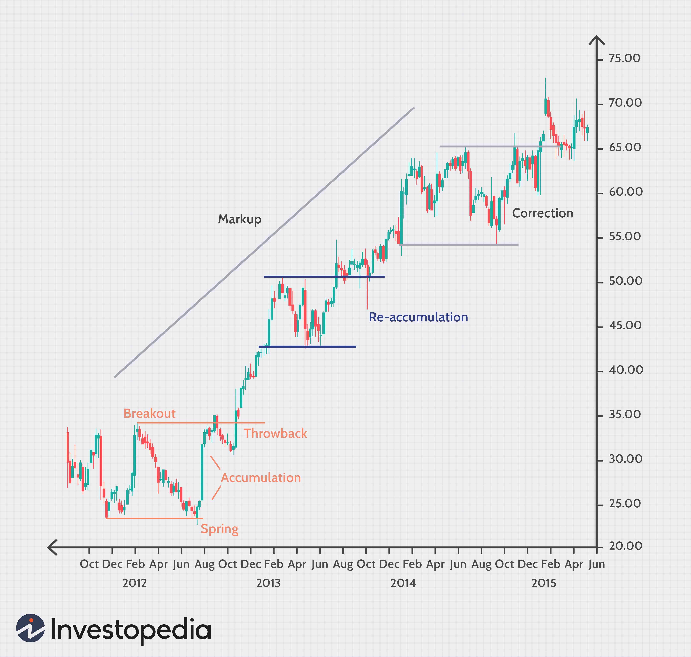

## Table of Contents

## What is the Wyckoff Trading Strategy?

The Wyckoff Trading Strategy is a method used by traders to understand and predict market movements. It was developed by Richard D. Wyckoff in the early 20th century. The strategy focuses on the idea that markets are influenced by big investors, called "Composite Operators." These big investors can control the market by buying and selling large amounts of stocks. Wyckoff's method helps traders figure out what these big investors are doing so they can make better trading decisions.

The strategy is based on three main concepts: determining the current market trend, identifying the accumulation and distribution phases, and using price and volume analysis to make trading decisions. Traders use charts to look for patterns that show when big investors are buying (accumulating) or selling (distributing) stocks. By understanding these patterns, traders can predict when the market might go up or down. This helps them decide when to buy or sell their own stocks to make a profit.

Overall, the Wyckoff Trading Strategy is a useful tool for traders who want to understand the bigger picture of the market. It helps them see beyond short-term price changes and focus on the actions of major investors. By following this strategy, traders can make more informed decisions and potentially increase their chances of success in the stock market.

## Who developed the Wyckoff Trading Strategy and when?

Richard D. Wyckoff developed the Wyckoff Trading Strategy. He was a stock market trader and educator who lived in the early 20th century. Wyckoff wanted to help other traders understand how the market works, so he created this strategy to share his knowledge.

The Wyckoff Trading Strategy was developed in the early 1900s. At that time, Wyckoff noticed that big investors, or "Composite Operators," had a lot of influence on the market. He studied their actions and came up with a method that other traders could use to predict market movements based on what these big investors were doing.

## What are the main principles of the Wyckoff Method?

The Wyckoff Method is based on three main ideas: figuring out the current market trend, spotting when big investors are buying or selling, and using charts to make trading decisions. The first idea is about understanding if the market is going up, down, or staying the same. This helps traders know if they should be buying or selling. The second idea is about watching for signs that big investors, called "Composite Operators," are either accumulating (buying) or distributing (selling) stocks. By seeing these signs, traders can guess what the market might do next.

The third idea is about using price and [volume](/wiki/volume-trading-strategy) charts to make smart choices. Traders look at these charts to find patterns that show when big investors are active. For example, if the price is going up and the volume is high, it might mean that big investors are buying a lot of stocks. By understanding these patterns, traders can decide when to buy or sell their own stocks to make a profit. The Wyckoff Method helps traders see the bigger picture of the market and make better decisions based on what big investors are doing.

## How does the Wyckoff Method identify accumulation and distribution phases?

The Wyckoff Method identifies accumulation phases by looking at how the price and volume of stocks change over time. When big investors start buying a lot of stocks, the price might not go up right away. Instead, it might move sideways or even drop a little. But if you look at the volume, you'll see it's higher than usual. This means that even though the price isn't going up much, a lot of stocks are being bought. This is a sign that big investors are accumulating stocks, getting ready for the price to go up later.

On the other hand, the Wyckoff Method spots distribution phases when big investors start selling their stocks. During this time, the price might go up a bit at first because there's still some buying happening. But then, the price starts to move sideways or drop. If you check the volume, you'll see it's high, which means a lot of stocks are being sold. This high volume with a sideways or dropping price is a sign that big investors are distributing their stocks, getting ready for the price to go down later. By watching these patterns, traders can guess when the market might change direction.

## What are the key Wyckoff phases in a market cycle?

The Wyckoff Method breaks down the market cycle into four main phases: Accumulation, Markup, Distribution, and Markdown. Accumulation is when big investors start buying a lot of stocks, but the price doesn't go up right away. It might move sideways or even drop a little. You can tell it's happening because the volume is higher than usual, showing that a lot of stocks are being bought. This phase is all about big investors getting ready for the price to go up later.

After Accumulation comes the Markup phase, where the price starts to go up because of all the buying that happened before. This is when the market starts to trend upwards, and it's a good time for traders to buy stocks and make a profit. Then, the Distribution phase starts when big investors begin selling their stocks. The price might go up a bit at first, but then it starts to move sideways or drop. High volume during this time shows that a lot of stocks are being sold, and it means the big investors are getting ready for the price to go down. Finally, the Markdown phase is when the price starts to fall because of all the selling that happened during Distribution. This is when the market trends downwards, and it's a good time for traders to sell their stocks to avoid losing money.

## How can the Wyckoff Method be applied to different financial markets?

The Wyckoff Method can be used in different financial markets like stocks, [forex](/wiki/forex-system), and commodities. It works by looking at the price and volume of whatever you're trading. The idea is the same no matter what market you're in: big investors can move the market, and by watching what they do, you can make better trading choices. For example, in the stock market, you might see big investors buying a lot of a certain stock, which means they're accumulating it. In the forex market, you might see a currency pair's price moving sideways with high volume, which could mean big investors are getting ready for a big move.

In the commodities market, like gold or oil, the Wyckoff Method can help you spot when big investors are buying or selling. If you see the price of gold moving up slowly with high volume, it might mean big investors are accumulating gold, and the price could go up more later. The key is to look for the same patterns in price and volume across different markets. By understanding these patterns, you can use the Wyckoff Method to make smart trading decisions no matter what you're trading.

## What are the essential Wyckoff chart patterns and how are they interpreted?

The Wyckoff Method uses several chart patterns to help traders understand what big investors are doing. One important pattern is the Spring, which happens during the Accumulation phase. It's when the price drops below a support level but then quickly goes back up. This shows that big investors are buying the stock at a lower price, getting ready for the price to go up later. Another pattern is the Upthrust, which happens during the Distribution phase. It's when the price goes above a resistance level but then falls back down. This means big investors are selling the stock at a higher price, getting ready for the price to go down later.

Another key pattern is the Last Point of Support (LPS), which can happen during both Accumulation and Distribution phases. During Accumulation, the LPS is the last time the price drops before it starts going up for good. It shows that big investors are done buying and are ready for the price to rise. During Distribution, the LPS is the last time the price goes up before it starts falling for good. It shows that big investors are done selling and are ready for the price to drop. By watching these patterns, traders can guess when the market might change direction and make better trading decisions.

## How does the Wyckoff Method use volume and price analysis?

The Wyckoff Method uses volume and price analysis to help traders understand what big investors are doing. When the price of a stock moves, traders look at the volume to see if it's high or low. If the price goes up and the volume is high, it means a lot of people are buying the stock. This could be a sign that big investors are accumulating the stock, getting ready for the price to go up more later. On the other hand, if the price goes down and the volume is high, it means a lot of people are selling the stock. This could be a sign that big investors are distributing the stock, getting ready for the price to go down more later.

By watching how the price and volume change together, traders can spot patterns that show when big investors are buying or selling. For example, during the Accumulation phase, the price might move sideways or even drop a little, but the volume will be high. This shows that big investors are buying a lot of the stock, even though the price isn't going up yet. During the Distribution phase, the price might go up a bit at first, but then it starts to move sideways or drop, and the volume is high. This shows that big investors are selling a lot of the stock, even though the price isn't going down yet. By understanding these patterns, traders can make better decisions about when to buy or sell their own stocks.

## What are some common Wyckoff trading tactics and strategies?

The Wyckoff Method includes several trading tactics and strategies that help traders make smart choices. One common tactic is to buy stocks during the Accumulation phase, when big investors are buying a lot of stocks. Traders look for signs like high volume and a price that's moving sideways or dropping a little. This shows that big investors are getting ready for the price to go up later. When traders see these signs, they can buy the stock at a lower price and then sell it later when the price goes up during the Markup phase.

Another strategy is to sell stocks during the Distribution phase, when big investors are selling a lot of stocks. Traders watch for signs like high volume and a price that's moving sideways or going up a bit before it starts to drop. This shows that big investors are getting ready for the price to go down later. When traders see these signs, they can sell the stock at a higher price before it drops during the Markdown phase. By using these tactics and strategies, traders can follow what big investors are doing and make better trading decisions.

## How can traders use Wyckoff's concept of 'effort vs. result' to make trading decisions?

Traders can use Wyckoff's concept of 'effort vs. result' to make better trading decisions by looking at how the price and volume of a stock change together. The idea is to see if the effort, which is the volume, matches the result, which is the price change. If the volume is high but the price doesn't move much, it means there's a lot of effort but not much result. This can be a sign that big investors are buying or selling a lot of the stock, but the price isn't changing yet. Traders can use this information to guess what might happen next. For example, if they see high volume with a small price change during the Accumulation phase, it might mean the price will go up soon.

On the other hand, if the volume is low but the price moves a lot, it means there's not much effort but a big result. This can be a sign that the price change might not last long because there's not enough buying or selling to support it. Traders can use this to decide when to buy or sell their own stocks. For example, if they see low volume with a big price change during the Distribution phase, it might mean the price will go down soon. By understanding the relationship between effort and result, traders can make smarter choices about when to enter or [exit](/wiki/exit-strategy) the market.

## What are the limitations and criticisms of the Wyckoff Trading Strategy?

The Wyckoff Trading Strategy has some limitations and criticisms that traders should know about. One big problem is that it can be hard to use. The strategy needs a lot of time and practice to understand and use well. Traders have to look at a lot of charts and data to spot the patterns that Wyckoff talks about. This can be too much for some people, especially if they are new to trading. Also, the strategy depends a lot on guessing what big investors are doing. But it's not always easy to know for sure what these big investors are up to, so traders might make wrong guesses and lose money.

Another criticism is that the Wyckoff Method might not work as well in today's markets. The stock market has changed a lot since Wyckoff made his strategy in the early 1900s. Now, there are more computers and algorithms trading stocks, which can make the market move in ways that are hard to predict with the Wyckoff Method. Some people also think that the strategy is too old-fashioned and doesn't fit with how trading works now. Even though it can still be useful, traders need to be careful and use other tools and strategies along with the Wyckoff Method to do well in today's markets.

## How can a trader integrate the Wyckoff Method with other technical analysis tools for better results?

A trader can make the Wyckoff Method work better by using it with other technical analysis tools. One way to do this is by using moving averages. Moving averages help smooth out price changes and show the overall trend of the market. A trader can use moving averages to confirm what the Wyckoff Method is saying about the market. For example, if the Wyckoff Method shows that big investors are buying a lot of stocks during the Accumulation phase, and the moving averages are also going up, it can give the trader more confidence to buy the stock. This way, the trader is using two tools to make a better decision.

Another tool that can help is the Relative Strength Index (RSI). The RSI shows if a stock is overbought or oversold, which can help traders know when to buy or sell. If the Wyckoff Method shows that big investors are selling a lot of stocks during the Distribution phase, and the RSI is also showing that the stock is overbought, it can be a good time for the trader to sell. By combining the Wyckoff Method with the RSI, the trader can get a clearer picture of what's happening in the market and make smarter trading choices. Using these tools together can help traders be more successful in their trading.

## References & Further Reading

[1]: ["The Wyckoff Method: A Tutorial"](https://chartschool.stockcharts.com/table-of-contents/market-analysis/wyckoff-analysis-articles/the-wyckoff-method-a-tutorial) on StockCharts

[2]: ["Technical Analysis of Stock Trends"](https://www.investopedia.com/terms/t/technical-analysis-of-stocks-and-trends.asp) by Robert D. Edwards and John Magee

[3]: ["Wyckoff 2.0: Structures, Volume Profile and Order Flow"](https://www.amazon.com/Wyckoff-2-0-Structures-Investing-Technical/dp/B091F3HLPK) by Rubén Villahermosa

[4]: ["A Complete Guide to Volume Price Analysis"](https://tradingmadesimple.org/wp-content/uploads/2024/02/A-Complete-Guide-To-Volume-Pric-Coulling_-Anna.pdf) by Anna Coulling

[5]: ["Algorithmic Trading and DMA: An introduction to direct access trading strategies"](https://www.amazon.com/Algorithmic-Trading-DMA-introduction-strategies/dp/0956399207) by Barry Johnson