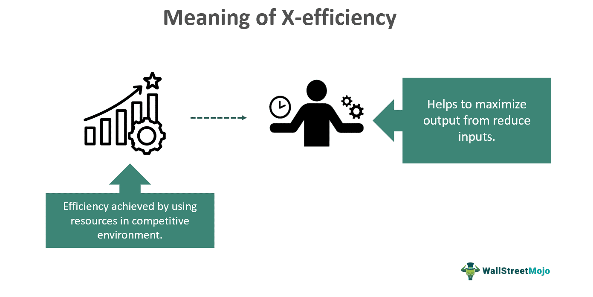

This article explores the concept of X-efficiency, a crucial economic theory initially introduced by economist Harvey Leibenstein. It challenges traditional assumptions about firm behavior and efficiency within economics. Traditionally, economic theories have presumed that firms operate under conditions of perfect rationality and efficiency. However, Leibenstein's concept of X-efficiency suggests that firms often fail to utilize resources optimally, especially in markets with imperfect competition.

The significance of X-efficiency lies in its focus on the suboptimal use of resources within firms, which suggests that human behavior, motivational factors, and internal organizational dynamics significantly influence operational efficiency. Understanding these aspects provides a comprehensive framework for analyzing how and why firms diverge from ideal efficiency models.



By examining X-efficiency, this article will provide a historical background, highlighting its role as a critique of neoclassical economic theories that emphasize allocative efficiency without accounting for internal firm dynamics. Further, the scope extends to modern economic theories and practices where X-efficiency plays a significant role.

Additionally, the implications of X-efficiency are profound for businesses and markets, notably in the context of algorithmic trading. In such areas, the theory could offer insights into optimizing trading strategies and resource utilization, thus maintaining competitiveness. As algorithmic trading continues to automate and dominate financial markets, understanding how firms can improve X-efficiency is pivotal for enhancing operational performance and profitability.

This article aims to provide a comprehensive understanding of X-efficiency, emphasizing its historical roots, theoretical advancements, and practical applications, particularly concerning algorithmic trading.

## Table of Contents

## Understanding X-Efficiency

X-efficiency is a concept that describes how effectively firms utilize their resources in situations where competition is imperfect. This idea stands in contrast to the classical economic assumption that firms inherently behave rationally to maximize efficiencies. Harvey Leibenstein, who introduced the concept of X-efficiency, posited that without sufficient competitive pressure, firms might operate with various inefficiencies. He suggested that traditional models, which focus on allocative efficiency where resources are distributed to maximize utility, do not fully capture the nuances of real-world firm operations, especially under less competitive circumstances.

Leibenstein asserted that the prevalent existence of inefficiencies within firms could be attributed to factors such as lack of motivation among managers and employees, organizational slack, and suboptimal monitoring methods. X-efficiency specifically looks into these internal inefficiencies and measures how much more efficient a firm could potentially be if it were subject to more competitive pressures. 

For example, in a monopolistic market where there is little to no competition, firms might not feel the necessity to minimize costs or innovate, resulting in X-inefficiency. However, if the market becomes more competitive, the firm is likely to streamline its operations, innovate, and make better use of its resources to maintain or enhance its market position. This implies that X-efficiency is concerned with the actual operational efficiency in contrast to potential efficiency in an ideal competitive environment.

Understanding X-efficiency provides insight into the behavior of firms beyond the mere allocation of resources, accounting for the roles of motivation, organizational dynamics, and external competitive forces. It's a critical lens for examining economic models to bring them closer to actual firm behavior and resource utilization efficiency in real markets. This perspective is essential in modern economics and holds implications for improving firm strategies, enhancing productivity, and fostering more dynamic market environments.

## Historical Background of X-Efficiency

Harvey Leibenstein introduced the concept of X-efficiency in 1966, marking a significant departure from traditional economic models that predominantly focused on allocative efficiency. Traditional neoclassical economics assumed that firms operate under conditions that lead to an optimal allocation of resources, where productive efficiency—achieving maximum output from given inputs—was seen as inherent in competitive markets. However, Leibenstein's theory challenged these assumptions by asserting that firms often do not achieve maximum efficiency, especially in markets where competitive pressures are weak or absent.

The introduction of X-efficiency addressed the discrepancies observed in firm efficiency across different market conditions. Leibenstein postulated that inefficiencies within firms could arise not just from external market structures but also from internal organizational factors. He argued that the motivational and organizational dynamics within firms critically impact their operational efficiency. This perspective underscored the role of management practices, employee motivations, and workplace culture, acknowledging that the human element significantly influences business efficiency.

One of the major contributions of X-efficiency theory was its critique of the overemphasis on allocative efficiency within neoclassical economics. Allocative efficiency focuses on the optimal distribution of resources to maximize consumer satisfaction, often assuming that firms naturally minimize costs. Leibenstein contended that firms might not always operate on the production frontier—where they are technically efficient—due to various internal and external factors. This concept opened up discussions about the realities of organizational behavior, questioning the prevailing beliefs about economic rationality and cost-minimization within firms.

X-efficiency thus became a subject of considerable debate as it questioned the traditional views of firm behavior that were largely deterministic and based on rational actors. Leibenstein’s work invited economists to consider how real-world inefficiencies could stem from factors such as complacency in less competitive markets, suboptimal managerial decisions, and inadequate incentives for workers. Consequently, X-efficiency theory provided a framework for understanding why firms often fail to reach their potential performance, offering insights into how organizational and motivational elements can be leveraged to improve efficiency.

## X-Efficiency in Modern Economic Theory

X-efficiency refers to the degree to which businesses effectively utilize their resources, particularly in less competitive markets such as monopolies or oligopolies. This concept remains highly relevant in modern economic theory, challenging the classical assumption that firms are always operating at their most efficient level to minimize costs and maximize productivity. Unlike allocative efficiency, which focuses on the optimal distribution of resources in an economy, X-efficiency examines the internal dynamics of a firm, emphasizing the role of management practices, worker motivation, and organizational structure in influencing productivity.

In the context of business behavior and strategic management, X-efficiency provides valuable insights into how firms can improve their operations even in the absence of competitive pressure. For instance, companies in monopolistic or oligopolistic markets, where competition is minimal, often lack the external impetus to reduce inefficiency. X-efficiency theory suggests that by scrutinizing managerial approaches and operational practices, firms can identify inefficiencies that, if addressed, could lead to significant improvement in output and cost-effectiveness.

The implications of X-efficiency are profound in various economic environments as it aids in recognizing potential gains from enhanced operational efficiency. For example, in industries where technological advancement is crucial, firms that embrace X-efficiency principles can leverage innovations to streamline processes and improve market responsiveness. By optimizing resource allocation and reducing wastage within their operational framework, businesses can achieve higher productivity levels, providing them with a competitive edge even in less dynamic market conditions.

Empirical studies on X-efficiency present a mixed picture. While some research demonstrates clear evidence of efficiency gains in firms that adopt X-efficiency practices, other studies highlight the complexities in measuring and achieving such efficiencies. The variation in results stems partly from differences in industry characteristics, the measurement of efficiency, and the methodological approaches used in studies. This has led to ongoing scholarly discussions and investigations, as economists and business strategists strive to understand the underlying factors that contribute to or hinder X-efficiency in different market settings.

In recognition of these challenges, future research may focus on developing more robust methodologies to assess X-efficiency across diverse sectors. Moreover, as technology continues to evolve, the integration of analytical tools and [machine learning](/wiki/machine-learning) techniques may offer new opportunities for firms to identify and rectify inefficiencies, aligning their operations more closely with the theoretical ideals of X-efficiency.

## The Role of X-Efficiency in Algorithmic Trading

Algorithmic trading, which utilizes computer algorithms to automate the buying and selling of financial instruments, stands to gain considerable advantages from the principles of X-efficiency. By understanding and applying the concept, traders can optimize the utilization of technological resources to maintain a competitive standing in dynamic trading environments.

X-efficiency highlights the potential for increased resource efficiency, emphasizing that in less than perfectly competitive markets, firms and algorithms may operate below their peak capabilities. Applying this understanding to [algorithmic trading](/wiki/algorithmic-trading) implies that continual refinement of algorithms and the systems supporting them can lead to superior performance. This is particularly relevant in high-frequency trading ([HFT](/wiki/high-frequency-trading-strategies)), where operations occur at such rapid speeds that minor enhancements in efficiency can result in substantial profit margins. In these fast-paced markets, even slight reductions in latency or improvements in decision-making processes can enhance a trader's edge significantly.

For instance, consider a high-frequency trading algorithm tasked with executing trades based on minimal price discrepancies across different venues. The goal is to capitalize on inefficiencies in price spreads that exist only briefly. If the algorithm can make decisions and execute trades just milliseconds faster than competitors, the profitability may increase exponentially. Python, often used for algorithmic trading due to its robust libraries and tools, can be leveraged to model and improve these efficiencies. For instance:

```python
import numpy as np

def compute_efficiency(price_data, speed_factor):
    """Simulate the impact of speed on efficiency in trade execution."""
    # Simulating trade execution time as inversely proportional to speed factor
    execution_time = np.min(price_data) / speed_factor
    return execution_time

# Example usage
price_data = np.array([101.5, 101.6, 101.55, 101.7])  # example price data
speed_factor = 1.2  # hypothetical improvement in algorithm speed
execution_efficiency = compute_efficiency(price_data, speed_factor)
print(f"Trade execution efficiency: {execution_efficiency}")
```

Through such simulations and models, traders gain insights into where and how they can enhance system performance for better market outcomes. Furthermore, understanding X-efficiency allows firms to spot inefficiencies and potential for improvement in their trading strategies and operational processes.

In summary, the incorporation of X-efficiency in algorithmic trading provides significant strategic advantages. By focusing on minimizing inefficiencies and optimizing resource use, firms can improve the effectiveness of their trading algorithms, thereby ensuring sustained competitiveness and potential for higher returns in the fast-evolving trading landscape.

## X-Efficiency vs. X-Inefficiency

While X-efficiency evaluates how closely firms approach optimal resource utilization, X-inefficiency underscores the gaps that exist between current operational performance and the potential peak efficiency a firm could achieve. The distinction between these terms is crucial in identifying opportunities for strategic enhancement in organizational performance. 

In essence, X-efficiency is indicative of the maximum utility derived from available resources within a business, contingent upon the management's ability to motivate and utilize both labor and capital effectively. Conversely, X-inefficiency emerges when firms fail to fully harness these resources, often due to internal management issues or external market conditions. 

State-owned enterprises and firms with significant market power, such as monopolies or oligopolies, often display a higher degree of X-inefficiency. This tendency can be attributed to the lack of competitive pressure that typically motivates entities to strive for efficiency improvements. In such environments, the absence of imminent threats from competitors creates a milieu where lax operational practices can proliferate without immediate financial repercussions. As a result, these organizations may have less incentive to minimize costs and maximize output, leading to operational inefficiencies.

Increasing X-efficiency can serve as a strategic objective for firms eager to bolster their market standing. By identifying and rectifying areas of X-inefficiency, companies can improve their operational processes, reduce costs, and ultimately capture greater market share. For instance, adopting lean management practices, automating routine tasks with technology, and encouraging a culture of continuous improvement can collectively enhance a firm's X-efficiency.

To illustrate, a simple Python script can be employed to simulate the impact of different efficiency levels on firm productivity. The following code exemplifies this concept:

```python
def calculate_efficiency(output, potential_output):
    """ Calculates X-efficiency as a percentage. """
    return (output / potential_output) * 100

# Example usage
current_output = 80
potential_output = 100
efficiency = calculate_efficiency(current_output, potential_output)

print(f"Current X-efficiency: {efficiency}%")
```

The script calculates the X-efficiency of a firm by comparing its current output to the potential output, emphasizing the significance of identifying and mitigating areas of inefficiency. By focusing on enhancing X-efficiency, firms can leverage their resources more effectively, positioning themselves advantageously within the competitive landscape.

## Conclusion

X-efficiency, introduced by Harvey Leibenstein, continues to play a crucial role in understanding firm behavior within economic theory and practice. This concept challenges the traditional economic assumption that firms always operate at maximum efficiency. By highlighting the potential inefficiencies within firms, especially in less competitive markets, X-efficiency provides a framework for analyzing and improving resource utilization.

In algorithmic trading, the principles of X-efficiency find significant application. Algorithmic trading relies on computer algorithms to automate trading decisions, where even small improvements in efficiency can result in substantial profit margins. By applying X-efficiency insights, traders and firms can optimize their algorithmic processes, maintaining and enhancing competitive advantages in fast-paced trading environments. The notion of improving operational efficiency aligns well with maximizing the performance of trading algorithms, allowing for more effective use of resources and technology.

The exploration of X-efficiency continues to provoke discussions and rethink established economic theories, emphasizing the human and procedural elements crucial to firm performance. As markets evolve and competitive dynamics shift, understanding and applying the principles of X-efficiency remains essential, not only for traditional firms but also in cutting-edge contexts like algorithmic trading. This persistent inquiry invites ongoing research and practical applications, ensuring that X-efficiency remains a vital component of economic analysis and strategic decision-making in various market contexts.

## References & Further Reading

[1]: Leibenstein, H. (1966). "Allocative Efficiency vs. 'X-Efficiency'." The American Economic Review, 56(3), 392-415. [JSTOR](https://www.jstor.org/stable/1823775)

[2]: Kasper, W., & Streit, M. E. (1998). Institutional Economics: Social Order and Public Policy. Edward Elgar Publishing.

[3]: "Algorithmic Trading: Winning Strategies and Their Rationale" by Ernest P. Chan. [Amazon](https://www.amazon.com/Algorithmic-Trading-Winning-Strategies-Rationale-ebook/dp/B00CY5HC0U)

[4]: "Misbehavior of Markets: A Fractal View of Risk, Ruin, and Reward" by Benoit B. Mandelbrot and Richard L. Hudson. [Amazon](https://www.amazon.com/Mis-Behaviour-Markets-benoit-b-mandelbrot-richard-l-hudson/dp/1846682622)

[5]: Farrell, M. J. (1957). "The Measurement of Productive Efficiency." Journal of the Royal Statistical Society. Series A (General), 120(3), 253-290. [JSTOR](https://www.jstor.org/stable/44013715)