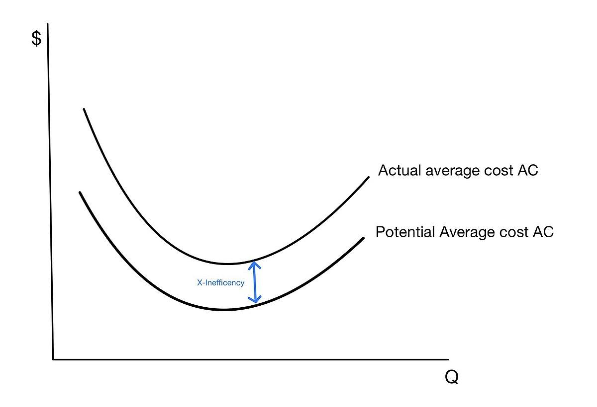

## Table of Contents

## What is X-efficiency in economics?

X-efficiency is a concept in economics that looks at how well a company uses its resources to produce goods or services. It's about how efficiently a business operates, not just in terms of costs, but also in how it manages its workforce and other inputs. If a company is X-efficient, it means it's doing a good job at turning its resources into products without wasting anything.

This idea was introduced by economist Harvey Leibenstein, who noticed that companies often don't work as efficiently as they could, even if they're in a competitive market. He called this inefficiency "X-inefficiency." It happens because of things like poor management, lack of motivation among workers, or not using the best technology. Improving X-efficiency can help a company lower its costs and become more competitive, which is good for the economy as a whole.

## Who introduced the concept of X-efficiency?

The concept of X-efficiency was introduced by an economist named Harvey Leibenstein. He came up with this idea to explain why some companies don't use their resources as well as they could, even when they are competing with other businesses.

Leibenstein noticed that companies often have what he called "X-inefficiency." This means they are not as good at turning their resources into products as they could be. This can happen because of things like bad management, workers not being motivated, or not using the best tools and technology. By improving X-efficiency, companies can lower their costs and do better in the market.

## How does X-efficiency differ from allocative efficiency?

X-efficiency and allocative efficiency are two different ways to look at how well a company or an economy is doing. X-efficiency is about how good a company is at using its resources to make things. It's about not wasting anything and making sure everyone and everything in the company is working well together. If a company is X-efficient, it means it's doing a great job at turning what it has into products without losing anything along the way.

Allocative efficiency, on the other hand, is about making sure that the resources in an economy are used in the best way possible to meet people's needs. It's about making the right things that people want and need. If an economy is allocatively efficient, it means it's using its resources to make the things that people value the most. So, while X-efficiency focuses on how well a company uses its own resources, allocative efficiency looks at whether the whole economy is making the right stuff for everyone.

## What are the main causes of X-inefficiency?

X-inefficiency happens when a company doesn't use its resources as well as it could. One big reason for this is poor management. If the people in charge aren't good at their jobs, they might not organize things well or make smart decisions. This can lead to workers not knowing what to do or wasting time and materials. Another reason is that workers might not be motivated. If they don't feel like their work matters or if they're not happy, they might not work as hard or as carefully as they should.

Another cause of X-inefficiency is not using the best technology or methods. If a company sticks with old ways of doing things instead of trying new, better ways, it can end up wasting resources. Also, sometimes companies don't have enough competition. If they don't have to worry about other companies taking their customers, they might not feel the need to work as efficiently. All these things together can make a company less X-efficient, which means it's not as good at turning what it has into what it needs to make.

## Can you provide examples of X-efficiency in real-world businesses?

One example of X-efficiency can be seen in Toyota's production system. Toyota is known for its lean manufacturing approach, which focuses on eliminating waste and improving efficiency. They do this by making sure every part of their production process is working smoothly and everyone knows exactly what to do. This means less time and materials are wasted, and the cars they make are of high quality. Toyota's focus on continuous improvement and involving workers in finding better ways to do things helps them stay X-efficient.

Another example is Southwest Airlines. They are known for their quick turnaround times at airports, which means their planes spend less time on the ground and more time in the air. Southwest achieves this by having a simple fleet of similar planes, which makes maintenance and training easier. They also have a strong company culture that motivates their employees to work efficiently. By keeping things simple and making sure everyone is on the same page, Southwest can keep their costs down and their service reliable, showing good X-efficiency.

## How can firms measure their X-efficiency?

Firms can measure their X-efficiency by looking at how well they use their resources to make things. One way to do this is by comparing their actual performance to what they could achieve if they were working at their best. For example, they might look at how much time it takes to make a product and see if they can do it faster without losing quality. They can also check how much material they use and see if they can use less while still making the same amount of product. By doing these comparisons, firms can see where they might be wasting resources and find ways to improve.

Another way to measure X-efficiency is by looking at how motivated and productive their workers are. Firms can do surveys or talk to their employees to find out if they feel supported and if they have the tools they need to do their jobs well. If workers are happy and motivated, they are likely to work more efficiently. Firms can also look at how much each worker produces in a day and compare it to what they could produce if everything was working perfectly. This helps them understand if there are problems with management or if there are other issues that need to be fixed to improve X-efficiency.

## What strategies can firms implement to improve their X-efficiency?

Firms can improve their X-efficiency by focusing on better management practices. Good managers make sure everyone knows what to do and that the work is organized well. They can also train their workers to use the best methods and technology. By setting clear goals and giving feedback, managers can help workers stay motivated and work more efficiently. Another way to improve management is by encouraging teamwork and communication. When everyone works together and shares ideas, they can find better ways to do things and avoid wasting time and resources.

Another strategy is to invest in technology and training. New technology can help firms do things faster and with less waste. For example, using machines that are more precise can reduce the amount of material that gets thrown away. Training workers to use this new technology is also important. When workers know how to use the best tools, they can work more efficiently. Firms can also look at their processes and see if there are any steps that can be made simpler or faster. By always trying to improve and find better ways to do things, firms can keep their X-efficiency high.

## How does X-efficiency relate to market structure and competition?

X-efficiency is closely tied to the market structure and the level of competition a firm faces. In markets with lots of competition, firms have to work hard to use their resources well. If they don't, they might lose customers to other companies that are more efficient. This pressure to stay competitive can push firms to be more X-efficient. They might try new ways to make things faster or use less material, and they'll make sure their workers are motivated and working well. So, in a competitive market, firms often have to be X-efficient just to stay in business.

On the other hand, in markets where there isn't much competition, firms might not feel the same pressure to be X-efficient. If a company is the only one selling a certain product, it might not worry as much about wasting resources or making things as efficiently as possible. Without competition, there's less reason for the firm to improve its X-efficiency. This can lead to what's called X-inefficiency, where the firm isn't using its resources as well as it could. So, the level of competition in a market can really affect how X-efficient a firm is.

## What role does organizational culture play in achieving X-efficiency?

Organizational culture plays a big role in helping a company achieve X-efficiency. Culture is all about the way people in a company think and act. If a company has a culture where everyone works together and tries to do their best, it can make the whole company more efficient. When workers feel like they are part of a team and their ideas matter, they are more likely to look for ways to save time and resources. A good culture can also make sure that everyone knows what the company's goals are and how to reach them, which helps everyone work towards the same thing.

On the other hand, if a company's culture is not so good, it can make it harder to be X-efficient. If workers don't feel valued or if there's a lot of fighting and confusion, they might not work as hard or as smart as they could. A bad culture can lead to people wasting time and resources because they don't know what to do or they don't care. So, having a strong and positive organizational culture is really important for making sure a company uses its resources well and stays X-efficient.

## How do technological advancements impact X-efficiency?

Technological advancements can really help a company become more X-efficient. When a company uses new technology, it can often make things faster and use less stuff. For example, if a factory gets a new machine that can cut materials more precisely, it might waste less and make more products in the same amount of time. Technology can also help with keeping track of how things are going, so managers can see where they might be wasting time or resources and fix it. This means the company can use its resources better and make more money.

But, it's not just about getting new machines or computers. Companies also need to make sure their workers know how to use the new technology. If workers are trained well, they can use the technology to do their jobs better and faster. This can make the whole company more X-efficient. So, while new technology can help a lot, it's important for companies to also think about how to teach their workers to use it the right way.

## What are the criticisms of the X-efficiency theory?

Some people think the X-efficiency theory has problems. One big criticism is that it's hard to measure X-efficiency. It's easy to say a company should use its resources better, but it's tough to figure out exactly how much better they could be doing. This makes it hard to tell if a company is really X-efficient or not. Another criticism is that the theory doesn't always explain why some companies are more efficient than others. It talks about things like bad management or unmotivated workers, but it doesn't give clear reasons for why these problems happen in the first place.

Another point critics make is that X-efficiency might not be the most important thing for a company. Sometimes, other things like making customers happy or coming up with new ideas can be more important for a company's success. Focusing too much on X-efficiency might make a company miss out on these other important goals. Also, some people argue that the theory doesn't take into account how different industries work. What makes a company efficient in one industry might not work in another, so the idea of X-efficiency might not fit every situation.

## How has the concept of X-efficiency evolved in economic literature over time?

The concept of X-efficiency was first introduced by Harvey Leibenstein in the 1960s. At that time, he noticed that companies often didn't use their resources as well as they could, even when they were in competitive markets. He called this problem X-inefficiency and said it happened because of things like bad management, workers not being motivated, or not using the best technology. Over the years, economists have built on Leibenstein's ideas, trying to understand more about why X-inefficiency happens and how companies can become more X-efficient. They've looked at how things like competition, technology, and company culture can affect X-efficiency.

As time went on, the idea of X-efficiency became more important in economic literature. Economists started to see that it wasn't just about how much a company produced, but also about how well it used its resources to produce those things. They began to study how different factors, like the structure of the market or the way a company is managed, could make a big difference in X-efficiency. More recent studies have also looked at how new technology and changes in the way people work can help companies become more X-efficient. Overall, the concept has grown from a simple idea about resource use to a more complex understanding of what makes companies efficient.

## References & Further Reading

[1]: Leibenstein, H. (1966). "Allocative Efficiency vs. 'X-Efficiency'." The American Economic Review, 56(3), 392-415. [JSTOR](https://www.jstor.org/stable/1823775)

[2]: Kasper, W., & Streit, M. E. (1998). Institutional Economics: Social Order and Public Policy. Edward Elgar Publishing.

[3]: "Algorithmic Trading: Winning Strategies and Their Rationale" by Ernest P. Chan. [Amazon](https://www.amazon.com/Algorithmic-Trading-Winning-Strategies-Rationale-ebook/dp/B00CY5HC0U)

[4]: "Misbehavior of Markets: A Fractal View of Risk, Ruin, and Reward" by Benoit B. Mandelbrot and Richard L. Hudson. [Amazon](https://www.amazon.com/Mis-Behaviour-Markets-benoit-b-mandelbrot-richard-l-hudson/dp/1846682622)

[5]: Farrell, M. J. (1957). "The Measurement of Productive Efficiency." Journal of the Royal Statistical Society. Series A (General), 120(3), 253-290. [JSTOR](https://www.jstor.org/stable/44013715)