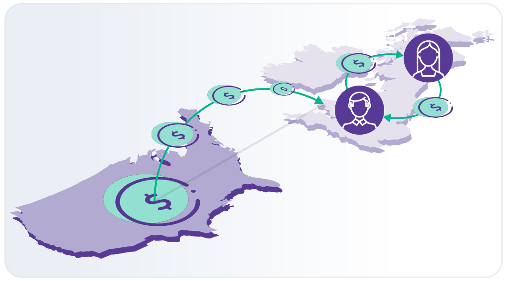

## Table of Contents

## What is xenocurrency?

Xenocurrency is a type of foreign currency that is widely used in trade and financial transactions outside of its home country. It is different from local currencies because it is accepted and used in many different countries, not just where it comes from. For example, the US dollar and the Euro are often used as xenocurrencies because they are accepted in many places around the world.

People and businesses use xenocurrencies because they are stable and widely recognized. This makes them useful for international trade and investments. For instance, a company in Japan might use US dollars to buy goods from a company in Brazil, even though neither country uses the US dollar as their official currency. This helps make global business easier and more efficient.

## How does xenocurrency differ from traditional currency?

Xenocurrency is different from traditional currency because it is used outside of its home country. Traditional currency, like the Japanese yen or the British pound, is mainly used within its own country. But xenocurrency, like the US dollar or the Euro, is used all over the world. This makes it very useful for buying and selling things between different countries.

Another difference is that xenocurrency is often seen as more stable and reliable. Because it is used in many places, people trust it more for big international deals. Traditional currency might change a lot in value, but xenocurrency usually stays more steady. This makes it easier for businesses to plan and do trade across borders without worrying too much about sudden changes in money value.

## What are some examples of xenocurrencies?

Some examples of xenocurrencies are the US dollar, the Euro, and the Japanese yen. The US dollar is used all over the world for buying and selling things. Many countries keep US dollars in their banks because it's seen as a safe and stable currency. The Euro is used a lot in Europe and other places too. It's the money used by countries in the European Union, but people in other countries also use it for big deals.

Another example is the Japanese yen. Even though it's the money used in Japan, it's also used in other countries for trading and investing. People trust the yen because Japan has a strong economy. These xenocurrencies make it easier for people and businesses to do things like buy goods from other countries or invest in different places without worrying about using different kinds of money.

## Why might a country choose to use a xenocurrency?

A country might choose to use a xenocurrency because it helps them do business with other countries more easily. If a country uses a xenocurrency like the US dollar, they can buy and sell things with other countries without having to change their money into different currencies all the time. This makes trade simpler and faster. For example, if a country in Africa wants to buy oil from Saudi Arabia, using US dollars can make the deal easier because both countries trust and use the US dollar.

Another reason is that xenocurrencies are often seen as more stable. This means their value doesn't change as much as some local currencies. When a country uses a stable xenocurrency, it can help them plan their economy better. They don't have to worry as much about their money losing value suddenly. This stability can attract more foreign investment because businesses from other countries feel safer putting their money into a country that uses a trusted xenocurrency.

## What are the economic impacts of adopting a xenocurrency?

When a country decides to use a xenocurrency, it can help their economy grow. Using a xenocurrency like the US dollar can make it easier for the country to trade with other countries. They don't have to change their money into different currencies all the time, which saves time and money. This can lead to more trade and more money coming into the country. Also, if the xenocurrency is seen as stable, it can attract more foreign businesses to invest in the country. These businesses feel safer putting their money into a country that uses a trusted currency.

However, using a xenocurrency can also have some downsides. If the country's own currency is weak, using a xenocurrency might make it even weaker. This can make it harder for the country to control its own economy. Also, if the xenocurrency's value changes a lot, it can affect the country's economy too. For example, if the US dollar goes up in value, it might make things more expensive for the country using it. So, while using a xenocurrency can help with trade and investment, it can also bring some risks that the country needs to think about carefully.

## How does the use of xenocurrency affect international trade?

The use of xenocurrency makes international trade easier and faster. When countries use a xenocurrency like the US dollar, they don't have to change their money into different currencies all the time. This saves time and money, which can lead to more trade between countries. For example, if a company in Brazil wants to buy goods from a company in Japan, using US dollars can make the deal simpler because both countries trust and use the US dollar. This can help businesses grow and make more money.

However, using a xenocurrency can also bring some challenges. If a country's own currency is weak, using a xenocurrency might make it even weaker. This can make it harder for the country to control its own economy. Also, if the value of the xenocurrency changes a lot, it can affect the cost of goods and services. For instance, if the US dollar goes up in value, it might make things more expensive for countries using it. So, while xenocurrency can help with trade, it can also bring some risks that countries need to think about carefully.

## What are the risks associated with using xenocurrency?

Using a xenocurrency can bring some risks to a country. One risk is that it might make the country's own currency weaker. If people start using the xenocurrency more, they might not use the local currency as much. This can make the local currency less valuable and harder for the country to control its own money. Another risk is that the value of the xenocurrency can change a lot. If the xenocurrency goes up or down in value suddenly, it can make things more expensive or cheaper for the country using it. This can be hard for businesses and people who have to plan their money carefully.

Another risk is that using a xenocurrency can make a country depend too much on another country's economy. For example, if a country uses the US dollar a lot, they might be affected by what happens in the US economy. If the US economy has problems, it can cause trouble for the country using the US dollar. This can make it harder for the country to make its own economic decisions. So, while using a xenocurrency can help with trade, it's important for countries to think about these risks carefully before deciding to use it.

## How is the value of a xenocurrency determined?

The value of a xenocurrency is determined by how much people want it and how much of it is available. If a lot of people want to use a xenocurrency like the US dollar, its value goes up. This is because there are more people trying to buy it than there is money available. On the other hand, if fewer people want to use it, its value can go down. The value can also change based on what's happening in the country where the xenocurrency comes from. For example, if the US economy is doing well, more people might want to use US dollars, making its value go up.

Another thing that affects the value of a xenocurrency is how stable it is. If people think a xenocurrency is stable and won't change a lot in value, they are more likely to use it. This trust can make its value go up. But if the xenocurrency's value changes a lot, people might not want to use it as much, which can make its value go down. So, the value of a xenocurrency depends on how much people want it, how much is available, and how stable it is seen to be.

## What role do international financial institutions play in the management of xenocurrencies?

International financial institutions like the International Monetary Fund (IMF) and the World Bank play a big role in managing xenocurrencies. They help make sure that xenocurrencies are used fairly and safely around the world. These institutions keep an eye on the global economy and give advice to countries on how to use xenocurrencies. They also help countries that are having money problems by giving them loans or other help, often in xenocurrencies like the US dollar.

These institutions also work to make the world's money system stable. They do this by setting rules and making agreements between countries. For example, they might help countries agree on how to use xenocurrencies in trade. This helps make sure that using xenocurrencies doesn't cause big problems for any country. By doing all these things, international financial institutions help make the use of xenocurrencies smoother and more reliable for everyone.

## How have xenocurrencies evolved historically?

Xenocurrencies have been around for a long time, but they became more important as countries started trading more with each other. In the old days, people used things like gold and silver to trade between countries. But as time went on, countries started using their own money more. The US dollar became a big xenocurrency after World War II. Many countries agreed to use the US dollar for big deals because the US had a strong economy. This made it easier for countries to trade with each other without having to change their money all the time.

Over the years, other currencies like the Euro and the Japanese yen also became important xenocurrencies. The Euro started being used in 1999 when many European countries decided to use the same money. This made it easier for them to trade with each other and other countries. The Japanese yen became more popular as Japan's economy grew strong. Today, xenocurrencies are used all over the world to make trade and business easier. They help countries buy and sell things without worrying too much about changing money. But they also bring some risks, so countries have to be careful about how they use them.

## What are the future prospects for xenocurrencies in global finance?

In the future, xenocurrencies will likely keep playing a big role in global finance. As more countries trade with each other, they will need a way to make these deals easier. Xenocurrencies like the US dollar and the Euro will probably stay important because they are trusted and used all over the world. New technologies, like digital money and blockchain, might also change how xenocurrencies are used. These technologies could make it even easier for countries to use xenocurrencies for trade and other deals.

However, there are also challenges ahead. Some countries might want to use their own money more and not rely so much on xenocurrencies. This could happen if they think their own money is getting too weak or if they want more control over their economy. Also, if big economies like the US or Europe have problems, it could affect the value of their xenocurrencies. So, while xenocurrencies will likely stay important, countries will need to keep an eye on these challenges and think carefully about how they use them in the future.

## How do regulatory frameworks differ for xenocurrencies compared to national currencies?

Regulatory frameworks for xenocurrencies are different from those for national currencies because xenocurrencies are used in many countries, not just one. National currencies are controlled by a country's central bank, which sets rules about how the money can be used and how much of it there should be. But xenocurrencies are not controlled by just one country. Instead, they are often managed by international agreements and organizations like the International Monetary Fund (IMF). These organizations help make sure that xenocurrencies are used fairly and safely around the world.

Because xenocurrencies are used in many places, the rules about them can be more complicated. Countries might have their own rules about using xenocurrencies, but they also have to follow international rules. For example, a country might set limits on how much xenocurrency people can use, but they also have to think about what other countries are doing. This can make it harder to control xenocurrencies compared to national currencies, where the rules are set by one country's government. So, while national currencies have clear rules set by one country, xenocurrencies have to follow a mix of rules from different places.

## References & Further Reading

[1]: Chaboud, A. P., Chiquoine, B., Hjalmarsson, E., & Vega, C. (2014). ["Rise of the Machines: Algorithmic Trading in the Foreign Exchange Market."](https://papers.ssrn.com/sol3/papers.cfm?abstract_id=1501135) The Journal of Finance, 69(5), 2045-2084.

[2]: Lopez de Prado, M. (2018). ["Advances in Financial Machine Learning."](https://www.amazon.com/Advances-Financial-Machine-Learning-Marcos/dp/1119482089) Wiley.

[3]: Harris, L. E. (2003). ["Trading and Exchanges: Market Microstructure for Practitioners."](https://www.amazon.com/Trading-Exchanges-Market-Microstructure-Practitioners/dp/0195144708) Oxford University Press.

[4]: Nagpal, S., & Jain, A. (2020). ["Algorithmic Trading: Concepts and Applications."](https://annescollege.fsu.edu/faculty-staff/dr-ravinder-nagpal) In Machine Learning and Principles and Applications of Soft Computing (pp. 263-273).

[5]: Hasbrouck, J. (2007). ["Empirical Market Microstructure: The Institutions, Economics, and Econometrics of Securities Trading."](https://academic.oup.com/book/52241) Oxford University Press.

[6]: Buchanan, B. G. (2019). ["Artificial Intelligence in Finance."](https://harisportal.hanken.fi/en/publications/artificial-intelligence-in-finance) Springer.