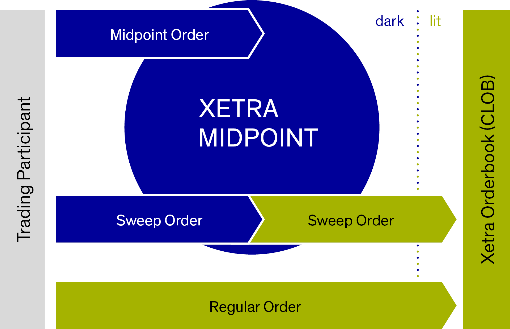

## Table of Contents

## What is the Xetra trading system?

Xetra is a trading system used for buying and selling stocks and other financial products. It is run by the Deutsche Boerse, which is a big stock exchange in Germany. People from all over the world can use Xetra to trade because it is electronic and works very fast. This means that trades can happen quickly and easily, no matter where the traders are located.

The system is known for being reliable and efficient. It uses computers to match buyers and sellers, which helps to make sure that trades are done fairly and at the best possible prices. Xetra also has rules to make sure that the market stays stable and that everyone follows the same guidelines. This makes it a popular choice for many investors and traders who want a safe and smooth way to trade.

## How does Xetra compare to other trading systems like NASDAQ or NYSE?

Xetra, NASDAQ, and NYSE are all big trading systems, but they have some differences. Xetra is run by the Deutsche Boerse in Germany and is known for being very fast and electronic. It's used a lot in Europe and is good for trading stocks and other financial products from around the world. NASDAQ, on the other hand, is based in the United States and is famous for being the first electronic stock market. It's known for technology and internet companies, and it's also very fast and electronic. The New York Stock Exchange (NYSE) is also in the U.S. and is the biggest stock exchange in the world by market capitalization. It's a bit different because it still uses a mix of electronic and traditional floor trading, where people shout and use hand signals to trade.

When comparing these systems, Xetra and NASDAQ are similar because they are both fully electronic, which means trades happen quickly and efficiently. Xetra might be a bit more popular in Europe, while NASDAQ is more focused on tech companies. The NYSE, with its mix of electronic and floor trading, can be seen as a bit more traditional. This can be good for some traders who like the human element in trading. All three systems are reliable and used by many investors, but they each have their own strengths and the choice between them might depend on what a trader is looking for in terms of speed, types of companies, and trading style.

## What are the main features of the Xetra trading platform?

Xetra is an electronic trading platform run by the Deutsche Boerse in Germany. It's known for being very fast and reliable. Traders from all over the world use Xetra to buy and sell stocks and other financial products. The system uses computers to match buyers and sellers, which helps make sure that trades happen quickly and at the best possible prices. Xetra also has rules to keep the market stable and fair for everyone.

Another important feature of Xetra is its wide range of products. You can trade not just stocks, but also bonds, exchange-traded funds (ETFs), and other financial instruments. This makes Xetra a versatile platform for different types of investors. Additionally, Xetra offers transparency, meaning that traders can see the prices and volumes of trades in real-time. This helps them make better decisions about when to buy or sell.

## How can beginners start trading on Xetra?

To start trading on Xetra, beginners first need to open an account with a broker that offers access to the Xetra platform. Many brokers provide this service, so it's a good idea to compare them and choose one that fits your needs. Once you have an account, you'll need to deposit money into it. This money will be used to buy stocks and other financial products on Xetra. Make sure to read and understand the broker's fees and any other rules before you start trading.

After setting up your account, you can start trading. Xetra is an electronic platform, so you'll use a computer or a mobile app to place your orders. You can buy and sell stocks, bonds, ETFs, and other products. It's important to do some research first to understand what you're buying and to make smart decisions. Xetra provides real-time information on prices and volumes, which can help you make better choices. Remember, trading involves risks, so start small and learn as you go.

## What are the fees associated with trading on Xetra?

Trading on Xetra involves different fees that you need to know about. The main fee is the trading fee, which is charged by the broker you use to trade on Xetra. This fee can be a flat amount per trade or a percentage of the total value of your trade. Different brokers have different fee structures, so it's a good idea to compare them before choosing one. Besides the trading fee, there might be other costs like account maintenance fees or fees for withdrawing money from your account.

Another fee to consider is the clearing fee, which is charged by the clearing house that processes your trades. This fee is usually very small, but it adds to the total cost of trading. Also, if you trade stocks from other countries, you might have to pay extra fees for currency conversion. It's important to understand all these fees so you can plan your trading and know how much it will cost you in the end.

## What types of securities can be traded on Xetra?

Xetra is a trading platform where you can buy and sell many different types of securities. The main type of security you can trade on Xetra is stocks. These are shares in companies that you can buy and sell. Xetra also lets you trade bonds, which are like loans you give to companies or governments that they pay back with interest. Another type of security you can trade on Xetra is exchange-traded funds (ETFs). ETFs are like baskets of different investments that you can buy and sell like stocks.

In addition to stocks, bonds, and ETFs, Xetra also allows trading in other financial products. You can trade certificates, which are securities that represent a certain value or asset. There are also warrants, which give you the right to buy or sell a stock at a certain price in the future. Lastly, Xetra offers trading in structured products, which are complex financial instruments that combine different types of investments. This wide range of securities makes Xetra a versatile platform for different types of investors.

## How does the Xetra system ensure fair trading and prevent market manipulation?

The Xetra system uses several ways to make sure trading is fair and to stop people from cheating or manipulating the market. One way is by using computers to match buyers and sellers. This means that trades happen quickly and at the best possible prices, without anyone being able to change things unfairly. Xetra also has rules that everyone has to follow. These rules help keep the market stable and make sure that no one can do things like spreading false information or trying to control prices.

Another important way Xetra keeps trading fair is by being very open and clear. Traders can see the prices and how many trades are happening in real-time. This transparency helps everyone see what's going on and makes it harder for anyone to cheat. If someone tries to do something wrong, it's easier to catch them because everything is out in the open. Xetra also works with regulators to watch the market and make sure everyone is playing by the rules.

## What are the technological advantages of using Xetra over other trading systems?

Xetra is known for being very fast and reliable. It uses computers to match buyers and sellers, which means trades happen quickly and at the best possible prices. This electronic system helps make sure that everyone gets a fair chance to trade without delays. Xetra's technology also allows traders from all over the world to use the platform easily, no matter where they are. This makes it a popular choice for many investors who want a smooth and efficient way to trade.

Another big advantage of Xetra is its ability to handle a lot of trades at the same time. The system is designed to work well even when there are many people trading, which helps keep things running smoothly during busy times. Xetra also provides real-time information on prices and volumes, which helps traders make better decisions. This transparency and efficiency make Xetra stand out compared to other trading systems that might not be as fast or as able to handle a lot of trades at once.

## How does Xetra handle high-frequency trading?

Xetra is very good at handling high-frequency trading. High-frequency trading is when computers make a lot of trades very quickly. Xetra's system is designed to be fast and can handle many trades at the same time. This means that even when a lot of high-frequency trading is happening, the system stays smooth and works well. Traders who use high-frequency trading like Xetra because it helps them do their trades quickly and without problems.

Xetra also has rules to make sure high-frequency trading is fair. The system watches for any strange trading patterns that might be trying to cheat or manipulate the market. By keeping an eye on things, Xetra helps make sure that high-frequency trading doesn't cause problems for other traders. This makes Xetra a safe and reliable place for all kinds of trading, including high-frequency trading.

## What are the liquidity and volume statistics for Xetra compared to other systems?

Xetra is known for having good liquidity and high trading volumes. Liquidity means how easy it is to buy or sell something without affecting its price too much. On Xetra, there are usually a lot of buyers and sellers, which makes it easy to trade. The trading volume on Xetra is also very high, which means a lot of trades happen every day. This is important because it shows that Xetra is a busy and active market where people can trade easily.

Compared to other systems like NASDAQ and NYSE, Xetra's liquidity and volume are strong, especially in Europe. NASDAQ and NYSE are bigger in terms of total market size because they are in the U.S., but Xetra is still very important for European markets. Xetra's high liquidity and volume make it a good choice for traders who want to buy and sell quickly and at good prices. While NASDAQ and NYSE might have more overall trading, Xetra's focus on European securities and its efficient system make it a key player in the global market.

## How does Xetra integrate with other financial systems and services?

Xetra works well with other financial systems and services. It connects with different brokers and banks, so traders can use their accounts on Xetra easily. This means that if you have an account with a broker that works with Xetra, you can trade on the platform without any problems. Xetra also shares information with other stock exchanges and financial markets, which helps keep everything running smoothly and makes it easier for traders to move between different markets.

Another way Xetra integrates with other systems is through its technology. It uses special software that can talk to other trading platforms and financial tools. This helps traders get real-time data and use different tools to make better trading decisions. By working well with other systems, Xetra makes trading easier and more efficient for everyone involved.

## What future developments are planned for the Xetra trading system?

The Deutsche Boerse, which runs Xetra, is always working on making the system better. They want to make trading even faster and more reliable. One big plan is to use more advanced technology to handle even more trades at the same time. This will help keep Xetra working well, even when a lot of people are trading. They are also looking at new ways to make the system safer and stop people from cheating or manipulating the market.

Another important plan is to add more types of financial products to Xetra. This means traders will be able to buy and sell even more things on the platform. The Deutsche Boerse is also thinking about how to make Xetra work better with other financial systems around the world. This will make it easier for traders to move between different markets and use different tools to help them trade. By doing all these things, Xetra will stay a top choice for traders in the future.

## References & Further Reading

[1]: Bergstra, J., Bardenet, R., Bengio, Y., & Kégl, B. (2011). ["Algorithms for Hyper-Parameter Optimization."](https://dl.acm.org/doi/10.5555/2986459.2986743) Advances in Neural Information Processing Systems 24.

[2]: ["Advances in Financial Machine Learning"](https://www.amazon.com/Advances-Financial-Machine-Learning-Marcos/dp/1119482089) by Marcos Lopez de Prado

[3]: ["Evidence-Based Technical Analysis: Applying the Scientific Method and Statistical Inference to Trading Signals"](https://www.amazon.com/Evidence-Based-Technical-Analysis-Scientific-Statistical/dp/0470008741) by David Aronson

[4]: ["Machine Learning for Algorithmic Trading"](https://github.com/stefan-jansen/machine-learning-for-trading) by Stefan Jansen

[5]: ["Quantitative Trading: How to Build Your Own Algorithmic Trading Business"](https://www.amazon.com/Quantitative-Trading-Build-Algorithmic-Business/dp/1119800064) by Ernest P. Chan