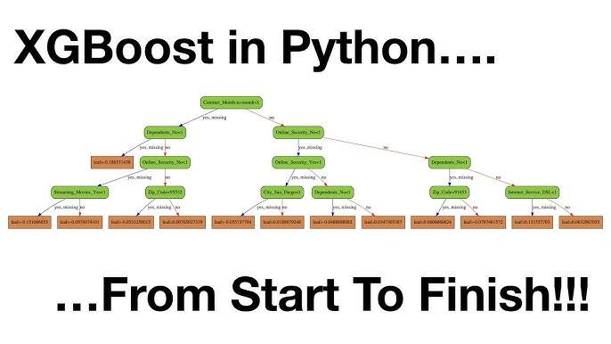

## Table of Contents

## What is XGBoost and why is it used in machine learning?

XGBoost is a type of machine learning algorithm that is really good at making predictions. It stands for "Extreme Gradient Boosting." Imagine you're trying to guess how much it will rain tomorrow. You could use one method to make a guess, but what if you could combine many guesses to make a better prediction? That's what XGBoost does. It takes many small predictions and combines them to make one strong prediction. This makes it very accurate and useful for many different kinds of problems.

People use XGBoost in machine learning because it works really well and is fast. It can handle lots of data and still give you good results quickly. Many people who work with data, like scientists and engineers, use XGBoost because it helps them solve problems like predicting house prices or figuring out if someone will buy a product. It's also easy to use with popular programming tools, so it's a favorite choice for many.

## How do you install XGBoost in a Python environment?

To install XGBoost in a Python environment, you can use a tool called pip, which helps you add new programs to Python. Open your computer's command line or terminal, and type in the command `pip install xgboost`. Press enter, and pip will download and set up XGBoost for you. It might take a little time, but once it's done, you'll see a message saying that XGBoost has been successfully installed.

If you're using a special Python environment like Anaconda, you can also use its own tool called conda. Just type `conda install -c conda-forge xgboost` in your terminal, and conda will handle the installation for you. This way is good if you want to keep your Python setup organized. After the installation finishes, you can start using XGBoost in your Python projects to make predictions and solve problems.

## What are the basic steps to implement XGBoost for a classification problem in Python?

To use XGBoost for a classification problem in Python, you first need to prepare your data. This means splitting it into features (the information you have) and labels (what you want to predict). For example, if you're trying to predict if an email is spam or not, the features could be the words in the email, and the label would be "spam" or "not spam." Once your data is ready, you divide it into a training set and a test set. The training set is used to teach XGBoost how to make predictions, and the test set is used to see how well it learned.

After preparing your data, you can start using XGBoost. First, you import the XGBoost library in your Python code with `import xgboost as xgb`. Then, you create an XGBoost model by calling `xgb.XGBClassifier()`. You can set different options, like how many trees to use or how deep they should be, to make your model work better for your problem. Next, you train your model using the training data with the `fit` method, like this: `model.fit(X_train, y_train)`. After training, you use the `predict` method to make predictions on your test data: `predictions = model.predict(X_test)`. Finally, you can check how well your model did by comparing its predictions to the actual labels in the test set.

## How can you tune the hyperparameters of an XGBoost model in Python?

To make your XGBoost model even better, you can change its settings, called hyperparameters. One way to do this is by using a method called grid search. Imagine you're trying to find the best spot in a park to have a picnic. You could try different spots one by one until you find the best one. In grid search, you pick a few different settings for your model, like how many trees to use or how deep they should be, and then you try all the combinations to see which one works best. You can use a tool like `GridSearchCV` from the `scikit-learn` library to do this. You tell it which settings to try, and it will run your XGBoost model with each combination and tell you which one gives the best results.

Another way to tune your XGBoost model is by using random search. This is like trying different picnic spots randomly instead of checking every single one. Random search can be faster because it doesn't try every possible combination, but it still gives you good results. You can use `RandomizedSearchCV` from `scikit-learn` for this. You tell it the range of settings you want to try, and it will pick random combinations to test. Both grid search and random search help you find the best settings for your XGBoost model so it can make the most accurate predictions.

## What are some key parameters in XGBoost that affect model performance?

Some important settings in XGBoost that can change how well your model works are the number of trees, the learning rate, and the maximum depth of the trees. The number of trees, called `n_estimators`, decides how many small predictions your model will make before combining them into a final prediction. If you have too few trees, your model might not learn enough about your data. If you have too many, it might take a long time to train and could start to memorize your data instead of learning from it. The learning rate, called `learning_rate`, controls how much each tree affects the final prediction. A smaller learning rate means each tree has a smaller impact, which can make your model more accurate but might need more trees and take longer to train.

Another important setting is the maximum depth of the trees, called `max_depth`. This decides how many layers each tree can have. Deeper trees can learn more complex patterns in your data, but they might also start to memorize it too much, which is called overfitting. If your trees are too shallow, they might not learn enough, and your model might not be very accurate. Balancing these settings, along with others like `min_child_weight`, which controls the minimum number of samples needed to split a node, and `gamma`, which controls how much a split needs to improve the model to be considered, can help you make your XGBoost model work its best.

## How does XGBoost handle missing values in datasets?

XGBoost is smart about handling missing values in your data. When you have missing values, XGBoost doesn't just ignore them or throw them away. Instead, it figures out the best way to deal with them as it builds each tree. It tries splitting the data two ways: one way where the missing values go to the left side of the tree, and another way where they go to the right side. Then, it chooses the way that makes the model work better. This means your model can still learn from the rest of the data, even if some pieces are missing.

This way of handling missing values helps make your XGBoost model more accurate and reliable. It's especially useful when you have a lot of data with gaps, because you don't have to spend time filling in those gaps yourself. XGBoost takes care of it automatically, which saves you time and effort. So, even if your data isn't perfect, XGBoost can still make good predictions.

## Can you explain how XGBoost implements gradient boosting?

XGBoost uses a method called gradient boosting to make its predictions better. Imagine you're trying to guess how much it will rain tomorrow. You start with a simple guess, and then you make more guesses to fix the mistakes in your first one. In XGBoost, each guess is like a tree in a forest. The first tree makes a basic prediction, and then the next trees focus on fixing the errors made by the previous trees. They do this by looking at the differences between what the first tree predicted and what actually happened. These differences are called "residuals." The new trees try to predict these residuals, which helps the overall prediction get closer to the truth.

To make sure each new tree helps improve the prediction, XGBoost uses a special math trick called gradients. Gradients show which direction to go to make the prediction better. When XGBoost builds a new tree, it looks at the gradients to decide how to split the data in the tree. This way, each new tree focuses on the parts of the data where the previous trees made the biggest mistakes. By adding these trees one by one and using gradients to guide them, XGBoost can make very accurate predictions. This process is called gradient boosting, and it's what makes XGBoost so powerful and popular in [machine learning](/wiki/machine-learning).

## How do you use XGBoost for regression tasks in Python?

To use XGBoost for regression tasks in Python, you first need to prepare your data. This means splitting it into features (the information you have) and labels (what you want to predict). For example, if you're trying to predict house prices, the features could be the size of the house, the number of bedrooms, and the location, while the label would be the actual price of the house. Once your data is ready, you divide it into a training set and a test set. The training set is used to teach XGBoost how to make predictions, and the test set is used to see how well it learned.

After preparing your data, you can start using XGBoost. First, import the XGBoost library in your Python code with `import xgboost as xgb`. Then, create an XGBoost model by calling `xgb.XGBRegressor()`. You can set different options, like how many trees to use or how deep they should be, to make your model work better for your problem. Next, train your model using the training data with the `fit` method, like this: `model.fit(X_train, y_train)`. After training, use the `predict` method to make predictions on your test data: `predictions = model.predict(X_test)`. Finally, you can check how well your model did by comparing its predictions to the actual prices in the test set.

## What are the differences between XGBoost and other gradient boosting frameworks like LightGBM and CatBoost?

XGBoost, LightGBM, and CatBoost are all types of gradient boosting frameworks, but they have some differences. XGBoost is known for being very accurate and fast. It works well with many types of data and can handle missing values smartly. XGBoost builds trees level by level, which means it adds all the nodes at one level before moving to the next. This makes it good at finding the best splits but can be slower for very large datasets. LightGBM, on the other hand, grows trees leaf by leaf, which can be faster, especially with big data. It's designed to be more memory-efficient and can handle large datasets better than XGBoost. LightGBM also has special ways to deal with categorical features, which can be helpful in some cases.

CatBoost is another gradient boosting framework that stands out because it's good at handling categorical data without needing to turn it into numbers first. It uses a method called "ordered boosting" to reduce overfitting, which can make it more accurate, especially with smaller datasets. CatBoost also has built-in ways to handle missing values and can be easier to use because it requires less tuning of settings. While XGBoost and LightGBM might need more work to get the best results, CatBoost often performs well right out of the box. Each of these frameworks has its strengths, so the best one for you depends on your specific data and what you need from your model.

## How can you interpret the results of an XGBoost model, including feature importance?

Interpreting the results of an XGBoost model helps you understand how it makes its predictions. One way to do this is by looking at feature importance. Feature importance tells you which pieces of information, or features, the model thinks are most important for making good predictions. In XGBoost, you can find feature importance by using the `feature_importances_` attribute of your trained model. This gives you a number for each feature that shows how much it affects the model's predictions. Features with higher numbers are more important, meaning they have a bigger impact on the final prediction.

Another way to interpret XGBoost results is by looking at the predictions themselves. You can compare the model's predictions to the actual outcomes to see how well it did. If you're using XGBoost for a classification problem, you can look at a confusion matrix to see where the model made mistakes. For regression tasks, you can look at metrics like mean squared error or R-squared to understand how close the predictions are to the real values. By combining these methods, you can get a good idea of how your XGBoost model works and which parts of your data it finds most useful.

## What are some advanced techniques for optimizing XGBoost models in Python?

One advanced way to make your XGBoost model even better is by using a technique called cross-validation. Imagine you're studying for a test and you want to make sure you're ready. You could split your study material into different parts and test yourself on each part separately. Cross-validation is like that. You split your data into different groups, train your model on some of the groups, and test it on the others. This way, you can see how well your model works on different parts of your data, which helps you find the best settings for your model. You can use `cross_val_score` from the `scikit-learn` library to do this easily.

Another advanced technique is called early stopping. Think of it like this: when you're training your model, it's like running a race. You want to keep going until you reach the finish line, but sometimes you might keep running even after you've crossed it, which wastes time and energy. Early stopping helps you stop training your model at the right time. It watches how well your model is doing on a separate set of data called a validation set. If the model's performance stops getting better, early stopping tells it to stop training. This saves time and helps prevent your model from memorizing your data too much, which is called overfitting. You can use the `early_stopping_rounds` parameter in XGBoost to set this up.

## How can XGBoost be integrated into larger machine learning pipelines and workflows in Python?

XGBoost can be easily added to bigger machine learning projects in Python. It works well with tools like scikit-learn, which helps you organize your whole project. You can use scikit-learn's `Pipeline` to put XGBoost together with other steps, like getting your data ready or trying different settings. This makes your project easier to manage because everything is in one place. For example, you could have a pipeline that first cleans your data, then uses XGBoost to make predictions, and finally checks how well it did. This way, you can run everything from start to finish without having to do each step separately.

Another way to use XGBoost in bigger projects is by saving and loading your models. After you train an XGBoost model, you can save it to a file using `joblib` or `pickle`. This means you can use the same model later without having to train it again, which saves time. You can also use tools like MLflow to keep track of your experiments and results. MLflow helps you remember which settings you used and how well your model did, so you can compare different versions and pick the best one. By combining XGBoost with these tools, you can build and manage complex machine learning projects more easily.

## Question: Why should one use XGBoost in algorithmic trading?

XGBoost, short for eXtreme Gradient Boosting, presents several compelling advantages when used in [algorithmic trading](/wiki/algorithmic-trading). Its high predictive accuracy is paramount in financial markets where trading decisions hinge on the ability to forecast price movements accurately. XGBoost achieves this accuracy by capitalizing on its ability to handle complex data structures inherent in financial datasets, which often involve non-linear relationships and high noise levels.

One of the strengths of XGBoost is its proficiency in exploiting non-linear relationships within market data. Financial markets are influenced by a myriad of factors that do not follow a straightforward linear path. Prices and market indicators react to a range of contextual variables and sudden market shifts, creating a complex interplay that can be challenging to model using linear approaches. XGBoost, with its robust gradient boosting framework, is adept at capturing these non-linear dependencies, thereby enhancing the capacity to predict trends and price movements more reliably.

The ensemble learning approach of XGBoost further extends its utility in algorithmic trading. Ensemble methods, like the one utilized in XGBoost, combine the predictions from multiple models to produce a superior overall result. This is done through a process of sequentially adding predictors to an ensemble, each one correcting the errors of its predecessors. For instance, if $y$ is our target variable and $f(x)$ is the function approximated by the ensemble of weak models, XGBoost creates a final model that reduces biases and variances effectively as:

$$
f(x) = \sum_{m=1}^{M} \gamma_m h_m(x)
$$

where $h_m(x)$ are individual weak models (typically decision trees) and $\gamma_m$ are the weights associated with these models. This strategy enhances model generalization, making XGBoost robust against overfitting by maintaining a balance between the bias and variance trade-off. Consequently, it yields predictions that generalize well on unseen data, a critical attribute for making informed trading decisions.

In conclusion, XGBoost's combination of high predictive accuracy, ability to model complex, non-linear relationships, and the ensemble approach to learning collectively make it a valuable tool in developing sophisticated trading strategies. Its adoption can lead to more informed and potentially profitable trading strategies, tapping into its strengths to navigate the complexities of financial markets.

## References & Further Reading

[1]: Bergstra, J., Bardenet, R., Bengio, Y., & Kégl, B. (2011). ["Algorithms for Hyper-Parameter Optimization."](https://dl.acm.org/doi/10.5555/2986459.2986743) Advances in Neural Information Processing Systems 24.

[2]: ["Advances in Financial Machine Learning"](https://www.amazon.com/Advances-Financial-Machine-Learning-Marcos/dp/1119482089) by Marcos Lopez de Prado

[3]: ["Evidence-Based Technical Analysis: Applying the Scientific Method and Statistical Inference to Trading Signals"](https://www.amazon.com/Evidence-Based-Technical-Analysis-Scientific-Statistical/dp/0470008741) by David Aronson

[4]: ["Machine Learning for Algorithmic Trading"](https://github.com/stefan-jansen/machine-learning-for-trading) by Stefan Jansen

[5]: ["Quantitative Trading: How to Build Your Own Algorithmic Trading Business"](https://books.google.com/books/about/Quantitative_Trading.html?id=j70yEAAAQBAJ) by Ernest P. Chan