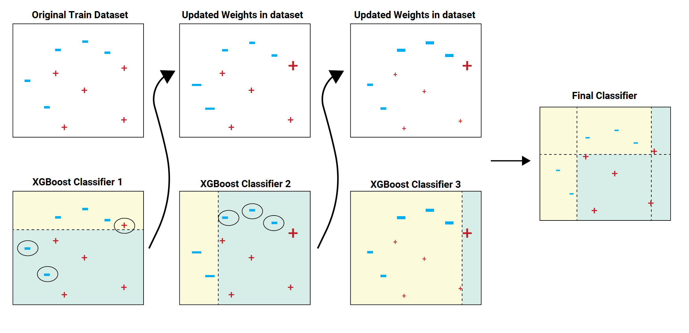

Algorithmic trading refers to the use of computer algorithms to automate trading decisions in financial markets. By leveraging vast amounts of data and processing capabilities, algorithmic trading enables the execution of complex trading strategies at speeds and frequencies that are impossible for human traders to achieve. With the evolution of data analytics and computational power, algorithmic trading now constitutes a significant share of trading volume in global financial markets, effectively reshaping the landscape of modern finance.

XGBoost, short for eXtreme Gradient Boosting, is a machine learning library that has gained considerable popularity due to its robust predictive capabilities and computational efficiency. It is based on the concept of gradient boosting, where models are trained sequentially to correct the errors of prior models, ultimately enhancing the overall predictive accuracy. Developed by Tianqi Chen, XGBoost has rapidly become one of the go-to tools in the machine learning community, especially in trading, due to its ability to handle structured or tabular data with numerous input variables.



The main aim of this article is to demonstrate how XGBoost can be effectively utilized to develop trading strategies. By focusing on the predictive accuracy and efficiency of XGBoost, the article will guide traders and data scientists in leveraging its capabilities to identify profitable trading opportunities. The integration of machine learning techniques like XGBoost into algorithmic trading strategies serves to enhance decision-making processes, offering a competitive edge in the fast-paced world of financial markets.

## Table of Contents

## What is XGBoost?

XGBoost, short for eXtreme Gradient Boosting, is an advanced implementation of the gradient boosting framework designed to enhance speed, efficiency, and predictive performance. The technique of gradient boosting involves generating an ensemble of weak prediction models, typically decision trees, where each subsequent model focuses on correcting the errors of its predecessors. XGBoost extends this concept by incorporating a range of system optimizations and algorithmic enhancements that significantly improve its performance over traditional methods.

At its core, XGBoost is recognized for three main attributes: speed, efficiency, and predictive accuracy. These attributes are achieved through several innovative features:

1. **Regularization**: XGBoost includes L1 (Lasso) and L2 (Ridge) regularization terms to prevent overfitting, a common problem in machine learning. This results in models that generalize better to new, unseen data.

2. **Parallelization**: Unlike traditional gradient boosting, XGBoost supports parallel tree construction by exploiting the features that can be processed independently. This capability significantly speeds up computation.

3. **Handling Missing Values**: XGBoost is adept at dealing with missing data. It automatically learns the best imputation strategy from the data itself during training.

4. **Tree Pruning**: An optimized methodology for tree pruning with a ‘max depth’ parameter improves model complexity control and execution speed.

5. **Weighted Quantile Sketch Algorithm**: This allows for effective handling of instances without sorting operations, enhancing computational efficiency.

Developed by Tianqi Chen as part of his Ph.D. research, XGBoost quickly gained traction in the [machine learning](/wiki/machine-learning) community thanks to its performance in various benchmark competitions, including Kaggle challenges. The algorithm's rapid adoption is attributed not only to its technical superiority but also to its versatility, being available in multiple programming languages such as Python, R, and C++. As a result, it has become a go-to algorithm for tasks requiring high accuracy and speed across numerous domains, including finance, healthcare, and marketing.

## Why Use XGBoost in Algorithmic Trading?

XGBoost, short for eXtreme Gradient Boosting, presents several compelling advantages when used in [algorithmic trading](/wiki/algorithmic-trading). Its high predictive accuracy is paramount in financial markets where trading decisions hinge on the ability to forecast price movements accurately. XGBoost achieves this accuracy by capitalizing on its ability to handle complex data structures inherent in financial datasets, which often involve non-linear relationships and high noise levels.

One of the strengths of XGBoost is its proficiency in exploiting non-linear relationships within market data. Financial markets are influenced by a myriad of factors that do not follow a straightforward linear path. Prices and market indicators react to a range of contextual variables and sudden market shifts, creating a complex interplay that can be challenging to model using linear approaches. XGBoost, with its robust gradient boosting framework, is adept at capturing these non-linear dependencies, thereby enhancing the capacity to predict trends and price movements more reliably.

The ensemble learning approach of XGBoost further extends its utility in algorithmic trading. Ensemble methods, like the one utilized in XGBoost, combine the predictions from multiple models to produce a superior overall result. This is done through a process of sequentially adding predictors to an ensemble, each one correcting the errors of its predecessors. For instance, if $y$ is our target variable and $f(x)$ is the function approximated by the ensemble of weak models, XGBoost creates a final model that reduces biases and variances effectively as:

$$
f(x) = \sum_{m=1}^{M} \gamma_m h_m(x)
$$

where $h_m(x)$ are individual weak models (typically decision trees) and $\gamma_m$ are the weights associated with these models. This strategy enhances model generalization, making XGBoost robust against overfitting by maintaining a balance between the bias and variance trade-off. Consequently, it yields predictions that generalize well on unseen data, a critical attribute for making informed trading decisions.

In conclusion, XGBoost's combination of high predictive accuracy, ability to model complex, non-linear relationships, and the ensemble approach to learning collectively make it a valuable tool in developing sophisticated trading strategies. Its adoption can lead to more informed and potentially profitable trading strategies, tapping into its strengths to navigate the complexities of financial markets.

## Setting Up the XGBoost Environment

To set up XGBoost in the Anaconda environment, you can follow a straightforward process that involves creating a new environment and installing the necessary packages. Anaconda is a popular choice among data scientists due to its ease of package management and environment setup, making it conducive for developing machine learning models like those using XGBoost.

### Step-by-Step Installation Guide

1. **Install Anaconda**: If you haven't already, download and install Anaconda from its [official website](https://www.anaconda.com/products/distribution). Anaconda provides a Python distribution equipped with numerous pre-installed data science libraries.

2. **Create a New Environment**: Open the Anaconda Prompt and create a new environment. It's good practice to create a separate environment for each project to avoid package conflicts.
   ```bash
   conda create --name xgboost_trading python=3.8
   ```
   Activate the newly created environment:
   ```bash
   conda activate xgboost_trading
   ```

3. **Install XGBoost**: With the environment activated, install XGBoost using conda or pip.
   ```bash
   conda install -c conda-forge xgboost
   ```
   Alternatively, you can use pip:
   ```bash
   pip install xgboost
   ```

### Verification and Test

To verify the installation, you can run a simple XGBoost program:

```python
import xgboost as xgb
from xgboost import DMatrix

# Create a simple dataset
data = [[1, 2, 3], [4, 5, 6]]
label = [0, 1]
dtrain = DMatrix(data, label=label)

# Set up parameters
params = {
    'objective': 'binary:logistic',
    'eval_metric': 'logloss'
}

# Train a simple model
model = xgb.train(params, dtrain, num_boost_round=10)

print("XGBoost installation and test ran successfully!")
```

### Complementary Libraries

For developing trading strategies, XGBoost is often used in conjunction with other Python libraries:

- **Pandas**: Essential for data manipulation and preparation, Pandas makes handling large datasets efficient. It is usually pre-installed with Anaconda, but you can install it via:
  ```bash
  conda install pandas
  ```

- **NumPy**: Provides support for large, multi-dimensional arrays and matrices, crucial for mathematical computations in machine learning. Install using:
  ```bash
  conda install numpy
  ```

- **Scikit-learn**: Offers tools for model evaluation and additional algorithms that can be used for comparison. It's useful for preprocessing and can be installed via:
  ```bash
  conda install -c anaconda scikit-learn
  ```

- **Matplotlib and Seaborn**: These libraries are used for data visualization, helping in the analysis and interpretation of model outputs.
  ```bash
  conda install matplotlib seaborn
  ```

By setting up XGBoost in this environment, you can effectively manage your dependencies and ensure a smooth workflow in developing and testing algorithmic trading strategies using machine learning techniques.

## Developing an XGBoost Trading Strategy

Developing an XGBoost trading strategy involves several stages, beginning with the selection of predictor variables and culminating in the fine-tuning of the model's hyperparameters. This process is crucial for building models that offer reliable predictions relevant to financial markets.

### Defining Predictor Variables

The initial step in creating an effective trading strategy using XGBoost involves identifying appropriate predictor variables from historical stock data. Predictor variables can include a range of market features such as prices, volumes, and technical indicators (e.g., moving averages, relative strength index). Selecting relevant features helps the model discern patterns that are predictive of future price movements.

A typical starting point in the feature selection process is employing a mix of fundamental, technical, and sentiment-based indicators. Fundamental indicators could involve earnings reports or macroeconomic data, while technical indicators include patterns derived from historical price data. Recent advancements allow for the inclusion of sentiment analysis sourced from news and social media, providing a more comprehensive dataset.

### Setting Up the Model

Having defined the predictor variables, the next step is to prepare the data for XGBoost modeling. This stage includes splitting the data into training and testing sets, a critical step to ensure the model can generalize well to unseen data. A common approach is to use a chronological split, where the model is trained on a segment of historical data and tested on subsequent data. This mimics real-world trading where future data is never available during model training.

Here is a basic template using Python to demonstrate data splitting for a trading model:

```python
import pandas as pd
from sklearn.model_selection import train_test_split

# Assuming `stock_data` is a DataFrame with predictor variables and target prices
X = stock_data.drop('target', axis=1)
y = stock_data['target']

# Splitting data into 70% training and 30% testing
X_train, X_test, y_train, y_test = train_test_split(X, y, test_size=0.3, shuffle=False)
```

### Hyperparameter Tuning

The optimization of hyperparameters is vital in enhancing the model's predictive performance. Unlike model parameters learned during training (e.g., weights in linear regression), hyperparameters are set before training begins and govern the model's architecture. In XGBoost, important hyperparameters include the learning rate (`eta`), maximum tree depth (`max_depth`), and the number of estimators (`n_estimators`).

Hyperparameter tuning seeks an optimal set that minimizes out-of-sample prediction error. Techniques such as grid search, random search, or more sophisticated methods like Bayesian optimization can be employed. Below is an example in Python using a grid search approach:

```python
from xgboost import XGBRegressor
from sklearn.model_selection import GridSearchCV

# Define a simple parameter grid
param_grid = {
    'eta': [0.01, 0.1, 0.3],
    'max_depth': [3, 5, 7],
    'n_estimators': [50, 100, 200]
}

# Initialize the XGBoost regressor
xgb_model = XGBRegressor(objective='reg:squarederror')

# Initialize the grid search
grid_search = GridSearchCV(estimator=xgb_model, param_grid=param_grid, cv=3, scoring='neg_mean_squared_error')

# Fit the model to find the best hyperparameters
grid_search.fit(X_train, y_train)

print(f"Best parameters: {grid_search.best_params_}")
```

The chosen hyperparameters directly affect the complexity and computation cost of the model, thus striking a balance between overfitting and underfitting is essential. A well-tuned XGBoost trading model can achieve superior performance by accurately capturing complex patterns in financial data, ultimately contributing to more informed and profitable trading decisions.

## Evaluating the Model

Evaluating the performance of an XGBoost model in algorithmic trading involves multiple layers of assessment to ensure its robustness and effectiveness in predicting market trends. One of the primary methods is cross-validation, a statistical technique used to estimate the skill of the model by training it on different subsets of the data. Cross-validation helps in understanding how well the model generalizes to an independent dataset, ensuring that the results are not merely a fluke from the particular sample chosen for training.

### Cross-Validation

A common approach to cross-validation is k-fold cross-validation, where the dataset is randomly partitioned into k equal-sized subsamples. For each subsample, the model is trained on k-1 subsamples and tested on the remaining single subsample. This process is repeated k times, with each of the k subsamples being used exactly once as the test data. The k results from the folds are averaged to produce a single estimation. This technique is especially useful to mitigate issues of overfitting, which occurs when the model is too closely fitted to the training data and may not perform well on new data.

### Confusion Matrices and Classification Reports

For classification problems, confusion matrices serve as an essential tool to evaluate the performance of the XGBoost model. A confusion matrix presents a tabular summary of the actual versus the predicted classifications made by the model. It helps in determining the model's precision, recall, and F1-score, providing insight into its classification accuracy.

- **Precision** refers to the accuracy of positive predictions.
- **Recall** indicates how many actual positives the model correctly identified.
- **F1-score** is the harmonic mean of precision and recall, offering a balance between them.

A classification report generated in Python can be implemented using libraries such as `scikit-learn`:

```python
from sklearn.metrics import classification_report
# Assuming y_true and y_pred are your actual and predicted labels
print(classification_report(y_true, y_pred))
```

### Visualizing Feature Importance

Visualizing feature importance is crucial for understanding how the XGBoost model makes predictions. XGBoost provides built-in functionality to plot feature importance, which can guide improvements in feature selection and engineering efforts. High importance features are those which the model relies on heavily to make predictions, and understanding these can provide valuable insights into market dynamics.

Here's a simple example of how to plot feature importance using Python:

```python
import xgboost as xgb
import matplotlib.pyplot as plt

# Assuming `model` is your trained XGBoost model
xgb.plot_importance(model)
plt.show()
```

The resulting plot ranks features based on their importance, allowing traders and analysts to focus on the variables that most influence model predictions. This visual understanding aids in model validation and adjustment, ensuring that no critical variables are overlooked.

In summary, evaluating an XGBoost model's performance in trading involves a comprehensive examination through cross-validation, detailed performance metrics via confusion matrices and classification reports, and a clear visualization of feature importance. These tools collectively ensure the model's predictive power and readiness for real-world trading environments.

## Performance Analysis

In evaluating the performance of an XGBoost-based trading strategy, [backtesting](/wiki/backtesting) is a crucial step. Backtesting involves simulating the trading strategy on historical data to assess its viability before deploying it in live markets. This process offers a comprehensive understanding of how the strategy would have performed under past market conditions and whether it can outperform traditional strategies such as buy-and-hold.

The XGBoost strategy is typically backtested using historical market data, where the model's predictions inform buying or selling decisions. The performance of this strategy can be analyzed through various metrics, including cumulative return, Sharpe ratio, and maximum drawdown. These metrics provide insights into the strategy’s profitability, risk-adjusted returns, and exposure to losses, respectively.

### Comparison with Buy-and-Hold Strategy

The buy-and-hold strategy is a simple investment approach where an asset—usually a stock or a portfolio of stocks—is purchased and held over a long period, regardless of fluctuations in the market. This strategy is based on the premise that markets generally rise over time.

When comparing the XGBoost trading strategy to buy-and-hold, it is essential to consider both the total returns and the [volatility](/wiki/volatility-trading-strategies) of returns. The XGBoost strategy often seeks to exploit short-term market inefficiencies and can provide higher returns during volatile market conditions through frequent trading. However, the strategy may also involve higher transaction costs and exposure to short-term market risks.

Quantitatively, suppose we denote the cumulative return of an XGBoost strategy as $R_{\text{XGB}}$ and that of a buy-and-hold strategy as $R_{\text{B\&H}}$. If $R_{\text{XGB}} > R_{\text{B\&H}}$, this indicates that the XGBoost strategy outperformed buy-and-hold during the backtesting period. However, it is essential to ensure that this outperformance is substantial enough to cover additional trading costs.

### Observed Predictive Power and Areas for Improvement

The predictive power of the XGBoost model in a trading strategy is vital, as it determines the model's ability to accurately forecast market movements. High predictive accuracy leads to more profitable trades and reduced risk exposure. However, the model's performance can vary based on market conditions, choice of features, and hyperparameter settings.

One observed strength of XGBoost is its ability to capture complex patterns in the data through ensemble learning and tree-based algorithms, which can account for non-linear relationships. This capability often results in higher predictive accuracy compared to simpler models like linear regression.

Despite these advantages, there are areas for improvement. Overfitting can be a concern, as the model may learn noise in the training data instead of the underlying patterns. This issue can be mitigated through techniques such as cross-validation, regularization, and careful selection of features. Additionally, the model’s interpretability is another area where focus is needed, as understanding how the model makes decisions can be vital for compliance and trust in its predictions.

In conclusion, while XGBoost-based trading strategies show promise and often outperform traditional strategies, continuous refinement and adaptation are crucial for maintaining their effectiveness in different market scenarios. Balancing predictive power with model robustness and cost efficiency is key to achieving sustainable trading success.

## Challenges and Considerations

Algorithmic trading using XGBoost, while powerful, presents several challenges and considerations that traders must address to optimize performance and adhere to regulatory requirements. 

One significant challenge is data quality. Financial market data can be noisy, incomplete, or inaccurate, leading to unreliable models if not properly managed. High-quality data is crucial for training effective models, necessitating rigorous preprocessing steps such as data cleaning, outlier detection, and normalization. Moreover, market data is often non-stationary, meaning statistical properties change over time, which can degrade a model's performance if not accounted for. Techniques like rolling-window validation help mitigate this by allowing models to adapt to changes.

Overfitting is another common challenge. Due to the high capacity and complexity of XGBoost models, there is a risk of fitting the noise instead of the underlying pattern. Regularization techniques, like L1 (Lasso) and L2 (Ridge), are intrinsic to XGBoost and help reduce overfitting by penalizing complex models. Additionally, cross-validation, a robust method for model evaluation, can provide insights into a model's performance and help avoid overfitting by assessing its predictive capabilities on unseen data.

Feature engineering plays a vital role in the effectiveness of XGBoost for trading. Creating informative and relevant features from raw financial data is essential for capturing the intricacies of market movements. Consider features like moving averages, relative strength index (RSI), or more complex indicators derived from domain knowledge. Feature selection is equally important, as irrelevant or redundant features can introduce noise and complicate the model, potentially leading to overfitting.

Another key consideration is model interpretability. While XGBoost offers high predictive power, its complexity can obscure the decision-making process. Tools like SHAP (SHapley Additive exPlanations) values provide insights into feature importance and contribution, enhancing interpretability. Understanding feature influences ensures that the model aligns with domain knowledge, thus supporting informed decision-making.

Deploying machine learning models in trading also involves navigating regulatory and compliance frameworks. Regulations such as the Markets in Financial Instruments Directive (MiFID II) in Europe or the Dodd-Frank Act in the United States necessitate transparency and explainability of algorithmic decisions. Ensuring that models and strategies comply with legal standards is crucial to avoid legal penalties and maintain market integrity.

Incorporating governance practices like model documentation, version control, and audit trails can facilitate compliance and make the deployment of XGBoost models in trading settings more robust and accountable. These considerations highlight the complexity of integrating machine learning models into trading strategies and underscore the importance of a thoughtful and systematic approach.

## Conclusion

XGBoost, or Extreme Gradient Boosting, represents a pivotal advancement in the application of machine learning within algorithmic trading. Its primary strengths are rooted in its high predictive accuracy, efficiency, and ability to manage complex datasets. These attributes make XGBoost a valuable tool in developing effective trading strategies that can pinpoint nuanced market trends and capitalize on them.

Nevertheless, employing XGBoost in algorithmic trading does come with notable challenges. The model's complexity can sometimes lead to overfitting, where it performs excellently on training data but less effectively on unseen data. Careful hyperparameter tuning and robust cross-validation methods are essential to mitigate this risk. Additionally, the quality of input data is crucial; poor data can distort predictions, necessitating rigorous data cleaning and preprocessing.

The dynamic nature of financial markets demands continuous updates and refinements in modeling approaches. As market conditions evolve, trading strategies — including those driven by machine learning models like XGBoost — must adapt to maintain their effectiveness. It is vital for practitioners to not only rely on historical data but to remain vigilant of real-time market changes and emerging trends.

Machine learning, particularly through models such as XGBoost, presents a frontier for further research and innovation in financial trading. The continued exploration and integration of these models in trading not only promise enhanced predictive performance but also provide opportunities for developing novel trading strategies. By combining domain expertise with advanced machine learning techniques, traders can potentially unlock new competitive advantages in the financial markets. Encouragingly, this intersection of machine learning and finance invites an era of innovative exploration and progressive transformations in trading methodologies.

## References & Further Reading

[1]: Bergstra, J., Bardenet, R., Bengio, Y., & Kégl, B. (2011). ["Algorithms for Hyper-Parameter Optimization."](https://dl.acm.org/doi/10.5555/2986459.2986743) Advances in Neural Information Processing Systems 24.

[2]: ["Advances in Financial Machine Learning"](https://www.amazon.com/Advances-Financial-Machine-Learning-Marcos/dp/1119482089) by Marcos Lopez de Prado

[3]: ["Evidence-Based Technical Analysis: Applying the Scientific Method and Statistical Inference to Trading Signals"](https://www.amazon.com/Evidence-Based-Technical-Analysis-Scientific-Statistical/dp/0470008741) by David Aronson

[4]: ["Machine Learning for Algorithmic Trading"](https://github.com/stefan-jansen/machine-learning-for-trading) by Stefan Jansen

[5]: ["Quantitative Trading: How to Build Your Own Algorithmic Trading Business"](https://books.google.com/books/about/Quantitative_Trading.html?id=j70yEAAAQBAJ) by Ernest P. Chan