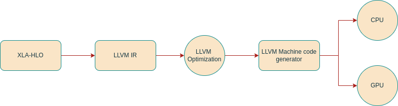

## Table of Contents

## What is XLA and why is it important in machine learning?

XLA, or Accelerated Linear Algebra, is a domain-specific compiler for linear algebra that optimizes the computations in machine learning models. It's like a smart tool that takes the math operations needed for machine learning and makes them faster and more efficient. When you use machine learning frameworks like TensorFlow or PyTorch, XLA can help by turning the operations into more streamlined code that runs better on different types of hardware, like CPUs, GPUs, or even TPUs.

This is important in machine learning because it can make your models run faster and use less power. Imagine you're training a big model on a lot of data; it can take a long time and use a lot of energy. With XLA, the same training can be done more quickly and with less energy, which is good for both the environment and your wallet. Plus, because XLA can work with different types of hardware, it makes it easier to use the best tool for the job, no matter what kind of computer you have.

## How does XLA improve the performance of machine learning models?

XLA improves the performance of machine learning models by optimizing the way they do math. When you use a machine learning framework like TensorFlow, it breaks down your model into lots of small math operations. XLA looks at all these operations and figures out how to do them in a smarter way. It can combine operations that can be done together, remove unnecessary steps, and rearrange the order of operations to make everything run faster. This is like having a super-organized helper who makes sure everything is done in the most efficient way possible.

Another way XLA helps is by making the model run better on different types of computers. Not all computers are the same—some have CPUs, some have GPUs, and some have TPUs. XLA can take the same set of math operations and turn them into code that works really well on any of these. This means you can use the best type of computer for your model without having to change your code. For example, if you're using a GPU, XLA can make sure the math operations are arranged in a way that the GPU can handle quickly. This flexibility makes it easier to get the best performance out of whatever hardware you have.

## What are the key components of the XLA framework?

The XLA framework has several key components that work together to make machine learning models run faster and more efficiently. One important part is the compiler, which takes the math operations from your model and turns them into optimized code. This compiler looks at all the operations and figures out how to do them in the best way possible, like combining steps or rearranging them to save time. Another key component is the runtime, which is responsible for actually running the optimized code on different types of hardware, like CPUs, GPUs, or TPUs. The runtime makes sure that the code runs smoothly and takes advantage of the specific features of the hardware it's running on.

Another important part of XLA is the intermediate representation (IR), which is like a common language that the compiler uses to understand and optimize the math operations. The IR helps the compiler see the big picture of what the model is doing and find ways to make it more efficient. Finally, XLA includes various optimization passes, which are like special tools that the compiler uses to make the code even better. These passes can do things like removing unnecessary operations, simplifying complex math, or making sure the code uses the hardware's memory in the best way possible. Together, these components help XLA make machine learning models run faster and use less power.

## Can you explain how XLA optimizes linear algebra operations?

XLA optimizes linear algebra operations by looking at all the math steps in a machine learning model and figuring out how to do them more efficiently. It does this by combining operations that can be done together, removing steps that aren't needed, and rearranging the order of operations to make everything run faster. For example, if a model has a series of matrix multiplications, XLA can combine them into one big operation, which saves time because it reduces the number of steps the computer needs to do. This is like how you might do a bunch of small errands in one trip instead of making lots of separate trips.

Another way XLA helps is by making sure the math operations work well on different types of computers, like CPUs, GPUs, or TPUs. It does this by turning the math operations into code that is specifically designed for the hardware it's running on. For instance, if you're using a GPU, XLA can arrange the operations in a way that the GPU can handle quickly, like using parallel processing to do many calculations at once. This flexibility means you can use the best type of computer for your model without having to change your code, making it easier to get the best performance out of whatever hardware you have.

## What are the differences between XLA and traditional linear algebra libraries?

XLA and traditional linear algebra libraries like NumPy or BLAS work on math operations, but they do it in different ways. Traditional libraries focus on doing one math operation at a time, like adding two matrices or multiplying them. They are good at doing these operations quickly, but they don't look at the bigger picture of how all the operations fit together. For example, if you want to do $$A + B$$ and then $$C \times D$$, a traditional library will do these steps one after the other without thinking about if there's a better way to do them.

XLA, on the other hand, looks at all the math operations in a machine learning model and figures out how to do them more efficiently. It can combine operations that can be done together, remove steps that aren't needed, and rearrange the order of operations to make everything run faster. For example, if you have a series of operations like $$A + B$$ followed by $$C \times (A + B)$$, XLA can see that it can do the addition and then the multiplication in one go, saving time. This makes XLA particularly useful for machine learning because it can optimize the whole model, not just individual operations.

Another big difference is that XLA is designed to work well on different types of computers, like CPUs, GPUs, and TPUs. It turns the math operations into code that is specifically designed for the hardware it's running on, making sure the operations run as fast as possible. Traditional libraries, while they can be used on different hardware, don't have this level of optimization. This flexibility means that with XLA, you can use the best type of computer for your model without having to change your code, making it easier to get the best performance out of whatever hardware you have.

## How can one integrate XLA into existing machine learning workflows?

Integrating XLA into existing machine learning workflows is pretty straightforward, especially if you're using popular frameworks like TensorFlow or PyTorch. If you're using TensorFlow, you can enable XLA just by adding a few lines of code to your existing scripts. For example, you can turn on XLA for your model by setting the `jit_compile` parameter to `True` when you compile your model. This tells TensorFlow to use XLA to optimize your model's operations. If you're using PyTorch, you can use the `torch_xla` package to integrate XLA. You'll need to install the package and then use it to create your model and run your training loops on a TPU, for instance.

Once you've enabled XLA, it will start working behind the scenes to make your model run faster and more efficiently. It looks at all the math operations in your model and figures out how to do them in the best way possible. For example, if your model does a series of operations like $$A + B$$ followed by $$C \times (A + B)$$, XLA can see that it can do the addition and then the multiplication in one go, saving time. This makes your training and inference faster without you needing to change much of your existing code. It's like having a smart helper who makes sure everything is done in the most efficient way possible.

## What programming languages and frameworks support XLA?

XLA is mainly used with TensorFlow and PyTorch, two popular machine learning frameworks. In TensorFlow, you can easily turn on XLA by setting the `jit_compile` parameter to `True` when you compile your model. This tells TensorFlow to use XLA to make your model's math operations faster. For example, if your model does $$A + B$$ followed by $$C \times (A + B)$$, XLA can combine these steps to save time. In PyTorch, you can use the `torch_xla` package to integrate XLA. You'll need to install this package and then use it to run your model on a TPU, which can make your training and inference much faster.

XLA also works with other programming languages and frameworks, but it's most commonly used with Python because that's what TensorFlow and PyTorch use. If you're using other languages like C++ or Java, you can still use XLA, but you might need to do a bit more work to set it up. For example, in C++, you can use the XLA API directly to optimize your linear algebra operations. This can be useful if you're working on high-performance computing projects where every bit of speed counts.

## Can you describe a real-world application where XLA has significantly improved performance?

In a real-world application, XLA was used by Google to speed up their machine learning models for language translation. They had a big model that needed to process a lot of data quickly. By using XLA, they were able to make their model run much faster on their TPUs. This meant they could translate text from one language to another more quickly and with less power. For example, if the model had to do a series of math steps like $$A + B$$ followed by $$C \times (A + B)$$, XLA could see that it could combine these steps to save time. This made a big difference because it let them serve more users and get better results without using more energy.

Another example is in the field of image recognition. A company used XLA to optimize their model that identifies objects in pictures. The model had a lot of math operations, and by using XLA, they could make it run faster on their GPUs. This was important because it let them process more images in less time, which is crucial for applications like security cameras or self-driving cars. For instance, if the model needed to do operations like $$D \times E$$ and then $$F + (D \times E)$$, XLA could optimize these steps to make the whole process quicker. This helped them improve their service and make it more reliable, all while using the same amount of hardware.

## What are the challenges and limitations of using XLA in machine learning projects?

Using XLA in machine learning projects can have some challenges. One challenge is that it might take some time to set up, especially if you're using a framework like PyTorch and need to install the `torch_xla` package. You might also need to change your code a bit to make sure XLA works properly. For example, if your model does operations like $$A + B$$ followed by $$C \times (A + B)$$, you need to make sure XLA can see these steps and optimize them. If your code is not set up right, XLA might not be able to help as much as it could.

Another limitation is that XLA might not always make your model run faster. Sometimes, the way XLA optimizes things might not work well with your specific model or hardware. For instance, if your model has a lot of different types of operations, XLA might not be able to combine them as well as it does with simpler models. This means you might need to test your model with and without XLA to see if it actually helps. It's like trying on different shoes to see which ones fit best; you might need to experiment to find the right fit for your project.

## How does XLA handle different hardware accelerators like GPUs and TPUs?

XLA is really good at working with different types of computers, like GPUs and TPUs. It does this by turning the math operations from your machine learning model into code that works best on the hardware it's running on. For example, if you're using a GPU, XLA can arrange the operations in a way that the GPU can handle quickly, like using parallel processing to do many calculations at once. This means your model can run faster and use less power, no matter what kind of computer you have. It's like having a smart helper who knows how to use the tools you give it in the best way possible.

If your model does operations like $$A + B$$ followed by $$C \times (A + B)$$, XLA can see that it can combine these steps to save time. This is especially helpful when you're using TPUs, which are designed to do lots of math operations very quickly. XLA can make sure your model takes full advantage of the TPU's speed, making your training and inference much faster. This flexibility means you can use the best type of computer for your model without having to change your code, which makes it easier to get the best performance out of whatever hardware you have.

## What advanced features does XLA offer for expert users in optimizing neural networks?

XLA offers some cool advanced features for people who really know their stuff when it comes to optimizing neural networks. One of these is the ability to do custom operations. If you have a special math operation that isn't built into TensorFlow or PyTorch, you can write your own and let XLA optimize it. This means you can make your model even faster by using operations that are perfect for your specific needs. For example, if your model needs to do $$A + B$$ followed by $$C \times (A + B)$$, you can write a custom operation that combines these steps, and XLA will make it run as fast as possible.

Another advanced feature is the ability to use XLA's intermediate representation (IR) directly. This lets you look at how XLA is turning your model's operations into code and even change it if you want. By working with the IR, you can find new ways to make your model run faster that XLA might not have thought of on its own. It's like being able to see inside the engine of a car and tweak it to go even faster. This can be really helpful for experts who want to get every last bit of speed out of their models.

## How can one measure the performance impact of using XLA in a machine learning model?

To measure the performance impact of using XLA in a machine learning model, you can start by comparing the training and inference times with and without XLA. For example, if your model does operations like $$A + B$$ followed by $$C \times (A + B)$$, you can run the model once with XLA enabled and once without it. You can then look at how long each run takes. If XLA is working well, the time it takes to train or run the model should be shorter when XLA is on. This simple comparison can give you a good idea of whether XLA is helping your model run faster.

Another way to measure the performance impact is by looking at how much memory your model uses. XLA can make your model use less memory by optimizing the math operations, like combining steps or rearranging them to be more efficient. You can check the memory usage of your model with and without XLA to see if there's a difference. If XLA is making your model use less memory, it's not only running faster but also using fewer resources, which can be really important, especially if you're working with big models or limited hardware.