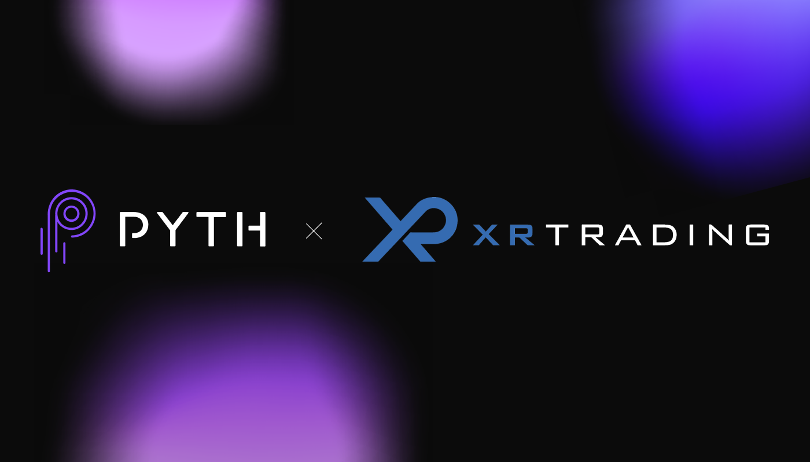

XR Trading, a prominent player in modern financial markets, is renowned for its focus on algorithmic trading, a method that leverages computer algorithms to automate trading decisions. Founded in the early 2000s, XR Trading has carved a niche for itself by employing sophisticated technologies to evaluate and execute trades swiftly and accurately. The firm's prominence is largely attributed to its innovative approach to algorithmic trading, a critical component of contemporary financial ecosystems.

Algorithmic trading, a technique that utilizes pre-programmed instructions to account for variables such as time, price, and volume, transforms the trading process. This strategy is crucial for XR Trading as it allows for the execution of trades within milliseconds, thereby maximizing efficiency and minimizing human error. The use of algorithms is not only about speed but also precision and the ability to analyze large datasets to predict market trends and execute trades accordingly.



XR Trading's journey in the algorithmic trading sector reflects the broader evolution of financial markets. Initially, the company adopted algorithmic methods to increase trading volume and liquidity, adapting over time to technological advancements and increasingly complex market dynamics. This evolution underscores the significance of algorithmic trading strategies, which have become indispensable tools for navigating volatile and fragmented markets. They enhance market efficiency, provide liquidity, and aid in price discovery, thus contributing to the overall robustness of the financial ecosystem.

The purpose of this article is to explore the intricacies of XR Trading's algorithmic trading practices. By examining the strategies and technologies employed by XR Trading, the article aims to shed light on how the firm maintains its competitive edge and contributes to innovations in financial markets. The focus will be on understanding the principles, applications, and future trends in algorithmic trading, especially as they pertain to XR Trading's continued success. This comprehensive exploration will provide insights into the operational and strategic facets of XR Trading's algorithmic trading operations, offering a detailed look at how the firm navigates the complexities and challenges of modern financial markets.

## Table of Contents

## Understanding Algorithmic Trading

Algorithmic trading involves utilizing computer algorithms to automate the process of trading financial instruments. It relies on pre-defined instructions and complex mathematical models to evaluate, execute, and manage trades at speeds and frequencies that a human trader cannot match. 

**Definition and Basic Principles**

At its core, [algorithmic trading](/wiki/algorithmic-trading) is the use of automated, pre-programmed trading instructions to execute trades. These instructions are based on variables such as timing, price, quantity, or any mathematical model. The primary aim is to maximize the trading profit by making quick, accurate decisions based on a large [volume](/wiki/volume-trading-strategy) of data.

**Evaluation, Execution, and Management of Trades**

Algorithms use historical data and statistical models to predict market trends and evaluate potential trades. Once a trading opportunity is identified, the algorithm executes the trade automatically. The execution speed is critically fast, often occurring in milliseconds, which involves the algorithm continuously scanning market conditions and adjusting the trading strategy in real-time. For managing trades, algorithms can adjust parameters dynamically, like stopping orders, scaling positions, or managing risk.

Python example of a basic algorithmic trading strategy:

```python
import numpy as np
import pandas as pd

def simple_moving_average_strategy(prices, short_window, long_window):
    short_ma = prices.rolling(window=short_window).mean()
    long_ma = prices.rolling(window=long_window).mean()
    signals = pd.DataFrame(index=prices.index)
    signals['signal'] = 0.0

    signals['signal'][short_window:] = np.where(short_ma[short_window:] > long_ma[short_window:], 1.0, 0.0)
    signals['positions'] = signals['signal'].diff()

    return signals
```

**Importance of Speed, Accuracy, and Data Analysis**

Speed is crucial in algorithmic trading, as it allows traders to capitalize on short-lived opportunities in the market. A delay of even a few milliseconds can result in a lost opportunity or unfavorable trade terms. Accuracy ensures the trades are executed as intended with minimal errors, and comprehensive data analysis enhances the quality of trade decisions by identifying patterns and trends.

**Types of Algorithms in Trading Scenarios**

Several types of algorithms are frequently used in trading:

1. **Trend-Following Algorithms**: These algorithms follow the market trend for a specific pathway, buying when the market is trending upwards and selling when it is trending downwards.

2. **Statistical Arbitrage**: These strategies involve statistical methods for trading that exploit price inefficiencies between correlated instruments.

3. **Market Making**: This involves placing buy and sell orders to profit from the bid-offer spread, requiring sophisticated matching algorithms.

4. **Mean Reversion Algorithms**: Based on the mean reversion theory, these algorithms assume that the prices of assets will revert to the mean over time.

**Benefits and Challenges**

Algorithmic trading provides several benefits, including increased efficiency due to automation, ability to process vast amounts of data quickly, reduced risk of human error, and the opportunity for 24/7 trading without fatigue. However, challenges also exist, such as the potential for technical failures, increased market [volatility](/wiki/volatility-trading-strategies) due to algorithmic trades, and the complexity of developing and maintaining effective algorithms. Additionally, regulatory challenges and the need for constant monitoring and updating of strategies to adapt to changing market conditions are significant hurdles.

These aspects make algorithmic trading an integral part of the modern financial ecosystem, where speed, precision, and data-driven insights define success.

## The Role of XR Trading in Algo Trading

XR Trading, a prominent figure in algorithmic trading, has strategically focused on developing cutting-edge algorithms that execute trades with precision and efficiency. The firm's approach to crafting these algorithms involves a symbiotic integration of quantitative analysis, sophisticated technology, and market intuition. By leveraging large datasets and comprehensive statistical models, XR Trading strives to anticipate market movements and capitalize on trading opportunities.

The process of designing and implementing algorithms at XR Trading begins with extensive data collection and analysis. Quantitative researchers at the firm employ a variety of statistical techniques to identify profitable trading patterns within historical market data. These insights are then translated into algorithmic strategies that can operate autonomously within the market. The algorithms are backtested rigorously to ensure their viability under different market conditions, thereby minimizing the risk of adverse outcomes.

Key technologies underpinning XR Trading's algorithmic operations include high-performance computing systems, low-latency networks, and state-of-the-art data analytics tools. These technologies enable XR Trading to process and analyze vast quantities of financial data in real-time, executing trades within microseconds—a capability that is crucial in today’s ultra-fast-paced markets. Furthermore, [machine learning](/wiki/machine-learning) plays a significant role in enhancing the adaptability and intelligence of XR Trading's algorithms, allowing for continuous improvement based on real-time market feedback.

The impact of XR Trading's algorithms on market dynamics is notable, as they contribute significantly to market [liquidity](/wiki/liquidity-risk-premium) and price discovery. By executing trades at high speeds, these algorithms ensure that markets remain efficient and responsive to new information. This high-frequency trading strategy not only enables XR Trading to capture fleeting opportunities but also stabilizes markets by providing both buy and sell side liquidity.

An illustrative example of XR Trading's success in algorithmic trading is demonstrated through their market-making strategies. By offering continuous buy and sell quotes, XR Trading algorithms narrow the bid-ask spread, facilitating smoother transactions for other market participants. This not only benefits XR Trading by capturing spreads but also enhances overall market functionality.

In conclusion, XR Trading's emphasis on algorithmic innovation and technological prowess has cemented its role as a leader in the domain of algorithmic trading. The firm's sophisticated approach to designing and implementing trading algorithms continues to shape market dynamics and set new benchmarks for efficiency and success in financial markets.

## Strategies Employed by XR Trading

## Strategies Employed by XR Trading

XR Trading employs a range of sophisticated algorithmic trading strategies to optimize the financial outcomes of its operations. The following key strategies demonstrate their diverse approach to market engagement.

### Statistical Arbitrage

Statistical [arbitrage](/wiki/arbitrage) is a cornerstone of XR Trading’s strategy portfolio. This approach involves using quantitative models to identify and exploit temporary price deviations between related securities. The basic principle is to find statistical mispricings and predict when prices will revert to their mean values. Traders at XR Trading develop models using historical data to identify these opportunities, often deploying machine learning techniques to refine predictions. By conducting extensive [backtesting](/wiki/backtesting), XR Trading ensures that their [statistical arbitrage](/wiki/statistical-arbitrage) models are robust against various market conditions. An example of a statistical arbitrage strategy is pairs trading, where a trader identifies two historically correlated stocks and buys one while shorting the other when the price spread between them widens.

### Market Making

Market making is another pivotal strategy for XR Trading. Market makers provide liquidity by continuously quoting buy and sell prices for various financial instruments. XR Trading's algorithms are designed to rapidly adjust quotes in response to market changes, ensuring tight bid-ask spreads. This strategy not only generates profit through the spread but also enhances market efficiency. XR Trading’s sophisticated risk management systems monitor exposure to mitigate the risks inherent in continuous market participation.

### Momentum Trading

Momentum trading is employed by XR Trading to capitalize on short-term trends in the market. Using advanced data analytics, their models detect trends as they emerge, allowing traders to enter positions based on the expectation that the trend will continue in the near term. XR Trading constructs models to dynamically assess the strength and persistence of trends, taking into account both market data and broader economic indicators. The flexibility to adjust quickly is a critical component of XR's [momentum](/wiki/momentum) trading success.

### Strategy Tailoring

One of XR Trading's strengths is its ability to tailor strategies to specific market conditions and data insights. Machine learning models and predictive analytics play a crucial role in customizing their approach, enabling XR Trading to adapt swiftly to volatile markets or unexpected economic events. For instance, in periods of high volatility, XR Trading algorithms might increase the frequency of trades to capture small price movements, thereby capitalizing on rapid fluctuations.

### Backtesting and Simulation

The importance of backtesting and simulation in XR Trading's strategy validation cannot be overstated. By simulating trading strategies against historical data, XR Trading can assess potential risks and returns before deploying strategies in live markets. Python and C++ are typically used for developing these simulations, owing to their computational efficiency and extensive libraries for data analysis. A simple Python code snippet to evaluate a moving average crossover strategy might look like:

```python
import pandas as pd

# Load historical price data
data = pd.read_csv('price_data.csv')
short_window = 40
long_window = 100

# Calculate moving averages
data['Short_MA'] = data['Close'].rolling(window=short_window, min_periods=1).mean()
data['Long_MA'] = data['Close'].rolling(window=long_window, min_periods=1).mean()

# Generate trading signals
data['Signal'] = 0
data['Signal'][short_window:] = np.where(data['Short_MA'][short_window:] > data['Long_MA'][short_window:], 1, -1)

# Simulate strategy returns
data['Strategy_Returns'] = data['Signal'].shift(1) * data['Returns']
```

### Innovative Strategies

XR Trading distinguishes itself from competitors with innovative strategies that leverage emerging technologies. For example, incorporating [alternative data](/wiki/best-alternative-data) sources such as satellite imagery or social media sentiment analysis into their trading models allows XR Trading to gain unique market insights. These innovative approaches exemplify XR Trading's commitment to maintaining a competitive edge in algorithmic trading by continually exploring new avenues for data-driven decision making.

## Technological Infrastructure Behind XR Trading

XR Trading operates on a robust technological infrastructure that plays a pivotal role in their algorithmic trading success. At the heart of XR Trading's operations is high-frequency trading ([HFT](/wiki/high-frequency-trading-strategies)), which allows the firm to execute orders at incredibly high speeds and capitalize on minimal price fluctuations. HFT is a key component, enabling XR Trading to analyze and respond to market data in milliseconds, thus maintaining a competitive edge in the volatile financial markets.

Artificial intelligence (AI) and machine learning (ML) are integral to refining XR Trading's algorithms. By utilizing these technologies, XR Trading can enhance pattern recognition, predict market trends, and adapt to shifting economic conditions with remarkable accuracy. Machine learning algorithms allow the firm to continuously optimize their trading strategies by learning from new data, thereby improving decision-making processes and reducing human-induced errors.

Proprietary software and platforms are central to XR Trading's technological framework, where custom tools are developed to meet specific trading needs. This includes systems for data management, execution, and monitoring of trades, all designed to ensure high performance and reliability. These platforms are often built using programming languages such as Python and C++, which offer the flexibility and computational power necessary for optimized algorithmic operations.

Data security, risk management, and compliance are critical aspects of XR Trading’s infrastructure. The firm employs rigorous security protocols to protect sensitive information and trading algorithms from cyber threats. Advanced encryption techniques and secure networks ensure data integrity and confidentiality. Additionally, XR Trading adheres to stringent risk management practices to mitigate potential losses and comply with regulatory requirements. This includes implementing real-time risk assessment systems, which monitor exposure across various trading activities, ensuring compliance with financial standards and regulations.

In conclusion, XR Trading's technological infrastructure is a sophisticated blend of high-frequency trading, advanced AI and ML models, proprietary software solutions, and stringent risk management protocols, positioning it as a leader in algorithmic trading.

## Challenges and Future Trends

XR Trading, like many firms engaged in algorithmic trading, encounters a variety of challenges and must stay ahead of future trends to maintain its competitive edge. This section discusses the regulatory hurdles, market ethics considerations, market volatility, economic shifts, emerging technologies, and future outlooks relevant to XR Trading and the algorithmic trading industry.

### Regulatory Hurdles and Market Ethics Considerations

Algorithmic trading is subject to intense scrutiny by regulatory bodies worldwide due to its potential to trigger market instability and its capacity for executing trades at speeds beyond human capability. Regulations such as the Markets in Financial Instruments Directive II (MiFID II) in Europe and the Financial Industry Regulatory Authority (FINRA) guidelines in the United States impose stringent reporting and transparency requirements on algorithmic trading firms. XR Trading must ensure that its algorithms comply with these regulations to avoid penalties and maintain market integrity.

Ethical considerations also play a critical role in XR Trading's strategy. The firm must ensure that its algorithms do not manipulate markets or create unfair trading advantages. Developing ethical guidelines and implementing robust internal compliance programs can help mitigate these risks.

### Potential Impact of Market Volatility and Economic Shifts

Market volatility and economic shifts significantly impact XR Trading strategies. Algorithms must be adaptive and robust enough to handle sudden market changes caused by economic events, geopolitical tensions, or unforeseen crises. For instance, during periods of high market volatility, algorithms might need to adjust trading volumes or switch strategies to optimize performance and minimize risk.

Advanced risk management frameworks and real-time data analysis enable XR Trading to respond swiftly to market changes. Algorithmic strategies are often backtested against historical data to anticipate potential scenarios and outcomes, allowing the firm to refine approaches continuously.

### Emerging Trends: Quantum Computing and Its Implications

Quantum computing is an emerging technological trend that holds transformative potential for algorithmic trading. Quantum computers can process complex algorithms much faster than classical computers, offering opportunities to enhance predictive modeling and optimization of trading strategies. While the technology is still in its early stages, XR Trading is likely monitoring developments and exploring potential applications to gain competitive advantages.

For example, quantum machine learning could improve pattern recognition in massive datasets, leading to more accurate market predictions and strategy adaptations. The integration of quantum-enhanced optimization algorithms could also enable XR Trading to solve complex portfolio management problems more efficiently.

### Future Outlook for XR Trading and the Broader Algorithmic Trading Industry

The future landscape of algorithmic trading will be shaped by technological advancements, regulatory evolution, and market dynamics. XR Trading is expected to focus on leveraging technologies like [artificial intelligence](/wiki/ai-artificial-intelligence), machine learning, and potentially quantum computing to refine its strategies further.

As markets become more interconnected and data availability increases, XR Trading will likely place greater emphasis on data analytics and machine learning techniques to maintain a competitive edge. Collaboration with technology firms and investment in R&D will be crucial to harnessing the potential of emerging technologies.

Moreover, as the regulatory landscape evolves, industry players including XR Trading will need to enhance compliance frameworks and ethical standards to address new challenges. By staying at the forefront of technological innovation and maintaining robust regulatory practices, XR Trading can continue to lead in the algorithmic trading arena and adapt to future trends effectively. 

Overall, XR Trading's ability to navigate regulatory landscapes, adapt to economic conditions, and implement cutting-edge technologies will determine its success in the ever-evolving algorithmic trading industry.

## Conclusion

XR Trading has cemented its position as a pivotal player in the field of algorithmic trading, continually driving advancements through innovation and technology. As discussed, the foundation of XR Trading's success lies in its sophisticated algorithmic trading strategies, which are rooted in a comprehensive understanding of data analysis and market dynamics. By leveraging high-speed computing and proprietary software, XR Trading has consistently maintained a competitive edge in the fast-paced financial markets.

The role of innovation cannot be understated, as it has enabled XR Trading to adapt and thrive amidst changing market conditions and regulatory landscapes. The integration of artificial intelligence and machine learning into trading algorithms exemplifies the cutting-edge practices that have set XR Trading apart from its peers. This technological prowess has not only refined the accuracy and efficiency of trading executions but has also minimized risks associated with volatile market scenarios.

As a leader in the algorithmic trading arena, XR Trading exemplifies the potential for technology to transform financial markets. Its commitment to research, development, and implementation of innovative strategies serves as a model for the industry. XR Trading’s influence extends beyond immediate market impacts, contributing to the overall evolution and sophistication of trading mechanisms.

Readers are encouraged to engage with further materials on XR Trading and explore the rapidly evolving field of algorithmic trading. Understanding the depth and intricacies of XR Trading’s strategies will provide valuable insights into the future trajectory of financial markets influenced by advanced computing technologies. Whether for academic interests or professional pursuits, the study of XR Trading’s methodologies offers a glimpse into the future of finance.

## References & Further Reading

[1]: ["Advances in Financial Machine Learning"](https://www.amazon.com/Advances-Financial-Machine-Learning-Marcos/dp/1119482089) by Marcos Lopez de Prado

[2]: ["Algorithmic Trading and DMA: An Introduction to Direct Access Trading Strategies"](https://archive.org/details/algorithmictradi0000john) by Barry Johnson

[3]: ["Quantitative Trading: How to Build Your Own Algorithmic Trading Business"](https://www.amazon.com/Quantitative-Trading-Build-Algorithmic-Business/dp/1119800064) by Ernest P. Chan

[4]: Aldridge, I. (2013). ["High-Frequency Trading: A Practical Guide to Algorithmic Strategies and Trading Systems."](https://www.amazon.com/High-Frequency-Trading-Practical-Algorithmic-Strategies/dp/1118343506) Wiley.

[5]: Narang, R. (2009). ["Inside the Black Box: A Simple Guide to Quantitative and High-Frequency Trading."](https://onlinelibrary.wiley.com/doi/book/10.1002/9781118267738) Wiley.

[6]: ["Principles of Quantitative Equity Investing: A Complete Guide to Creating, Evaluating, and Implementing Trading Strategies"](https://www.amazon.com/Principles-Quantitative-Equity-Investing-Implementing/dp/0134192796) by Sugata Ray