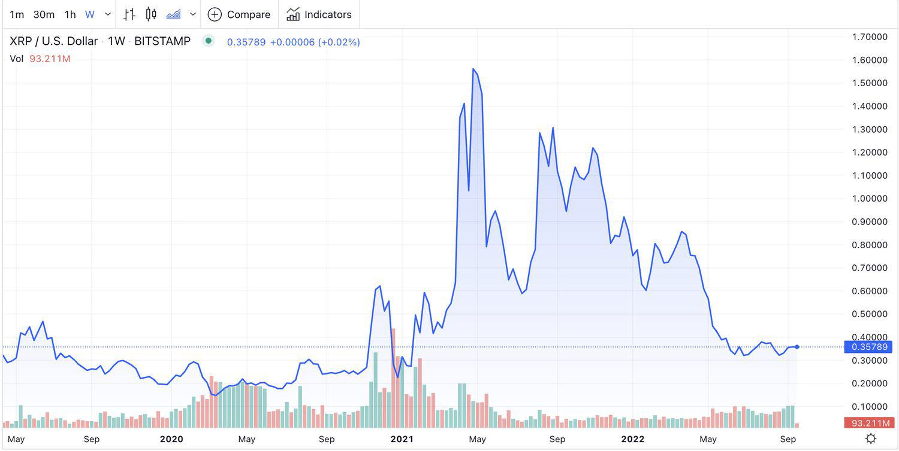

The world of cryptocurrency has witnessed immense growth over the past decade, with digital assets like XRP gaining widespread popularity among investors and traders. XRP, created by Ripple Labs, is particularly significant due to its role in enhancing cross-border payment solutions. Its protocol facilitates swift and cost-effective international transactions, distinguishing it from other digital currencies. This efficiency has enabled XRP to establish itself as a vital player within the cryptocurrency market landscape.

The emergence of algorithmic trading, or algo trading, has further transformed the trading of digital currencies, including XRP. Algorithmic trading involves using automated systems driven by complex algorithms to conduct trades at speeds unachievable by human traders. These systems operate by leveraging mathematical models to exploit market opportunities, ensuring precision and speed in executing transactions. This technological advancement is notable in cryptocurrencies due to their inherent volatility, which algorithmic trading can navigate effectively.



This article examines the dynamic nature of XRP as a digital asset and the substantial influence of algorithmic trading on its market dynamics. Whether you're an experienced trader or a curious novice, grasping these elements is essential for achieving success within the financial spheres impacted by cryptocurrency trading. Understanding how XRP's unique properties and the mechanisms of algorithmic trading align could provide valuable insights into maximizing the potential of these digital assets in contemporary markets.

## Table of Contents

## Understanding XRP as a Digital Asset

XRP is a digital currency developed by Ripple Labs, fundamentally designed to enhance the efficiency of cross-border transactions. As a prominent digital asset, XRP distinguishes itself through its unique consensus algorithm, the Ripple Protocol Consensus Algorithm (RPCA), which facilitates transactions that are both fast and energy-efficient. Unlike traditional cryptocurrencies like Bitcoin or Ethereum, which rely on energy-intensive mining processes, XRP is not mined. Instead, it was distributed via a pre-established mechanism at its inception, which involved the creation of a fixed supply of 100 billion XRP tokens.

The fixed supply is a critical factor in understanding XRP's market value elasticity. Since no new XRP coins are generated, the market value is influenced predominantly by demand and usage. As demand increases or decreases, the value of XRP can fluctuate significantly, providing opportunities and risks for investors and traders.

Beyond its market dynamics, XRP serves a practical application in the financial industry as a bridge currency. Its role is especially highlighted in scenarios involving cross-border transactions. Financial institutions leverage XRP to mitigate liquidity costs and enable instant currency conversion when facilitating international payments. This bridge function reduces the need for holding various fiat currencies, streamlining the process and potentially lowering transactional costs for these institutions.

In essence, XRP's foundational design and utility position it as a pivotal player in global financial transactions, effectively bridging gaps that traditional currencies and systems struggle to close efficiently.

## The Rise of Algorithmic Trading in Cryptocurrency

Algorithmic trading, also known as algo trading, utilizes intricate algorithms to automate and optimize the trading process. This approach promises unprecedented speed and efficiency, essential in today's fast-paced financial markets. The inherent [volatility](/wiki/volatility-trading-strategies) of the [cryptocurrency](/wiki/cryptocurrency) market makes it an ideal candidate for [algorithmic trading](/wiki/algorithmic-trading) strategies. High price variability creates numerous opportunities for traders to execute multiple transactions over short periods, enhancing potential returns.

Algo trading eliminates the influence of emotional biases and provides a systematic, data-driven approach to market decisions. By leveraging pre-programmed criteria, algorithmic trading ensures that trades are executed based on quantitative and objective data rather than human emotions such as fear or greed. This systematic approach is crucial for thriving in dynamic trading environments like cryptocurrency markets.

Both institutional investors and retail traders employ algorithmic models to execute trades within milliseconds. This capability is vital for capitalizing on fleeting market opportunities that might be missed with manual trading. For instance, an [arbitrage](/wiki/arbitrage) algorithm might capitalize on price differences of a cryptocurrency like XRP across various exchanges, thus ensuring profits through simultaneous buying and selling activities.

Popular algorithms utilized in cryptocurrency trading include arbitrage, trend-following, and market-making strategies. Arbitrage strategies attempt to exploit price discrepancies of the same asset across different markets, ensuring quick profits with minimal risk. Trend-following strategies, on the other hand, focus on capturing the [momentum](/wiki/momentum) in asset prices by recognizing longer-term directional movements. Meanwhile, market-making strategies involve providing [liquidity](/wiki/liquidity-risk-premium) to the market by placing simultaneous buy and sell orders, thereby profiting from the bid-ask spread.

The advances in technology and the growing sophistication of computational methods facilitate the development and deployment of these algorithms. For instance, Python, with its versatile libraries like NumPy and pandas, allows for the efficient processing and analysis of large datasets, a core requirement for developing robust trading algorithms. The combination of XRP's rapid transaction capabilities and the efficiency of algorithmic trading can reshape how trading is conducted in the cryptocurrency space, presenting both opportunities and challenges for traders worldwide.

## Integrating XRP with Algo Trading Strategies

XRP's liquidity and widespread adoption contribute significantly to its integration into algorithmic trading systems, making it a viable choice for both institutional and retail investors. The cryptocurrency's high transaction speed and efficiency align well with the high-frequency nature of algorithmic trading, minimizing latency and ensuring rapid trade execution. 

Algo trading thrives on strategies such as arbitrage, where traders exploit price discrepancies of XRP across different exchanges. The constant price fluctuations of XRP provide ample opportunities for these arbitrage strategies, enhancing profitability prospects. Traders might employ algorithms to identify and respond to these discrepancies, buying XRP at a lower price on one exchange and selling it at a higher price on another, thereby capturing the price difference as profit.

Advanced trading bots further enhance the efficiency of trading XRP by leveraging real-time market data. These custom-designed algorithms are capable of analyzing vast amounts of information within seconds, allowing traders to make informed decisions quickly. Python is often used for creating such trading bots due to its extensive libraries and frameworks, such as NumPy and Pandas for data manipulation, and frameworks like TensorFlow or PyTorch for implementing [machine learning](/wiki/machine-learning) models to predict market trends.

Consider a simplified Python script using a trading bot that employs an arbitrage strategy:

```python
import ccxt

# Initialize exchanges
exchange1 = ccxt.binance()
exchange2 = ccxt.kraken()

# Fetch price data
ticker1 = exchange1.fetch_ticker('XRP/USDT')
ticker2 = exchange2.fetch_ticker('XRP/USDT')

# Calculate arbitrage opportunity
def check_arbitrage(ticker1, ticker2):
    price1 = ticker1['ask']
    price2 = ticker2['bid']
    if price2 > price1:
        print(f'Arbitrage opportunity: Buy on Binance at {price1} and sell on Kraken at {price2}!')

# Execute the check
check_arbitrage(ticker1, ticker2)
```

Security remains paramount in integrating XRP with algorithmic trading platforms. Robust mechanisms are in place within XRP and these platforms to safeguard trade transactions and preserve investor confidence. Encryption protocols and secure signature schemes ensure that all transactions are authentic and free from tampering. Additionally, many algorithmic platforms incorporate multi-[factor](/wiki/factor-investing) authentication and regular security audits to mitigate potential vulnerabilities.

Overall, the alignment of XRP's transaction capabilities with algorithmic trading strategies promises to enhance trading experiences, offering both efficiency and security to participants in the cryptocurrency market.

## Challenges and Considerations

Algorithmic trading in the cryptocurrency market offers significant advantages, but it also presents various challenges and considerations that traders must address. One of the primary concerns is the risk of technical glitches, which can arise from software bugs, network issues, or unexpected system behavior. These technical failures can lead to substantial financial losses, especially in a market as volatile as cryptocurrency [1].

Moreover, the increasing reliance on automation means that traders may overlook market dynamics and lose the ability to react swiftly to unforeseen market events. Automated trading strategies, while efficient, can often lack the nuanced understanding that a human trader might provide, potentially leading to suboptimal outcomes in rapidly changing market conditions.

The regulatory landscape poses another significant challenge. Cryptocurrency regulations are evolving, and compliance can vary dramatically between jurisdictions. Algorithmic trading strategies need to be adaptable to these varying regulatory requirements, particularly for digital assets like XRP. For instance, changes in tax laws, trading restrictions, or disclosure requirements may impact how trades are executed and reported [2].

Given the unpredictability of crypto market regulations, having a robust risk management strategy is crucial. Traders should design their algorithms to account for potential regulatory changes and incorporate mechanisms to mitigate associated risks. This includes setting stop-loss orders, diversifying trading strategies, and regularly updating compliance protocols.

Data integrity and accuracy are critical for the successful execution of algorithmic trades. Inaccurate or delayed market data can lead to erroneous trade decisions, resulting in financial setbacks. Ensuring access to reliable data sources and employing strategies to verify data accuracy is essential for maintaining the integrity of trading activities.

Finally, the dynamic nature of the cryptocurrency market necessitates that traders continually adapt and optimize their algorithms to remain competitive. This involves staying informed about technological advancements, market trends, and regulatory shifts. Regular [backtesting](/wiki/backtesting) and performance evaluation of trading algorithms are essential practices for traders aiming to refine their strategies and enhance their trading outcomes in an environment where both the technology and market conditions are constantly evolving.

By addressing these challenges with strategic planning and continuous learning, investors can better navigate the complexities of algorithmic trading in cryptocurrency, positioning themselves for sustained success.

References:
1. "Algorithmic Trading: Pros and Cons." Investopedia. [https://www.investopedia.com/terms/a/algorithmictrading.asp](https://www.investopedia.com/terms/a/algorithmictrading.asp)
2. "Cryptocurrency Regulation: A Guide to the Current Legislative Framework." CoinDesk. [https://www.coindesk.com/learn/](https://www.coindesk.com/learn/)

## Conclusion

XRP's integration with algorithmic trading systems creates a robust platform for investors looking to exploit cryptocurrency market dynamics. The swift transaction capabilities inherent in XRP enhance the operational efficiency typical of algo trading processes. When latency is minimized, traders can swiftly respond to market fluctuations, optimizing profits.

However, navigating the intricacies of XRP and algorithmic trading requires acute awareness of regulatory shifts and technological developments within the cryptocurrency sphere. The digital asset landscape is subject to evolving legal frameworks which may impact trading strategies. Thus, remaining informed about policy changes is paramount for successful investment outcomes.

Technological improvements in trading algorithms and platforms continue to offer groundbreaking opportunities for leveraging XRP in more profitable ways. By integrating XRP with advanced algorithmic trading systems, investors can unlock innovative trading techniques that leverage real-time data, predictive analytics, and machine learning to forecast market trends more accurately.

Success in XRP markets through algorithmic trading is closely tied to informed decision-making and strategic flexibility. Investors must continually refine and adapt their trading strategies to maintain a competitive edge. Embracing these techniques can lead to unprecedented trading experiences and opportunities, setting new standards in cryptocurrency investment and financial growth.

## References & Further Reading

[1]: "Algorithmic Trading: Pros and Cons." Investopedia. [https://www.investopedia.com/terms/a/algorithmictrading.asp](https://www.investopedia.com/terms/a/algorithmictrading.asp)

[2]: "Cryptocurrency Regulation: A Guide to the Current Legislative Framework." CoinDesk. [https://www.coindesk.com/learn/](https://www.coindesk.com/policy/2021/03/09/us-lawmakers-introduce-bill-to-clarify-crypto-regulations/)

[3]: Bergstra, J., Bardenet, R., Bengio, Y., & Kégl, B. (2011). ["Algorithms for Hyper-Parameter Optimization."](https://proceedings.neurips.cc/paper/2011/file/86e8f7ab32cfd12577bc2619bc635690-Paper.pdf) Advances in Neural Information Processing Systems 24.

[4]: "Advances in Financial Machine Learning" by Marcos Lopez de Prado. [https://www.amazon.com/Advances-Financial-Machine-Learning-Marcos/dp/1119482089](https://www.amazon.com/Advances-Financial-Machine-Learning-Marcos/dp/1119482089)

[5]: "Evidence-Based Technical Analysis: Applying the Scientific Method and Statistical Inference to Trading Signals" by David Aronson. [https://www.wiley.com/en-gb/Evidence+Based+Technical+Analysis:+Applying+the+Scientific+Method+and+Statistical+Inference+to+Trading+Signals-p-9780470008744](https://www.wiley.com/en-gb/Evidence+Based+Technical+Analysis%3A+Applying+the+Scientific+Method+and+Statistical+Inference+to+Trading+Signals-p-9780470008744)

[6]: "Machine Learning for Algorithmic Trading" by Stefan Jansen. [https://www.amazon.com/Machine-Learning-Algorithmic-Trading-intelligence/dp/9918608013](https://www.amazon.com/Machine-Learning-Algorithmic-Trading-alternative/dp/1839217715)

[7]: "Quantitative Trading: How to Build Your Own Algorithmic Trading Business" by Ernest P. Chan. [https://www.amazon.com/Quantitative-Trading-Build-Algorithmic-Business/dp/0470284889](https://www.amazon.com/Quantitative-Trading-Build-Algorithmic-Business/dp/0470284889)