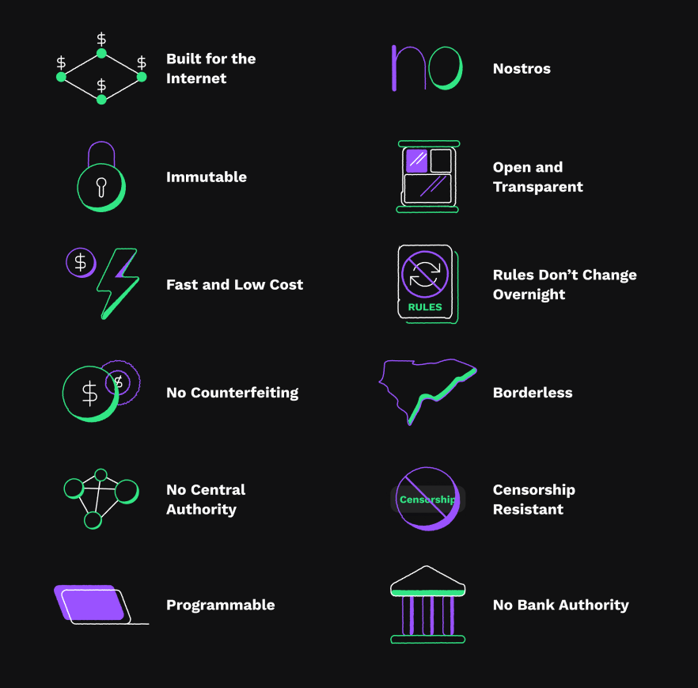

## Table of Contents

## What is XRP and what is its primary purpose?

XRP is a type of digital currency, also known as a cryptocurrency. It was created by a company called Ripple Labs. XRP is used on a special system called the Ripple network, which helps banks and other financial institutions move money around the world quickly and cheaply.

The main purpose of XRP is to make international money transfers faster and less expensive. Normally, when you send money to another country, it can take a few days and cost a lot in fees. With XRP, the transfer can happen in seconds and the fees are much lower. This makes it easier for people and businesses to send money across borders.

## Who created XRP and when was it launched?

XRP was created by a company called Ripple Labs. The people who started Ripple Labs are Chris Larsen and Jed McCaleb. They wanted to make a new way for banks to send money around the world faster and cheaper.

XRP was launched in 2012. That's when people could start using it on the Ripple network. Since then, more and more banks and financial companies have been using XRP to move money quickly and save on fees.

## How does XRP differ from other cryptocurrencies like Bitcoin and Ethereum?

XRP is different from other cryptocurrencies like Bitcoin and Ethereum in a few big ways. First, XRP was made to help banks and big financial companies move money around the world quickly and cheaply. Bitcoin and Ethereum, on the other hand, were made more for people to use as a new kind of money or to run special computer programs. So, XRP focuses on making international money transfers easier, while Bitcoin and Ethereum have different main goals.

Another big difference is how fast and cheap XRP transactions are. With XRP, you can send money across the world in just a few seconds, and it costs very little. Bitcoin and Ethereum transactions can take much longer and cost more in fees. This makes XRP a good choice for banks that need to move a lot of money quickly and save on costs. So, while Bitcoin and Ethereum are more about being used by regular people, XRP is more about helping big financial systems work better.

## What is the Ripple network and how does it use XRP?

The Ripple network is a special system that helps banks and other big money companies send money around the world quickly and cheaply. It's like a big highway for money, where banks can move money from one place to another without having to go through a lot of different steps that usually take a long time and cost a lot of money. The Ripple network uses a technology called blockchain, which is a way of keeping track of money movements that is safe and hard to cheat.

XRP is a special kind of money that is used on the Ripple network. When a bank wants to send money to another country, it can use XRP to make the transfer happen faster and cheaper. Instead of going through a lot of different banks and paying high fees, the bank can just change its money into XRP, send the XRP across the Ripple network, and then change it back into the money of the country it's going to. This way, the money gets to where it needs to go in just a few seconds, and the bank saves a lot of money on fees.

## Can you explain the concept of XRP Ledger?

The XRP Ledger is like a big notebook that keeps track of all the XRP money that moves around. It's part of the Ripple network and helps make sure that all the money transfers are safe and correct. The XRP Ledger uses something called a blockchain, which is a special way of writing down information so that it's hard for anyone to cheat or change it. Every time someone sends XRP to someone else, it gets written down in the XRP Ledger, and everyone can see it.

The XRP Ledger is different from other blockchains because it's made to be really fast and cheap. When you send XRP, it gets written down in the ledger in just a few seconds, and it doesn't cost much money to do it. This makes it really good for banks and big money companies that need to move a lot of money quickly and save on costs. The XRP Ledger also has special rules that help keep everything fair and working smoothly, so everyone can trust it to move their money safely.

## What are the main features of the XRP Ledger?

The XRP Ledger is a special kind of notebook that keeps track of all the XRP money that moves around. It's made to be really fast and cheap, so when you send XRP, it gets written down in the ledger in just a few seconds, and it doesn't cost much money. This makes it really good for banks and big money companies that need to move a lot of money quickly and save on costs. The XRP Ledger uses something called a blockchain, which is a special way of writing down information so that it's hard for anyone to cheat or change it.

The XRP Ledger also has special rules that help keep everything fair and working smoothly. For example, it has a rule that stops people from sending the same XRP to two different places at the same time, which helps keep everything honest. Another rule helps make sure that the XRP Ledger can keep working even if some of the computers that help run it have problems. This makes the XRP Ledger very reliable and trustworthy for moving money safely.

## How is XRP used in cross-border payments?

XRP is used in cross-border payments to make sending money from one country to another faster and cheaper. When a bank wants to send money to another country, it can use XRP on the Ripple network. Instead of going through a lot of different banks and paying high fees, the bank can change its money into XRP, send it across the Ripple network, and then change it back into the money of the country it's going to. This way, the money gets to where it needs to go in just a few seconds, and the bank saves a lot of money on fees.

The XRP Ledger, which is part of the Ripple network, helps make sure that all these money transfers are safe and correct. It keeps track of all the XRP that moves around, and it uses a special kind of technology called a blockchain to make sure no one can cheat or change the records. This makes the whole process of sending money across borders very reliable and trustworthy.

## What is the total supply of XRP and how is it distributed?

The total supply of XRP is 100 billion XRP. This number was set when XRP was first created, and it will never change. Unlike some other cryptocurrencies where new coins can be made over time, the total amount of XRP will always stay the same.

When XRP was first made, the company that created it, Ripple Labs, kept most of the XRP for themselves. They did this so they could use it to help grow the Ripple network and make it easier for banks and other big money companies to use XRP. Over time, Ripple Labs has been giving away some of their XRP to different people and companies to help more people use it. But even now, Ripple Labs still has a big part of all the XRP that exists.

## What are the regulatory challenges faced by XRP?

XRP has faced some big problems with rules and laws, especially in the United States. The main problem is that some people think XRP should be treated like a special kind of money called a "security." If XRP is a security, then the people who made it, Ripple Labs, would have to follow a lot of strict rules about how they sell and talk about XRP. This could make it harder for them to do business and could even get them in trouble with the law. The U.S. Securities and Exchange Commission (SEC) has been looking into this and has even taken Ripple Labs to court over it.

Because of these problems with rules and laws, some banks and big money companies have been careful about using XRP. They don't want to get in trouble with the law, so they might choose to use other ways to send money across borders. This has made it harder for XRP to grow and be used by more people. But Ripple Labs is still working to solve these problems and show that XRP is not a security, so they can keep helping banks move money quickly and cheaply.

## How does the consensus mechanism of XRP Ledger work?

The XRP Ledger uses a special way to make sure everyone agrees on what's happening with the XRP money. This way is called the "consensus mechanism." Instead of using a lot of computers to solve hard math problems like Bitcoin does, the XRP Ledger uses a group of special computers called "validators." These validators work together to check and agree on all the XRP transactions that happen. They do this by talking to each other and making sure they all have the same information about what's happening with the XRP. If most of the validators agree on a set of transactions, those transactions get added to the XRP Ledger, and everyone knows they are correct.

This consensus mechanism makes the XRP Ledger very fast and cheap to use. Because the validators don't have to solve hard math problems, they can agree on transactions in just a few seconds. This is much faster than other cryptocurrencies like Bitcoin, which can take a long time to agree on transactions. Also, because the validators are working together to keep everything correct, it doesn't cost a lot of money to send XRP. This makes the XRP Ledger a good choice for banks and big money companies that need to move a lot of money quickly and save on costs.

## What are some of the major partnerships or use cases of XRP?

XRP has been used by some big companies to help them send money across borders quickly and cheaply. One of the biggest partnerships is with MoneyGram, a company that helps people send money to different countries. MoneyGram uses XRP to move money faster and save on fees, which makes it easier for people to send money to their families in other countries. Another important partnership is with American Express, which has been working with Ripple to test how XRP can help them move money more efficiently. These partnerships show how XRP can be used in the real world to make a big difference for people and businesses.

Another use case for XRP is with banks. Some banks, like Santander and Bank of America, have been looking at how they can use XRP to send money to other countries. For example, Santander has a service called "Santander One Pay [FX](/wiki/fx-anomaly)" that uses the Ripple network to help people send money to different countries quickly and cheaply. This shows how XRP can help banks save money and make their customers happier by making international money transfers easier. Even though there have been some problems with rules and laws, these partnerships and use cases show that XRP has a lot of potential to change how money moves around the world.

## What are the future prospects and potential developments for XRP?

XRP has a lot of potential to grow and be used by more people and businesses in the future. One big reason is that it can make sending money across borders much faster and cheaper. This is something that a lot of banks and big money companies need, so if XRP can solve the problems with rules and laws, it could be used by more of them. Also, as more people learn about XRP and how it can help them save money and time, more of them might start using it. This could make XRP more popular and valuable.

Another thing that could help XRP in the future is new technology and ideas. The people who made XRP, Ripple Labs, are always working on new ways to make the Ripple network and XRP Ledger even better. They might come up with new ways to use XRP that we haven't thought of yet, which could make it even more useful. But, XRP still has to deal with the problems with rules and laws, especially in the United States. If Ripple Labs can solve these problems, XRP could have a bright future and help change how money moves around the world.

## References & Further Reading

[1]: "Algorithmic Trading: Pros and Cons." Investopedia. [https://www.investopedia.com/terms/a/algorithmictrading.asp](https://www.investopedia.com/terms/a/algorithmictrading.asp)

[2]: "Cryptocurrency Regulation: A Guide to the Current Legislative Framework." CoinDesk. [https://www.coindesk.com/learn/](https://www.coindesk.com/policy/2021/03/09/us-lawmakers-introduce-bill-to-clarify-crypto-regulations/)

[3]: Bergstra, J., Bardenet, R., Bengio, Y., & Kégl, B. (2011). ["Algorithms for Hyper-Parameter Optimization."](https://proceedings.neurips.cc/paper/2011/file/86e8f7ab32cfd12577bc2619bc635690-Paper.pdf) Advances in Neural Information Processing Systems 24.

[4]: "Advances in Financial Machine Learning" by Marcos Lopez de Prado. [https://www.amazon.com/Advances-Financial-Machine-Learning-Marcos/dp/1119482089](https://www.amazon.com/Advances-Financial-Machine-Learning-Marcos/dp/1119482089)

[5]: "Evidence-Based Technical Analysis: Applying the Scientific Method and Statistical Inference to Trading Signals" by David Aronson. [https://www.wiley.com/en-gb/Evidence+Based+Technical+Analysis:+Applying+the+Scientific+Method+and+Statistical+Inference+to+Trading+Signals-p-9780470008744](https://www.wiley.com/en-gb/Evidence+Based+Technical+Analysis%3A+Applying+the+Scientific+Method+and+Statistical+Inference+to+Trading+Signals-p-9780470008744)

[6]: "Machine Learning for Algorithmic Trading" by Stefan Jansen. [https://www.amazon.com/Machine-Learning-Algorithmic-Trading-intelligence/dp/9918608013](https://www.amazon.com/Machine-Learning-Algorithmic-Trading-alternative/dp/1839217715)

[7]: "Quantitative Trading: How to Build Your Own Algorithmic Trading Business" by Ernest P. Chan. [https://www.amazon.com/Quantitative-Trading-Build-Algorithmic-Business/dp/0470284889](https://www.amazon.com/Quantitative-Trading-Build-Algorithmic-Business/dp/0470284889)