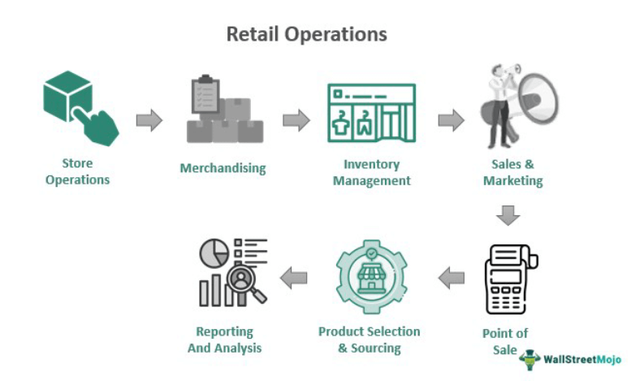

The world of stock trading is filled with various terminologies and symbols that can be quite puzzling for both novice and seasoned investors. Among these is the term 'XRT'. XRT holds a dual meaning in the trading community. Firstly, it serves as an abbreviation used to indicate that a stock is trading on an ex-rights basis. This label signifies a pivotal point in the rights offering process, where investors no longer have the option to purchase additional shares at a discounted rate because these rights have expired. Secondly, XRT is also the ticker symbol for the SPDR S&P Retail ETF, which tracks the performance of stocks in the U.S. retail sector, providing insights into consumer spending trends. Understanding XRT's role is crucial, particularly in the context of rights offerings and the increasingly sophisticated domain of algorithmic trading. As rights offerings influence stock prices and market strategies, knowledge of XRT's implications can empower investors to make informed trading decisions, optimizing their financial portfolios in response to market dynamics.

## Table of Contents



## What is XRT?

XRT is an abbreviation used to indicate that a stock is trading on an ex-rights basis. When a stock is marked as ex-rights, it means that the rights to purchase additional shares at a discounted price have lapsed, and any new buyer of the stock will not receive these rights. This situation occurs after a company offers its existing shareholders the right to purchase additional shares in a rights issue, and once the rights period has expired, the shares trade without these attached rights. The ex-rights price, often lower, reflects the detachment of the rights, and this process typically leads to adjustments in the stock’s market price.

Moreover, XRT is also the ticker symbol for the SPDR S&P Retail ETF, an exchange-traded fund that replicates the performance of the S&P Retail Select Industry Index. This ETF provides exposure to stocks in the U.S. retail industry, encompassing a diverse range of retail sub-sectors such as apparel, electronics, and department stores. It tracks and weighs retail stocks equally, offering a comprehensive representation of the retail sector. As an investment vehicle, XRT allows traders and investors to gain insight and potentially benefit from retail industry trends without the need to directly purchase individual retail stocks.

## Understanding Ex-Rights Trading

When a stock is labeled with XRT, it signifies that the stock is trading on an ex-rights basis. This designation means the rights attached to the stock, which formerly allowed shareholders to purchase additional shares at a predetermined, often discounted, rate, are now unavailable. These rights typically serve as a tool intended to preserve the ownership stakes of existing shareholders by offering them the chance to buy new shares before they are made available to the general public.

The transition to an ex-rights trading status generally follows the rights offering period. Once this period concludes, any trading in the stock excludes the rights, hence the term "ex-rights." 

The impact on the stock price is often a notable consideration in ex-rights trading. Specifically, when a stock begins trading ex-rights, it frequently sees a reduction in its trading price. This decline can be attributed to the absence of the previously available rights, which are viewed as an intrinsic part of the stock's value. The price drop aligns with the theoretical value of the rights that are no longer attached to the stock. 

For instance, if a company issues rights allowing shareholders to purchase one new share for every ten held at a discount, these rights have an inherent market value. Once the rights have expired and the stock trades ex-rights, the market typically adjusts the share price downward by approximately the value of the rights to reflect their absence. This is a necessary adjustment to ensure that the stock's market price accurately reflects its new value proposition sans additional share purchasing benefits.

The formula used to estimate the adjusted stock price when it commences trading ex-rights is the following:

$$
\text{Ex-rights Price} = \frac{(N \times \text{Current Stock Price}) + (\text{Rights Price} \times \text{New Shares})}{N + \text{New Shares}}
$$

Where:
- $N$ is the number of original shares required to obtain rights to one new share.
- $\text{Current Stock Price}$ is the trading price before it goes ex-rights.
- $\text{Rights Price}$ is the price at which new shares can be bought with the rights.
- $\text{New Shares}$ is the number of shares one can purchase per right. 

This explanation underscores a key aspect of stock trading involving rights and pricing adjustments attributable to such rights offerings. Understanding these dynamics aids investors in making informed trading decisions and recognizing how rights offerings may impact a stock's value.

## Function of Rights in Trading

Rights offerings play a crucial role in the financial market by allowing existing shareholders to purchase additional shares of a company at a preferential price, usually below the current market value. This opportunity is typically time-limited and is designed to serve several strategic purposes within corporate finance.

Primarily, rights offerings enable shareholders to preserve their proportional ownership in a company. When new shares are issued, existing shareholders face the risk of dilution, which can diminish the value of their existing shares. By participating in a rights offering, shareholders can buy additional shares at a discounted price, thereby maintaining their percentage stake in the company. This can be calculated as follows:

$$
\text{New Ownership Percentage} = \frac{\text{Old Shares Owned} + \text{New Shares Purchased}}{\text{Total Shares Outstanding} + \text{New Shares Issued}}
$$

For example, if a shareholder owns 100 shares in a company with 1,000 shares outstanding, and the company issues 200 new shares through a rights offering, the shareholder can purchase enough new shares to maintain their ownership percentage using the formula above.

Additionally, rights offerings serve as a form of price protection. During the offering period, the company essentially guarantees that current shareholders can buy additional shares at the specified price, offering a buffer against market fluctuations and potential dilution impacts. This function acts as a safeguard for the value of their investment, ensuring that the entry price for new shares is favorable compared to the market dynamics at the time.

Moreover, for companies, rights offerings are an attractive way to raise capital without incurring substantial underwriting fees associated with other capital-raising methods, such as public offerings. This cost-effectiveness can be advantageous for both the company and its investors, as it maximizes the funds available for corporate projects while minimizing expenses. 

In summary, rights offerings provide a financial mechanism for shareholders to maintain their stake and protect against the potential negative impacts of share dilution, while concurrently offering the issuing company a streamlined and cost-effective method for capital acquisition.

## XRT and Algorithmic Trading Strategies

Algorithmic trading, often referred to as algo trading, employs computer algorithms to execute trading orders at high speeds and volumes. These algorithms are programmed to follow a specific set of rules and can be particularly effective when responding to stock statuses such as XRT. XRT, or ex-rights trading, indicates that the beneficial rights originally attached to a stock have expired, which can significantly influence market dynamics.

In the context of algo trading, XRT signals provide valuable information that traders can integrate into their algorithms to optimize strategies. As rights expire, the stock often experiences a price adjustment to reflect the loss of rights value. Algorithms can be designed to detect these price movements and respond accordingly, potentially capitalizing on the resulting price [volatility](/wiki/volatility-trading-strategies).

High-frequency trading ([HFT](/wiki/high-frequency-trading-strategies)), a form of algo trading, excels in rapidly executing trades to take advantage of small price discrepancies. When a stock moves to an XRT status, HFT strategies might be employed to quickly buy or sell shares based on anticipated price changes. This rapid response capability can be particularly beneficial as the market adjusts to the new valuation of the ex-rights stock.

Consider a simple algorithmic strategy: the algorithm can monitor the XRT status of a stock, check for predefined thresholds in price changes, and execute trades when conditions are met. This could involve setting parameters for acceptable price deviations post-rights expiration. For example:

```python
def check_xrt_signal(stock_price, expected_drop, threshold):
    """Evaluate whether a trade should be executed based on XRT signal."""
    if stock_price <= expected_drop * (1 - threshold):
        return "Buy"
    elif stock_price >= expected_drop * (1 + threshold):
        return "Sell"
    return "Hold"

# Example usage
stock_price = 95  # current stock trading price after XRT
expected_drop = 100  # predicted price before XRT
threshold = 0.05  # 5% threshold for action

trade_decision = check_xrt_signal(stock_price, expected_drop, threshold)
print(f"Trade Decision: {trade_decision}")
```

In the above example, an algorithm assesses whether the stock price has dropped by more than 5% from the expected pre-XRT price. If it has, the algorithm suggests a 'Buy' decision to capitalize on the price decrease. Conversely, if the stock price unexpectedly increases, it suggests selling the stock, and it holds the current position if the price is within the threshold.

Thus, integrating XRT signals into [algorithmic trading](/wiki/algorithmic-trading) systems can enhance market response efficiency, enabling traders to refine their execution strategies. By systematically accounting for rights expirations and subsequent price adjustments, traders are better equipped to make informed decisions benefiting from short-term market fluctuations.

## Conclusion

Navigating the complexities of stock trading requires a well-rounded understanding of financial instruments such as XRT and rights offerings. These elements are pivotal in shaping strategies that respond promptly to market adjustments. The XRT status, signaling the expiration of shareholder rights to purchase additional stocks at discounted rates, is crucial for maintaining investment strategies aligned with market dynamics. Recognizing the ex-rights phase helps investors adjust their portfolios, potentially mitigating the impacts of stock price adjustments that follow the expiration of these rights. 

Understanding how rights offerings function provides traders with the ability to anticipate and manage price dilution, thereby preserving their ownership stakes effectively. Advanced algorithmic trading strategies might capitalize on XRT data, using it to finetune their decision-making processes for rapid buying or selling activities. Algorithms can leverage the temporal patterns of rights expirations to optimize trading actions, underscoring the importance of integrating real-time financial signals into these strategies.

For both seasoned traders and newcomers, the ability to interpret ex-rights trading is integral to informed decision-making. Through grasping the implications of XRT and rights offerings, investors can not only protect their interests but also uncover opportunities to enhance their market positioning. As the financial landscape continues to evolve, the importance of these insights in aligning strategies with prevailing market conditions cannot be overstated.

## References & Further Reading

[1]: ["Rights Offerings: A Survey and Synthesis"](https://www.investopedia.com/terms/r/rightsoffering.asp) by H.P. Bowers and J.D. Edmister in Financial Management

[2]: ["Exchange-Traded Funds and the New Dynamics of Investing"](https://www.amazon.com/Exchange-Traded-Investing-Financial-Management-Association/dp/0190279397) by Ananth N. Madhavan

[3]: [SPDR S&P Retail ETF (XRT) Profile](https://finance.yahoo.com/quote/XRT/profile/) by State Street Global Advisors

[4]: ["Quantitative Finance" on Wikipedia](https://en.wikipedia.org/wiki/Quantitative_analysis_(finance)) for general understanding of quantitative finance principles

[5]: ["Algorithmic Trading: Winning Strategies and Their Rationale"](https://www.amazon.com/Algorithmic-Trading-Winning-Strategies-Rationale-ebook/dp/B00CY5HC0U) by Ernie Chan