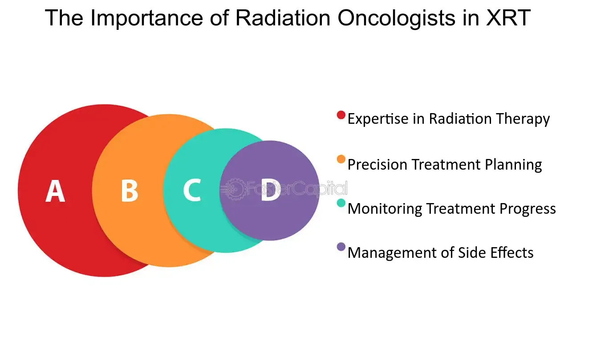

## Table of Contents

## What does XRT stand for?

XRT stands for "External Beam Radiation Therapy." This is a type of cancer treatment where high-energy rays are used to kill cancer cells and shrink tumors. The radiation comes from a machine outside the body and is directed at the cancer.

During XRT, the patient lies on a table while the machine moves around them, aiming the radiation at the tumor from different angles. This helps to target the cancer while trying to protect the surrounding healthy tissues. XRT is often used along with other treatments like surgery or chemotherapy to improve the chances of curing the cancer.

## What are the basic rights included in XRT?

When you get XRT, you have some basic rights that help make sure you get good care. These rights include being told about your treatment plan in a way you can understand. Your doctors should explain what XRT is, why you need it, what it might do to your body, and any other choices you have. You should also be able to ask questions and get clear answers. This helps you make good choices about your care.

Another important right is privacy. Your personal health information should be kept safe and only shared with people who need to know to help treat you. You also have the right to be treated with respect and dignity. This means the healthcare team should be kind and supportive, and they should listen to your worries and feelings.

Lastly, you have the right to say no to any part of your treatment if you want to. If you decide not to have XRT or want to stop it, your healthcare team should respect your choice. They should also help you understand what might happen if you choose not to have the treatment. These rights are there to help you feel safe and cared for during your treatment.

## How does XRT function in everyday situations?

XRT, or External Beam Radiation Therapy, is a treatment that people with cancer might get. In everyday life, someone going through XRT might visit a special clinic a few times a week. Each session lasts about 15 to 30 minutes. During the session, the person lies still on a table while a big machine moves around them. The machine sends beams of radiation to the cancer to try to kill the cancer cells. The person doesn't feel the radiation, but they might hear the machine making noises.

After the session, the person can usually go back to their normal activities, like work or spending time with family. But they might feel tired or have some side effects from the radiation. These side effects can be different for everyone but might include skin changes, feeling sick, or having trouble eating. It's important for the person to talk to their doctor about how they feel so they can get help if they need it. Over time, as the treatment goes on, the person and their healthcare team will keep an eye on how the cancer is responding to the XRT.

## Who is responsible for enforcing XRT?

The responsibility for enforcing XRT, or External Beam Radiation Therapy, falls on the healthcare team that is treating the patient. This team usually includes radiation oncologists, who are doctors specialized in using radiation to treat cancer, and radiation therapists, who operate the machines that deliver the radiation. They make sure the treatment plan is followed correctly and that the patient gets the right amount of radiation at the right time.

The healthcare team works together to make sure the patient's treatment goes smoothly. They check the machines to make sure they are working properly and that the radiation is aimed at the cancer accurately. They also keep track of how the patient is doing during the treatment and make changes if needed. If there are any problems, the team talks to the patient and helps them understand what is happening and what they can do to feel better.

## What are the historical origins of XRT?

The history of XRT, or External Beam Radiation Therapy, goes back to the late 1800s. It all started when Wilhelm Roentgen discovered X-rays in 1895. Soon after, scientists found out that these X-rays could kill cells. This led doctors to try using X-rays to treat cancer. The first time doctors used X-rays to treat cancer was in 1896, when a patient with breast cancer was treated. This was the beginning of using radiation to fight cancer.

Over the years, XRT technology got better and better. In the early 1900s, machines called orthovoltage X-ray machines were made. These machines could send stronger X-rays into the body to reach deeper tumors. But these early machines could also harm healthy tissues around the cancer. In the 1950s, a big step forward came with the invention of the linear [accelerator](/wiki/accelerator), or LINAC. This machine could make even stronger and more focused beams of radiation, which helped to target the cancer better and protect healthy tissues. Today, XRT keeps improving with new technology to make it even more effective and safer for patients.

## How does XRT differ from other rights systems?

XRT, or External Beam Radiation Therapy, is not a rights system but a medical treatment for cancer. It is different from rights systems because it is a specific type of healthcare that uses radiation to kill cancer cells. Rights systems, like human rights or patient rights, are about the protections and freedoms people should have. For example, patient rights include things like the right to know about your treatment and the right to privacy. XRT, on the other hand, is about using a machine to send radiation into the body to treat cancer.

In everyday life, XRT involves going to a clinic for treatment sessions, while rights systems are more about how you are treated in healthcare and other areas of life. With XRT, a patient lies on a table while a machine moves around them, aiming radiation at the cancer. This is a very specific medical procedure. Rights systems, however, are broader and cover many aspects of life, like the right to be treated with respect or the right to make your own healthcare choices. So, while XRT is a treatment method, rights systems are about the protections and respect you should receive in all parts of life.

## What are the legal frameworks that support XRT?

The legal frameworks that support XRT, or External Beam Radiation Therapy, are mainly about making sure that patients get safe and good care. In the United States, the main law is the Federal Food, Drug, and Cosmetic Act. This law says that the machines used for XRT must be safe and work well. The U.S. Food and Drug Administration (FDA) checks these machines before they can be used on patients. Another important law is the Health Insurance Portability and Accountability Act (HIPAA), which protects patients' private health information. This means that the healthcare team has to keep the patient's information safe and only share it with people who need to know.

There are also rules from the Nuclear Regulatory Commission (NRC) that make sure that the radiation used in XRT is handled safely. These rules are there to protect both the patients and the people working with the radiation machines. In addition to federal laws, each state might have its own rules about how XRT should be done. These state laws help to make sure that the treatment is given in a way that is safe and follows the best practices. Together, these laws and rules help to make sure that XRT is a safe and effective treatment for cancer.

## How can individuals exercise their rights under XRT?

Individuals can exercise their rights under XRT by talking openly with their healthcare team. When they start treatment, they should ask their doctors to explain everything about the XRT, like why they need it, what it will do, and what other choices they have. If they don't understand something, they should keep asking questions until they do. They also have the right to say no to the treatment or stop it if they want to. It's important to tell the healthcare team about any worries or feelings they have so they can get the support they need.

Another way to exercise their rights is by making sure their personal health information stays private. They should check that the clinic follows the rules about keeping their information safe. If they feel like their privacy is not being respected, they can talk to the clinic's privacy officer or even file a complaint. By knowing their rights and speaking up, individuals can make sure they get the respect and care they deserve during their XRT treatment.

## What are the common challenges faced when implementing XRT?

One common challenge when using XRT is making sure the radiation hits the cancer and not too much of the healthy tissue around it. The machines that give the radiation are very good, but it can still be hard to aim the beams just right. Sometimes, the cancer might move a bit or change shape, and this can make it harder to target. Also, different people's bodies can react differently to the radiation, so doctors have to be careful and watch closely to make sure the treatment is working well and not causing too many side effects.

Another challenge is dealing with the side effects that can come from XRT. Many people feel very tired during treatment, and their skin might get red or sore where the radiation goes in. Some might feel sick to their stomach or have trouble eating. These side effects can make it hard for people to keep up with their normal life, like going to work or spending time with family. Doctors and nurses try to help by giving medicines or advice, but it can still be tough for patients to handle these problems while also getting through their treatment.

## How does XRT impact international relations?

XRT, or External Beam Radiation Therapy, can affect international relations because it involves technology and knowledge that countries share with each other. When countries work together on cancer treatment, they share information about how to use XRT better. This can help build good relationships between countries because they are working together to help people with cancer. But sometimes, if one country has better XRT technology than others, it might not want to share it. This can cause tension because other countries might feel left out or think it's not fair.

Also, the machines used for XRT can be expensive and hard to get. Some countries might need help from other countries to buy these machines or to train their doctors to use them. When richer countries help poorer countries with XRT, it can make their relationship stronger. But if they don't help, it can make poorer countries feel ignored. So, how countries handle XRT can show whether they want to work together and help each other or if they want to keep their advantages to themselves.

## What are the advanced mechanisms for protecting XRT?

To protect XRT, or External Beam Radiation Therapy, one important mechanism is using special software that helps make the radiation beams very accurate. This software can change the shape and direction of the beams to fit the cancer exactly. This way, the radiation hits the cancer and not too much of the healthy tissue around it. Doctors also use special tools to keep track of the cancer during treatment. These tools can tell if the cancer moves or changes shape, so the doctors can adjust the radiation to keep it on target. This helps make sure the treatment works well and is safe for the patient.

Another way to protect XRT is by having strict rules about how the machines are used and checked. The machines need to be looked at often to make sure they are working right. This is done by people who know a lot about radiation safety. They check everything to make sure the radiation is going where it should and that it's not too strong. Also, the people who work with the machines have to be trained well. They need to know how to use the machines safely and how to help patients during treatment. This helps keep both the patients and the workers safe.

## What future developments are anticipated in the field of XRT?

In the future, XRT is expected to get even better at targeting cancer cells and protecting healthy tissue. Scientists are working on new ways to make the radiation beams more accurate. They are developing special software that can change the shape and direction of the beams to fit the cancer perfectly. This could mean less harm to the healthy parts of the body. Also, new tools are being made to watch the cancer during treatment. These tools can tell if the cancer moves or changes, so doctors can adjust the radiation to keep it on target. This will help make XRT safer and more effective.

Another big change coming to XRT is the use of [artificial intelligence](/wiki/ai-artificial-intelligence) (AI). AI can help doctors plan the best treatment for each patient. It can look at lots of information about the cancer and the patient's body to make a plan that works best. This could make XRT more personalized, so each person gets the treatment that is just right for them. Also, new machines are being made that can give radiation in shorter times. This means patients might not have to come to the clinic as often, which can make treatment easier on them. These future developments will make XRT a better way to fight cancer.

## What is Understanding Ex-Rights Trading?

When a stock is labeled with XRT, it signifies that the stock is trading on an ex-rights basis. This designation means the rights attached to the stock, which formerly allowed shareholders to purchase additional shares at a predetermined, often discounted, rate, are now unavailable. These rights typically serve as a tool intended to preserve the ownership stakes of existing shareholders by offering them the chance to buy new shares before they are made available to the general public.

The transition to an ex-rights trading status generally follows the rights offering period. Once this period concludes, any trading in the stock excludes the rights, hence the term "ex-rights." 

The impact on the stock price is often a notable consideration in ex-rights trading. Specifically, when a stock begins trading ex-rights, it frequently sees a reduction in its trading price. This decline can be attributed to the absence of the previously available rights, which are viewed as an intrinsic part of the stock's value. The price drop aligns with the theoretical value of the rights that are no longer attached to the stock. 

For instance, if a company issues rights allowing shareholders to purchase one new share for every ten held at a discount, these rights have an inherent market value. Once the rights have expired and the stock trades ex-rights, the market typically adjusts the share price downward by approximately the value of the rights to reflect their absence. This is a necessary adjustment to ensure that the stock's market price accurately reflects its new value proposition sans additional share purchasing benefits.

The formula used to estimate the adjusted stock price when it commences trading ex-rights is the following:

$$
\text{Ex-rights Price} = \frac{(N \times \text{Current Stock Price}) + (\text{Rights Price} \times \text{New Shares})}{N + \text{New Shares}}
$$

Where:
- $N$ is the number of original shares required to obtain rights to one new share.
- $\text{Current Stock Price}$ is the trading price before it goes ex-rights.
- $\text{Rights Price}$ is the price at which new shares can be bought with the rights.
- $\text{New Shares}$ is the number of shares one can purchase per right. 

This explanation underscores a key aspect of stock trading involving rights and pricing adjustments attributable to such rights offerings. Understanding these dynamics aids investors in making informed trading decisions and recognizing how rights offerings may impact a stock's value.

## What is the function of rights in trading?

Rights offerings play a crucial role in the financial market by allowing existing shareholders to purchase additional shares of a company at a preferential price, usually below the current market value. This opportunity is typically time-limited and is designed to serve several strategic purposes within corporate finance.

Primarily, rights offerings enable shareholders to preserve their proportional ownership in a company. When new shares are issued, existing shareholders face the risk of dilution, which can diminish the value of their existing shares. By participating in a rights offering, shareholders can buy additional shares at a discounted price, thereby maintaining their percentage stake in the company. This can be calculated as follows:

$$
\text{New Ownership Percentage} = \frac{\text{Old Shares Owned} + \text{New Shares Purchased}}{\text{Total Shares Outstanding} + \text{New Shares Issued}}
$$

For example, if a shareholder owns 100 shares in a company with 1,000 shares outstanding, and the company issues 200 new shares through a rights offering, the shareholder can purchase enough new shares to maintain their ownership percentage using the formula above.

Additionally, rights offerings serve as a form of price protection. During the offering period, the company essentially guarantees that current shareholders can buy additional shares at the specified price, offering a buffer against market fluctuations and potential dilution impacts. This function acts as a safeguard for the value of their investment, ensuring that the entry price for new shares is favorable compared to the market dynamics at the time.

Moreover, for companies, rights offerings are an attractive way to raise capital without incurring substantial underwriting fees associated with other capital-raising methods, such as public offerings. This cost-effectiveness can be advantageous for both the company and its investors, as it maximizes the funds available for corporate projects while minimizing expenses. 

In summary, rights offerings provide a financial mechanism for shareholders to maintain their stake and protect against the potential negative impacts of share dilution, while concurrently offering the issuing company a streamlined and cost-effective method for capital acquisition.

## References & Further Reading

[1]: ["Rights Offerings: A Survey and Synthesis"](https://www.investopedia.com/terms/r/rightsoffering.asp) by H.P. Bowers and J.D. Edmister in Financial Management

[2]: ["Exchange-Traded Funds and the New Dynamics of Investing"](https://www.amazon.com/Exchange-Traded-Investing-Financial-Management-Association/dp/0190279397) by Ananth N. Madhavan

[3]: [SPDR S&P Retail ETF (XRT) Profile](https://finance.yahoo.com/quote/XRT/profile/) by State Street Global Advisors

[4]: ["Quantitative Finance" on Wikipedia](https://en.wikipedia.org/wiki/Quantitative_analysis_(finance)) for general understanding of quantitative finance principles

[5]: ["Algorithmic Trading: Winning Strategies and Their Rationale"](https://www.amazon.com/Algorithmic-Trading-Winning-Strategies-Rationale-ebook/dp/B00CY5HC0U) by Ernie Chan