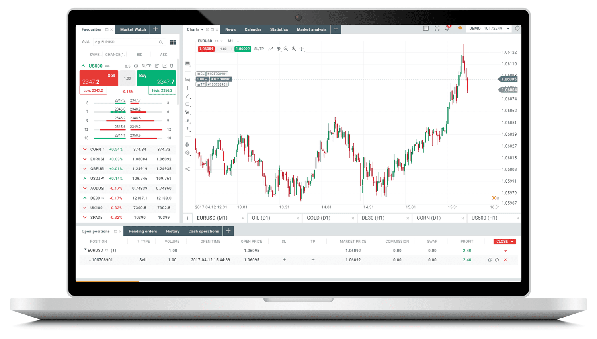

## Table of Contents

## What is XTB and what services does it offer?

XTB is a company that helps people buy and sell things like stocks, currencies, and other financial products. It's like a big online store where instead of buying clothes or electronics, you can buy pieces of companies or trade money from different countries. XTB makes it easy for people to do this by providing a platform where they can see prices, make trades, and keep track of their money.

XTB offers different services to help people with their trading. They have tools that show charts and graphs to help you understand how prices are moving. They also give you information and news about the markets so you can make better decisions. If you're new to trading, XTB has learning materials and sometimes even live classes to teach you how to trade. They also have customer support to help you if you have any problems or questions.

## How can a beginner start trading on XTB?

To start trading on XTB as a beginner, the first thing you need to do is sign up for an account on their website. It's easy - just fill out your information, like your name and email, and follow the steps they give you. Once you're signed up, you'll need to put some money into your account. This is called making a deposit. XTB will tell you how to do this, and you can use a bank transfer or a card. After your money is in your account, you're ready to start trading.

Once you have your account set up and funded, you can start exploring the XTB platform. They have a practice account called a demo account where you can try trading without using real money. This is a great way to learn without risking your own cash. When you feel ready, you can switch to trading with real money. XTB has lots of tools and information to help you, like charts and news updates. If you're not sure what to do, you can always ask their customer support team for help.

## What are the account types available on XTB?

XTB offers different types of accounts to fit what people need. The main account types are the Standard Account and the Pro Account. The Standard Account is good for beginners because it's easy to use and doesn't need a lot of money to start. It has all the basic tools you need to trade. The Pro Account is for people who trade a lot and want lower costs. It has more advanced tools and lower fees, but you need to trade more to use it.

There's also a demo account that's great for anyone who wants to practice trading without using real money. You can try out the platform, learn how it works, and see if you like it before you start trading for real. This is a good way to get comfortable with trading before you put your own money in.

## What are the fees and commissions associated with trading on XTB?

When you trade on XTB, you need to know about the fees and commissions. For the Standard Account, XTB charges a small fee every time you open or close a trade. This fee is called a spread, and it's the difference between the buying price and the selling price of what you're trading. The spread can change depending on what you're trading and how the market is doing. There are no extra commissions for the Standard Account, so you just pay the spread.

For the Pro Account, the fees are a bit different. The spreads are usually smaller than on the Standard Account, which can save you money if you trade a lot. But, you might have to pay a commission on top of the spread. This commission is a small percentage of the amount you're trading. The exact amount depends on what you're trading and how much you're trading. It's good to check the XTB website for the latest fee information because it can change.

There are also some other fees to think about. If you don't trade for a while, XTB might charge you a fee for keeping your account open. And if you want to take your money out of your account, there might be a fee for that too. It's always a good idea to read the fee details on the XTB website so you know exactly what you might have to pay.

## How does XTB's trading platform interface look and function?

XTB's trading platform is designed to be easy to use, even if you're new to trading. When you log in, you'll see a clean and simple layout. At the top, there's a menu bar where you can switch between different sections like your account, trading tools, and educational resources. The main part of the screen shows a list of the things you can trade, like stocks, currencies, and commodities. You can click on any of these to see more details, like current prices and charts. On the right side, there's a panel where you can see your open trades and how much money you have in your account.

The platform also has lots of tools to help you trade better. There are charts that show how prices are moving over time, and you can add lines and other markers to help you make decisions. If you want to trade, you just click on what you want to buy or sell, choose how much you want to trade, and then click to open the trade. It's quick and easy. XTB also has a mobile app that looks and works a lot like the website, so you can trade from your phone or tablet too. If you ever need help, there's a help button that can connect you to customer support.

## What educational resources does XTB provide for traders?

XTB offers a lot of educational resources to help traders learn and get better at trading. They have a section on their website called XTB Academy where you can find videos, articles, and guides about trading. These materials cover everything from the basics of trading to more advanced topics like how to use charts and analyze the market. They also have webinars, which are like online classes where you can learn from experts and ask questions. This is great for beginners who want to understand how trading works before they start using real money.

In addition to the XTB Academy, they also have a demo account where you can practice trading without risking your own money. This is a really good way to learn because you can try out different strategies and see how the platform works. XTB also sends out regular market news and analysis to keep you updated on what's happening in the markets. This can help you make better trading decisions. If you ever need more help, their customer support team is there to answer your questions and guide you through the learning process.

## How does XTB support customer service and what are the available contact methods?

XTB knows that trading can be hard, so they have good customer service to help you. They want to make sure you can get help when you need it. You can reach their customer service team through email or by calling them on the phone. They also have a live chat on their website where you can talk to someone right away. This is good if you have a quick question or if something goes wrong and you need help fast.

They also have a help center on their website with lots of information. You can find answers to common questions there, like how to set up an account or how to use the trading platform. If you can't find what you need in the help center, you can always contact customer service. They try to answer your questions quickly and make sure you understand the answers. This way, you can keep trading without too many problems.

## What are the security measures implemented by XTB to protect user data and funds?

XTB takes security very seriously to keep your data and money safe. They use strong encryption to protect your information when you're using their website or app. This means that your personal details and trading activities are kept private and secure. XTB also follows strict rules and regulations to make sure they're doing everything right. They are watched by financial authorities in different countries, which helps make sure they're keeping your money safe.

Another way XTB keeps your funds safe is by keeping them separate from their own money. This is called segregation of funds. It means that if something bad happens to XTB, your money is still safe and can be given back to you. They also have insurance to protect your money in case something goes wrong. Plus, XTB has systems in place to watch for any strange activity on your account, so they can stop any problems before they get too big.

## How does XTB's mobile trading app perform and what features does it include?

XTB's mobile trading app is easy to use and works well on both iPhones and Android phones. When you open the app, you'll see a simple layout that looks a lot like the website. You can quickly check your account balance, see your open trades, and look at the markets. The app runs smoothly and doesn't slow down, even when you're looking at charts or making trades. It's great for people who want to trade on the go because you can do everything you need to do right from your phone.

The app has all the important features you need for trading. You can see live prices and charts, and you can open and close trades with just a few taps. There are also tools to help you analyze the market, like drawing lines on charts and setting up alerts for price changes. If you need help, you can use the live chat to talk to customer support right from the app. Plus, you can switch to the demo account to practice trading without using real money, which is really helpful for beginners.

## What advanced trading tools and features does XTB offer for experienced traders?

XTB offers a lot of advanced tools and features that experienced traders will find useful. They have a tool called xStation 5, which is a powerful trading platform with lots of features. You can use it to see detailed charts and add different indicators to help you understand how prices are moving. There's also a feature called Trading Central, which gives you expert analysis and trading ideas. This can help you make better decisions about when to buy and sell. Plus, you can set up custom alerts to let you know when prices reach certain levels, so you don't have to watch the markets all the time.

Another great feature for experienced traders is the ability to use advanced order types. You can set up stop-loss and take-profit orders to manage your risk automatically. This means you can decide ahead of time when to close a trade to limit your losses or lock in your profits. XTB also lets you trade with leverage, which can increase your potential profits but also your risks. They have a tool called the Economic Calendar that shows important events that might affect the markets, so you can plan your trades around them. All these tools together make XTB a good choice for traders who know what they're doing and want to use advanced strategies.

## How does XTB compare to other online trading platforms in terms of features and performance?

XTB stands out among other online trading platforms because it offers a good mix of tools for both beginners and experienced traders. It's easy to use, with a clean interface that makes it simple to find what you need. The xStation 5 platform has lots of advanced features like detailed charts, indicators, and expert analysis from Trading Central. This makes it a good choice for people who want to use more complex trading strategies. XTB also has a demo account where you can practice trading without using real money, which is great for learning. Compared to other platforms, XTB's fees are competitive, especially for the Pro Account, where the spreads are lower and there are no extra commissions for some types of trades.

When it comes to performance, XTB's platform and mobile app work smoothly and quickly. You can open and close trades fast, and the charts and tools load without any delays. This is important for traders who need to make quick decisions. XTB also has strong security measures to keep your data and money safe, like encryption and keeping your funds separate from their own. Other platforms might have similar features, but XTB's customer service is really good, with live chat, phone, and email support. Overall, XTB is a solid choice for traders looking for a reliable and feature-rich platform that's easy to use and performs well.

## What are the latest updates or changes to XTB's platform as of 2024?

As of 2024, XTB has made some big updates to their platform to make it even better for traders. They've added new tools to help you understand the markets better. One of the new features is an improved version of their Economic Calendar, which now shows more details about important events that might affect the markets. This helps you plan your trades better. They've also made the charts easier to use, so you can add more indicators and draw lines to see trends more clearly. These updates make it easier for both new and experienced traders to make smart decisions.

Another big change is that XTB has worked on making their platform faster and more reliable. They've improved how quickly you can open and close trades, which is really important when you need to act fast. The mobile app has also been updated to work better on different phones, so you can trade on the go without any problems. Plus, they've added more educational resources to the XTB Academy, like new videos and guides, to help you learn more about trading. All these updates show that XTB is always trying to make their platform better for their users.

## References & Further Reading

[1]: Bergstra, J., Bardenet, R., Bengio, Y., & Kégl, B. (2011). ["Algorithms for Hyper-Parameter Optimization."](https://papers.nips.cc/paper/4443-algorithms-for-hyper-parameter-optimization) Advances in Neural Information Processing Systems 24.

[2]: ["Advances in Financial Machine Learning"](https://www.amazon.com/Advances-Financial-Machine-Learning-Marcos/dp/1119482089) by Marcos Lopez de Prado

[3]: ["Evidence-Based Technical Analysis: Applying the Scientific Method and Statistical Inference to Trading Signals"](https://www.amazon.com/Evidence-Based-Technical-Analysis-Scientific-Statistical/dp/0470008741) by David Aronson

[4]: ["Machine Learning for Algorithmic Trading"](https://github.com/PacktPublishing/Machine-Learning-for-Algorithmic-Trading-Second-Edition) by Stefan Jansen

[5]: ["Quantitative Trading: How to Build Your Own Algorithmic Trading Business"](https://books.google.com/books/about/Quantitative_Trading.html?id=j70yEAAAQBAJ) by Ernest P. Chan