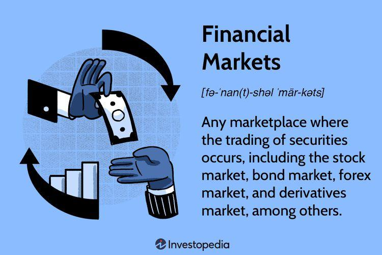

XTX Markets Limited is a leading algorithmic trading firm, headquartered in London, renowned for its sophisticated approach to market making and liquidity provision. Since its inception in January 2015 by Alexander Gerko, XTX Markets has swiftly carved out a prominent position within the financial markets. The company's strengths lie in its ability to deploy advanced algorithms and machine learning techniques to efficiently trade across various financial venues. As an electronic liquidity provider, XTX Markets operates globally, optimizing trading strategies to capitalize on market inefficiencies. This strategic prowess enables the firm to remain at the forefront of the competitive algorithmic trading industry.

## Table of Contents

## History and Growth

XTX Markets Limited emerged as a significant player in the algorithmic trading industry following its inception as a spin-off from GSA Capital. This strategic move marked its formal entry into the competitive financial trading segment in January 2015. The inception of XTX Markets was a calculated decision to leverage advanced algorithmic strategies, translating complex financial data into actionable insights and executable trades across various market venues.

By 2016, XTX Markets had secured its position as the ninth-largest foreign exchange market liquidity provider globally. This achievement was particularly notable as the company competed against a myriad of traditional financial institutions and banks. Its success as a non-bank entity underscored its innovative use of quantitative strategies and technological efficiency, enabling it to execute trades with remarkable speed and precision.

XTX's trajectory of rapid growth did not wane after its initial successes. Its commitment to leveraging technology, scalable infrastructure, and adept market strategies led to its ascension as the largest foreign exchange spot liquidity provider worldwide by 2019. The company's relentless focus on innovation and adapting to market dynamics positioned it as a dominant force within the financial industry, showcasing its ability to provide liquidity and stability in volatile markets. This rapid ascent reflects not only the effectiveness of its algorithms but also the strategic foresight in expanding its operations and optimizing its trading strategies across global markets.

## Operations and Market Influence

XTX Markets, known for its sophisticated quantitative strategies, operates as a crucial player in global financial markets. The firm collaborates with international exchanges and provides [liquidity](/wiki/liquidity-risk-premium) across multiple asset classes including equities, foreign exchange ([FX](/wiki/fx-anomaly)), commodities, and fixed income. By utilizing advanced algorithms, XTX Markets is able to efficiently manage market discrepancies and facilitate seamless trading across different venues.

The strategic expansion of XTX Markets has solidified its footprint in key international markets, notably in the United States and Singapore. Such expansion not only underscores its commitment to global presence but also enables it to tap into a broader range of trading opportunities. This geographic diversification enhances its ability to offer market participants robust liquidity options, essential for markets characterized by high [volatility](/wiki/volatility-trading-strategies) and diverse trading needs.

Further demonstrating its adaptability and forward-thinking approach, XTX Markets has diversified its operations to include trading U.S. Treasuries. This venture into U.S. Treasuries denotes a significant step, entailing precise risk management and a deep understanding of the fixed income market's intricacies. The company's foray into this area signifies its drive to optimize its operational reach and address the growing demand for liquidity provision in diverse asset segments.

Additionally, the launch of a single dealer platform for U.S. equities marks a significant milestone in XTX's operational strategy. This platform enables direct access to liquidity in U.S. equity markets, thereby enhancing the trading experience for its clients through improved pricing, execution efficiency, and reduced transaction costs. By integrating cutting-edge technology with robust market insight, XTX Markets leverages its platform to deliver unparalleled service to its clients while consolidating its influence in the equities market.

Collectively, these strategic moves reflect XTX Markets' endeavor to bolster its market influence while diversifying its service offerings. The company's commitment to expanding international operations and venturing into new asset classes positions it as a pivotal entity in the constantly evolving financial landscape.

## Technological Innovation

XTX Markets Limited's success is deeply rooted in its sophisticated use of algorithms and cutting-edge technology. A key component of its technological prowess is the establishment of a 'pricing engine' in Singapore, which plays a crucial role in enhancing its foreign exchange trading capabilities. This strategic setup allows XTX Markets to efficiently process vast amounts of market data worldwide, ensuring optimal pricing and execution for its clients. The ‘pricing engine’ leverages complex algorithms to analyze market conditions in real-time, enabling swift responses to market fluctuations and maintaining efficient liquidity provision.

In addition, XTX Ventures, an investment arm of XTX Markets, underscores the company's commitment to technological advancement by investing in early-stage companies that focus on machine learning as a foundational technology. This focus on [machine learning](/wiki/machine-learning) not only propels innovation within the trading sector but also contributes to the broader technological ecosystem. By investing in these companies, XTX Ventures supports the development of cutting-edge machine learning models and tools that can be integrated into advanced trading systems, optimizing decision-making processes and predictive analytics.

These technological innovations are indicative of XTX Markets' forward-thinking approach, positioning the company at the forefront of [algorithmic trading](/wiki/algorithmic-trading). Its commitment to technology and investment in future-ready solutions ensure sustained leadership in a highly competitive industry.

## Philanthropy and Social Responsibility

XTX Markets has demonstrated a strong commitment to philanthropy and social responsibility through numerous initiatives. In response to the global COVID-19 pandemic, the company contributed over £20 million to relief efforts, showcasing its commitment to supporting communities and frontline services during times of crisis. This significant financial involvement helped facilitate various pandemic-response activities, including supplying essential medical equipment and supporting research initiatives aimed at combating the virus.

In 2022, XTX Markets further exemplified its dedication to humanitarian causes by committing substantial funds to support relief efforts in Ukraine. The ongoing conflict in Ukraine created widespread humanitarian needs, and XTX's contributions aimed to alleviate some of the hardships faced by those affected by the crisis. This financial support was crucial in providing resources for emergency assistance, such as food, shelter, and medical aid to communities in dire need.

Moreover, XTX Markets has launched its Academic Sanctuaries Fund, designed to provide valuable opportunities for displaced students and researchers. This initiative offers scholarships and research grants, enabling individuals who have been forced to leave their home countries to continue their academic pursuits. By investing in education and research, XTX is not only aiding individuals but also contributing to the broader advancement of knowledge and innovation.

Through these philanthropic efforts, XTX Markets not only reinforces its role as a leader in the financial sector but also upholds its commitment to making a positive societal impact.

## Conclusion

XTX Markets has established itself as a formidable presence in the financial sector, distinguished by its innovative use of technology and profound impact on market dynamics. The firm's dedication to harnessing advanced algorithms and data analytics allows it to efficiently navigate the complexities of global financial markets, reinforcing its position as a leader in electronic trading. This commitment is not only evident in its business operations but also in its strategic expansion across key financial hubs, which underscores its ambition to sustain and enhance its market influence.

Moreover, XTX Markets' growth trajectory and significant involvement in social responsibility projects reflect its ethos beyond mere financial success. By directing resources towards pressing humanitarian causes and supporting educational initiatives, XTX demonstrates a balanced approach to business success and social contribution. These efforts reinforcing its standing as a forward-thinking entity in the financial world, poised to continue shaping the landscape of algorithmic trading with both technological prowess and a robust sense of corporate responsibility.

As XTX Markets continues to expand its global reach and deepen its integration in various financial sectors, the company is prepared to cement its leadership position. Its reliance on cutting-edge technology and strategic market operations remains central to its strategy, ensuring that it can adeptly adapt to evolving market trends and maintain its competitive edge in the continuously advancing field of algorithmic trading.

## References & Further Reading

[1]: Gerko, A., & Shah, N. (2015). ["The role of technology in modern finance"](https://online.ucpress.edu/gp/article/2/1/27353/118411/How-Is-Technology-Changing-the-World-and-How). Journal of Applied Finance.

[2]: Aldridge, I. (2013). ["High-Frequency Trading: A Practical Guide to Algorithmic Strategies and Trading Systems"](https://www.wiley.com/en-us/High+Frequency+Trading%3A+A+Practical+Guide+to+Algorithmic+Strategies+and+Trading+Systems%2C+2nd+Edition-p-9781118343500). John Wiley & Sons.

[3]: ["Markets Media Interview with Alexander Gerko"](https://www.ft.com/content/d813fe90-29ba-4c98-ac57-c2919a7970b1) - Insights into the operations and strategies employed by XTX Markets.

[4]: Harford, T. (2016). ["How algorithms rule our working lives"](https://www.linkedin.com/pulse/how-algorithms-rule-our-working-lives-martin-morency). Financial Times. 

[5]: ["Financial Times Article on XTX Markets"](https://www.ft.com/content/82a747ac-0091-4e6b-9c2a-4ac567f18fa2) - An overview of XTX Markets' role and impact in the financial markets.