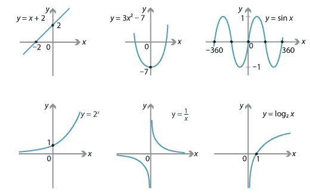

## Table of Contents

## What is Y?

Y is the 25th letter in the English alphabet. It is a letter that can make different sounds, like in "yes" or "myth." People use Y in many words, both at the beginning, middle, or end. For example, "yellow," "sky," and "happy" all have Y in them.

In math, Y is often used as a variable. This means it stands for a number that can change. You might see Y in equations, like Y = 2X + 3. Here, Y depends on X. In graphs, Y is usually on the vertical axis, which is called the Y-axis.

## What is the origin of Y?

The letter Y comes from a very old alphabet called Phoenician. In Phoenician, there was a letter called "waw" that looked like a hook or a stick. This letter made a sound like "w" or "u." When the Greeks took the Phoenician alphabet and changed it, they made the letter "upsilon" from waw. Upsilon looked a bit like our Y and made a sound like "u" or "ü."

Later, the Romans took the Greek alphabet and changed it to make the Latin alphabet. They used the Greek upsilon to make the letter V. But they also needed a letter to make the "y" sound, which they got from Greek words. So, they took the Greek upsilon again and changed it a bit to make our letter Y. This is why Y looks a bit like both V and the Greek upsilon.

## How is Y used in everyday language?

In everyday language, Y is a letter that we use in many words. It can be at the start, middle, or end of a word. For example, "yes," "try," and "sky" all have Y in them. Y can make different sounds. In "yes," it sounds like "yuh." In "myth," it sounds like "ih." At the end of words like "happy," Y can sound like "ee."

Y is also used in short forms and slang. People might say "Y" instead of "why" in text messages or on social media. It's a quick way to ask a question. Y can also be part of words that we use every day, like "you," "your," and "yours." So, Y is a very useful letter in our language.

## What are the different pronunciations of Y?

Y can sound different in different words. At the start of words like "yes" and "yellow," Y sounds like "yuh." It's a bit like the sound you make when you say "you." In words like "myth" and "hymn," Y sounds like "ih." This is a short, sharp sound.

When Y is at the end of a word, it can sound like "ee." You hear this in words like "happy" and "sky." Sometimes, Y at the end can sound like "ay," like in "try" and "fly." So, Y can change its sound a lot, depending on where it is in a word.

## Can you explain the grammatical function of Y?

In grammar, Y can be part of different kinds of words. It can be in nouns like "year" and "yacht," verbs like "yell" and "yield," adjectives like "yellow" and "young," and adverbs like "yearly" and "yesterday." Y can also be in pronouns like "you," "your," and "yours." These words help us talk about people and things, and they can change depending on what we want to say.

Y can also help make words plural or show possession. For example, when we add Y to "city" to make "cities," it shows there is more than one city. When we add Y to "Mary" to make "Mary's," it shows something belongs to Mary. So, Y is a very useful letter in grammar because it can be part of many different kinds of words and help us change words to mean different things.

## How does Y function in different languages?

In different languages, Y can sound and work differently. In English, Y can be a consonant at the start of words like "yes" or a vowel at the end like in "happy." In Spanish, Y is often a consonant and sounds like the English "y" in "yes." It can also be used as a vowel, sounding like the English "ee" in words like "rey" (king). In French, Y is mostly used as a vowel and sounds like "ee" in words like "yoga." So, Y can change a lot depending on the language.

In German, Y is not very common, but when it is used, it usually sounds like the English "y" in "yes." In Russian, the letter "ы" (y) is a vowel and sounds like a mix between "ee" and "ih." In some languages like Turkish, Y is used a lot and can sound like "ee" or "üh." So, Y can be a consonant or a vowel and can have different sounds in different languages. This makes Y a very interesting letter because it can change a lot depending on where it is used.

## What are some common phrases or idioms that include Y?

Some common phrases with Y include "yes and no," which means giving both positive and negative answers, and "young at heart," which means someone feels young even if they are old. People also say "you bet" to agree strongly or show they are sure about something. Another phrase is "year in, year out," which means something happens every year without stopping.

There are also idioms like "yank someone's chain," which means to tease or trick someone. Another is "yellow-bellied," which means someone is a coward. People might say "you can't judge a book by its cover" to remind others not to judge people or things by how they look on the outside. These phrases and idioms show how Y can be part of everyday language in fun and meaningful ways.

## How has the usage of Y evolved over time?

The letter Y has changed a lot over time. It started in the Phoenician alphabet as a letter called "waw," which looked like a hook and made a "w" or "u" sound. The Greeks changed it into "upsilon," which looked like our Y and made a "u" or "ü" sound. Then, the Romans took it and made it into V and later Y, which they used for the "y" sound in Greek words. So, Y went from a simple hook to a letter that can make many different sounds.

Today, Y is used in many ways in English. It can be a consonant at the start of words like "yes" or a vowel at the end like in "happy." In other languages, Y can sound different too. For example, in Spanish, it can sound like "y" or "ee," and in French, it usually sounds like "ee." Over time, Y has become a very flexible letter that can change its sound and use depending on the language and where it is in a word.

## What are some advanced linguistic theories about Y?

Some linguists think about Y in a special way. They say Y is a special letter because it can be both a consonant and a vowel. In English, Y can start words like "yes" and sound like a consonant, but at the end of words like "happy," it sounds like a vowel. This makes Y different from other letters. Some theories say that Y's ability to change sounds comes from how languages have changed over time. Y started as a simple letter in the Phoenician alphabet and changed a lot as it moved to Greek and then Latin. This change helped Y become a letter that can do many things in different languages.

Other linguists look at how Y works in different languages. They say that in some languages, like Spanish, Y can be a vowel or a consonant, but it mostly sounds like "y" or "ee." In French, Y is mostly a vowel and sounds like "ee." These differences show that Y's sound can change a lot depending on the language. Some theories also talk about how Y can help make words plural or show possession in English, like in "cities" or "Mary's." This shows that Y is not just a letter that makes sounds, but it also helps change the meaning of words in grammar.

## Can you provide examples of Y in literature or media?

In literature, Y is in many famous [books](/wiki/algo-trading-books). For example, in "The Catcher in the Rye" by J.D. Salinger, the main character, Holden Caulfield, says "yes" and "no" a lot. These words show how he feels about things. Another example is in "Harry Potter" by J.K. Rowling. In the book "Harry Potter and the Philosopher's Stone," there is a character named "Yvonne." She is a student at Hogwarts, and her name starts with Y. These examples show how Y can be part of important words and names in stories.

In media, Y is in many movies and songs. For example, in the movie "The Lion King," there is a song called "Hakuna Matata." In the song, they sing about being happy, and the word "happy" has a Y in it. Another example is in the TV show "Sesame Street." They have a character named "Yip Yip" who is an alien. The name "Yip Yip" has two Ys in it, and it makes the character fun and easy to remember. These examples show how Y can be part of words and names that people see and hear in media.

## How is Y taught in language education?

In language education, Y is taught as a letter that can be both a consonant and a vowel. Teachers show students that at the start of words like "yes," Y sounds like "yuh." But at the end of words like "happy," Y sounds like "ee." This helps students understand that Y can change its sound. Teachers also use examples to show how Y can be in different parts of words, like the middle in "sky" or the end in "try." This way, students learn that Y is a flexible letter.

Teachers also use fun activities to help students remember Y. They might play games where students have to find words with Y or sing songs that have Y in them. This makes learning about Y fun and easy. By using these methods, teachers help students see how important Y is in our language and how it can be part of many different words.

## What are the current research trends regarding Y?

Researchers are looking at how Y works in different languages. They want to know why Y can be a consonant or a vowel. In English, Y can start words like "yes" and sound like a consonant, but at the end of words like "happy," it sounds like a vowel. Scientists study how Y's sounds have changed over time. They look at how Y started in the Phoenician alphabet and changed as it moved to Greek and then Latin. This helps them understand why Y can do so many things in different languages.

Another thing researchers are studying is how Y helps in grammar. They look at how Y can help make words plural or show possession, like in "cities" or "Mary's." They also study how Y is used in different kinds of words, like nouns, verbs, adjectives, and adverbs. By looking at these things, researchers learn more about how Y works in our language and how it can change the meaning of words.

## What is Algorithmic Trading?

Algorithmic trading, often synonymous with automated trading, refers to the use of computer algorithms to manage trading decisions based on pre-defined criteria. This modern approach to trading is pivotal in today's financial markets due to its capability to process data and execute trades at speeds and frequencies that are impossible for human traders.

**Key Components of Algorithmic Trading**

1. **Automated Strategies**: These are programmed sets of rules and criteria for entering and exiting trades. Algorithms can implement simple rules, like executing a buy order when the stock price drops below a specific threshold, or complex strategies involving multiple factors such as price, timing, and volume. Simplified, an automated strategy may follow:
$$
   \text{if } P_t < \text{threshold} \text{ then execute buy order}

$$

   where $P_t$ is the asset price at time $t$.

2. **Data Analysis**: Algorithms rely heavily on data for making informed trading decisions. This includes historical data, current market prices, volumes, and even news sentiment. Data analysis tools are integral for identifying trends, patterns, and anomalies that human traders might overlook. Statistical models and machine learning algorithms further enhance predictive capabilities.

3. **Trading Signals**: These are indicators generated by the algorithm that suggest potential trading opportunities. Trading signals can be derived from technical analysis using moving averages, RSI (Relative Strength Index), and other indicators. For example, a common signal might involve moving average crossovers:
$$
   \text{if } \text{SMA}_{50} > \text{SMA}_{200} \text{ then signal buy}

$$

   where $\text{SMA}_{50}$ and $\text{SMA}_{200}$ are the 50-day and 200-day simple moving averages respectively.

**Role of Python and 'yfinance' in Algorithmic Trading**

Python is a favorite among algorithmic traders due to its simplicity and the extensive libraries it offers. Libraries such as NumPy and pandas facilitate data manipulation and analysis, while [machine learning](/wiki/machine-learning) libraries like Scikit-learn provide powerful tools for building predictive models.

'yfinance' is a Python library used for accessing historical market data from Yahoo Finance. It simplifies data collection, allowing traders to easily implement their strategies:

```python
import yfinance as yf  # For more datasets, visit: https://paperswithbacktest.com/datasets

# Download historical data for Microsoft
msft_data = yf.download('MSFT', start='2020-01-01', end='2023-01-01')

# Calculate moving averages
msft_data['SMA_50'] = msft_data['Close'].rolling(window=50).mean()
msft_data['SMA_200'] = msft_data['Close'].rolling(window=200).mean()

# Generate signals
msft_data['Signal'] = 0.0
msft_data['Signal'][50:] = np.where(msft_data['SMA_50'][50:] > msft_data['SMA_200'][50:], 1.0, 0.0)
```

This example demonstrates the ease with which traders can retrieve historical data and perform analyses, such as calculating moving averages to generate trading signals.

Algorithmic trading's significance in finance is underscored by its ability to enhance efficiency, reduce costs, and potentially increase profitability by mitigating human errors and emotions. The rise of powerful computing and user-friendly tools continues to democratize access to [algorithmic trading](/wiki/algorithmic-trading), making it accessible even to individual traders and hobbyists.

## References & Further Reading

[1]: ["Algorithmic Trading: Winning Strategies and Their Rationale"](https://books.google.com/books/about/Algorithmic_Trading.html?id=WAlFDwAAQBAJ) by Ernest P. Chan

[2]: ["Python for Finance: Analyze Big Financial Data"](https://books.google.com/books/about/Python_for_Finance.html?id=E93SBQAAQBAJ) by Yves Hilpisch

[3]: ["Machine Learning for Trading"](https://www.coursera.org/specializations/machine-learning-trading) by Georgia Tech on Coursera

[4]: ["yfinance Documentation"](https://pypi.org/project/yfinance/)

[5]: ["Algorithmic Trading and Finance Models with Python, R, and Stata Essential Training"](https://masterscareers.brown.edu/classes/algorithmic-trading-and-finance-models-with-python-r-and-stata-essential-training/) on edX