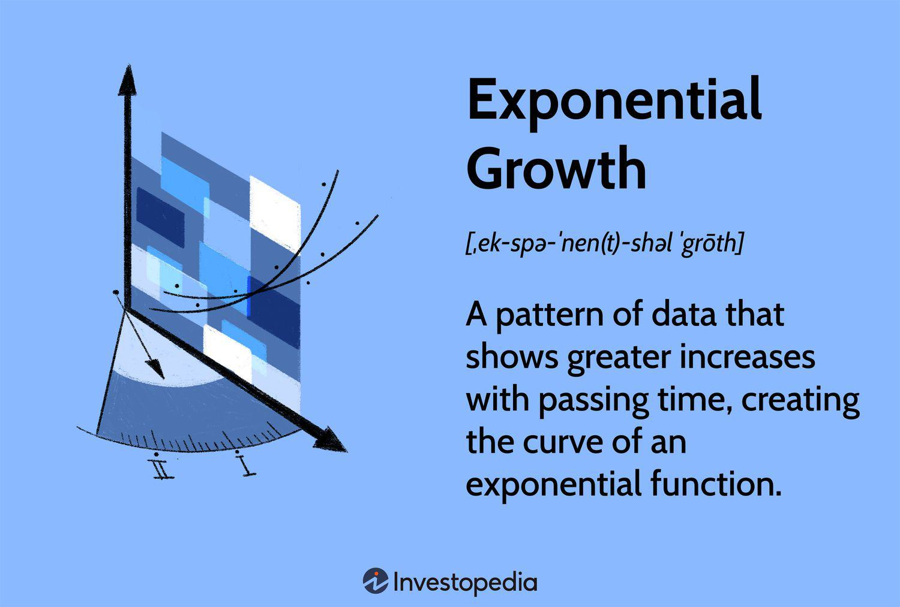

The 'Y' function holds significant importance across various financial contexts, serving as a bridge between trading symbols and algorithmic trading. In the world of stock markets, the 'Y' symbol is particularly crucial for American Depositary Receipts (ADRs), which allow U.S. investors to trade shares of foreign companies on American exchanges. The unique 'Y' suffix within trading symbols identifies those instruments as ADRs, distinguishing them from other equity investments. This facilitates investors' access to global markets without the direct complexities of dealing with foreign financial regulations and currency exchange fluctuations.

Algorithmic trading leverages the advancements in computational technology and data analysis to execute trades at speeds and frequencies beyond human capabilities. The 'Y' function plays an integral role in this domain as part of tools and libraries like 'yfinance', which is widely used in Python for financial data extraction. By providing a means to access real-time and historical stock data efficiently, 'Y' functions enable traders and investors to formulate automated strategies based on comprehensive data analysis. Whether implementing simple moving averages or complex trading signals, the 'Y' function enhances the precision and efficiency of algorithmic trading strategies.



The objective of this article is to elucidate the significance of the 'Y' function, its application in both trading symbols and algorithmic trading scenarios, and to provide practical examples of its utility. By understanding the multifaceted role that 'Y' plays, readers can appreciate its value in modern finance and potentially harness these insights to optimize their trading strategies. As the financial landscape continues to evolve with technological progress, the 'Y' function remains an essential tool in expanding the reach and efficacy of trading operations.

## Table of Contents

## Understanding the 'Y' Symbol in Stock Markets

The 'Y' symbol in stock markets primarily relates to American Depositary Receipts (ADRs) and serves as an essential marker for U.S. investors interested in trading foreign stocks. ADRs are securities that represent shares in a foreign company's stock, allowing these shares to be traded on U.S. exchanges, thereby simplifying the process for American investors.

**Definition of the 'Y' Symbol:**

In the context of stock markets, the 'Y' symbol is commonly associated with ADRs. ADRs are a key financial instrument allowing U.S. investors to purchase shares in international corporations without dealing with complexities like foreign stock exchanges, currency conversions, or other regulatory challenges. The 'Y' symbol helps in distinguishing these receipts from other stocks listed on American exchanges. For instance, an ADR might have a trading symbol like "XYZ Co. Depositary Shares (XYZDY)" where the 'Y' indicates its status as an ADR.

**Significance of ADRs:**

For U.S. investors, ADRs offer an array of benefits when investing in foreign equities:

1. **Convenience**: ADRs are traded like any U.S. stock, which means they are priced in U.S. dollars and involve transactions processed under U.S. regulations. Investors receive dividends in dollars and do not need to worry about foreign exchange rates.

2. **Diversification**: By allowing access to international companies, ADRs enable investors to diversify their portfolios beyond domestic investments, thereby reducing risk associated with domestic market fluctuations.

3. **Liquidity and Accessibility**: Trading on the U.S. exchanges provides better liquidity for ADRs compared to direct foreign investments. It also ensures that these instruments are more accessible to individual and institutional investors alike.

**Differentiation by 'Y' Symbol:**

The inclusion of the 'Y' in a security's trading symbol serves as a clear differential indicator that the stock is an ADR, distinguishing it from other domestic securities. This notation is crucial for investors who specifically seek to invest in foreign markets through the convenience of U.S. trading platforms. Furthermore, ADRs can be categorized into various levels with distinct privileges and regulatory requirements, adding layers to their differentiation. The 'Y' provides immediate identification and helps investors quickly and efficiently navigate trading choices within U.S. markets.

In conclusion, the 'Y' symbol is a testament to the financial innovation that ADRs represent, bridging American investors with global opportunities while providing the framework of U.S. financial systems and protections.

## What is Algorithmic Trading?

Algorithmic trading, often synonymous with automated trading, refers to the use of computer algorithms to manage trading decisions based on pre-defined criteria. This modern approach to trading is pivotal in today's financial markets due to its capability to process data and execute trades at speeds and frequencies that are impossible for human traders.

**Key Components of Algorithmic Trading**

1. **Automated Strategies**: These are programmed sets of rules and criteria for entering and exiting trades. Algorithms can implement simple rules, like executing a buy order when the stock price drops below a specific threshold, or complex strategies involving multiple factors such as price, timing, and volume. Simplified, an automated strategy may follow:
$$
   \text{if } P_t < \text{threshold} \text{ then execute buy order}

$$

   where $P_t$ is the asset price at time $t$.

2. **Data Analysis**: Algorithms rely heavily on data for making informed trading decisions. This includes historical data, current market prices, volumes, and even news sentiment. Data analysis tools are integral for identifying trends, patterns, and anomalies that human traders might overlook. Statistical models and machine learning algorithms further enhance predictive capabilities.

3. **Trading Signals**: These are indicators generated by the algorithm that suggest potential trading opportunities. Trading signals can be derived from technical analysis using moving averages, RSI (Relative Strength Index), and other indicators. For example, a common signal might involve moving average crossovers:
$$
   \text{if } \text{SMA}_{50} > \text{SMA}_{200} \text{ then signal buy}

$$

   where $\text{SMA}_{50}$ and $\text{SMA}_{200}$ are the 50-day and 200-day simple moving averages respectively.

**Role of Python and 'yfinance' in Algorithmic Trading**

Python is a favorite among algorithmic traders due to its simplicity and the extensive libraries it offers. Libraries such as NumPy and pandas facilitate data manipulation and analysis, while [machine learning](/wiki/machine-learning) libraries like Scikit-learn provide powerful tools for building predictive models.

'yfinance' is a Python library used for accessing historical market data from Yahoo Finance. It simplifies data collection, allowing traders to easily implement their strategies:

```python
import yfinance as yf  # For more datasets, visit: https://paperswithbacktest.com/datasets

# Download historical data for Microsoft
msft_data = yf.download('MSFT', start='2020-01-01', end='2023-01-01')

# Calculate moving averages
msft_data['SMA_50'] = msft_data['Close'].rolling(window=50).mean()
msft_data['SMA_200'] = msft_data['Close'].rolling(window=200).mean()

# Generate signals
msft_data['Signal'] = 0.0
msft_data['Signal'][50:] = np.where(msft_data['SMA_50'][50:] > msft_data['SMA_200'][50:], 1.0, 0.0)
```

This example demonstrates the ease with which traders can retrieve historical data and perform analyses, such as calculating moving averages to generate trading signals.

Algorithmic trading's significance in finance is underscored by its ability to enhance efficiency, reduce costs, and potentially increase profitability by mitigating human errors and emotions. The rise of powerful computing and user-friendly tools continues to democratize access to [algorithmic trading](/wiki/algorithmic-trading), making it accessible even to individual traders and hobbyists.

## Role of Y Functions in Algorithmic Trading

The 'Y' functions, particularly with the advent of 'yfinance', play a critical role in algorithmic trading by facilitating the collection and analysis of stock market data. Tools like 'yfinance' empower traders to automate and optimize their trading strategies, harnessing both historical and real-time market data to generate trading signals effectively.

### Automating and Optimizing Trading Strategies

'Y' functions contribute to the automation of trading strategies by allowing traders to programmatically access vast amounts of data with minimal manual intervention. This capability is invaluable for executing complex algorithms that can react to market conditions instantaneously. By leveraging libraries such as 'yfinance', traders can fetch historical price data, financial indicators, and other relevant metrics essential for data-driven decision-making. Here's a basic example of how to use 'yfinance' in Python:

```python
import yfinance as yf  # For more datasets, visit: https://paperswithbacktest.com/datasets

# Fetch historical data for a specific stock
data = yf.download("AAPL", start="2020-01-01", end="2023-01-01")

# Display the first few rows
print(data.head())
```

This code snippet demonstrates the straightforward retrieval of Apple's (AAPL) historical data, which forms the backbone of many analytical techniques used in algorithmic trading.

### Generating Trading Signals

Generating trading signals involves analyzing historical market data and monitoring real-time data for patterns or indicators that alert traders to potential buy or sell opportunities. The 'Y' functions in libraries like 'yfinance' simplify the extraction and processing of such data, enabling the development of models to generate these signals. One common method is using moving averages, which can smooth out price data and help identify trends. Here is an example using Python:

```python
# Calculate the 50-day and 200-day moving averages
data['50_MA'] = data['Close'].rolling(window=50).mean()
data['200_MA'] = data['Close'].rolling(window=200).mean()

# Generate buy/sell signals
data['Signal'] = 0.0
data['Signal'][50:] = np.where(data['50_MA'][50:] > data['200_MA'][50:], 1.0, 0.0)
data['Position'] = data['Signal'].diff()

# Display the signals
print(data[['Close', '50_MA', '200_MA', 'Signal', 'Position']].tail())
```

The above code calculates the 50-day and 200-day moving averages, generating a signal when the shorter moving average crosses above or below the longer one.

### Real-Time Data Analysis

Real-time data processing is crucial for making immediate trading decisions, where a small delay can result in significant losses. 'Y' prefixed functions focus on providing a reliable interface to fetch the latest stock prices, thus allowing automated systems to evaluate market conditions and respond appropriately. Traders can integrate real-time data evaluation into broader algorithms that execute trades based on predefined conditions, leveraging continuously updated information to maintain an edge over slower, manual trading processes.

In summary, the 'Y' functions, especially those found in 'yfinance', are instrumental for traders looking to automate and refine their trading strategies, as well as efficiently generate actionable trading signals from historical and real-time data. As these tools become more advanced, their role in enhancing and broadening access to sophisticated trading methodologies is set to grow further.

## Examples of Y Functions in Action

To work effectively with real-time stock market data and execute algorithmic trades, one of the pivotal tools is 'yfinance', a popular Python library that simplifies data retrieval from Yahoo Finance. To begin, setting up 'yfinance' in a Python environment is straightforward and essential for accessing historical and current market data.

First, ensure you have Python installed, and then proceed to install 'yfinance' using pip:

```bash
pip install yfinance
```

Once installed, 'yfinance' can be utilized to fetch real-time data. Consider the example of retrieving stock data for a specific ticker symbol, such as "AAPL" for Apple Inc.:

```python
import yfinance as yf  # For more datasets, visit: https://paperswithbacktest.com/datasets

# Download historical stock data
data = yf.download("AAPL", start="2022-01-01", end="2023-01-01")

print(data.head())
```

This code snippet will output historical price data for the specified date range, which can be critical for analyzing trends or developing trading strategies.

Generating trading signals, such as moving averages, is a fundamental tactic in algorithmic trading. Using 'yfinance', traders can implement a strategy based on the crossover of short-term and long-term moving averages:

```python
# Calculate moving averages
data['Short_MA'] = data['Close'].rolling(window=40).mean()
data['Long_MA'] = data['Close'].rolling(window=100).mean()

# Generate buy/sell signals
data['Signal'] = 0.0
data.loc[data['Short_MA'] > data['Long_MA'], 'Signal'] = 1.0
data.loc[data['Short_MA'] < data['Long_MA'], 'Signal'] = -1.0

print(data[['Close', 'Short_MA', 'Long_MA', 'Signal']].tail())
```

This moving average crossover strategy helps identify potential buy or sell points: a 'buy' signal occurs when the short-term average crosses above the long-term average and a 'sell' signal when the opposite happens.

Integrating 'yfinance' data into trading platforms for algorithmic trades requires establishing a connection between the data analysis solutions and the trade execution system. Tools like MetaTrader or algorithmic trading platforms like QuantConnect can automate trade placing based on signals defined by the algorithms developed using 'yfinance'. Utilizing APIs, traders can connect their Python scripts to these platforms, ensuring that signals lead to actual trading actions.

Furthermore, integrating with platforms like [Interactive Brokers](/wiki/interactive-brokers-api) requires their API:

```python
from ib_insync import *

# Connect to Interactive Brokers API
ib = IB()
ib.connect('127.0.0.1', 7497, clientId=1)

# Assuming strategies and signals are ready
if data['Signal'].iloc[-1] == 1.0:
    # Code to place a buy order
    order = MarketOrder('BUY', 100)
    ib.placeOrder(stock, order)
elif data['Signal'].iloc[-1] == -1.0:
    # Code to place a sell order
    order = MarketOrder('SELL', 100)
    ib.placeOrder(stock, order)
```

Such integrations allow for seamless transition from data analysis to actual market transactions, leveraging the power of algorithmic trading to optimize efficiency and responsiveness to market changes.

## Benefits and Challenges

The use of 'Y' functions, such as those available in financial tools like 'yfinance', greatly benefits traders by enhancing efficiency and enabling data-driven decisions. These functions allow for the automation of data retrieval and analysis processes, reducing the time and effort required to monitor market trends and execute trades. By automating these tasks, traders can focus on developing and refining strategies based on comprehensive datasets, which may lead to more informed trading decisions.

One of the primary advantages of using 'Y' functions lies in their ability to process vast amounts of historical and real-time data quickly. For instance, with Python's 'yfinance', traders can effortlessly fetch stock prices, dividends, and other financial metrics. This ensures that they are working with up-to-date information while strategizing their trades, potentially increasing the likelihood of profitable outcomes.

Despite these benefits, there are challenges associated with utilizing 'Y' functions in algorithmic trading. Data accuracy is a concern, as incorrect or outdated information can directly impact trading results. To mitigate this, traders should verify the sources of data and cross-reference essential data points across multiple reliable platforms. Additionally, technical hurdles may arise, such as ensuring robust network connections for real-time data feeds and maintaining the integrity of the trading system against software bugs or outages. Developing a rigorous testing framework for trading algorithms can help identify and rectify potential issues before they impact live trading activities.

Overcoming these challenges requires a combination of technical acumen and strategic foresight. Traders should engage in continuous learning and skill development, particularly in programming and data analysis, to adeptly manage these tools. Utilizing libraries and platforms such as Jupyter Notebook can aid in testing and visualizing trading strategies effectively. Moreover, implementing error-handling mechanisms in their code can minimize disruptions during trading operations.

By leveraging the power of 'Y' functions, traders can greatly enhance the precision and effectiveness of their strategies. However, it is crucial to address the accompanying challenges to fully capitalize on the potential of these tools in the competitive landscape of algorithmic trading.

## Conclusion

Understanding the 'Y' function's role in trading is crucial for both novice and experienced investors seeking to leverage algorithmic trading tools for more informed decision-making. The 'Y' functions, particularly embodied through tools like 'yfinance', provide a gateway to automated, data-driven trading strategies that enhance market efficiency and trader responsiveness.

The application of 'Y' functions enables traders to automate the retrieval and analysis of vast stock market datasets, facilitating the development of robust algorithms that can process information at a speed and accuracy unattainable by manual methods. This empowers traders to make swift, informed decisions, optimizing their strategies and improving their market outcomes.

Encouraging further exploration is vital as the landscape of trading and finance continues to evolve. Engaging deeply with 'Y' functions and related algorithmic tools allows traders to stay ahead of market trends and technological advancements. Experimenting with these tools in Python and other programming environments enhances one's ability to develop innovative trading solutions tailored to specific market conditions.

Looking forward, the future of algorithmic trading is set to be shaped by the convergence of machine learning, big data analytics, and advanced algorithmic tools. The 'Y' functions will likely adapt and evolve to accommodate these advancements, offering even greater potential for data analysis and trading strategy refinement. Thus, a firm grasp of their current capabilities and potential future developments positions traders to not only leverage existing opportunities but also adapt to unforeseen challenges in the dynamic world of finance.

## Further Reading and Resources

For readers aspiring to deepen their understanding of algorithmic trading, a wide array of articles, tutorials, and educational resources are available to aid in enhancing expertise in this field.

### Articles and Tutorials

1. **Investopedia's Algorithmic Trading Explanation**: A foundational article that introduces the core principles of algorithmic trading, covering basic strategies and terminology. [Investopedia](https://www.investopedia.com/terms/a/algorithmictrading.asp).

2. **QuantStart's Algorithmic Trading Series**: A series of tutorials that start with beginner concepts and progress to more advanced topics such as strategy optimization and risk management. [QuantStart](https://www.quantstart.com/articles).

3. **Kaggle Tutorials**: Provides practical guides and notebooks to practice machine learning and data analysis skills essential for algorithmic trading. [Kaggle](https://www.kaggle.com/learn).

4. **Towards Data Science on Medium**: Offers a curated list of articles on Python financial libraries and their applications in algorithmic trading. [Towards Data Science](https://towardsdatascience.com).

### Documentation for Python and Finance Libraries

- **Pandas**: The official documentation is a vital resource for learning how to manipulate data structures and time series for preparing data in trading algorithms. [Pandas Documentation](https://pandas.pydata.org/docs/).

- **NumPy**: Since numerical computations form the basis of algorithmic predictions and statistics, mastering NumPy will be advantageous. [NumPy Documentation](https://numpy.org/doc/stable/).

- **yfinance**: The library's documentation provides insights on easily accessing market data within Python for developing trading algorithms. [yfinance Documentation](https://pypi.org/project/yfinance/).

- **TA-Lib**: Documentation that investigates into technical analysis library features, crucial for creating indicators and signals. [TA-Lib Documentation](https://mrjbq7.github.io/ta-lib/).

### Books and Courses

- **"Algorithmic Trading: Winning Strategies and Their Rationale" by Ernest Chan**: This book offers insights on implementing quantitative trading strategies in real markets and includes practical examples.

- **Coursera's "Machine Learning for Trading" by Georgia Tech**: A comprehensive online course that blends finance theory with machine learning techniques tailored to trading. [Coursera](https://www.coursera.org/learn/machine-learning-trading).

- **"Python for Finance: Analyze Big Financial Data" by Yves Hilpisch**: Provides a solid introduction to using Python for financial analytics and the development of trading strategies.

- **edX's "Algorithmic Trading and Finance Models with Python, R, and Stata Essential Training"**: A course suited for those looking to employ multiple programming languages in financial modeling and trading strategy development. [edX](https://www.edx.org/course/algorithmic-trading-finance-models-python-r-stata).

These resources collectively offer a pathway for building both foundational knowledge and advanced insights into algorithmic trading, enabling practitioners to develop more sophisticated and effective trading strategies.

## References & Further Reading

[1]: ["Algorithmic Trading: Winning Strategies and Their Rationale"](https://books.google.com/books/about/Algorithmic_Trading.html?id=WAlFDwAAQBAJ) by Ernest P. Chan

[2]: ["Python for Finance: Analyze Big Financial Data"](https://books.google.com/books/about/Python_for_Finance.html?id=E93SBQAAQBAJ) by Yves Hilpisch

[3]: ["Machine Learning for Trading"](https://www.coursera.org/specializations/machine-learning-trading) by Georgia Tech on Coursera

[4]: ["yfinance Documentation"](https://pypi.org/project/yfinance/)

[5]: ["Algorithmic Trading and Finance Models with Python, R, and Stata Essential Training"](https://masterscareers.brown.edu/classes/algorithmic-trading-and-finance-models-with-python-r-and-stata-essential-training/) on edX