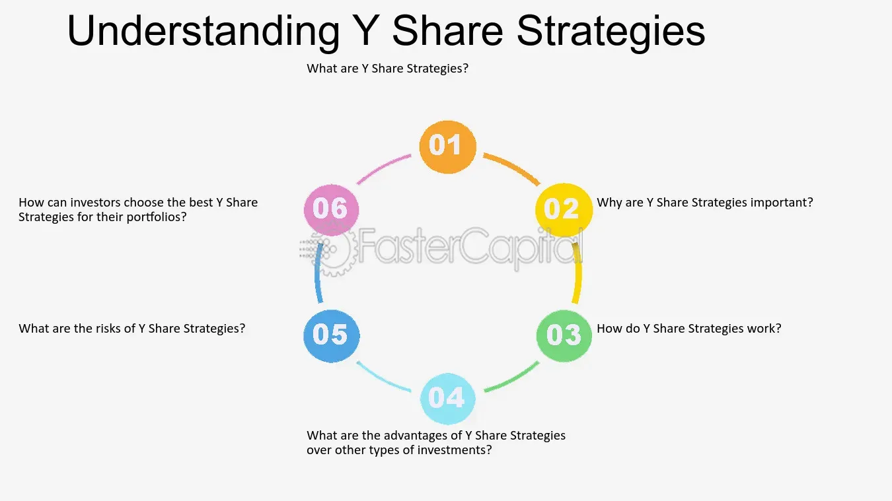

## Table of Contents

## What is Y-Share?

Y-Share is a type of stock that companies can issue. It is different from regular stocks because it usually does not have voting rights. This means that people who own Y-Shares cannot vote on company decisions. Companies might issue Y-Shares to raise money without giving away control of the company.

Y-Shares are often used by companies that want to keep control in the hands of a few people, like the founders or a small group of investors. These shares can still be attractive to investors because they might offer higher dividends or other financial benefits. However, because they don't come with voting rights, they might be seen as less valuable than regular shares that do allow voting.

## How does Y-Share differ from other share classes?

Y-Shares are different from other share classes mainly because they usually don't give the owner the right to vote on company decisions. Most common shares, often called A-Shares, do come with voting rights. This means that if you own A-Shares, you can vote on things like who should be on the company's board of directors or other important company matters. But with Y-Shares, you don't get to vote, so the people who started the company or other key investors can keep more control over it.

Another way Y-Shares differ is that they might offer different financial benefits. Sometimes, companies will give Y-Shares higher dividends to make up for the lack of voting rights. This can make Y-Shares attractive to investors who are more interested in getting money back from their investment than in having a say in how the company is run. Other share classes, like B-Shares or C-Shares, might have their own unique features, but Y-Shares are specifically known for not having voting rights and possibly offering higher dividends.

## What are the primary benefits of investing in Y-Share?

One of the main benefits of investing in Y-Shares is that they often come with higher dividends. This means you can get more money back from your investment compared to other types of shares. If you're looking to earn income from your investments, Y-Shares can be a good choice because they might pay you more regularly or in larger amounts.

Another benefit is that Y-Shares can be a way to invest in a company without affecting its control. Since Y-Shares don't come with voting rights, the people who started the company or other key investors can keep making the big decisions. This can be good if you trust the current leaders and just want to benefit from the company's success without getting involved in how it's run.

## Who typically invests in Y-Share?

People who invest in Y-Shares are often looking for a steady income from their investments. These investors might be retirees or others who need regular money coming in. They like Y-Shares because these shares usually pay higher dividends than other types of shares. This means they can get more money back from their investment without worrying about voting on company decisions.

Another group that might invest in Y-Shares are those who believe in the company's leadership but don't want to have a say in how the company is run. These investors trust the founders or current management to make good decisions. They are happy to let these people keep control of the company while they enjoy the financial benefits that come from owning Y-Shares.

## How can one purchase Y-Share?

To buy Y-Shares, you need to find a company that offers them. Not all companies have Y-Shares, so you might need to do some research. You can look at the company's website or check financial news to see if they have Y-Shares available. Once you find a company with Y-Shares, you can buy them through a stockbroker. A stockbroker is someone who helps you buy and sell stocks. You can use an online broker, which is easy to do from your computer or phone, or you can work with a traditional broker who you can talk to in person or over the phone.

After you choose a broker, you'll need to open an account with them. This usually involves filling out some forms and giving them some information about yourself. Once your account is set up, you can put money into it and then use that money to buy Y-Shares. Just tell your broker which company's Y-Shares you want to buy and how many you want. They will do the rest and soon you'll own Y-Shares in that company.

## What are the fees associated with Y-Share?

When you buy Y-Shares, you might have to pay some fees. One common fee is the brokerage fee. This is what you pay the stockbroker for helping you buy the shares. The amount can be different depending on which broker you use. Some brokers charge a flat fee for each trade, while others might charge a percentage of the total amount you're spending on the shares.

Another fee you might see is a management fee if you're buying Y-Shares through a mutual fund or an exchange-traded fund ([ETF](/wiki/etf-trading-strategies)) that holds Y-Shares. This fee is for the people who manage the fund and make decisions about which shares to buy and sell. It's usually a small percentage of the total value of your investment in the fund. Keep in mind that these fees can add up over time, so it's a good idea to check what fees you might have to pay before you decide to buy Y-Shares.

## What is the minimum investment required for Y-Share?

The minimum investment required for Y-Shares can be different depending on the company and the broker you use. Some companies might let you buy just one share, while others might have a higher minimum amount you need to spend. It's a good idea to check with the company or look at their website to find out what their rules are.

Brokers also have their own rules about how much you need to start investing. Some online brokers let you buy shares for a very small amount of money, maybe even less than $100. But other brokers might need you to have more money in your account before you can start buying shares. So, it's important to ask your broker what their minimum investment is before you decide to buy Y-Shares.

## How does the performance of Y-Share compare to other share classes?

The performance of Y-Shares can be different from other share classes like A-Shares or B-Shares. Y-Shares often don't have voting rights, which can make them less valuable to some investors who want to have a say in the company's decisions. But Y-Shares might offer higher dividends to make up for this. This means that if you're looking for regular income from your investment, Y-Shares could perform better for you than other shares that pay less in dividends.

On the other hand, the overall value of Y-Shares can go up or down just like any other share. The company's success or failure will affect the price of Y-Shares, just as it would affect A-Shares or B-Shares. But because Y-Shares don't give you voting power, they might not attract as many investors, which could sometimes lead to lower demand and a lower price compared to shares with voting rights. So, while Y-Shares might give you more money in dividends, they might not grow in value as much as other share classes if the company does well.

## What are the tax implications of investing in Y-Share?

When you invest in Y-Shares, you need to think about taxes. If you get dividends from your Y-Shares, you have to pay taxes on that money. The tax rate can be different depending on where you live and how much money you make. Sometimes, the tax on dividends is less than the tax on other kinds of income, but it's still something you need to pay.

If you sell your Y-Shares and make a profit, you also have to pay taxes on that profit. This is called capital gains tax. How much you pay depends on how long you owned the shares before selling them. If you held them for a long time, usually more than a year, you might pay a lower tax rate on your profit. But if you sold them quickly, the tax rate could be higher. It's a good idea to talk to a tax expert to understand exactly how much you might have to pay in taxes when investing in Y-Shares.

## How does Y-Share handle dividends and capital gains?

When you own Y-Shares, you get dividends, which are like payments the company gives you for owning their shares. Y-Shares often give higher dividends than other types of shares because they don't let you vote on company decisions. When you get these dividends, you have to pay taxes on them. The tax rate depends on where you live and how much money you make. Sometimes, the tax on dividends is lower than other kinds of income, but you still need to pay it.

If you decide to sell your Y-Shares and make a profit, that's called a capital gain. You have to pay taxes on this profit too. The tax rate for capital gains depends on how long you owned the shares before selling them. If you held them for more than a year, you might pay a lower tax rate. But if you sold them quickly, the tax rate could be higher. It's a good idea to talk to someone who knows about taxes to understand exactly how much you might have to pay.

## What are the risks associated with Y-Share?

One risk of investing in Y-Shares is that they don't give you the right to vote on company decisions. This means you can't have a say in important things like who runs the company or what big choices they make. If the people in charge make bad decisions, the value of your Y-Shares could go down, and you can't do anything about it. This can be a big problem if you don't trust the company's leaders.

Another risk is that Y-Shares might not grow in value as much as other types of shares. Because they don't come with voting rights, some investors might not want to buy them, which can make the price go down. Even though Y-Shares often pay higher dividends, if the company doesn't do well, those dividends could get smaller or stop completely. So, while you might get more money back in the short term, you could lose money in the long run if the company's value drops.

## How can an investor monitor and manage their Y-Share investments?

To keep an eye on your Y-Share investments, you can use the tools that your broker gives you. Most brokers have websites or apps where you can see how your shares are doing. You can check the price of your Y-Shares every day and see how much money you're getting from dividends. It's a good idea to look at these things regularly so you know if your investment is doing well or if you need to make changes.

Managing your Y-Share investments means thinking about when to buy more shares or when to sell them. If the company is doing well and paying good dividends, you might want to buy more Y-Shares. But if the company starts to struggle, you might want to sell your shares before they lose too much value. It's also smart to talk to a financial advisor who can help you make these decisions and make sure you're not paying too much in taxes on your dividends and any profits you make from selling your shares.

## References & Further Reading

[1]: Agarwal, V., & Naik, N. Y. (2004). ["Risks and Portfolio Decisions Involving Hedge Funds."](https://www.jstor.org/stable/1262669) The Review of Financial Studies, 17(1), 63-98.

[2]: Aldridge, I. (2013). ["High-Frequency Trading: A Practical Guide to Algorithmic Strategies and Trading Systems."](https://www.amazon.com/High-Frequency-Trading-Practical-Algorithmic-Strategies/dp/1118343506) Wiley.

[3]: Lo, A. W., Mamaysky, H., & Wang, J. (2000). ["Foundations of Technical Analysis: Computational Algorithms, Statistical Inference, and Empirical Implementation."](https://www.cis.upenn.edu/~mkearns/teaching/cis700/lo.pdf) The Review of Financial Studies, 12(2), 343-389.

[4]: Hasbrouck, J., & Saar, G. (2013). ["Low-Latency Trading."](https://www.sciencedirect.com/science/article/abs/pii/S1386418113000165) The Review of Financial Studies, 26(9), 2599-2634.

[5]: Narang, R. K. (2013). ["Inside the Black Box: A Simple Guide to Quantitative and High-Frequency Trading."](https://onlinelibrary.wiley.com/doi/book/10.1002/9781118662717) Wiley.