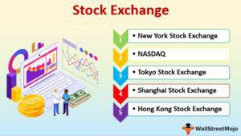

In the rapidly evolving world of finance, the integration of algorithmic trading mechanisms with Y-Share investments presents a unique opportunity for investors. Algorithmic trading, commonly referred to as algo trading, utilizes computer algorithms to execute transactions at speeds and with precision beyond human capability. This technology relies on predefined instructions to buy or sell shares, ensuring swift and efficient trade execution. Such strategies are crucial in seizing fleeting market opportunities and optimizing trade execution in the fast-paced financial markets.

On the other hand, Y-Shares refer to a type of institutional share class associated with mutual funds that offer institutional investors benefits such as lower fees. These shares are characterized by their high minimum investment thresholds and reduced fee structures, including limited or waived load charges and minimal distribution fees. Such characteristics make Y-Shares an attractive option for large-scale investors seeking cost-effective investment solutions.



The intersection of Y-Shares and algorithmic trading offers a compelling narrative within the investment space. This combination allows for innovative strategies that can enhance financial returns by combining the cost-effectiveness of Y-Shares with the precision and speed of algo trading. By automating the investment in Y-Shares through sophisticated algorithms, institutional investors can reduce transaction costs and increase the efficiency of high-volume trades.

This article will explore the relationship between these two elements, providing insights and examples to highlight their significance in contemporary finance. As financial markets continue to grow increasingly complex, leveraging such advanced techniques becomes essential for investors aiming to maximize returns and gain a strategic advantage.

## Table of Contents

## Understanding Y-Shares

Y-Shares are a specialized class of mutual fund shares primarily designed for institutional investors. These shares are particularly attractive to this category of investors due to their high minimum investment requirements and notably low expense ratios. Such characteristics make Y-Shares an appealing option for large-scale investments, where minimizing costs is crucial for maximizing net returns.

One of the significant benefits associated with Y-Shares is their reduced fee structure. Unlike other share classes, Y-Shares often come with limited or completely waived load charges, which are fees that some funds charge when you buy or sell shares. Additionally, the distribution fees for Y-Shares are generally minimal. This cost-effectiveness is especially advantageous for institutional investors who manage large funds and are keen to reduce operational expenses.

Y-Shares are predominantly available to institutional investors due to their investment parameters. However, certain retirement plans may also have access to Y-Shares. This access provides these plans the opportunity to benefit from low fees, enhancing their appeal even to non-institutional entities with substantial assets under management.

For example, the Putnam Global Equity Fund provides Y-Shares without any front-end or back-end commissions. This situation exemplifies the cost advantages that Y-Shares offer. By eliminating these commissions, investors can reinvest a greater portion of their capital, thereby enhancing their potential returns over time.

Y-Shares facilitate the mobilization of larger capital with minimal intermediary costs. This aspect is strategically invaluable for investors seeking to optimize portfolio performance. In essence, Y-Shares allow institutional investors and eligible retirement plans to leverage their financial resources efficiently, minimizing costs, and maximizing potential returns. This efficiency plays a critical role when making decisions about asset allocation and investment strategy in pursuit of financial performance optimization.

 to Algorithmic Trading

Algorithmic trading utilizes computerized systems to execute trades in financial markets based on a set of predetermined instructions. This approach reduces reliance on human traders, thereby eliminating human error and emotional decision-making biases. The execution of trades is systematic, ensuring that trades occur consistently and without deviation from the strategy, regardless of market turmoil.

Common strategies in [algorithmic trading](/wiki/algorithmic-trading) encompass trend-following, [arbitrage](/wiki/arbitrage), and portfolio rebalancing. Trend-following strategies capitalize on [momentum](/wiki/momentum) in the market by buying securities that are rising and selling those that are falling, often based on moving averages or other technical indicators. Arbitrage exploits price differentials of the same asset in different markets or forms, aiming to profit from minute discrepancies. Portfolio rebalancing involves adjusting the composition of a portfolio to maintain a desired risk level or asset allocation.

The integral role of algorithmic trading in contemporary finance stems from its ability to process high-frequency transactions, which are pivotal when the [volume](/wiki/volume-trading-strategy) and speed of trades have substantial implications for profitability. By executing trades automatically, algorithms can capitalize on transient market anomalies, optimizing trade execution before opportunities vanish.

Algorithms in trading are designed to analyze vast data sets, enabling traders to swiftly adjust to market dynamics. For instance, Python can be employed to backtest trading strategies, ensuring that the algorithm performs as intended across historical data. A simple example of a moving average crossover strategy in Python could be:

```python
import pandas as pd
import numpy as np

# Fetch historical data (this would typically come from an API or database)
data = pd.read_csv('historical_prices.csv')

# Calculate moving averages
data['SMA50'] = data['Close'].rolling(window=50).mean()
data['SMA200'] = data['Close'].rolling(window=200).mean()

# Generate buy/sell signals
data['Signal'] = 0
data['Signal'][50:] = np.where(data['SMA50'][50:] > data['SMA200'][50:], 1, 0)

# Create trading positions
data['Position'] = data['Signal'].diff()
```

This code segment demonstrates the generation of buy and sell signals based on a crossover of the short-term (50-day) and long-term (200-day) simple moving averages. The algorithmic approach ensures that trades are executed when statistically advantageous conditions are met, according to predefined criteria.

In conclusion, algorithmic trading provides a systematic and efficient way to navigate complex financial markets. By leveraging advanced technologies and data analytics, traders can achieve a high level of precision and responsiveness in their investment strategies, better positioning themselves to extract value from modern financial markets.

## Y-Share Investment Mechanisms with Algo Trading

The integration of Y-Share investments with algorithmic trading offers a groundbreaking approach to managing large portfolios, delivering both enhanced efficiency and maximized returns. With the aid of sophisticated algo trading platforms, investors can pinpoint optimal investment timings for Y-Shares by utilizing advanced data analysis tools. These platforms analyze multiple market variables and trends, allowing trades to be executed precisely when market conditions are most favorable.

The automation of Y-Share investments through algo trading brings significant advantages to institutional investors, particularly in reducing transaction costs. The process minimizes human intervention, which not only reduces the potential for costly errors but also enhances [liquidity](/wiki/liquidity-risk-premium) by facilitating high-volume trade execution seamlessly. This capability proves advantageous as it supports the rapid entry and [exit](/wiki/exit-strategy) from positions, crucial for capitalizing on transient market opportunities.

Consider a scenario where an algorithm continuously monitors the moving averages of a mutual fund's performance. It can be programmed to trigger buy or sell orders when certain conditions are met, such as when the price deviation crosses a predefined threshold. This approach helps in profiting from market fluctuations by ensuring that trades are executed at optimal moments. The moving average crossover strategy is a common example where such algorithms excel.

Moreover, algorithms can manage complex investment strategies like [statistical arbitrage](/wiki/statistical-arbitrage) and mean reversion. Statistical arbitrage involves exploiting pricing inefficiencies between correlated securities, using statistical models to predict price movements and generate profits. For instance, by leveraging historical data and statistical techniques, an algorithm might identify mispriced Y-Shares relative to other mutual fund classes, executing trades that profit from the eventual correction of these discrepancies.

Mean reversion strategies, on the other hand, are based on the premise that asset prices and historical returns eventually move back towards their long-term mean or average level. An algorithm can identify situations where Y-Shares deviate significantly from their historical average performance and initiate trades to capitalize on the expected reversion.

To implement these strategies, Python serves as an excellent choice for developing algorithms due to its robust libraries for data analysis and trading, such as Pandas for handling time series data, NumPy for numerical calculations, and libraries like TA-Lib for technical analysis:

```python
import pandas as pd
import numpy as np
import talib

# Example of moving average crossover strategy
def moving_average_crossover(dataframe, short_window=40, long_window=100):
    dataframe['short_mavg'] = dataframe['Close'].rolling(window=short_window, min_periods=1).mean()
    dataframe['long_mavg'] = dataframe['Close'].rolling(window=long_window, min_periods=1).mean()

    # Signals to buy or sell
    dataframe['signal'] = 0
    dataframe['signal'][short_window:] = np.where(
        dataframe['short_mavg'][short_window:] > dataframe['long_mavg'][short_window:], 1, -1)

    # Calculate the return
    dataframe['strategy_returns'] = dataframe['signal'].shift(1) * dataframe['returns']

    return dataframe

# Example usage
df = pd.read_csv('your_data.csv')
returns = moving_average_crossover(df)
```

The strategic use of algorithms in Y-Share investments enables investors to effectively manage and enhance their portfolios, leveraging the power of technology to optimize financial performance. This integration is a testament to the evolving landscape of investment management, driven by technological advancements and data-driven decision-making.

## Benefits and Challenges

The primary benefit of integrating Y-Shares with algorithmic trading is the substantial enhancement of cost-efficiency and transactional precision, which offers significant financial leverage. Algorithmic trading decreases the reliance on human decision-making by employing quantitative models, thereby minimizing emotional biases and variability. These models use sophisticated algorithms to execute trades at optimal times, capitalizing on market inefficiencies and fleeting opportunities. 

Despite its advantages, the development of effective algorithms poses considerable challenges. Creating these systems requires a deep understanding of both financial markets and advanced computational techniques. Significant investment in technological infrastructure is essential, as these systems need to process vast amounts of data to identify profitable trading opportunities in real-time. The complexity of programming and maintaining such infrastructures cannot be underestimated, often requiring a team of skilled IT professionals and data scientists.

Moreover, the rapidly evolving regulatory environment adds another layer of complexity. Algorithmic trading is closely monitored by financial authorities to ensure market integrity and to prevent instances of market manipulation or unfair trading practices. Consequently, investors and firms must stay informed about regulatory changes and continuously adapt their strategies to comply with new laws and guidelines. This environment necessitates ongoing monitoring and adaptation, which can be resource-intensive.

Despite these challenges, the synergy between Y-Shares and algorithmic trading represents a sophisticated strategy for maximization of returns while mitigating risks. The combination allows institutional investors to exploit low-cost investment options with the high-speed, high-precision execution that algorithmic trading offers. For investors poised to navigate the technological and regulatory complexities, this approach affords a competitive edge and represents a substantial opportunity for achieving financial success in modern markets.

## Conclusion

In conclusion, the combination of Y-Share investment mechanisms and algorithmic trading represents a powerful approach for institutional investors aiming to enhance performance in competitive markets. This strategic alignment harnesses the benefits of low-cost institutional share classes, such as Y-Shares, with the enhanced precision and speed that algorithmic trading offers. By minimizing fees and optimizing trade execution times, investors can maximize their returns and reduce costs, an essential [factor](/wiki/factor-investing) in maintaining an edge in fast-paced financial environments.

As financial markets continue to evolve, these integrated strategies are likely to gain wider acceptance, significantly impacting the future landscape of investment management. The ability to adapt quickly to changing market conditions through automated trading systems will likely be a key differentiator for successful institutional investors. This trend underscores the importance of staying informed about new technological and market developments, as these insights will be crucial in refining and adjusting investment strategies to preserve their effectiveness over time.

Overall, the fusion of Y-Shares and algorithmic trading embodies a notable advancement in the quest for financial excellence. This dynamic approach not only optimizes returns but also positions investors to leverage cutting-edge technologies for improved decision-making and market positioning.

## References & Further Reading

[1]: Agarwal, V., & Naik, N. Y. (2004). ["Risks and Portfolio Decisions Involving Hedge Funds."](https://www.jstor.org/stable/1262669) The Review of Financial Studies, 17(1), 63-98.

[2]: Aldridge, I. (2013). ["High-Frequency Trading: A Practical Guide to Algorithmic Strategies and Trading Systems."](https://www.amazon.com/High-Frequency-Trading-Practical-Algorithmic-Strategies/dp/1118343506) Wiley.

[3]: Lo, A. W., Mamaysky, H., & Wang, J. (2000). ["Foundations of Technical Analysis: Computational Algorithms, Statistical Inference, and Empirical Implementation."](https://www.cis.upenn.edu/~mkearns/teaching/cis700/lo.pdf) The Review of Financial Studies, 12(2), 343-389.

[4]: Hasbrouck, J., & Saar, G. (2013). ["Low-Latency Trading."](https://www.sciencedirect.com/science/article/abs/pii/S1386418113000165) The Review of Financial Studies, 26(9), 2599-2634.

[5]: Narang, R. K. (2013). ["Inside the Black Box: A Simple Guide to Quantitative and High-Frequency Trading."](https://onlinelibrary.wiley.com/doi/book/10.1002/9781118662717) Wiley.