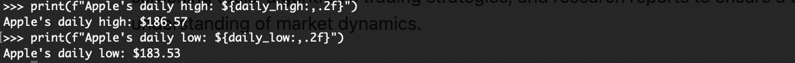

Yahoo Finance, recognized as one of the world's leading business news platforms, offers more than just news articles and stock market updates. One of its most prized features, particularly for developers and data analysts, is the Yahoo Finance API. This Application Programming Interface (API) offers a gateway to a trove of financial data, from historical stock prices to company fundamentals. For anyone involved in the finance sector, be it a hobbyist, professional, or academic researcher, having access to such a vast amount of data is invaluable.

The Yahoo Finance API serves as a bridge between your applications and Yahoo Finance data. However, like any tool or resource, its optimal utilization requires a proper understanding and skill. This guide aims to shed light on the diverse functionalities of the Yahoo Finance API, from basic access methods to intricate data retrieval techniques. We'll also explore its unique advantages, potential shortcomings. Additionally, for those seeking alternatives, we'll deep dive into other financial API platforms that can serve as worthy substitutes.

## Table of Contents

## Deep Dive: Yahoo Finance API

The Yahoo Finance API, once officially supported by Yahoo and now available through various third-party wrappers and tools, has long been the go-to solution for developers seeking financial data. It provides users with a wide range of financial data, from stock quotes to historical data, and has played a crucial role in finance-related software development over the years.

### Understanding Yahoo Finance API

At its core, the Yahoo Finance API provides an interface for retrieving financial data. This data encompasses various domains:

1. **Stock Quotes**: Real-time and historical stock prices for a multitude of global exchanges.
2. **Financial News**: Updates on companies, stocks, markets, and economies from across the globe.
3. **Historical Data**: Historical stock prices and other related metrics that allow users to analyze trends over time.
4. **Company Financials**: Data from financial statements, including income statements, balance sheets, and cash flow statements.
5. **Market Data**: Information on indices, commodities, currencies, and other key financial instruments.

This vast spectrum of data makes the Yahoo Finance API an invaluable tool for traders, investors, researchers, and developers.

### Reasons to Adopt Yahoo Finance API

Given the abundance of financial data APIs available, what makes the Yahoo Finance API stand out?

1. **Comprehensive Data Coverage**: From stocks and bonds to commodities and currencies, the API provides a diverse set of data types to meet various needs.
2. **Global Reach**: It covers multiple global exchanges, giving users a holistic view of the financial world.
3. **Historical Data Availability**: Users can access extensive historical data, vital for backtesting trading strategies and conducting financial research.
4. **Integration with Third-party Tools**: Various Python libraries, such as `yfinance` and `yahoo_fin`, provide seamless access to the Yahoo Finance API, simplifying data retrieval for developers.

### Potential Drawbacks of Yahoo Finance API

While the Yahoo Finance API is undeniably powerful, it's essential to understand its limitations:

1. **Official Support**: Yahoo officially discontinued its public finance API in 2017[1]. This means that many current methods of accessing it are through unofficial wrappers or methods, potentially leading to stability and consistency concerns.
2. **Rate Limitations**: Frequent requests can be rate-limited, restricting data retrieval if you're pulling vast amounts of data in a short period.
3. **Data Accuracy Concerns**: Some users have reported discrepancies in data, especially when comparing the API's data with other sources.
4. **Limited Advanced Financial Metrics**: Some specialized metrics available in premium financial databases might not be present in Yahoo's data.

## Financial Accessibility and Costs

One of the first questions that come to mind when considering any API is its affordability and cost structure. It's crucial to understand these aspects to ensure that the solution is sustainable for your requirements.

### Pricing Structure

Originally, Yahoo Finance offered its API as a free service, which contributed to its immense popularity among developers and researchers. However, **Yahoo discontinued this free public API** in 2017. Since then, many third-party wrappers and alternatives have sprung up, enabling access to Yahoo's financial data.

If you are looking for official, direct, and reliable access to Yahoo Finance data, Yahoo offers the **Yahoo Finance Premium** service[2]. While this service primarily targets individual investors, it comes with a cost. This premium subscription provides advanced analytics, exclusive insights, and other features that go beyond the basic free offerings on their website.

### Usability with Programming Languages

Given the popularity of **Python** in the fields of data analysis, finance, and [machine learning](/wiki/machine-learning), it's no surprise that there are several dedicated Python libraries for accessing Yahoo Finance data. Libraries like `yfinance` and `yahoo_fin` are tailored for Python and offer seamless integration, allowing for easy retrieval and manipulation of financial data.

Other languages like **JavaScript**, **Java**, **R**, and **C#** also have libraries or methods to access Yahoo Finance data, albeit with varying degrees of ease and functionality. For instance, in the R community, the `quantmod` package allows users to fetch data from Yahoo Finance among other sources. Similarly, there are npm packages for JavaScript and libraries for Java that facilitate this data access.

## Practical Tutorials: Engaging with Yahoo Finance API

### Access Platforms and Methods

Engaging with the Yahoo Finance API is simplified thanks to a variety of platforms and methods available to developers. Here, we'll explore three of the most popular approaches: RapidAPI, yfinance, and Yahoo_fin.

#### RapidAPI

[RapidAPI](https://rapidapi.com/) is a robust API marketplace that connects developers with thousands of APIs. Yahoo Finance is among the APIs available on this platform.

**Features and benefits**:

- Centralized dashboard for managing API calls.
- Enhanced analytics to monitor requests and responses.
- Streamlined integration with built-in code snippets for multiple languages.

**Steps for integration**:

1. Sign up for a free account on [RapidAPI](https://www.rapidapi.com/).
2. Navigate to the Yahoo Finance API page within the marketplace.
3. Subscribe to the API, following any associated guidelines.
4. Utilize the built-in test endpoints to initiate sample calls.
5. Incorporate the provided code snippets into your application to fetch data as needed.

#### yfinance

`yfinance` is a Python library that emerged as a response to the discontinuation of Yahoo's public API[3].

**Advantages and use cases**:

- Intuitive Pythonic interface, ideal for data analysis and machine learning tasks.
- Offers both historical and real-time data retrieval.
- Can fetch data for stocks, options, mutual funds, ETFs, and more.

**Basic commands and integration guide**:

1. Install the library using pip: `pip install yfinance`.
2. Import the library in your Python script: `import yfinance as yf  # For more datasets, visit: https://paperswithbacktest.com/datasets`.
3. To fetch data for a specific ticker: `data = yf.Ticker("AAPL")`.
4. Retrieve historical data using: `data.history(period="5d")`.
5. For real-time data, utilize: `data.info`.

#### Yahoo_fin

`Yahoo_fin` is another Python-centric module that provides methods to scrape Yahoo Finance data[4].

**Why use Yahoo_fin over others?**:

- Offers a more comprehensive scraping solution, fetching data beyond stock prices.
- Can extract fundamentals, dividend data, and even simulate web-based stock screeners.
- Capable of scraping earnings dates and analyst price targets, features not present in many alternatives.

**Steps for integration and usage**:

1. Install via pip: `pip install yahoo_fin`.
2. Import required modules: `from yahoo_fin import stock_info as si`.
3. Fetch current price of a stock: `price = si.get_live_price('AAPL')`.
4. To retrieve recent financial statements: `statements = si.get_financials('AAPL')`.

By leveraging these platforms and methods, developers can efficiently and effectively harness the vast financial data offered by Yahoo Finance. As always, it's prudent to consult the official documentation or forums for these tools for more detailed information and troubleshooting advice.

### Hands-On with yfinance

#### Installation Process

**yfinance**, originally known as **fix-yahoo-finance**, was developed as a response to Yahoo Finance's decision to decommission their historical data API in 2017. It provides a simple and reliable way to access Yahoo Finance's data using Python.

To get started, you'll need to have Python and pip already installed on your machine. Once you have those prerequisites, the installation of **yfinance** is a straightforward process. Run the following command:

```
pip install yfinance --upgrade --no-cache-dir
```

This command fetches the latest version of yfinance and ensures you're not pulling a cached older version.

After the successful installation of **yfinance**, it is recommended to patch `pandas_datareader` to seamlessly ensure compatibility:

```python
import yfinance as yf  # For more datasets, visit: https://paperswithbacktest.com/datasets
yf.pdr_override()
```

With this, you are ready to start fetching data using the `yfinance` library.

#### Understanding the Library Layout

Once **yfinance** is installed, understanding its layout and basic commands is crucial for efficient data extraction.

1. **Ticker Module**: At the heart of **yfinance** is the `Ticker` module, which allows you to access all the data Yahoo Finance offers for a given ticker.
    
    Example:
    
    ```python
    apple = yf.Ticker("AAPL")
    ```
    
    By creating a `Ticker` object like the one above, you now have access to tons of data associated with Apple Inc.
    
2. **Historical Market Data**: Once you've instantiated your ticker, you can fetch historical market data using the `history` method.
    
    Example:
    
    ```python
    apple_data = apple.history(period="5d")
    print(apple_data)
    ```
    
    
    
    This fetches the last 5 days of historical market data for Apple.
    
3. **Info Attribute**: For general information about the company, you can use the `info` attribute. It returns a dictionary containing many details like sector, fullTimeEmployees, and more.
    
    Example:
    
    ```python
    apple_info = apple.info
    print(apple_info)
    ```
    
    
    
4. **Actions Data**: To access dividends and stock splits, you can use the `actions` attribute:
    
    Example:
    
    ```python
    apple_actions = apple.actions
    print(apple_actions)
    ```
    
    
    

These are just a few commands and structures within the **yfinance** library. As you explore further, you'll find functionalities tailored for balance sheets, cashflows, sustainability, among other data points.

While **yfinance** is a powerful tool, always ensure you're adhering to Yahoo's terms of service when fetching data. And remember, while the data is comprehensive, always verify critical financial data from multiple sources when making informed decisions.

### Fetching Financial Data

#### Historical Data Retrieval

Fetching historical data is one of the primary uses of the **yfinance** library. This capability allows users to analyze trends, backtest strategies, and understand a stock's performance over time.

**Single Ticker Example:**

To fetch historical data for a single ticker, use the `history` method of the `Ticker` object. For instance, if you're interested in the last 6 months of data for Microsoft (MSFT):

```python
import yfinance as yf  # For more datasets, visit: https://paperswithbacktest.com/datasets

msft = yf.Ticker("MSFT")
msft_data = msft.history(period="6mo")
print(msft_data)
```


By default, this will give you daily data, including the open, high, low, close prices, and [volume](/wiki/volume-trading-strategy), among other details.

**Multiple Ticker Example:**

For those who need data on multiple tickers simultaneously, **yfinance** has got you covered. Instead of the `Ticker` object, use the `download` method:

```python
tickers_list = ["AAPL", "MSFT", "GOOGL"]
data = yf.download(tickers_list, start="2022-01-01", end="2023-01-01")
print(data)
```


In this example, we retrieve data for Apple, Microsoft, and Alphabet (Google) for the year 2022. The `download` method provides flexibility with the `start` and `end` parameters, allowing you to define a specific date range.

One key advantage of using **yfinance** is its efficient handling of multiple tickers, ensuring rapid and consolidated data retrieval. However, be mindful of the number of requests and the time period specified to avoid hitting any rate limits imposed by Yahoo Finance.

#### Fundamental Metrics Download

Fundamental metrics provide a lens through which investors can gauge a company's financial health and performance. While numerous metrics exist, some, like the Price to Earnings (P/E) ratio and dividends, stand out due to their wide acceptance as indicators of value and growth potential. **yfinance** offers a straightforward way to fetch these metrics.

**Price to Earnings Ratio (P/E):**

The P/E ratio is a popular metric that measures the price of a stock relative to its per-share earnings. It's used to evaluate the relative value of a company's shares.

To fetch the P/E ratio for a stock using **yfinance**:

```python
import yfinance as yf  # For more datasets, visit: https://paperswithbacktest.com/datasets

ticker = yf.Ticker("AAPL")
pe_ratio = ticker.info['forwardPE']
print(f"The forward P/E ratio for Apple is: {pe_ratio}")
```


**Dividends:**

Dividends represent a share of profit that a company distributes to its shareholders. They are an essential metric for income-focused investors.

Using **yfinance**, fetching dividend data is uncomplicated:

```python
dividends = ticker.dividends
print(dividends)
```


This command returns a Pandas DataFrame containing the historical dividend payments by the company.

**Group Fetch and Comparison:**

Often, investors want to compare fundamental metrics across a group of companies, especially when evaluating stocks within the same sector.

For a grouped fetch:

```python
companies = ["AAPL", "MSFT", "GOOGL"]
data = {company: yf.Ticker(company).info for company in companies}
pe_ratios = {company: data[company]['forwardPE'] for company in companies}

print(pe_ratios)
```


The above code fetches forward P/E ratios for Apple, Microsoft, and Alphabet, providing a direct comparison.

Using **yfinance**, investors can quickly access and compare key fundamental metrics, streamlining the process of stock evaluation and analysis. As always, while these metrics are vital, they should be part of a broader analytical toolkit, and investors are advised to incorporate diverse data sources and methodologies in their assessments.

#### Trading Data Acquisition

In the bustling world of stock markets, certain trading data points, like market capitalization, trading volume, and daily price fluctuations, are invaluable. They allow investors to gauge the size, [liquidity](/wiki/liquidity-risk-premium), and [volatility](/wiki/volatility-trading-strategies) of a particular security. Let's explore how to fetch these metrics using the **yfinance** library.

**Market Capitalization Insights:**

Market capitalization, often referred to as "market cap", reflects the total market value of a company's outstanding shares. It provides insights into the size of a company and its potential stability.

To fetch the market capitalization for a stock using **yfinance**:

```python
import yfinance as yf  # For more datasets, visit: https://paperswithbacktest.com/datasets

ticker = yf.Ticker("AAPL")
market_cap = ticker.info['marketCap']
print(f"Market Capitalization of Apple: ${market_cap:,.2f}")
```


**Volume Statistics:**

Trading volume signifies the number of shares or contracts traded in a security or an entire market during a given period. It provides insights into the liquidity and activity of a particular stock.

Fetching the trading volume for a specific day is straightforward:

```python
volume_data = ticker.history(period="1d")['Volume']
print(f"Trading volume for Apple today: {volume_data[0]:,}")
```


**Daily Highs and Lows:**

Daily highs and lows provide a snapshot of a stock's intraday price volatility. This information is especially crucial for day traders and those employing technical analysis.

To acquire the day's highest and lowest trading prices:

```python
daily_data = ticker.history(period="1d")
daily_high = daily_data['High'][0]
daily_low = daily_data['Low'][0]

print(f"Apple's daily high: ${daily_high:,.2f}")
print(f"Apple's daily low: ${daily_low:,.2f}")
```



Harnessing the **yfinance** library, you can quickly gather pivotal trading data, aiding in robust investment decisions. As these metrics are pivotal, they're commonly integrated into stock screening tools, [algorithmic trading](/wiki/algorithmic-trading) strategies, and research reports to ensure a comprehensive understanding of market dynamics.

#### Statement Data Extraction

Financial statements are fundamental in gauging a company's financial health. Thanks to the **yfinance** library, you can seamlessly extract data from Income Statements, Balance Sheets, and Cashflow Statements.

**Income Statement Insights:**

The Income Statement provides a snapshot of a company's profitability over a specific period. By assessing revenue, expenses, and net income, one can infer the company's operational efficacy.

To extract Apple's Income Statement using **yfinance**:

```python
ticker = yf.Ticker("AAPL")
income_statement = ticker.financials
print(income_statement)
```


The returned DataFrame will provide details like total revenue, cost of revenue, operating income, and more.

**Balance Sheet Metrics:**

A Balance Sheet offers a comprehensive view of a company's assets, liabilities, and shareholders' equity. It's a testament to the company's financial stability.

Fetching Apple's Balance Sheet is similar:

```python
balance_sheet = ticker.balance_sheet
print(balance_sheet)
```


The resulting DataFrame will detail current assets, long-term debt, total liabilities, and more, helping investors discern the company's asset-to-liability ratio.

**Cashflow Statement Data:**

The Cashflow Statement showcases the inflow and outflow of cash, stemming from operating, investing, and financing activities. It's pivotal in understanding the liquidity and solvency of an entity.

Extracting this statement for Apple:

```python
cashflow_data = ticker.cashflow
print(cashflow_data)
```


Here, you'll glean insights into operating cash flow, capital expenditures, free cash flow, among other metrics.

With **yfinance**, extracting these financial statements becomes a breeze. Coupled with an in-depth analysis, they empower investors to make informed decisions, allowing for a profound understanding of a company's financial standing.

#### Options Data Analysis

Options trading can offer diversified investment strategies, from hedging to leveraging. Properly analyzing options data is pivotal for a successful venture, and the **yfinance** library eases this process for traders.

**Deriving Expiration Dates:**

Before delving into specific options contracts, it's important to understand the expiration dates available. The expiration date dictates when the option contract becomes null and void.

To fetch expiration dates for Apple (AAPL) using **yfinance**:

```python
ticker = yf.Ticker("AAPL")
expiration_dates = ticker.options
print(expiration_dates)
```


This command will return a tuple of dates, giving traders a comprehensive view of all available expiration dates for the particular stock.

**Fetching Calls and Puts Data:**

Options consist of calls (buying option) and puts (selling option). Analyzing these can offer insights into market sentiment, with a predominance of calls indicating a bullish outlook and a surge in puts hinting at a bearish perspective.

For extracting Apple's calls and puts for a specific expiration date:

```python
opt = ticker.option_chain('yyyy-mm-dd') # Replace 'yyyy-mm-dd' with a specific expiration date.
calls_data = opt.calls
puts_data = opt.puts
print(calls_data, puts_data)
```

The `opt.calls` DataFrame provides details like strike prices, last trade date, open interest, and implied volatility for call options. Similarly, `opt.puts` outlines the same metrics for put options.

Through **yfinance**, traders can efficiently explore options data, providing them with actionable insights and allowing them to respond swiftly to market dynamics.

## Beyond Yahoo: Exploring Other Financial API Platforms

### Alpha Vantage

[Alpha Vantage](https://www.alphavantage.co/) stands out as one of the premier alternatives to Yahoo's Finance API, especially for developers and financial market enthusiasts who demand a wide array of data types, from stock time series to forex data and even cryptocurrency analytics.

**Features**:

1. **Time Series Data**: Alpha Vantage provides intraday time series data ranging from 1-minute to monthly intervals, with up to 20 years of historical data.
2. **Foreign Exchange Rates**: The platform covers real-time and historical forex rates, beneficial for international businesses and forex traders.
3. **Cryptocurrency**: Alpha Vantage offers real-time and historical pricing data on a comprehensive range of cryptocurrencies.
4. **Technical Indicators**: Over 50 technical indicators are available, serving algorithmic traders and researchers extensively.
5. **Sector Performance Analysis**: For those looking at macro-level market trends, Alpha Vantage provides breakdowns of sector performances.

**Benefits**:

- **Broad Coverage**: From stocks to forex, and even cryptocurrencies, Alpha Vantage delivers a comprehensive suite of financial data.
- **Easy Integration**: The API is well-documented and supports multiple programming languages, making integration smooth for developers.
- **Affordability**: While there is a free tier with limited access, the paid plans are competitively priced, offering a strong value proposition for businesses and independent users alike.

**Comparison with Yahoo**:

1. **Data Diversity**: While Yahoo Finance primarily focuses on stock market data, Alpha Vantage diversifies its offerings with forex and cryptocurrency data, catering to a broader audience.
2. **Technical Indicators**: Alpha Vantage's rich set of technical indicators is a boon for algorithmic traders, a feature that's more limited on the Yahoo platform.
3. **Data Limitations**: Yahoo Finance has faced issues with data accuracy and reliability in the past, while Alpha Vantage maintains a strong reputation for data quality.
4. **Pricing**: Yahoo Finance API's premium versions can be expensive for individual users. In contrast, Alpha Vantage offers a more accessible pricing structure, even including a free tier with reasonable limits.

In conclusion, while both Yahoo Finance and Alpha Vantage offer robust platforms for financial data, the choice between them boils down to specific needs. For those wanting a wider range of data types, especially [cryptocurrency](/wiki/cryptocurrency) and [forex](/wiki/forex-system), alongside stock market data, Alpha Vantage presents an enticing proposition.

### Polygon

[Polygon](https://polygon.io/) is a multifaceted platform offering real-time and historic market data from various exchanges. Built primarily for developers and traders, it stands as a robust alternative to traditional market data feeds and is often compared with Yahoo Finance API for its data quality and breadth of coverage.

**Overview**:

Polygon operates on the mantra of providing "only the data you need." With access to over 15 exchanges and a treasure trove of financial data, the platform is a paradise for those seeking a comprehensive market overview. It provides real-time stock data, historic trading data, real-time news, and various other market indicators.

**Differentiation Points**:

1. **Coverage Breadth**: Polygon's suite of data extends beyond just equities. The platform covers commodities, forex, crypto, and more, providing a more holistic view of the financial markets.
2. **Real-Time News Stream**: Keeping abreast with market-moving news is crucial. Polygon offers real-time news updates, which can be crucial for algorithmic traders and those looking to stay ahead of market trends.
3. **Granularity and Depth**: With tick-by-tick historical trade data, Polygon offers granular insights into market movements, a feature that quantitative researchers and traders will find invaluable.
4. **WebSocket Support**: For those needing real-time data streaming, Polygon provides WebSocket access, ensuring low latency data delivery, a boon for day traders and high-frequency trading setups.
5. **Aggregations**: Polygon allows users to view aggregated market data, such as OHLCV (Open, High, Low, Close, Volume) over various time frames, providing both macro and micro views of market trends.
6. **Cost-Effective**: Polygon operates on a tiered pricing model, ensuring that both individual investors and larger institutions find a plan that suits their needs, making it an attractive proposition compared to some pricier alternatives.
7. **Data Accuracy and Reliability**: In the world of financial data, accuracy is paramount. Polygon prides itself on its data quality and uptime, ensuring users receive accurate, consistent, and reliable data feeds.

For those moving beyond Yahoo Finance and looking for a data-rich platform that offers extensive market coverage, granular data insights, and a cost-effective solution, Polygon certainly stakes its claim as one of the top contenders.

### IEX

[IEX](https://iexcloud.io/), or the Investors Exchange, is more than just a stock exchange. It also provides an array of developer-friendly tools and data services through its IEX Cloud platform. When considering alternatives to Yahoo Finance API, IEX's offerings are noteworthy for several key reasons.

**Transparency**: At its core, IEX was founded on principles of transparency, aiming to eliminate predatory trading behaviors prevalent in many electronic exchanges. This transparency extends to its data services, ensuring that users get clean, unbiased, and accurate financial data.

**Comprehensive Data Sets**: IEX Cloud offers extensive datasets ranging from historical stock prices to real-time quotes, and even more advanced metrics such as social sentiment. This variety ensures that both casual investors and advanced traders find the data they need.

**Cost-Effective Tiers**: IEX Cloud operates on a freemium model. This means that developers can start with a free tier and only upgrade as their data needs grow. This flexibility in pricing makes it an attractive option for startups and individual developers.

**Ease of Use**: IEX Cloud's API is designed with simplicity in mind. With clear documentation and straightforward endpoints, even novice developers can easily integrate IEX data into their applications.

**Data Ethics**: In an era where data resale is common, IEX stands out for its commitment to user privacy. It ensures that user queries and data requests are not resold or used for advertising, prioritizing user trust.

**Speed and Efficiency**: Recognizing the importance of timely data in the financial world, IEX Cloud ensures quick data retrieval, making it a go-to choice for real-time applications.

**Robust Documentation and Community**: IEX Cloud boasts a comprehensive documentation that facilitates smooth integration. Additionally, its active community provides support, shares insights, and offers solutions to common challenges.

For those in search of a reliable, transparent, and developer-friendly financial data platform, IEX offers a compelling package that makes it a standout contender in the crowded market data space.

## Yahoo's Decision: Understanding the 2017 Decommissioning

In 2017, Yahoo made the significant decision to decommission its free Finance API, a service that had been widely used by financial analysts, developers, and hobbyists alike for nearly a decade. The move was met with considerable consternation, given the API's widespread adoption and the suddenness of the decision.

**Reasoning Behind the Decision**

Yahoo didn't provide an exhaustive official statement on the rationale behind the discontinuation. However, several [factor](/wiki/factor-investing)s can be inferred:

1. **Monetization Challenges**: As with many free services, monetizing the Finance API might have proved challenging for Yahoo. Over time, the cost of maintenance, infrastructure, and data licensing likely outweighed the direct financial benefits.
2. **Data Licensing Issues**: Companies often have to pay to source quality financial data, and by providing it freely or at a very low cost, Yahoo may have faced challenges justifying the cost.
3. **Shift in Strategic Priorities**: In 2016, Yahoo was acquired by Verizon, and this corporate restructuring might have led to a reevaluation of product offerings and a pivot towards more profitable ventures.
4. **Misuse & Over-reliance**: The ease of access to Yahoo's Finance API meant it was often overutilized, leading to potential server overloads and misuse, both of which could strain Yahoo's resources.

**Implications for Users and Developers**

The decommissioning left a significant void in the market:

1. **Immediate Disruption**: Many developers and businesses faced immediate challenges as applications and models relying on the API stopped working.
2. **Search for Alternatives**: The discontinuation propelled users to seek out alternatives. Some migrated to paid services, while others turned to free or open-source alternatives, albeit with potential compromises in data breadth or quality.
3. **Cost Implications**: Those who relied on Yahoo's free API for financial data were now compelled to factor in new costs. While several alternatives exist, few match the depth, breadth, and cost-free nature of Yahoo's offering.
4. **Trust Issues**: The abruptness of the decision, coupled with the absence of significant prior notice, made some users wary of overly relying on third-party platforms for crucial data, fearing potential abrupt changes in the future.

In conclusion, while Yahoo's decision to decommission its Finance API was likely driven by a mix of economic, strategic, and logistical factors, it underscored the importance of adaptability and contingency planning in the rapidly-evolving digital landscape.

## Best Practices & Recommendations

Engaging with financial data APIs, like Yahoo Finance's, requires a blend of technical proficiency and financial acumen. But even experts can find themselves stumbling if they don't adhere to some fundamental best practices. Here's a distilled list of recommendations to ensure you get the most out of the Yahoo Finance API and sidestep common pitfalls:

**Optimizing Your Experience with Yahoo Finance API**

1. **Rate Limits Adherence**: Always be aware of rate limits when making API calls. Frequent and excessive requests can lead to your IP being temporarily blocked. Instead, space out your calls, especially when fetching data for multiple tickers or long date ranges.
2. **Error Handling**: Implement robust error handling in your scripts. APIs might occasionally return incomplete data or encounter downtime. Always check the status of the response and handle errors gracefully.
3. **Data Validation**: Cross-reference the data fetched with other reliable sources. While the Yahoo Finance API is reputable, discrepancies can occasionally arise. It's a good habit to validate critical financial data points.
4. **Use Official Libraries**: When available, utilize official or widely-recognized third-party libraries for the API. They usually handle many intricacies and can simplify the data retrieval process.
5. **Stay Updated**: APIs evolve, with new features getting introduced and old ones deprecated. Regularly check for updates or announcements related to the Yahoo Finance API to ensure your integrations remain functional.

**Pitfalls to Avoid**

1. **Over-reliance on a Single Source**: Yahoo Finance API is a robust tool, but it shouldn't be your only source for financial data. Diversifying your data sources can protect you against potential inaccuracies or downtimes.
2. **Ignoring Data Limits**: Remember that while some aspects of the API might be free, excessive data fetches can result in additional charges or throttling. Understand the limits and stay within them.
3. **Not Testing Regularly**: Even if your system is running smoothly, regularly test your API integrations. This practice will help you quickly detect and resolve issues, ensuring continuous access to the data you need.
4. **Avoid Hardcoding Parameters**: Whether it's ticker symbols or date ranges, avoid hardcoding these values in your scripts. Instead, use dynamic variables or user inputs, which will make your integrations more flexible and reduce the need for frequent code modifications.

In financial data, precision and reliability are paramount. By following these best practices and being wary of potential pitfalls, you can make the most of the Yahoo Finance API and ensure your endeavors, whether investment or analytical, are built on a robust foundation.

## Conclusion

Navigating the intricate world of financial data can be daunting, but tools like the Yahoo Finance API have made it considerably more accessible. From our exploration, we discerned the significant advantages of using the Yahoo Finance API, from its unique features and benefits to its integration capabilities, particularly with Python. While it offers an array of data retrieval options—historical data, fundamental metrics, trading data, statement data, and options analysis—users should be aware of its limitations and the occasional hidden costs.

For those looking beyond Yahoo, platforms like Alpha Vantage, Polygon, and IEX offer alternative solutions, each with its distinct strengths. It's imperative to remember the 2017 decommissioning of Yahoo's public API. The event underlines the importance of flexibility and adaptability when building systems reliant on external services.

Making the most of the Yahoo Finance API, or any financial data tool, means understanding its functionalities in-depth, staying updated, and most crucially, adopting best practices. This not only ensures the accuracy and reliability of your data but also enhances your overall experience.

As with all decisions in finance and technology, be informed. Take the knowledge gleaned from this guide, apply it with discernment, and empower your financial projects, be they for investment, analysis, or development. Remember, the right tools, combined with the right approach, can lead to transformative results. Choose wisely and stay data-informed.

## Frequently Asked Questions

**What is the Yahoo Finance API?**

The Yahoo Finance API is a service that provides access to stock market data, including stock quotes, financial news, and historical stock market data.

**Is the Yahoo Finance API free?**

While there are free endpoints, Yahoo also offers premium tiers with increased request rates and additional features. It's crucial to check their official documentation for the most updated pricing details.

**How do I integrate Yahoo Finance API with Python?**

Libraries such as `yfinance` and `Yahoo_fin` simplify the process. By installing these libraries, you can seamlessly fetch data with minimal lines of code. Various tutorials are available that provide step-by-step instructions.

**Can I access historical data using the Yahoo Finance API?**

Yes, the API allows users to retrieve historical stock data, including daily prices, volume, and more.

**Are there rate limits for the Yahoo Finance API?**

Rate limits vary based on the subscription tier. Free users typically face stricter limits than premium subscribers. Always refer to Yahoo's official documentation to get the most current rate limits.

**Why was the public Yahoo Finance API decommissioned in 2017?**

Yahoo decided to decommission the public API due to its heavy usage, which impacted their infrastructure. The move also aligned with their business strategy to monetize the service.

**Are there other alternatives to the Yahoo Finance API?**

Definitely! Platforms such as Alpha Vantage, Polygon, and IEX offer varying features and capabilities as alternatives to Yahoo Finance.

**Does the API only support stock market data?**

While stock market data is a primary feature, the Yahoo Finance API also offers insights into other financial instruments, including options, commodities, and forex data.

**How reliable is the data from the Yahoo Finance API?**

While Yahoo Finance is a reputable source, it's always recommended to cross-reference data from multiple sources, especially when making crucial financial decisions.

**Are there limitations to the kind of financial metrics I can retrieve?**

The Yahoo Finance API offers a broad range of financial metrics. However, availability might vary based on the stock or financial instrument in question. It's always good practice to refer to the official documentation or use the API's querying capabilities to ascertain specific metric availability.

## References & Further Reading

[1]: [Yahoo's Official Announcement on API Decommissioning](https://yahoo.uservoice.com/forums/382977-finance/suggestions/19382118-restore-the-access-to-the-api)

[2]: [Yahoo Finance Premium](https://finance.yahoo.com/premium)

[3]: [yfinance GitHub Repository](https://github.com/ranaroussi/yfinance)

[4]: [Yahoo_fin Documentation](http://theautomatic.net/yahoo_fin-documentation/)