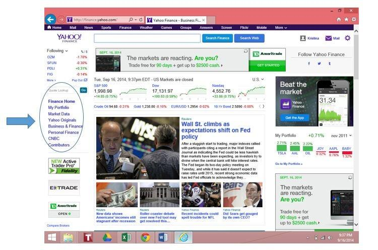

Algorithmic trading, often referred to as algo trading, involves using computer programs to trade financial securities at speeds and frequencies beyond the capacity of human traders. It relies on a set of instructions — an algorithm — to make trading decisions based on predefined rules or models, enabling traders to optimize profits and manage risks with precision. Central to the success of algorithmic trading is access to high-quality financial data, which forms the backbone of any trading model and strategy. The accuracy, timeliness, and comprehensiveness of such data can critically impact the performance of trading algorithms.

Yahoo Finance is widely recognized as a robust platform for accessing a vast array of financial data. Established as a comprehensive resource for both retail and institutional investors, Yahoo Finance provides data on stock prices, currency rates, commodity prices, economic indicators, and business news. The platform's extensive database includes historical financial data, real-time market quotes, and key statistics, making it an invaluable resource for traders looking to analyze market trends and make informed trading decisions. Although the official Yahoo Finance API was discontinued in 2017, various unofficial solutions continue to provide valuable access to its data, serving as a cornerstone for many in the financial community.



The objective of this article is to explore the use of Yahoo Finance in algorithmic trading. By examining how traders can leverage Yahoo Finance's offerings, the article aims to showcase its potential in supporting algorithm development, data retrieval, and strategy optimization. Our focus will include understanding the mechanisms to access Yahoo Finance data, the benefits and challenges inherent in its use, and how it stands against other contemporaneous data sources. This analysis will provide a comprehensive overview for traders seeking to integrate Yahoo Finance data into their algorithmic trading strategies.

## Table of Contents

## Understanding Yahoo Finance and its API

Yahoo Finance is a widely-used financial platform that provides a range of financial news, data, and analytical tools for traders, investors, and financial professionals. The platform is particularly popular for offering free access to a vast array of financial data, including stock quotes, historical price charts, company financials, and economic data. Yahoo Finance is a go-to source for many individuals and institutions interested in the financial markets, as it not only aggregates data from various sources but also provides insights and analysis that assist in making informed trading decisions.

Yahoo Finance's data has traditionally been accessible through an API, allowing developers to programmatically retrieve financial information for various purposes, including creating trading algorithms and financial applications. The Yahoo Finance API initially provided a structured and convenient way to access a comprehensive set of financial data. However, in 2017, Yahoo officially discontinued its public API service, which prompted the development of several unofficial workarounds to meet the ongoing demand for Yahoo Finance's data.

Following the shutdown of the official API, developers turned to unofficial alternatives that relied on techniques such as web scraping and leveraging the existing Yahoo Finance website endpoints. Popular unofficial alternatives include the open-source libraries like `yfinance`, `yahoo_fin`, and services like RapidAPI. These solutions enable users to pull a wide range of financial data from Yahoo Finance, albeit with some increasingly common limitations and challenges typical of unofficial setups. 

Unofficial APIs generally scrape data directly from the Yahoo Finance website or reconstruct API-like endpoints using reverse engineering. This method can be fragile, as the underlying web structure can change without notice, leading to potential breaks in data retrieval. Despite this, these tools remain popular due to their relative ease of use and the comprehensive nature of the data they can access. Moreover, these unofficial APIs often capture a wide scope of financial information, such as historical stock prices, real-time data, and company financials, which supports various [algorithmic trading](/wiki/algorithmic-trading) strategies and models. 

The discontinuation of Yahoo's official API reinforced the importance of adaptable and resilient data retrieval methods in financial analytics, creating an area where unofficial APIs, while helpful, come with their own set of risks and considerations.

## Benefits of Using Yahoo Finance for Algo Trading

Yahoo Finance stands out as a popular resource for algorithmic traders due to its extensive range of freely accessible financial data. The platform covers a comprehensive array of financial information, such as historical price data, real-time quotes, financial news, and insights into financial statements. This breadth of information is particularly appealing to traders who seek diverse data sets to develop and enhance their trading algorithms without incurring additional costs.

One of the enticing aspects of using Yahoo Finance for algorithmic trading is the ease of setting it up, making it suitable for beginners. Given its user-friendly interface, even those with limited experience can quickly familiarize themselves with the platform's functionalities. The simplified access to financial data allows aspiring algo traders to focus on developing their trading strategies without getting bogged down by complex data retrieval processes.

Additionally, the convenience of the Yahoo Finance API plays a significant role in its appeal for quick data retrieval. Although the official API was discontinued in 2017, unofficial alternatives, such as the `yfinance` Python library, have filled the gap, offering seamless access to Yahoo Finance data. By using the `yfinance` library, traders can effortlessly fetch financial data with minimal programming knowledge. Here is a brief example of how to use `yfinance` in Python to retrieve historical stock data:

```python
import yfinance as yf

# Fetch historical data for a specific ticker
ticker = "AAPL"
data = yf.download(ticker, start="2020-01-01", end="2023-01-01")

print(data.head())
```

This snippet demonstrates the simplicity with which traders can acquire historical stock data, thereby minimizing the technical barriers to entry. By facilitating uncomplicated and expedient access to comprehensive datasets, Yahoo Finance empowers algorithmic traders to craft and refine their trading models efficiently.

Overall, these features underscore why Yahoo Finance remains an attractive choice for traders, especially those seeking a cost-effective, beginner-friendly solution for algorithmic trading in the financial markets.

## Limitations and Challenges

Unofficial Yahoo Finance APIs, while widely utilized, present several limitations and challenges that traders need to consider. Firstly, these APIs often rely heavily on web scraping techniques to extract data from Yahoo Finance’s web pages. Web scraping inherently poses issues of fragility, as any change or update to Yahoo Finance's website structure could disrupt the functionality of the scraping scripts. This dependence on a stable website format makes the data retrieval process vulnerable, requiring continuous maintenance and updates to ensure accuracy and functionality.

Moreover, the unofficial status of these APIs means they operate without the official endorsement or support from Yahoo Finance. This absence of official backing increases the risk of API interruptions. Since developers rely on publicly available web data, any modifications in Yahoo’s terms of service or access restrictions could lead to sudden stoppages in data flow. Such interruptions directly affect trading operations that depend on timely and reliable data, potentially causing lapses in trading activities or errors in algorithmic evaluations.

Another significant concern is the potential for data inconsistencies. Without official maintenance, there is no guarantee of data accuracy or completeness. Discrepancies in data can adversely impact algorithmic trading where precision is crucial for decision-making processes. Traders might encounter mismatches in historical pricing, delayed updates, or even erroneous data entries, leading to incorrect market assessments and, consequently, flawed trading strategies.

In summary, while unofficial Yahoo Finance APIs provide free access to a wealth of financial data, their reliance on web scraping makes them prone to disruption, and their lack of official support introduces risks of data interruptions and inconsistencies. Traders should carefully weigh these limitations against the benefits when integrating these APIs into their trading systems.

## How to Access Yahoo Finance Data for Trading

Accessing Yahoo Finance data for trading involves utilizing a variety of methods and libraries that facilitate the retrieval of financial information programmatically. Below, we explore several popular approaches, including RapidAPI, yfinance, and yahoo_fin, and offer guidance on setting these up in Python to access different types of data such as historical prices, fundamental metrics, and real-time trading information.

### RapidAPI

RapidAPI offers a platform where developers can find and connect to thousands of APIs, including an unofficial Yahoo Finance API. To use RapidAPI for accessing Yahoo Finance data, follow these steps:

1. **Sign Up on RapidAPI:** Create an account on [RapidAPI's website](https://rapidapi.com/).
2. **Subscribe to the Yahoo Finance API:** Navigate to the Yahoo Finance API on RapidAPI and subscribe to it. Ensure you understand the pricing tier you select, as there might be limits on data retrieval.
3. **Install Requests Library:** Use Python's requests library to interact with the API. Install it via pip if it's not already available:

   ```bash
   pip install requests
   ```

4. **Fetch Data:** Use Python to send requests and access financial data:

   ```python
   import requests

   url = "https://apidojo-yahoo-finance-v1.p.rapidapi.com/stock/v2/get-summary"
   querystring = {"symbol":"AAPL"}
   headers = {
       "X-RapidAPI-Key": "YOUR_RAPIDAPI_KEY",
       "X-RapidAPI-Host": "apidojo-yahoo-finance-v1.p.rapidapi.com"
   }

   response = requests.get(url, headers=headers, params=querystring)
   data = response.json()
   print(data)
   ```

### yfinance Library

The `yfinance` library is a popular Python module that acts as a wrapper around Yahoo Finance. It simplifies data retrieval and provides easy access to a wide range of financial data.

1. **Installation:** Install the yfinance library using pip:

   ```bash
   pip install yfinance
   ```

2. **Retrieve Historical Data:** Use yfinance to download historical data easily:

   ```python
   import yfinance as yf

   # Download historical data for Apple (AAPL)
   aapl = yf.Ticker("AAPL")
   historical_data = aapl.history(period="1mo")
   print(historical_data)
   ```

3. **Accessing Fundamental Data:** You can also access fundamental data including company financials:

   ```python
   # Get fundamental data for Apple (AAPL)
   financials = aapl.financials
   print(financials)
   ```

### yahoo_fin Library

The `yahoo_fin` library provides tools to scrape public data from Yahoo Finance. It is another option for accessing financial data in Python.

1. **Installation:** Use pip to install the yahoo_fin package:

   ```bash
   pip install yahoo_fin
   ```

2. **Retrieve Stock Price:** Use yahoo_fin to access stock price history:

   ```python
   from yahoo_fin import stock_info as si

   # Get historical data for Apple (AAPL)
   historical_prices = si.get_data("AAPL", start_date="2022-01-01", end_date="2022-01-31")
   print(historical_prices)
   ```

3. **Accessing Trading Data:** You can also fetch real-time trading data with yahoo_fin:

   ```python
   # Get current stock price for Apple (AAPL)
   current_price = si.get_live_price("AAPL")
   print(current_price)
   ```

These methods provide a robust toolkit for traders and developers to harness Yahoo Finance data, tailoring solutions to individual needs. The simplicity and accessibility of these libraries make them excellent choices for integrating financial data into trading algorithms and analyses.

## Practical Application in Algo Trading

Yahoo Finance data is instrumental in developing trading algorithms, offering a wealth of information that ranges from historical prices to real-time market quotes. This data is crucial for creating robust trading models that can analyze market conditions and make informed trading decisions. 

### Integration of Financial Indicators and Market Data

Yahoo Finance provides access to a broad array of financial indicators such as moving averages, [volume](/wiki/volume-trading-strategy) data, and [momentum](/wiki/momentum) indicators, which are fundamental in technical analysis. By integrating these indicators into trading algorithms, traders can identify patterns and potential entry and [exit](/wiki/exit-strategy) points. For example, a simple moving average (SMA) crossover strategy, where a short-term SMA crosses a long-term SMA, can be implemented to signal buy or sell orders. 

Python, a popular language for algorithmic trading, offers libraries such as `pandas` and `numpy` to facilitate data manipulation and analysis. The following Python snippet demonstrates how to calculate a 50-day and 200-day SMA using Yahoo Finance data:

```python
import yfinance as yf

# Fetch historical data
data = yf.download('AAPL', start='2022-01-01', end='2023-01-01')

# Calculate SMAs
data['SMA_50'] = data['Close'].rolling(window=50).mean()
data['SMA_200'] = data['Close'].rolling(window=200).mean()

# Determine crossover points
data['Signal'] = 0
data['Signal'][50:] = np.where(data['SMA_50'][50:] > data['SMA_200'][50:], 1, 0)
data['Position'] = data['Signal'].diff()
```

### Considerations for Backtesting and Validating Trading Strategies

Once a trading algorithm incorporates relevant financial indicators and market data, [backtesting](/wiki/backtesting) becomes a critical step. Backtesting involves applying the trading strategy to historical data to evaluate its performance without risking actual capital. Yahoo Finance's extensive archives make it a valuable resource for conducting thorough backtests. 

Key considerations during backtesting include transaction costs, market impact, and execution speed, which can significantly affect strategy performance. Additionally, using Yahoo Finance data for backtesting requires attention to split and dividend adjustments to ensure accuracy.

Validating trading strategies involves statistical performance metrics such as the Sharpe ratio, maximum drawdown, and win-loss ratio. The Sharpe ratio, for example, measures risk-adjusted returns and is defined as:

$$
\text{Sharpe Ratio} = \frac{{\text{Average Return} - \text{Risk-Free Rate}}}{{\text{Standard Deviation of Returns}}}
$$

By employing these metrics, traders can assess the viability and reliability of their strategies.

Yahoo Finance data, with its comprehensive financial information and ease of integration, serves as a foundation for developing, backtesting, and validating trading algorithms. It enables traders to harness historical and real-time data effectively, paving the way for successful algorithmic trading endeavors.

## Alternatives to Yahoo Finance for Algo Trading

When exploring alternatives to Yahoo Finance for accessing financial data, several notable platforms offer robust features and diverse data sets that cater to the needs of algorithmic traders. Three popular alternatives are Alpha Vantage, Polygon, and IEX Cloud. Each of these services provides unique benefits and may be preferred by traders depending on their specific requirements.

**Alpha Vantage** offers a wide range of financial data, including real-time and historical data, technical indicators, and foreign exchange rates. With a comprehensive set of APIs, it is particularly favored for its ease of integration into trading algorithms. One of the advantages of using Alpha Vantage is its affordability, as it offers free tiers with sufficient capabilities for retail traders and flexible payment plans for advanced features. Additionally, Alpha Vantage is notable for its extensive community support, which includes libraries in various programming languages to help streamline data access and analysis.

**Polygon**, another leading alternative, is highly regarded for its real-time, high-frequency trading data, which is critical for traders looking to deploy algorithmic strategies in fast-paced markets. Polygon provides an impressive array of data types, such as tick-level trades, quotes, and aggregates, catering to both equity and cryptocurrency markets. Its premium services are tailored for institutional traders and high-frequency trading applications, emphasizing speed and data granularity. Consequently, Polygon becomes an ideal choice for traders focused on real-time performance analysis and execution.

**IEX Cloud** positions itself as a versatile platform by combining high-quality data with robust integration tools. Known for offering free access to its core data, IEX Cloud supports trading strategies that require a blend of fundamental and technical analyses with its wide range of endpoints. The platform's emphasis on transparency and its reputation for delivering accurate data make it a favored option for traders placing a premium on data integrity. IEX Cloud's flexible pricing models allow users to customize their subscriptions based on usage, making it an attractive option for traders with varying data needs.

Traders might choose these alternatives over Yahoo Finance for several reasons. Alpha Vantage may be preferred for its comprehensive technical indicators and low-cost entry, which are advantageous for retail traders seeking budget-friendly solutions. Polygon is particularly appealing for those requiring detailed real-time data for high-frequency trading strategies. Meanwhile, IEX Cloud's transparency and customization in data access make it suitable for traders who prioritize data accuracy and flexibility.

Overall, when selecting a platform for algorithmic trading, traders should consider their specific strategy requirements, including data type, real-time needs, and budget constraints. The choice of a data provider can significantly impact the effectiveness of an algorithmic trading strategy, making it essential to evaluate each alternative's features and offerings carefully.

## Future of Yahoo Finance in Algo Trading

The landscape of financial data access through Yahoo Finance is expected to evolve with technological advancements and market demands. As algorithmic trading continues to grow, the demand for robust, reliable, and comprehensive financial data sources will likely increase. While Yahoo Finance's official API was discontinued in 2017, unofficial methods have filled the void, with developers using web scraping and third-party libraries to access data. However, the potential re-emergence of an official Yahoo Finance API or improvements in data access methods could significantly impact the algorithmic trading community.

One potential change is the introduction of a more structured, reliable, and officially supported API by Yahoo Finance. This move would be in response to the ever-growing necessity for real-time data, high-frequency trading, and the integration of advanced [machine learning](/wiki/machine-learning) models in trading strategies. Access to an official, real-time data API could minimize the current issues faced by traders utilizing web scraping techniques, such as data inconsistencies and the risk of legal implications.

Moreover, Yahoo's strategies could involve partnerships with financial technology companies to enhance data accessibility, providing traders with advanced analytics, comprehensive datasets, and historical market trends. This could empower traders by offering a one-stop solution that combines data retrieval and analysis within Yahoo's ecosystem.

For developers, evolving data access methods may provide opportunities to create innovative tools that integrate Yahoo Finance data more seamlessly into trading platforms and algorithms. These tools might leverage [artificial intelligence](/wiki/ai-artificial-intelligence) to analyze datasets more effectively, offering traders predictive analytics and deeper market insights. Enhanced APIs could also facilitate the development of more complex trading strategies by providing enriched datasets, including sentiment analysis and [alternative data](/wiki/best-alternative-data) sources, thus giving traders a competitive advantage.

Additionally, advancements in cloud computing and data processing could allow Yahoo Finance to offer data-as-a-service (DaaS) solutions, enabling traders to execute algorithms in the cloud, reducing latency and hardware dependency.

Such developments would not only align Yahoo Finance with current market needs but also ensure its relevance in the continually evolving sector of algorithmic trading, opening up new possibilities for developers and traders striving for superior data-driven trading strategies.

## Conclusion

In conclusion, Yahoo Finance stands out as a valuable resource for individuals engaged in algorithmic trading, particularly due to its extensive data offerings and accessible interfaces. The platform provides comprehensive financial data that is crucial for the development and refinement of trading algorithms. Despite the discontinuation of the official Yahoo Finance API in 2017, developers can still leverage unofficial alternatives such as RapidAPI, yfinance, and yahoo_fin libraries to access real-time and historical data. This accessibility is particularly beneficial for beginners, allowing them to quickly and efficiently retrieve the necessary data for their trading models.

While Yahoo Finance offers significant advantages, there are inherent challenges associated with using unofficial APIs, such as potential data inconsistencies and the fragility associated with web scraping techniques. These limitations underline the importance of selecting a stable and reliable data source tailored to specific trading needs. Alternatives like Alpha Vantage, Polygon, and IEX provide diverse features that may cater to different aspects of a trader’s requirements, offering robust support and various data options.

Ultimately, the choice of a financial data source should align with the trader's particular objectives, strategies, and risk tolerance. By carefully evaluating the benefits and limitations of each platform, traders can effectively harness these resources to enhance their algorithmic trading capabilities and achieve their financial goals.

## References & Further Reading

[1]: ["Yahoo Finance API (Unofficial) Documentation"](https://algotrading101.com/learn/yahoo-finance-api-guide/)

[2]: ["yfinance - an open-source library for accessing Yahoo Finance data"](https://algotrading101.com/learn/yfinance-guide/)

[3]: ["RapidAPI's Yahoo Finance API"](https://rapidapi.com/blog/blog/how-to-use-the-yahoo-finance-api/)

[4]: Lopez de Prado, M. (2018). ["Advances in Financial Machine Learning."](https://books.google.com/books/about/Advances_in_Financial_Machine_Learning.html?id=oU9KDwAAQBAJ) Wiley.

[5]: Chan, E. P. (2009). ["Quantitative Trading: How to Build Your Own Algorithmic Trading Business."](https://github.com/ftvision/quant_trading_echan_book) Wiley.

[6]: ["Alpha Vantage API Documentation"](https://www.alphavantage.co/documentation/)

[7]: ["Polygon.io Documentation"](https://polygon.io/docs/stocks)

[8]: ["IEX Cloud API Documentation"](https://iexcloud.io/docs/core/fundamentals)

[9]: Jansen, S. (2018). ["Machine Learning for Algorithmic Trading."](https://www.amazon.com/Hands-Machine-Learning-Algorithmic-Trading/dp/178934641X) Packt Publishing.

[10]: Aronson, D. R. (2006). ["Evidence-Based Technical Analysis: Applying the Scientific Method and Statistical Inference to Trading Signals."](https://www.amazon.com/Evidence-Based-Technical-Analysis-Scientific-Statistical/dp/0470008741) Wiley.