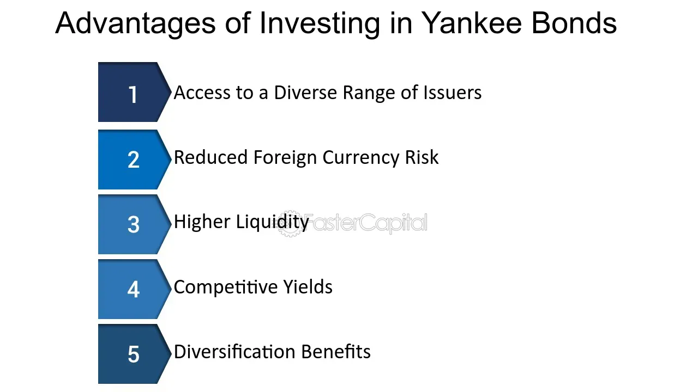

## Table of Contents

## What is a Yankee Bond?

A Yankee Bond is a type of bond that is issued by a foreign company or government in the United States. These bonds are denominated in U.S. dollars, which means they are priced and paid back in U.S. currency. The term "Yankee" refers to the fact that these bonds are sold to American investors, even though they are issued by non-U.S. entities.

Yankee Bonds are attractive to foreign issuers because they can tap into the large and liquid U.S. bond market. This allows them to raise capital from American investors. For U.S. investors, Yankee Bonds offer a way to diversify their investment portfolios by adding foreign securities. However, these bonds come with additional risks, such as currency risk and political risk, which investors need to consider before investing.

## How does a Yankee Bond function?

A Yankee Bond works like any other bond but is issued by a foreign company or government in the U.S. It's sold in U.S. dollars, which means both the price and the payments are in dollars. When a foreign issuer wants to raise money, they can issue a Yankee Bond to attract American investors. These investors buy the bond and, in return, get regular interest payments until the bond matures. At maturity, the issuer pays back the principal amount to the investors.

Yankee Bonds are useful because they allow foreign issuers to access the large U.S. market. This can be a good way for them to get more money than they might in their home country. For U.S. investors, buying Yankee Bonds is a way to invest in foreign companies or governments without dealing with foreign currencies directly. However, there are risks involved. If the foreign issuer's country has political problems or economic issues, it could affect the bond's value. Also, since the bond is in U.S. dollars, changes in the value of the foreign issuer's currency can impact the bond's performance.

## Who can issue a Yankee Bond?

A Yankee Bond can be issued by any foreign company or government that wants to raise money in the United States. This means that a business from another country, like a car maker from Japan or a tech company from Germany, can issue a Yankee Bond. Also, foreign governments, like the government of Brazil or Australia, can issue these bonds to get money from American investors.

The main thing is that the issuer must be from outside the U.S. They use Yankee Bonds to tap into the big U.S. market and get more investors. This helps them raise the money they need for different projects or to manage their finances.

## What are the typical currencies used for Yankee Bonds?

Yankee Bonds are always in U.S. dollars. This means that when a foreign company or government issues a Yankee Bond, they promise to pay back the money they borrow in U.S. dollars. This is good for American investors because they don't have to worry about changing their money into another currency.

Using U.S. dollars for Yankee Bonds makes things easier for everyone. The foreign issuer can reach a lot of investors in the U.S., and American investors can buy these bonds without dealing with foreign money. But, if the value of the foreign issuer's currency changes a lot compared to the U.S. dollar, it can still affect the bond's value.

## What are the advantages of issuing a Yankee Bond for a foreign company?

Issuing a Yankee Bond can help a foreign company get more money. The U.S. has a big bond market with lots of investors. By selling bonds in the U.S., a foreign company can reach more people who want to invest. This means they can raise more money than they might be able to in their own country. It's like having a bigger pool of people to borrow from.

Another advantage is that Yankee Bonds are in U.S. dollars. This can be good for a foreign company if they need dollars for their business. For example, if they want to buy things or invest in the U.S., having money in dollars makes it easier. Plus, using U.S. dollars can make the company look more stable and attractive to investors around the world.

## What are the disadvantages of issuing a Yankee Bond?

Issuing a Yankee Bond can be tricky for a foreign company. One big problem is the cost. It can be expensive to set up and sell these bonds in the U.S. The company might need to pay for lawyers, accountants, and other experts to make sure everything is done right. Plus, they might have to pay higher interest rates to attract American investors, which means they'll have to pay back more money over time.

Another issue is the risk of changes in currency values. Even though the bond is in U.S. dollars, if the company's home currency goes down compared to the dollar, it can be harder for them to pay back the bond. This is called currency risk. Also, if the company's country has political or economic problems, it might scare off investors and make it harder to sell the bonds or keep them valuable.

Lastly, there are rules and regulations to follow. The U.S. has strict laws about selling bonds, and a foreign company has to make sure they follow all of them. This can be a lot of work and might slow down the process of getting the money they need. If they make a mistake, it could lead to fines or other problems.

## How does the SEC regulate Yankee Bonds?

The SEC, or Securities and Exchange Commission, makes sure that Yankee Bonds follow U.S. rules. When a foreign company wants to sell Yankee Bonds in the U.S., they have to register with the SEC. This means they need to give a lot of information about their business and the bonds they're selling. The SEC looks at this information to make sure it's true and that investors know what they're buying. This helps keep the market fair and safe for everyone.

The SEC also keeps an eye on how Yankee Bonds are sold and traded. They make sure that companies follow rules about how they talk to investors and what they say about their bonds. If a company breaks these rules, the SEC can step in and take action. This might mean fines or other punishments to make sure companies play by the rules. By doing all this, the SEC helps protect American investors and keeps the bond market working well.

## What are the differences between Yankee Bonds and other types of international bonds?

Yankee Bonds are special because they are issued by foreign companies or governments but sold in the U.S. and paid back in U.S. dollars. This is different from other international bonds like Eurobonds, which are issued outside the country of the currency they're in. For example, a Eurobond might be a bond in U.S. dollars but issued in Europe. Another type is Samurai Bonds, which are yen-denominated bonds issued in Japan by non-Japanese companies. Each type of bond has its own rules and markets, but Yankee Bonds are unique because they tap into the U.S. market specifically.

Another difference is how these bonds are regulated. Yankee Bonds have to follow U.S. rules, which means the issuer needs to register with the SEC and give a lot of information to American investors. This is not the case for all international bonds. For example, Eurobonds are not subject to the same strict regulations and can be issued in many different countries with less oversight. This makes Eurobonds more flexible but also potentially riskier for investors. Yankee Bonds, on the other hand, offer more protection for U.S. investors because of the SEC's involvement.

## How do Yankee Bonds impact the U.S. economy?

Yankee Bonds can help the U.S. economy by bringing in money from other countries. When foreign companies or governments issue these bonds, they are borrowing money from American investors. This means more money is flowing into the U.S., which can help businesses grow and create jobs. Plus, it can make the U.S. bond market stronger because more people want to invest in it.

But there are also some risks. If a foreign company has trouble paying back the bond, it could affect American investors who bought the bond. This could make them less willing to invest in the future. Also, if a lot of money leaves the U.S. to pay back these bonds, it might weaken the U.S. dollar. So, while Yankee Bonds can bring benefits, they also come with challenges that can impact the U.S. economy.

## What are the tax implications of investing in Yankee Bonds?

When you invest in Yankee Bonds, you need to think about taxes. The interest you earn from these bonds is usually taxed as regular income in the U.S. This means you'll pay taxes on the interest at the same rate as your other income, like wages. If you live in the U.S., you'll report this interest on your tax return and pay taxes based on your tax bracket.

There can also be other tax issues to consider. If the bond issuer is from a country that has a tax treaty with the U.S., it might affect how much tax you pay. Some treaties can lower the amount of tax you owe on the interest. Also, if you sell the bond before it matures and make a profit, you might have to pay capital gains tax on that profit. It's a good idea to talk to a tax advisor to understand all the tax rules that apply to your situation.

## How do interest rates affect the pricing of Yankee Bonds?

Interest rates play a big role in how Yankee Bonds are priced. When interest rates go up, the price of existing Yankee Bonds usually goes down. This happens because new bonds will be issued with higher interest rates, making the older bonds with lower rates less attractive to investors. So, to sell the older bonds, their price has to drop to make up for the lower interest they pay.

On the other hand, when interest rates go down, the price of existing Yankee Bonds tends to go up. This is because the older bonds now have higher interest rates than the new ones being issued. Investors will want to buy these older bonds because they offer better returns, which means their price can go up. So, the movement of interest rates directly affects how much Yankee Bonds are worth in the market.

## What are some case studies of successful Yankee Bond issuances?

One successful Yankee Bond issuance was by Toyota Motor Corporation in 2010. Toyota, a Japanese car company, wanted to raise money in the U.S. They issued a Yankee Bond worth $1 billion. The bond was popular with American investors because Toyota is a well-known and trusted company. The bond had a good [interest rate](/wiki/interest-rate-trading-strategies), and it helped Toyota get the money they needed to grow their business in the U.S. This was a big success because it showed that even during tough economic times, foreign companies could still raise a lot of money in the U.S.

Another example is the Brazilian government's Yankee Bond issuance in 2013. Brazil needed money to help their economy grow, so they issued a Yankee Bond worth $3 billion. American investors liked this bond because Brazil is a big country with a lot of potential. The bond had a good interest rate, and it helped Brazil get the money they needed for important projects. This was a success because it showed that even countries from different parts of the world could use Yankee Bonds to raise money in the U.S.

## References & Further Reading

[1]: Bergstra, J., Bardenet, R., Bengio, Y., & Kégl, B. (2011). ["Algorithms for Hyper-Parameter Optimization."](https://dl.acm.org/doi/10.5555/2986459.2986743) Advances in Neural Information Processing Systems 24.

[2]: ["Advances in Financial Machine Learning"](https://www.amazon.com/Advances-Financial-Machine-Learning-Marcos/dp/1119482089) by Marcos Lopez de Prado

[3]: ["Evidence-Based Technical Analysis: Applying the Scientific Method and Statistical Inference to Trading Signals"](https://www.amazon.com/Evidence-Based-Technical-Analysis-Scientific-Statistical/dp/0470008741) by David Aronson

[4]: ["Machine Learning for Algorithmic Trading"](https://github.com/stefan-jansen/machine-learning-for-trading) by Stefan Jansen

[5]: ["Quantitative Trading: How to Build Your Own Algorithmic Trading Business"](https://www.amazon.com/Quantitative-Trading-Build-Algorithmic-Business/dp/1119800064) by Ernest P. Chan