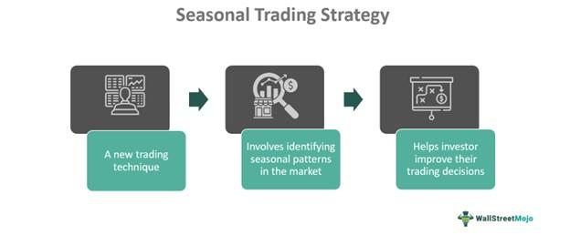

## Table of Contents

## What is a year-on-year seasonal trending strategy?

A year-on-year seasonal trending strategy is a way to look at how things change over the same time each year. For example, if you sell ice cream, you might see that sales go up every summer. By comparing this year's summer sales to last year's summer sales, you can see if there's a trend. This helps businesses plan better because they can predict when sales might go up or down.

This strategy is useful because it takes out the effect of the season. If you just look at monthly sales, you might think sales are bad in winter because they're lower than in summer. But if you compare this winter's sales to last winter's, you can see if they're actually getting better or worse. This way, businesses can make smarter decisions about when to stock up, run sales, or even when to hire more staff.

## How does a year-on-year seasonal trending strategy differ from other trading strategies?

A year-on-year seasonal trending strategy focuses on comparing the same time periods in different years to find patterns. For example, if you're selling umbrellas, you might see that sales go up every rainy season. By looking at this year's rainy season sales compared to last year's, you can see if there's a trend. This helps you predict when sales might go up or down in the future. This strategy is different from other trading strategies because it looks at the same time each year, not just any time.

Other trading strategies might focus on different things. For example, a [momentum](/wiki/momentum) trading strategy looks at how prices are moving right now and tries to follow that trend. It doesn't care about the time of year, just whether prices are going up or down. Another strategy, like a mean reversion strategy, believes that prices will eventually go back to their average. So, if prices are high now, it might bet on them going down. These strategies don't look at the same time each year like the year-on-year seasonal trending strategy does.

In simple terms, the year-on-year seasonal trending strategy is about understanding how things change over the same time each year. It's useful for businesses that have clear seasonal patterns. Other strategies might look at short-term trends or believe prices will return to normal, but they don't focus on the same time each year. This makes the year-on-year seasonal trending strategy unique and helpful for planning based on seasonal changes.

## What are the key components of a year-on-year seasonal trending strategy?

The main part of a year-on-year seasonal trending strategy is looking at the same time each year. For example, if you sell swimsuits, you might see that sales go up every summer. By comparing this summer's sales to last summer's sales, you can see if there's a trend. This helps you predict when sales might go up or down in the future. The key is to always compare the same time periods, like comparing January this year to January last year, to see how things change over time.

Another important part is understanding the seasonal patterns in your business. Some businesses have clear times of the year when they do better or worse. By looking at these patterns year after year, you can plan better. For example, if you know that sales always drop in the winter, you can prepare by running sales or cutting costs. This way, you can make smarter decisions about when to stock up, run promotions, or even hire more staff.

Overall, a year-on-year seasonal trending strategy helps you see how your business changes over the same time each year. It's different from other strategies because it focuses on seasonal patterns, not just any time. By understanding these patterns, you can predict and plan for the future, making your business more successful.

## Can you explain the concept of seasonality in the context of this strategy?

Seasonality means that things change at different times of the year. For example, if you sell ice cream, you might sell more in the summer when it's hot. This is a seasonal pattern. In the context of a year-on-year seasonal trending strategy, seasonality is really important. It's about looking at these patterns every year to see if they stay the same or change. By comparing the same time each year, like this summer to last summer, you can see if there's a trend.

Understanding seasonality helps you plan better. If you know that sales always go up in the summer, you can make sure you have enough ice cream in stock. Or if sales always drop in the winter, you can plan to run sales or cut costs. This way, you can predict what might happen and make smarter decisions about when to buy more products, run promotions, or even hire more staff. It's all about using the patterns you see every year to make your business better.

## What types of markets are best suited for a year-on-year seasonal trending strategy?

Markets that have clear seasonal patterns are best suited for a year-on-year seasonal trending strategy. For example, businesses that sell things like swimsuits, ice cream, or holiday decorations often see their sales go up and down at the same times every year. By comparing sales from one year to the next during these times, these businesses can see if there are trends and plan better for the future.

This strategy works well for industries like tourism, agriculture, and retail. In tourism, more people might travel during summer or holidays, so hotels and travel agencies can use year-on-year data to predict busy times. In agriculture, certain crops are harvested at specific times of the year, so farmers can plan their planting and selling based on past years. Retail businesses, especially those selling seasonal items, can use this strategy to manage inventory and promotions effectively.

## How do you identify seasonal trends in historical data?

To identify seasonal trends in historical data, you need to look at the same time periods every year. For example, if you're selling ice cream, you might compare how many ice creams you sold in June this year to how many you sold in June last year. By doing this for several years, you can see if there's a pattern. If you see that ice cream sales always go up in June, that's a seasonal trend.

Once you've found these patterns, you can use them to plan better. If you know that sales always go up in June, you can make sure you have enough ice cream in stock. Or if sales always drop in the winter, you can plan to run sales or cut costs. This way, you can predict what might happen and make smarter decisions about when to buy more products, run promotions, or even hire more staff. It's all about using the patterns you see every year to make your business better.

## What are the common tools and software used to implement a year-on-year seasonal trending strategy?

To implement a year-on-year seasonal trending strategy, businesses often use spreadsheet software like Microsoft Excel or Google Sheets. These tools are great because they let you organize your sales data by date and easily compare the same months or seasons from different years. You can use functions like AVERAGE, SUM, and VLOOKUP to quickly see how your sales are doing year after year. There are also special add-ons and templates in these programs that can help you spot seasonal trends more easily.

Another common tool is specialized business intelligence software like Tableau or Power BI. These programs are more advanced and can handle a lot of data. They let you create visual charts and graphs that make it easier to see seasonal patterns at a glance. For example, you can make a line graph that shows your sales for each June over the last five years. This helps you see if there's a trend without having to look at numbers all the time. Both types of software help you understand your seasonal trends better and make smarter decisions for your business.

## How can one backtest a year-on-year seasonal trending strategy?

To backtest a year-on-year seasonal trending strategy, you need to look at your past sales data and compare the same time periods from different years. For example, if you sell ice cream, you would compare how many ice creams you sold in June this year to how many you sold in June last year, and then do the same for several years. By doing this, you can see if there's a pattern. If you see that ice cream sales always go up in June, that's a seasonal trend. You can use tools like Microsoft Excel or Google Sheets to organize your data and make these comparisons easier.

Once you've identified these patterns, you can use them to see how well your strategy would have worked in the past. For example, if you know that sales always go up in June, you could have planned to stock up on ice cream in May. By looking at your past data, you can see if this would have helped you sell more ice cream. This way, you can feel more confident that your strategy will work in the future. It's all about using what you've learned from the past to make better decisions for the future.

## What are the potential risks and limitations of using a year-on-year seasonal trending strategy?

One risk of using a year-on-year seasonal trending strategy is that it might not work if things change a lot from one year to the next. For example, if there's a big event like a global health crisis or a new competitor in the market, your sales might not follow the same pattern as before. This can make it hard to predict what will happen, and you might end up with too much or too little stock. Another limitation is that this strategy only looks at the same time each year, so it might miss other important trends that happen at different times.

Another risk is that this strategy can be too simple. It might not take into account other things that can affect your sales, like changes in what customers want or new technology. If you only look at the same time each year, you might miss out on these other factors. This can make your planning less accurate. So, while a year-on-year seasonal trending strategy can be helpful, it's important to use it along with other ways of looking at your data to get a full picture of what's going on.

## How can one adjust a year-on-year seasonal trending strategy to account for market anomalies or unexpected events?

To adjust a year-on-year seasonal trending strategy for market anomalies or unexpected events, you need to keep an eye on what's happening around you. If something big happens, like a new law or a natural disaster, you should look at how it might change your sales. For example, if there's a heatwave, you might sell more ice cream than usual in the summer. By watching these events and thinking about how they could affect your business, you can make better guesses about what might happen next.

One way to do this is by using other data along with your year-on-year data. You can look at news, social media, or even talk to your customers to see what's going on. If you see that something big is happening, you can change your plans. For example, if a new competitor opens up, you might need to run more sales or change your prices. By combining your year-on-year data with what's happening right now, you can make your strategy more flexible and ready for anything that comes your way.

## What advanced techniques can be used to enhance the performance of a year-on-year seasonal trending strategy?

One advanced technique to enhance the performance of a year-on-year seasonal trending strategy is to use [machine learning](/wiki/machine-learning). Machine learning can look at a lot of data and find patterns that might be hard for people to see. For example, it can look at not just your sales data, but also things like the weather, holidays, and even what people are saying on social media. By using all this information, machine learning can make better predictions about when your sales might go up or down. This can help you plan better and make sure you have the right amount of stock at the right time.

Another technique is to use something called time series decomposition. This breaks down your sales data into different parts, like the trend, the seasonality, and any random changes. By understanding these parts, you can see what's really driving your sales. For example, you might see that your sales are going up over time, but they also go up and down with the seasons. By knowing this, you can make better plans for the future. You can also use this information to spot any unusual changes in your sales and figure out why they're happening. This way, you can adjust your strategy to deal with these changes and keep your business running smoothly.

## Can you provide case studies or examples where a year-on-year seasonal trending strategy has been successfully applied?

One example where a year-on-year seasonal trending strategy was successfully applied is in the retail industry, specifically with a company that sells holiday decorations. This company noticed that their sales always went up in November and December every year. By comparing their sales from one year to the next during these months, they could see if there was a trend. They found that sales were increasing year after year. Using this information, they started ordering more stock in September and October to make sure they had enough decorations for the holiday rush. This helped them meet customer demand and increase their profits.

Another example is in the tourism industry, with a hotel chain that operates in a popular beach destination. The hotel noticed that their bookings always peaked in the summer months. By looking at their booking data from one summer to the next, they could see that the number of guests was growing each year. They used this information to plan ahead, hiring more staff and offering special summer packages to attract even more visitors. This strategy helped them maximize their occupancy rates and improve their overall business performance during the busy season.

## References & Further Reading

[1]: Chan, E. (2009). ["Quantitative Trading: How to Build Your Own Algorithmic Trading Business."](https://github.com/ftvision/quant_trading_echan_book) John Wiley & Sons.

[2]: Jansen, S. (2020). ["Machine Learning for Algorithmic Trading: Predictive Models to Extract Signals from Market and Alternative Data for Systematic Trading Strategies."](https://www.amazon.com/Machine-Learning-Algorithmic-Trading-alternative/dp/1839217715) Packt Publishing.

[3]: Pring, M. J. (1991). ["Technical Analysis Explained: The Successful Investor's Guide to Spotting Investment Trends and Turning Points."](https://www.amazon.com/Technical-Analysis-Explained-Fifth-Successful/dp/0071825177) McGraw-Hill.

[4]: Aronson, D. R. (2007). ["Evidence-Based Technical Analysis: Applying the Scientific Method and Statistical Inference to Trading Signals."](https://onlinelibrary.wiley.com/doi/book/10.1002/9781118268315) John Wiley & Sons.

[5]: Lopez de Prado, M. (2018). ["Advances in Financial Machine Learning."](https://www.amazon.com/Advances-Financial-Machine-Learning-Marcos/dp/1119482089) Wiley.