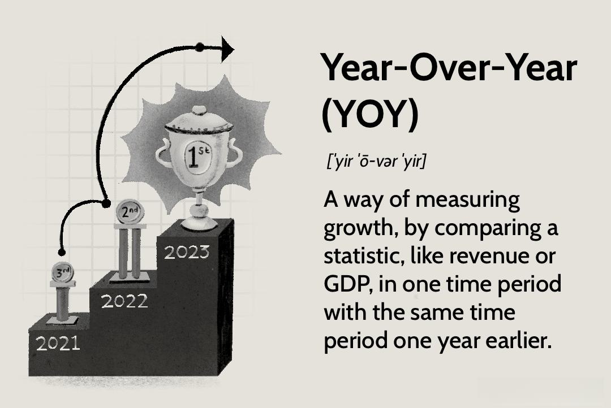

With the rapid advancement of technology in finance, algorithmic trading has become a pivotal component in the financial markets. In recent years, evaluating its performance year-over-year (YOY) offers insights into both its evolution and its impact.

Algorithmic trading leverages sophisticated computer systems to execute trades at speeds and volumes that a traditional human investor cannot match. This powerful tool employs complex algorithms to drive trading decisions, leading to efficiency and potentially higher returns. These algorithms process vast amounts of data, identify opportunities, and execute strategies that range from arbitrage to market-making. For instance, a basic trading strategy can be implemented using Python, employing libraries like NumPy and pandas for numerical and data manipulation tasks. Such strategies are often tuned for specific parameters that are tested against historical data to optimize performance.

This article explores the growth and changes in algorithmic trading through a detailed year-over-year analysis. We aim to provide a comprehensive view of how trading algorithms are reshaping the landscape of financial investments and their significance in the industry today. A YOY analysis offers a robust framework to assess various facets, such as market liquidity improvements, execution costs, and return on investment metrics, helping traders and institutions enhance their strategic approaches.

We will discuss important aspects like the development of trading strategies, technology advancements, and market implications to understand how algorithmic trading has evolved. These developments include the integration of artificial intelligence and machine learning, which have greatly enhanced algorithms' predictive capabilities and adaptability in the dynamic financial markets. The continuous refinement of these strategies is essential in maintaining a competitive edge.

Our goal is to provide readers with valuable insights into the strategic advantages of algorithmic trading and the challenges associated with its implementation. Understanding these elements can aid investors and financial institutions in navigating the complexities of modern trading environments. As algorithmic trading continues to grow, effective YOY analysis will be crucial in sustaining this pace and addressing potential risks such as market volatility and technological disruptions.

## Table of Contents

## Understanding Year-Over-Year (YOY) Analysis

Year-over-year (YOY) analysis is a fundamental analytical tool used to evaluate data by comparing the performance of a particular period to the same period in the previous year. This technique is particularly valuable in the context of algorithmic trading, as it assists in revealing patterns, trends, and growth metrics that can be obscured by short-term volatility.

YOY analysis offers a comprehensive overview that goes beyond monthly or quarterly evaluations by accounting for seasonal and cyclical fluctuations. These fluctuations can significantly affect financial markets, making it crucial to analyze data on an annual basis to understand the true performance of trading strategies. By providing a clearer picture of long-term progress, YOY analysis helps investors and analysts evaluate the effectiveness and sustainability of [algorithmic trading](/wiki/algorithmic-trading) strategies.

By focusing on yearly data, stakeholders can identify persistent trends and assess whether strategies have improved or underperformed over time. This analysis aids in determining whether specific algorithms or trading approaches need optimization, restructuring, or replacement. Such assessments are instrumental in refining strategic approaches and ensuring that algorithmic trading remains aligned with market dynamics.

Furthermore, YOY analysis can be used to measure various key performance indicators (KPIs) in algorithmic trading, such as return on investment (ROI), execution speed, and risk management efficacy. These metrics provide valuable insights into the efficiency and profitability of trading algorithms. By comparing these KPIs on a year-to-year basis, traders can benchmark performance, identify anomalies or improvements, and recalibrate strategies to enhance future outcomes.

In conclusion, YOY analysis plays a critical role in evaluating and refining algorithmic trading strategies. It not only highlights the ongoing evolution of these strategies but also aids in making informed decisions to maximize returns and manage risks effectively in the ever-changing financial markets.

## Emergence and Evolution of Algorithmic Trading

Algorithmic trading first emerged in the financial markets towards the end of the 20th century, transforming the landscape of securities trading by introducing automation and data-driven strategies. Initially, algorithmic trading was limited to executing simple orders to minimize market impact. However, advancements in technology and data analytics have significantly enhanced its capabilities, leading to widespread adoption across various segments of the financial industry.

Over the past few decades, financial institutions have increasingly relied on algorithmic trading to manage portfolios, execute trades, and optimize strategies. The robust infrastructure that supports these algorithms has enabled trades to be executed at millisecond speeds, with real-time market analysis providing traders with the necessary information to make informed decisions. The ability to process large volumes of data swiftly has facilitated the development of more sophisticated trading strategies, ranging from statistical [arbitrage](/wiki/arbitrage) to high-frequency trading.

A year-over-year (YOY) analysis reveals the profound impact of technological innovations on the refinement of algorithmic trading strategies. Technologies such as [artificial intelligence](/wiki/ai-artificial-intelligence) (AI) and [machine learning](/wiki/machine-learning) have been pivotal in enhancing the adaptability and precision of trading algorithms. AI-driven insights have allowed for more accurate predictions of market trends, while machine learning models have streamlined the identification of complex patterns within financial data sets. 

Dynamic pricing models and complex trading algorithms continue to evolve, setting new industry standards. For instance, [reinforcement learning](/wiki/reinforcement-learning), a subset of machine learning, has been applied to develop adaptive strategies that learn optimal trading actions through trial and error. This approach is particularly effective in volatile markets, where traditional models may fall short.

The evolution of algorithmic trading has also been marked by the integration of [alternative data](/wiki/best-alternative-data) sources, such as social media sentiment and satellite imagery, which complement traditional financial indicators. This multifaceted data approach enables algorithms to gain a competitive edge by uncovering insights that may not be immediately apparent through conventional analysis.

In summary, the emergence and evolution of algorithmic trading are characterized by ongoing technological progress and innovation. The continuous enhancement of algorithms, driven by the incorporation of AI and advanced data analytics, underscores the transformative role of technology in modern financial markets. As these technologies continue to mature, the strategic implementation of algorithmic trading is poised to deliver even greater efficiencies and insights.

## Popular Algorithmic Trading Strategies

Algorithmic trading encompasses a variety of strategies aimed at optimizing trade execution and enhancing capital returns through the use of automation and computational power. These strategies leverage historical data, sophisticated mathematical models, and stringent risk management protocols to capture market opportunities effectively.

**Trend Following:** Trend following strategies are predicated on the principle that markets tend to move in persistent directions over time. These strategies analyze historical price data to identify long-term and short-term trends and generate buy or sell signals accordingly. A fundamental concept is that once a trend is established, it is likely to continue until a significant external force disrupts it. Traders utilizing this strategy often employ indicators such as moving averages, the relative strength index (RSI), or the moving average convergence divergence (MACD) to pinpoint entry and exit points.

**Arbitrage:** Arbitrage strategies exploit price discrepancies across different markets or similar securities. The essence of arbitrage is to simultaneously buy low and sell high to lock in risk-free profits. For instance, statistical arbitrage involves complex mathematical models to identify mispricings between correlated securities. These models estimate the expected value of the instruments and execute trades based on deviations from the predicted values. High-frequency trading techniques are commonly employed to capitalize on these fleeting opportunities owing to their ability to execute large volumes of orders at high speeds.

**Mean Reversion:** Mean reversion capitalizes on the statistical tendency of asset prices to revert to their historical averages or mean over time. The strategy involves identifying securities that deviate significantly from their historical price averages and assuming that they will revert to the mean. Quantitative models incorporating factors such as the standard deviation of price movements or Z-scores are used to determine the degree of deviation required to prompt a trading decision.

**Index Fund Rebalancing and Market Timing:** Index fund rebalancing involves realigning the proportions of assets in a portfolio to maintain a desired risk level or asset allocation. Algorithmic trading systems can optimize the timing and execution of trades necessary for rebalancing to minimize market impact and costs. On the other hand, market timing strategies attempt to predict future market movements and adjust portfolios proactively to take advantage of anticipated trends.

Each algorithmic trading strategy is constructed to achieve particular investment objectives, whether maximizing short-term gains or minimizing risk. Year-over-year (YOY) analysis plays a crucial role in assessing these strategies' performance, providing insights into their effectiveness and avenues for optimization. By comparing annual performance data, traders can refine their algorithms, adapt to evolving market conditions, and enhance their strategic approach to achieve consistent success in dynamic financial markets.

## Assessing Performance: YOY Metrics in Algorithmic Trading

Evaluating the performance of algorithmic trading via year-over-year (YOY) metrics is crucial for understanding both the effectiveness and the efficiency of trading strategies. Among these metrics, execution speed, risk management efficacy, and return on investment (ROI) serve as pivotal indicators of an algorithm's performance. 

Execution speed, measured in milliseconds, is critical in algorithmic trading because it directly affects the ability to capitalize on market opportunities. Algorithms that can execute trades faster are more likely to achieve desired price points, enhancing potential returns. YOY analysis of execution speed can reveal technological advancements or identify bottlenecks that need addressing. Historical comparison allows traders to benchmark improvements and implement necessary upgrades to maintain competitive advantages in increasingly fast-paced markets.

Risk management is another essential component assessed through YOY metrics. Effective risk management ensures that trading strategies do not overly expose an investment to potential losses. Metrics such as Value at Risk (VaR) and Stress Testing help gauge how well the algorithm manages risk across different market conditions. By analyzing these metrics over successive years, traders can identify patterns or anomalies that signal weaknesses in their strategies or unexpected changes in the trading environment. Enhancements in these areas can be guided by past performance insights.

Return on investment (ROI) serves as a critical measure of a trading strategy's profitability. Calculating ROI involves assessing the net profit of investments against the capital invested, providing a clear picture of an algorithm's success. YOY analysis allows traders to distinguish between short-term gains and sustainable growth, offering a perspective on how strategies perform over varying fiscal periods. This analysis helps in identifying whether a trading strategy requires adjustment or complete overhauls based on its performance trends.

By leveraging these YOY metrics, traders and algorithm developers can uncover inefficiencies and areas for improvement. The continual comparison of current performance against historical data allows for the refinement of strategies, ensuring they adapt to the evolving market landscape and make informed decisions to enhance algorithmic effectiveness. This proactive approach not only boosts performance but also ensures that trading strategies remain robust, competitive, and aligned with long-term investment goals.

## Technological Advances Driving Algorithmic Trading

Technological advancements are integral to the rapid growth and sophistication of algorithmic trading. Key developments in computing power have drastically increased the speed and efficiency of executing trades. High-performance computing systems allow for the processing of vast datasets in real-time, facilitating the implementation of complex algorithms and models. This computational capacity supports large-scale simulations and back-testing, providing traders with robust insights into market behavior and potential trade outcomes.

The proliferation of big data has further revolutionized algorithmic trading by providing unprecedented access to information, including market trends, social media sentiment, and economic indicators. The ability to analyze this data quickly and accurately enables more predictive and responsive trading strategies. Machine learning and artificial intelligence are integral to this process, offering powerful tools for pattern recognition, anomaly detection, and decision-making. AI-driven insights can adapt to evolving market conditions, enhancing the precision and timing of trades.

Blockchain technology is transforming transparency and security in transactions. Its decentralized and immutable nature offers a reliable platform for recording and verifying trades, reducing the potential for fraud and error. Enhanced security protocols, bolstered by advancements in cybersecurity, protect against the risks associated with high-frequency automated trading, such as hacking and data breaches.

The year-over-year evolution of these technologies underscores the increasing sophistication of the trading landscape. As systems become faster and more secure, and as AI continues to evolve, traders are equipped to develop and execute intricately designed strategies with greater efficiency. This technological progression not only augments trading performance but also continually reshapes the expectations and capabilities within financial markets. As technology advances, it remains a pivotal force driving both innovation and competitiveness in algorithmic trading.

## Risks and Challenges in Algorithmic Trading

Algorithmic trading, while offering numerous advantages, presents several risks and challenges that must be addressed to ensure sustainable and effective deployment. One significant risk is technological failure or glitches, which can cause substantial financial losses. The reliance on complex computer systems and algorithms means that any system malfunction or software bug could lead to incorrect trading decisions or execution errors. This is often exemplified by the phenomenon known as the "flash crash," where rapid price movements, exacerbated by algorithmic trades, trigger widespread market instability.

A key challenge in algorithmic trading is the risk of over-optimization. Traders often calibrate their algorithms based on historical data to maximize performance. However, this practice, sometimes referred to as "curve-fitting," may result in algorithms that perform well on past data but fail under new market conditions. This risk is heightened during unforeseen events or market shifts where historical data does not accurately predict future trends. For example, an algorithm optimized on historical [volatility](/wiki/volatility-trading-strategies) measures may underperform in a sudden market crash or during rapid economic recovery periods.

Another concern in algorithmic trading is the absence of human oversight, which can lead to missed market nuances and adaptive failures. Algorithms operate on coded logic and quantitative analysis, which may overlook qualitative factors such as political events, market sentiment, or regulatory changes. Consequently, routine review and adjustment of these algorithms are essential, ensuring they remain effective under varying market conditions. Implementing a hybrid model where human expertise complements algorithmic trading can mitigate this risk, providing a balance between automated efficiency and strategic oversight.

In addition to these challenges, algorithmic trading faces regulatory and ethical considerations. The high-speed nature of trading can potentially lead to market manipulation or unfair trading advantages, prompting the need for stringent regulatory oversight. As regulatory bodies adapt to these challenges, traders must ensure compliance, adding an additional layer of complexity to algorithm management.

Addressing these risks requires a proactive approach, incorporating robust testing, regular updates, and continuous monitoring of algorithmic performance. By leveraging comprehensive risk management strategies and maintaining transparency, traders can enhance the reliability and effectiveness of algorithmic systems, ensuring they are well-prepared to navigate the complex and dynamic nature of financial markets.

## Future Outlook and Conclusion

As financial markets continue to embrace technology, the trajectory of algorithmic trading is poised for acceleration. The future of this field is marked by the anticipated integration of more sophisticated artificial intelligence, enhanced real-time data analytics, and advanced computational capabilities. These innovations are expected to significantly refine trading strategies, providing even greater precision and agility in executing trades.

Algorithmic trading has been transformative for the financial industry, largely due to its unparalleled efficiency and ability to provide profound market insights. Over the years, it has facilitated the handling of massive amounts of data and enabled rapid decision-making—a feat difficult to achieve with traditional trading methods. Despite the challenges that accompany technological dependency, such as technical malfunctions and the potential for systemic risks, algorithmic trading continues to be a formidable force.

A year-over-year analysis of algorithmic trading highlights the strategies' potential for further growth and innovation. This analysis underscores the necessity for continuous development in this field to sustain the [momentum](/wiki/momentum). With advancements in AI, particularly in machine learning and [deep learning](/wiki/deep-learning), algorithmic trading systems are becoming increasingly capable of anticipating market movements and adapting to new patterns swiftly.

For investors and firms aiming to capitalize on these technological trends, vigilance is paramount. The fast-paced evolution of technology within financial markets demands a proactive approach to adaptation. Alongside seizing opportunities, it is crucial to mitigate associated risks by implementing robust risk management strategies and ensuring that algorithmic systems are continuously updated and monitored for performance and reliability.

In conclusion, amid a rapidly evolving technological landscape, algorithmic trading remains an essential component of modern finance. It provides a competitive edge in terms of efficiency and insight, which are invaluable for achieving consistent trading success. Investors poised to navigate this dynamic environment should focus on embracing innovation while maintaining a keen awareness of the accompanying risks and challenges.

## References & Further Reading

[1]: Bergstra, J., Bardenet, R., Bengio, Y., & Kégl, B. (2011). ["Algorithms for Hyper-Parameter Optimization."](https://dl.acm.org/doi/10.5555/2986459.2986743) Advances in Neural Information Processing Systems 24.

[2]: ["Advances in Financial Machine Learning"](https://www.amazon.com/Advances-Financial-Machine-Learning-Marcos/dp/1119482089) by Marcos Lopez de Prado

[3]: ["Evidence-Based Technical Analysis: Applying the Scientific Method and Statistical Inference to Trading Signals"](https://www.amazon.com/Evidence-Based-Technical-Analysis-Scientific-Statistical/dp/0470008741) by David Aronson

[4]: ["Machine Learning for Algorithmic Trading"](https://github.com/stefan-jansen/machine-learning-for-trading) by Stefan Jansen

[5]: ["Quantitative Trading: How to Build Your Own Algorithmic Trading Business"](https://www.amazon.com/Quantitative-Trading-Build-Algorithmic-Business/dp/1119800064) by Ernest P. Chan