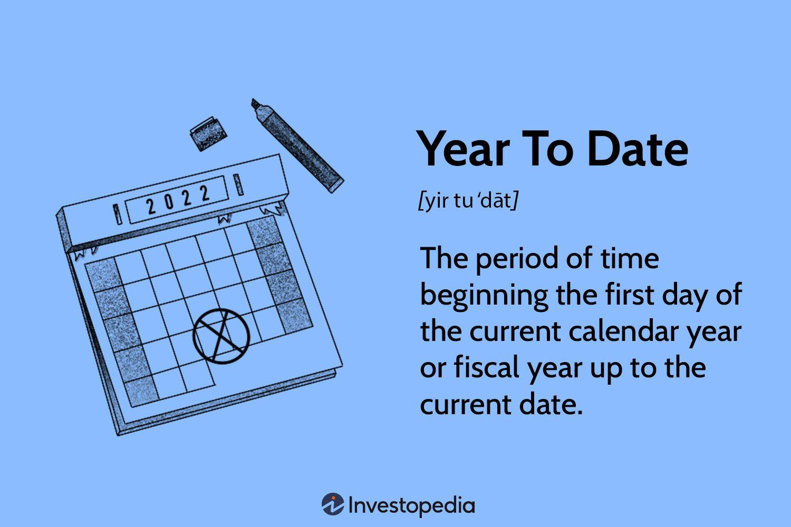

Year to Date (YTD) financial analysis is a critical tool used to assess a company's financial performance from the beginning of the current year up to a specified date. It provides insights into trends and patterns that help businesses make informed strategic decisions. YTD analysis is important for investors, analysts, and managers, as it offers a clear view of how a company’s current performance measures up to expectations and previous years' benchmarks. By evaluating metrics such as revenues, expenses, and profits on a YTD basis, stakeholders can better discern the trajectory of a business and assess its operational health.

Algorithmic trading, on the other hand, refers to the use of computer algorithms to automate trading decisions and execute orders in financial markets. This technique leverages complex mathematical models and statistical analysis to determine optimal trading strategies. Algorithms process vast amounts of market data to identify trading opportunities, thereby reducing human error and increasing efficiency. Financial analysis algorithms play a key role in this domain as they facilitate real-time data analysis, predictive modeling, and execution of trades faster than human capability.



Integrating YTD analysis into algorithmic trading strategies can provide traders with a comprehensive understanding of market dynamics and the performance of individual stocks or sectors. By analyzing YTD data, trading algorithms can identify trends and discrepancies that could signify profitable trading opportunities. For instance, if a company consistently outperforms its YTD figures compared to industry averages, an algorithm might recognize this as a signal to buy its stock. As a result, YTD financial analysis can enhance trading strategies by aligning them with broader market trends and ensuring they adapt to new information efficiently. This combination of historical performance insights and algorithmic execution of trades sets the stage for more informed, data-driven trading decisions.

## Table of Contents

## Understanding Year to Date (YTD) in Financial Analysis

Year to Date (YTD) is a commonly used term in financial analysis that refers to the period from the beginning of the current calendar year (January 1) to a specified date. YTD provides a cumulative measure of performance, allowing businesses and investors to track and assess progress over the year. It serves as a pivotal tool in financial management, enabling the evaluation of a company's performance, investment returns, and other financial metrics.

YTD calculations are versatile and encompass several metrics, most notably YTD returns and YTD earnings. YTD returns refer to the profit or loss generated by an investment since the beginning of the year, expressed as a percentage. This can be calculated using the formula:

$$
\text{YTD Return} = \left( \frac{\text{Current Price} - \text{Price at Beginning of Year}}{\text{Price at Beginning of Year}} \right) \times 100
$$

YTD earnings, on the other hand, represent the aggregate net income a company has earned from the start of the year up to the specified date. This helps stakeholders gauge the company’s profitability over the current year, providing insight into operational efficiency and financial health.

YTD metrics allow for effective comparison of performance data over time or against industry benchmarks. By standardizing the starting point of analysis, YTD enables investors and analysts to make apples-to-apples comparisons. For instance, YTD performance metrics help determine whether a company is on track to meet its financial targets or to benchmark against industry standards. This comparison can reveal valuable insights regarding trends, growth potential, and areas requiring strategic adjustments.

In addition to their descriptive capabilities, YTD metrics are crucial for predictive analysis and decision-making processes. For example, if a particular stock shows a strong YTD return, it might attract more investors expecting continued growth. Conversely, lagging YTD figures might signal caution or necessitate re-evaluation of business strategies.

Overall, Year to Date analysis serves as an essential component of financial analysis, supporting both current performance evaluation and strategic forecasting.

## Algorithmic Trading: An Overview

Algorithmic trading refers to the use of complex algorithms and mathematical models to make decisions about buying and selling financial instruments in an automated manner. This approach enhances the speed and efficiency of trades, minimizing human intervention and the associated potential for error. At its core, [algorithmic trading](/wiki/algorithmic-trading) involves the development and implementation of trading strategies based on a set of pre-defined rules and conditions, which help in executing decisions at optimal speeds.

In today's financial markets, algorithmic trading plays a pivotal role by providing [liquidity](/wiki/liquidity-risk-premium), reducing transaction costs, and enabling the execution of trading strategies at speeds inconceivable for human traders. This technology dominates the trading of equities and has expanded to other financial instruments, including futures, options, and foreign exchange.

Python stands out as a leading programming language for developing algorithmic trading strategies due to its readability, extensive libraries, and supportive community. Key technologies that aid algorithmic trading include:

- **Python Libraries**: Python's rich ecosystem of libraries such as Pandas for data manipulation, NumPy for numerical operations, and TA-Lib for technical analysis makes it a natural choice for algorithmic traders. Pandas, for instance, allows traders to handle financial data with ease, offering powerful data structures like DataFrames to manipulate time-series data effectively.

- **Trading Platforms**: Several platforms like QuantConnect, Quantopian, or PyAlgoTrade offer Python-based environments where traders can test and implement their algorithms. These platforms provide real-time data and APIs essential for executing trading strategies.

- **Machine Learning**: Increasingly, trading algorithms leverage machine learning models to predict market movements and optimize strategies. Libraries such as Scikit-learn and TensorFlow are commonly used for developing predictive models that can analyze historical data and identify patterns indicative of market trends.

In summary, algorithmic trading has revolutionized financial markets through the automation of trade execution and strategy deployment. Tools and technologies, particularly Python, have made algorithmic trading accessible and efficient, thus playing an indispensable role in modern finance.

## Role of YTD Financial Analysis in Algorithmic Trading

Year to Date (YTD) financial analysis serves as a valuable tool within algorithmic trading models by providing a temporal frame of reference that can enhance the decision-making process. By assessing performance and trends from the beginning of the current year to the present day, traders can integrate YTD data into algorithms to calibrate trading strategies that are responsive to ongoing market conditions.

**Integration into Algorithmic Models**

Integrating YTD financial analysis into algorithmic trading models can be achieved by incorporating YTD returns and other performance metrics as inputs that inform trading decisions. This approach allows traders to evaluate an asset's performance within the current fiscal year relative to historical data or predefined benchmarks. For instance, an algorithm might include a rule that compares current YTD performance to a five-year average to determine if an asset is performing above or below expectations, triggering buy or sell signals accordingly.

**Benefits in Trading Strategies**

One of the primary benefits of using YTD data is its ability to contextualize current market conditions. YTD metrics provide a snapshot of performance that can help algorithms detect shifts in market trends or [volatility](/wiki/volatility-trading-strategies) patterns earlier than traditional metrics that rely on longer historical data. For example, YTD metrics can help identify when a stock is beginning to show resilience earlier in the year, giving algorithms a chance to capitalize on emerging upward trends.

**Exploration Through Case Studies**

There are several instances where YTD analysis has proven beneficial to trading outcomes. Consider a scenario where a trading algorithm uses YTD data to adjust a moving average crossover strategy. By integrating a check for YTD returns relative to threshold values, the algorithm could enhance decision-making by only executing trades when YTD performance meets specific criteria, thereby reducing noise and improving signal quality. Additionally, such strategies have been applied in equity trading, where algorithms dynamically adjust buy/sell decisions based on a comparison of current YTD performance against historical averages or expected industry growth rates. These strategies not only improve accuracy but also enhance the algorithm's adaptability to rapidly changing market conditions.

By integrating YTD financial analysis into algorithmic trading, traders gain a dynamic tool capable of refining strategies to respond readily to the market’s present state. This alignment between YTD contextual data and algorithmic logic affords traders a sharper edge, effectively balancing historical data insights with current-year performance for optimized trading outcomes.

## Using Python for YTD Financial Analysis and Algo Trading

Python has become a favored language for financial analysis and algorithmic trading due to its simplicity, versatility, and extensive range of libraries that facilitate efficient data manipulation and computation. Its ability to handle complex algorithms and large datasets makes it an ideal choice for developing and [backtesting](/wiki/backtesting) trading strategies, including those involving Year to Date (YTD) financial analysis.

Key Python libraries play a crucial role in executing financial calculations:

1. Pandas: Known for data manipulation and analysis, Pandas provides data structures and functions needed to work with structured data seamlessly. It is particularly useful in handling time series data, which is essential for calculating YTD metrics. Functions like `pandas.DataFrame` and `pandas.Series` allow for efficient data organization and temporal operations.

2. NumPy: This library underpins many scientific computing tasks due to its powerful n-dimensional array object and numerous functions for performing numerical operations on these arrays. NumPy is particularly adept at handling large data sets and performing mathematical computations, which are fundamental in algorithmic trading.

3. TA-Lib: The Technical Analysis Library, or TA-Lib, is tailored for performing technical analysis on financial time series. It offers over 150 functions related to indicators like moving averages, momentum oscillators, and more, aiding in the development of algorithmic trading strategies by providing tools for incorporating YTD analysis in decision-making processes.

To perform YTD analysis and backtest trading strategies using Python, the following steps are often undertaken:

**Step 1: Data Collection and Preprocessing**
   - Collect historical financial data, which can be sourced from databases or APIs such as Yahoo Finance or Alpha Vantage.
   - Use Pandas to load this data into DataFrame structures, allowing for clean and manipulable data formats.

```python
import pandas as pd

# Example of loading data
data = pd.read_csv('financial_data.csv')
```

**Step 2: YTD Calculation**
   - Calculate YTD performance metrics by manipulating data indices to align with the start of the year and perform cumulative calculations on relevant columns.

```python
# Calculate YTD returns
data['YTD_Return'] = (data['Close'] / data['Close'].iloc[0]) - 1
```

**Step 3: Strategy Development Using TA-Lib**
   - Implement technical indicators using TA-Lib to inform trading signals based on YTD analysis and other criteria.

```python
import talib

# Calculate a simple moving average
data['SMA'] = talib.SMA(data['Close'], timeperiod=30)
```

**Step 4: Backtesting the Strategy**
   - Use historical data to simulate the trading strategy, analyzing its performance through backtesting frameworks available in Python, such as Backtrader or zipline.

```python
# Example of a basic moving average strategy
def trading_strategy(data):
    data['signal'] = 0
    data['signal'][30:] = np.where(data['Close'][30:] > data['SMA'][30:], 1, 0)
    data['position'] = data['signal'].diff()

# Execute the strategy
trading_strategy(data)
```

Throughout these processes, Python’s flexible environment supports iterative testing and adjustment of models. The integration of YTD analysis into algorithmic strategies can provide insights into market behavior relative to annual financial benchmarks, aiding traders in developing refined, data-driven approaches.

## Building an Algorithmic Strategy Using YTD Analysis

Formulating a trading strategy using Year to Date (YTD) analysis involves evaluating performance data from the beginning of the current year up to the present date. One common approach is the moving average crossover strategy, which uses different moving averages to identify market trends and potential entry or [exit](/wiki/exit-strategy) points. YTD analysis augments this strategy by offering a longer-term perspective on financial metrics, potentially refining the signals derived from moving averages.

### Moving Average Crossover Strategy

The moving average crossover strategy involves two key components: a short-term moving average (MA) and a long-term moving average. The strategy generates buy signals when the short-term MA crosses above the long-term MA (golden cross) and sell signals when it crosses below (death cross). This technique helps traders identify shifts in market trends.

#### Step-by-Step Implementation in Python

To integrate YTD analysis with a moving average crossover strategy, one can use Python, a popular programming language in financial analysis. Below is a step-by-step guide:

1. **Data Collection and Preprocessing**: Use libraries like Pandas to collect historical price data, ensuring it spans at least from the start of the current year to capture YTD data.

   ```python
   import pandas as pd
   import numpy as np
   import yfinance as yf

   # Fetch historical data
   data = yf.download('AAPL', start='2023-01-01', end='2023-12-31')
   ```

2. **Calculate Moving Averages**: Compute short-term and long-term moving averages. For example, use a 50-day for short-term and a 200-day for long-term.

   ```python
   data['Short_MA'] = data['Close'].rolling(window=50).mean()
   data['Long_MA'] = data['Close'].rolling(window=200).mean()
   ```

3. **YTD Returns Calculation**: Calculate YTD returns to integrate into the strategy evaluation.

   ```python
   data['YTD_Return'] = (data['Close']/data['Close'].iloc[0]) - 1
   ```

4. **Generate Signals**: Create buy and sell signals based on moving average crossovers.

   ```python
   data['Signal'] = 0
   data.loc[data['Short_MA'] > data['Long_MA'], 'Signal'] = 1
   data.loc[data['Short_MA'] < data['Long_MA'], 'Signal'] = -1
   ```

5. **Backtesting**: Test the strategy by simulating trades to assess performance and risk.

   ```python
   initial_balance = 10000
   data['Position'] = data['Signal'].shift().fillna(0)
   data['Strategy_Returns'] = data['Position'] * data['Close'].pct_change()
   data['Portfolio_Value'] = initial_balance * (1 + data['Strategy_Returns'].cumsum())
   ```

### Optimizing and Enhancing the Strategy

Optimization is crucial to enhancing trading strategies. Consider the following approaches:

- **Parameter Tuning**: Experiment with different moving average periods to optimize performance relative to YTD metrics.
- **Incorporate Additional Data**: Use other YTD financial indicators, such as volatility or sector performance, to refine entry and exit points.
- **Risk Management Adjustments**: Implement stop-loss and take-profit levels based on historical YTD volatility to manage risk effectively.

By leveraging the historical and cumulative perspective that YTD data provides, traders can better identify the long-term trends and anomalies within a given timeframe, leading to potentially improved trading outcomes.

## Challenges and Considerations

Utilizing Year to Date (YTD) data in algorithmic trading presents several challenges and considerations that traders must address to harness its full potential. Key among these are the issues of overfitting, risk management, data quality, and execution costs.

### Overfitting and Risk Management

Overfitting occurs when a trading algorithm is excessively tailored to historical data, capturing noise rather than genuine market signals. This can lead to poor performance in live trading as the model fails to generalize to unseen data. When integrating YTD data into algorithmic strategies, there is a risk that the model may become overly dependent on patterns or anomalies specific to the YTD timeframe, resulting in overfitting. The primary strategy to counteract overfitting is to split the data into distinct training and test sets. Cross-validation techniques, such as k-fold cross-validation, can provide more robust validation by ensuring that the model performs well across various subsets of the historical data.

Risk management is crucial in algorithmic trading as it helps in mitigating potential losses and ensures long-term strategy viability. Incorporating risk management techniques, such as stop-loss orders and portfolio diversification, can protect against adverse market movements. Quantifying risk through metrics like Value at Risk (VaR) and employing risk-adjusted performance measures like the Sharpe Ratio can offer insights into the risk-return profile of YTD-dependent strategies.

### Data Quality and Execution Costs

High-quality data is fundamental for accurate YTD analysis and reliable model outcomes. Inaccuracies or incomplete data can lead to biased analysis, resulting in flawed trading decisions. Ensuring data integrity involves verifying data sources, cross-referencing with multiple databases, and employing data preprocessing steps to handle outliers and missing values.

Execution costs, including transaction fees and slippage, can significantly impact the profitability of algorithmic strategies, especially those that execute frequently based on YTD signals. To address this, strategies must account for these costs during backtesting and incorporate realistic assumptions about market liquidity and [order book](/wiki/order-book-trading-strategies) dynamics. Utilizing limit orders instead of market orders can help minimize slippage, while optimizing order size and timing can further reduce transaction costs.

In conclusion, while YTD analysis provides valuable insights for algorithmic trading, overcoming challenges related to overfitting, risk management, data quality, and execution costs is essential for developing robust and profitable trading strategies. By implementing rigorous testing and validation frameworks, and paying careful attention to execution logistics, traders can better leverage YTD data to enhance their trading outcomes.

## Conclusion

Integrating Year to Date (YTD) analysis into algorithmic trading offers numerous advantages that can significantly enhance the efficacy of trading strategies. YTD analysis provides a clear and concise measure of performance by summarizing data from the beginning of the year up to the current date. This approach allows traders and algorithmic models to compare performance metrics consistently over a fixed timeframe, facilitating informed decision-making and strategy adjustments based on the ongoing market trends and historical performance.

Python emerges as an indispensable tool in this context due to its versatility and rich ecosystem of libraries dedicated to financial analysis and algorithmic trading. Libraries such as Pandas and NumPy provide robust data manipulation capabilities, while TA-Lib offers a wide range of technical analysis functionalities. Furthermore, Python's simplicity and readability make it accessible to both novice and experienced traders, enabling the straightforward implementation and testing of sophisticated trading algorithms.

By leveraging YTD analysis in Python, traders can harness historical data to refine strategies with improved accuracy and predictive power. Utilizing data-driven insights, Python scripts can be employed to calculate YTD returns, optimize parameters, and conduct thorough backtesting. This seamless integration of financial analysis and algorithmic execution positions Python as a preferred platform for crafting strategies that adapt to market fluctuations and enhance trading success.

Exploring YTD analysis allows traders to maintain a competitive edge in algorithmic trading. By incorporating these comprehensive metrics, traders can align their strategies with long-term market movements and relative performance benchmarks, ensuring their models remain resilient and adaptive to change. Encouraging the integration of YTD analyses not only optimizes trading outcomes but also equips traders with critical insights to navigate the complexities of financial markets effectively.

## References & Further Reading

[1]: Bergstra, J., Bardenet, R., Bengio, Y., & Kégl, B. (2011). ["Algorithms for Hyper-Parameter Optimization."](https://papers.nips.cc/paper/4443-algorithms-for-hyper-parameter-optimization) Advances in Neural Information Processing Systems 24.

[2]: ["Advances in Financial Machine Learning"](https://www.amazon.com/Advances-Financial-Machine-Learning-Marcos/dp/1119482089) by Marcos Lopez de Prado

[3]: ["Evidence-Based Technical Analysis: Applying the Scientific Method and Statistical Inference to Trading Signals"](https://www.amazon.com/Evidence-Based-Technical-Analysis-Scientific-Statistical/dp/0470008741) by David Aronson

[4]: ["Machine Learning for Algorithmic Trading"](https://github.com/PacktPublishing/Machine-Learning-for-Algorithmic-Trading-Second-Edition) by Stefan Jansen

[5]: ["Quantitative Trading: How to Build Your Own Algorithmic Trading Business"](https://books.google.com/books/about/Quantitative_Trading.html?id=j70yEAAAQBAJ) by Ernest P. Chan