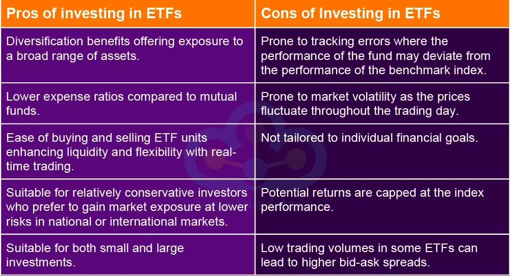

## Table of Contents

## What is a Yen ETF?

A Yen ETF, or Exchange Traded Fund, is a type of investment fund that tracks the value of the Japanese yen against other currencies. It allows investors to buy and sell shares of the fund on a stock exchange, just like they would with stocks. This makes it easier for people to invest in the yen without having to directly trade in the foreign exchange market, which can be complex and risky.

Yen ETFs are popular among investors who want to diversify their portfolios or hedge against currency fluctuations. For example, if an investor thinks the yen will get stronger compared to the U.S. dollar, they might buy shares in a Yen ETF to potentially profit from this change. These funds can be a useful tool for managing risk and taking advantage of movements in the currency market.

## How does a Yen ETF work?

A Yen ETF works by tracking the value of the Japanese yen against other currencies, like the U.S. dollar. When you buy shares in a Yen ETF, you're not buying yen directly. Instead, you're buying into a fund that holds yen or yen-related assets. The value of your shares goes up or down based on how the yen performs against other currencies. If the yen gets stronger, the value of your ETF shares usually goes up. If the yen gets weaker, the value of your shares usually goes down.

These ETFs are traded on stock exchanges, just like regular stocks. This means you can buy and sell shares whenever the market is open. It's easier than trading currencies directly on the foreign exchange market, which can be tricky and requires a lot of knowledge. Yen ETFs are a good way for people to invest in the yen without having to become experts in currency trading. They can help you diversify your investments or protect against changes in currency values.

## What are the main types of Yen ETFs available in the market?

There are mainly two types of Yen ETFs you can find in the market. The first type is called a currency ETF. This kind of ETF directly tracks the value of the yen against another currency, like the U.S. dollar. If you think the yen will get stronger compared to the dollar, you might buy shares in this ETF to make money from that change. These ETFs are simple and let you invest in the yen without having to trade currencies yourself.

The second type is called a currency-hedged ETF. This type of ETF is a bit more complex. It invests in foreign assets, like stocks or bonds, but it uses financial tools to protect against changes in the yen's value. This means if the yen gets weaker, the ETF tries to keep your investment safe. These ETFs are good if you want to invest in foreign markets but don't want to worry about the yen's ups and downs. Both types of Yen ETFs can help you manage your investments and take advantage of currency movements.

## What are the advantages of investing in Yen ETFs?

Investing in Yen ETFs can be a good way to diversify your investments. When you put your money into different types of investments, you spread out your risk. If one investment goes down, another might go up. Yen ETFs let you invest in the Japanese yen without having to trade currencies directly, which can be hard and risky. By adding a Yen ETF to your portfolio, you can balance out your investments and maybe make money if the yen gets stronger.

Another advantage is that Yen ETFs can help you protect against changes in currency values. If you have investments in other countries, changes in the yen can affect how much money you make. By investing in a Yen ETF, you can hedge against these changes. This means you can reduce the risk that comes from the yen getting weaker or stronger. Yen ETFs are easy to buy and sell on stock exchanges, so you can quickly adjust your investments as the market changes.

## What are the disadvantages of investing in Yen ETFs?

One big disadvantage of investing in Yen ETFs is that they can be risky. The value of the yen can go up and down a lot because of things like Japan's economy, interest rates, and what's happening in the world. If the yen gets weaker, the value of your ETF shares will go down, and you could lose money. Also, Yen ETFs often have fees that you have to pay, like management fees. These fees can add up over time and eat into your profits.

Another thing to think about is that Yen ETFs might not be the best choice for everyone. If you don't know a lot about how currencies work, it can be hard to understand when to buy or sell Yen ETFs. You might make bad choices and lose money. Also, if you're looking for a quick way to make money, Yen ETFs might not be the best option. They are usually better for long-term investing, and it can take time to see good results.

## How can Yen ETFs help in diversifying an investment portfolio?

Yen ETFs can help you spread out your investments by adding something different to your portfolio. When you invest in different things, like stocks, bonds, and currencies, you're not putting all your eggs in one basket. If one part of your investments goes down, another part might go up. Yen ETFs let you invest in the Japanese yen, which can move differently from other investments. This means if the yen gets stronger, your Yen ETF shares could go up, helping to balance out any losses you might have in other areas of your portfolio.

Adding Yen ETFs to your investments can also protect you from changes in currency values. If you have money in other countries, the value of the yen can affect how much money you make. By investing in a Yen ETF, you can hedge against these changes. This means you can reduce the risk that comes from the yen getting weaker or stronger. Yen ETFs are easy to buy and sell on stock exchanges, so you can quickly adjust your investments as the market changes. This flexibility can help you manage your portfolio better and take advantage of opportunities in the currency market.

## What are the risks associated with Yen ETFs?

Investing in Yen ETFs can be risky because the value of the yen can change a lot. Things like Japan's economy, interest rates, and what's happening around the world can make the yen go up or down. If the yen gets weaker, the value of your ETF shares will go down, and you could lose money. Also, Yen ETFs have fees that you have to pay, like management fees. These fees can add up over time and take away from the money you make.

Another risk is that Yen ETFs might not be right for everyone. If you don't know a lot about how currencies work, it can be hard to know when to buy or sell Yen ETFs. You might make bad choices and lose money. Also, if you're looking for a quick way to make money, Yen ETFs might not be the best option. They are usually better for long-term investing, and it can take time to see good results.

## How do currency fluctuations affect Yen ETFs?

Currency fluctuations can have a big impact on Yen ETFs. When the value of the yen goes up or down compared to other currencies, like the U.S. dollar, it changes the value of the ETF shares. If the yen gets stronger, the price of the Yen ETF usually goes up because the ETF is tracking the yen's value. On the other hand, if the yen gets weaker, the price of the ETF goes down. This means that if you think the yen will get stronger, you might buy a Yen ETF to make money from that change.

But, currency fluctuations can also make Yen ETFs risky. Things like Japan's economy, interest rates, and global events can cause the yen to move a lot. If the yen suddenly drops in value, you could lose money on your ETF shares. It's important to keep an eye on what's happening in the world and understand how these things might affect the yen. That way, you can make better choices about when to buy or sell your Yen ETF shares.

## What should be considered when choosing a Yen ETF?

When choosing a Yen ETF, you should think about what you want to achieve with your investment. Are you looking to make money if the yen gets stronger, or do you want to protect your other investments from changes in the yen's value? There are different types of Yen ETFs, like currency ETFs that track the yen directly and currency-hedged ETFs that invest in foreign assets but protect against yen fluctuations. Knowing your goals will help you pick the right kind of ETF.

You should also look at the fees and costs of the ETF. All ETFs have fees, like management fees, that can eat into your profits over time. It's a good idea to compare different Yen ETFs to see which one has the lowest fees. Another thing to consider is how much the ETF trades. Some ETFs are more popular and have more buyers and sellers, which can make it easier to buy and sell your shares. By thinking about these things, you can choose a Yen ETF that fits your needs and helps you reach your investment goals.

## How do Yen ETFs compare to other currency ETFs?

Yen ETFs are a type of currency ETF that focus on the Japanese yen. They work a lot like other currency ETFs, which track the value of different currencies like the euro or the British pound. The main difference is that Yen ETFs are all about the yen, so if you think the yen will get stronger or weaker compared to other currencies, you might want to buy a Yen ETF. Other currency ETFs let you invest in different currencies, so you can choose the one you think will do well.

One thing to think about is that all currency ETFs can be risky because currency values can change a lot. But Yen ETFs might be a bit different because Japan's economy and what's happening in the world can affect the yen in unique ways. For example, if there's a big event in Japan, it might make the yen go up or down more than other currencies. So, when you're choosing between a Yen ETF and another currency ETF, you should think about what's happening in Japan and how it might affect the yen compared to other currencies.

## What are the tax implications of investing in Yen ETFs?

When you invest in Yen ETFs, you need to think about taxes. If you make money from your ETF, you might have to pay capital gains tax. This is a tax on the profit you make when you sell your ETF shares for more than you paid for them. The tax rate can be different depending on how long you held the ETF. If you held it for a year or less, it's called a short-term capital gain, and you'll pay your regular income tax rate. If you held it for more than a year, it's a long-term capital gain, and the tax rate is usually lower.

Another thing to consider is that some Yen ETFs might pay out dividends. If you get dividends, you'll have to pay taxes on that income too. The tax rate on dividends can also be different based on how long you've held the ETF. It's a good idea to talk to a tax advisor to understand all the tax rules and how they might affect your investment in Yen ETFs. They can help you figure out the best way to manage your taxes and keep more of your money.

## How have Yen ETFs performed historically, and what are the future outlooks?

Historically, Yen ETFs have had ups and downs, just like the yen itself. Over the years, the yen has gone through periods of being strong and weak compared to other currencies like the U.S. dollar. For example, during times of economic uncertainty or when Japan's economy was doing well, the yen often got stronger, which could mean good returns for people who invested in Yen ETFs. But when Japan's economy struggled or there were big events in the world, the yen could get weaker, leading to losses for Yen ETF investors. So, the performance of Yen ETFs really depends a lot on what's happening with the yen and the global economy.

Looking to the future, it's hard to say exactly how Yen ETFs will do because so many things can affect the yen's value. Things like Japan's economic policies, interest rates, and what's happening around the world will all play a role. If Japan's economy does well and the yen gets stronger, Yen ETFs could do well too. But if there are problems in Japan or the world, the yen might get weaker, which could hurt Yen ETFs. It's a good idea to keep an eye on these factors and maybe talk to a financial advisor to get a better idea of what might happen with Yen ETFs in the future.

## References & Further Reading

[1]: ["Advances in Financial Machine Learning"](https://www.amazon.com/Advances-Financial-Machine-Learning-Marcos/dp/1119482089) by Marcos Lopez de Prado

[2]: ["Quantitative Trading: How to Build Your Own Algorithmic Trading Business"](https://github.com/LucindaYa/quant-resources/blob/master/Quantitative%20Trading%20How%20to%20Build%20Your%20Own%20Algorithmic%20Trading%20Business.pdf) by Ernest P. Chan

[3]: ["Machine Learning for Algorithmic Trading"](https://github.com/stefan-jansen/machine-learning-for-trading) by Stefan Jansen

[4]: ["Evidence-Based Technical Analysis: Applying the Scientific Method and Statistical Inference to Trading Signals"](https://www.amazon.com/Evidence-Based-Technical-Analysis-Scientific-Statistical/dp/0470008741) by David Aronson

[5]: Bergstra, J., Bardenet, R., Bengio, Y., & Kégl, B. (2011). ["Algorithms for Hyper-Parameter Optimization."](https://dl.acm.org/doi/10.5555/2986459.2986743) Advances in Neural Information Processing Systems 24.