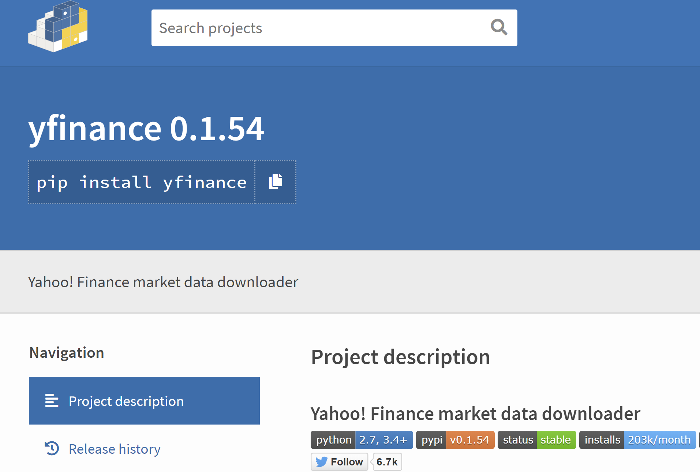

Algorithmic trading, commonly known as algo trading, represents a transformative approach to executing trading strategies. By employing computer algorithms, traders can automatically conduct transactions with precision and at speeds and frequencies unachievable by human intervention. This technology enables the exploitation of market opportunities, optimizing trading efficiency and execution timeliness.

As these automated systems continue to grow in complexity and use, the importance of accessing accurate and timely financial data becomes paramount. Effective algo trading depends heavily on comprehensive datasets that reflect current market conditions, historical trends, and various financial metrics. This is precisely where yfinance comes into play as a critical tool for algorithmic traders.



The yfinance library, written in Python, offers a robust solution for extracting historical and real-time market data needed by traders. By providing an easy-to-access interface to Yahoo Finance's extensive data repository, yfinance allows traders to seamlessly capture and integrate financial data into their analytic and trading systems. This includes historical price data for backtesting strategies, real-time updates for live trading, and additional insights from corporate actions and financial fundamentals.

In this article, we will discuss the integral role of yfinance in supporting algotrading efforts, highlighting its key features and demonstrating how it can be effectively integrated into trading strategies. For traders of all levels, from novices embarking on their algorithmic trading journey to seasoned professionals seeking to refine their existing strategies, leveraging tools like yfinance can significantly broaden their trading horizons and capabilities.

By embracing technologies and methodologies that enhance data acquisition and processing, traders can optimize their algorithmic strategies to meet the demands of modern markets, ultimately paving the way for more informed and successful trading decisions.

## Table of Contents

## Understanding Yfinance

Yfinance is a widely-used Python library designed to facilitate easy access to financial data directly from Yahoo Finance. Its popularity stems from its user-friendly interface and the comprehensive range of data it offers. Users can seamlessly download historical prices, examine fundamental data, and view market summaries, all of which contribute to informed decision-making in trading and investment strategies.

Originally, yfinance was developed as an alternative to Yahoo's deprecated APIs, which previously provided access to financial data. With the discontinuation of these APIs, yfinance emerged as a critical tool for Python-based traders and data scientists seeking a reliable source of financial information. The library's ability to furnish historical and real-time market data has made it an essential component in the toolkit of algorithmic traders.

Yfinance enables traders to gather data across various asset classes, encompassing stocks, exchange-traded funds (ETFs), mutual funds, and indices. This versatility makes it an attractive choice for those devising a diverse array of trading strategies. Understanding how yfinance functions can reveal its contribution to effective trading and data analysis.

The library operates by allowing users to specify the financial instruments and timeframes they are interested in, retrieving the data accordingly. The following Python code example demonstrates how to use yfinance to download historical price data for a specific stock:

```python
import yfinance as yf  # For more datasets, visit: https://paperswithbacktest.com/datasets

# Define the ticker symbol
ticker_symbol = 'AAPL'

# Get historical market data
ticker_data = yf.download(ticker_symbol, start='2022-01-01', end='2023-01-01')

# Print the data
print(ticker_data)
```

This code downloads the historical price data for Apple Inc. from January 1, 2022, to January 1, 2023. The `yf.download()` function is particularly valuable for aggregating large datasets that can be utilized in [backtesting](/wiki/backtesting) trading algorithms or conducting financial research.

Beyond historical data, yfinance also offers functionalities for retrieving real-time data, exploring corporate actions like dividends and stock splits, and analyzing company fundamentals. Its API facilitates seamless integration into various [algorithmic trading](/wiki/algorithmic-trading) frameworks, thereby enhancing the development and testing of robust trading models. With these capabilities, yfinance stands as a cornerstone resource for traders aiming to construct well-informed, data-driven strategies.

## Key Features of Yfinance for Algo Trading

Yfinance offers several features that make it particularly valuable for algorithmic trading applications:

1. **Historical Market Data**: One of the most fundamental aspects of algorithmic trading is the ability to backtest strategies against historical market data. Yfinance enables users to download historical price data at daily, weekly, and monthly intervals. This extensive range of data allows traders to simulate how their strategies would have performed in past market conditions, aiding in refining and optimizing trading algorithms. This data can be accessed using the `yf.download()` function, where users can specify the ticker, start and end dates, and the interval of the data required.

    ```python
    import yfinance as yf  # For more datasets, visit: https://paperswithbacktest.com/datasets

    # Example of downloading historical data
    data = yf.download("AAPL", start="2020-01-01", end="2021-01-01", interval="1d")
    ```

2. **Real-Time Data Access**: For strategies that require current market conditions, such as live trading systems, Yfinance offers the ability to fetch real-time stock data. This feature allows traders to implement strategies that can react to market movements promptly. However, users should be aware of latency issues, especially for high-frequency trading applications, as the data may not always be true real-time.

    ```python
    # Fetching real-time data for a stock
    ticker = yf.Ticker("AAPL")
    real_time_data = ticker.history(period="1d")
    ```

3. **Corporate Actions and Dividends**: Yfinance provides data on corporate actions, which include stock splits, dividends, and other significant events. This information is crucial for adjusting trading models to ensure accuracy. For instance, when a stock splits, the historical data is adjusted to reflect the split, maintaining consistency in the data used for backtesting and live trading.

    ```python
    # Accessing corporate actions and dividends
    splits = ticker.splits
    dividends = ticker.dividends
    ```

4. **Fundamental Data**: Yfinance offers fundamental financial data that can be utilized for in-depth analysis of a company’s health and valuation. This includes financial statements and valuation metrics. Traders can incorporate this data into their strategies to make more informed decisions based on the intrinsic value of assets, beyond just price movements.

    ```python
    # Accessing fundamental data
    financials = ticker.financials
    balance_sheet = ticker.balance_sheet
    ```

5. **Easy Integration**: The design of Yfinance's API allows for straightforward integration with several algorithmic trading platforms and frameworks, such as QuantConnect and Backtrader. This ease of use facilitates the development of more complex trading strategies, enabling traders to utilize advanced features of these platforms in combination with the data from Yfinance.

    ```python
    # Basic integration with a trading strategy framework
    import backtrader as bt

    class MyStrategy(bt.Strategy):
        # Define the strategy
        pass

    cerebro = bt.Cerebro()
    cerebro.addstrategy(MyStrategy)

    # Use yfinance data
    data = bt.feeds.PandasData(dataname=data)
    cerebro.adddata(data)
    ```

Yfinance's features, from comprehensive historical data to easy API integration, serve as a robust foundation for traders seeking to enhance their algorithmic trading capabilities. By leveraging these tools, traders can develop, backtest, and execute sophisticated trading strategies with greater efficiency.

## Implementing Yfinance in Your Trading Strategy

Integrating yfinance into an algorithmic trading strategy begins with the essential task of setting up a Python environment. This can be done using platforms like Anaconda or virtual environments to ensure that dependencies are managed effectively. The installation of the yfinance library is straightforward and can be achieved using the Python package manager pip with the command: 

```bash
pip install yfinance
```

Once yfinance is installed, the next step is to utilize its functions for data retrieval. The `yf.download()` function is commonly used to obtain historical market data, which is critical for the development and backtesting of trading algorithms. An example of using `yf.download()` to fetch historical data for a specific stock is shown below:

```python
import yfinance as yf  # For more datasets, visit: https://paperswithbacktest.com/datasets

# Download historical data for a given ticker
data = yf.download('AAPL', start='2020-01-01', end='2023-10-01', interval='1d')

# Display the first few rows of the data
print(data.head())
```

For accessing detailed information about a specific stock, including real-time data, the `yf.Ticker()` function serves as an invaluable tool. This function can be used to extract various data aspects, such as current market price, historical financials, and corporate actions. Here is a simple example:

```python
# Instantiate a Ticker object for Apple
apple = yf.Ticker('AAPL')

# Get the current market price
market_price = apple.history(period="1d")['Close'][-1]
print(f"Current market price of AAPL: {market_price}")
```

After acquiring the data, it becomes crucial to analyze and visualize it to uncover patterns or trends that can inform trading strategies. Python libraries such as pandas, matplotlib, and scikit-learn (sklearn) can be employed for this purpose. For example, pandas can be used to manipulate data, matplotlib for plotting, and sklearn for implementing [machine learning](/wiki/machine-learning) algorithms. Here's a hypothetical workflow:

1. **Data Cleaning and Preparation:**

```python
import pandas as pd

# Fill missing data
data.fillna(method='bfill', inplace=True)
```

2. **Data Visualization:**

```python
import matplotlib.pyplot as plt

# Plot the closing price
data['Close'].plot(title='AAPL Closing Prices')
plt.xlabel('Date')
plt.ylabel('Price (USD)')
plt.show()
```

3. **Strategy Development and Backtesting:**

```python
from sklearn.model_selection import train_test_split
from sklearn.ensemble import RandomForestRegressor

# Feature engineering and model preparation
features = data[['Open', 'High', 'Low', 'Volume']]
target = data['Close']

# Split data into training and test sets
X_train, X_test, y_train, y_test = train_test_split(features, target, test_size=0.2, random_state=42)

# Train a model
model = RandomForestRegressor(n_estimators=100, random_state=42)
model.fit(X_train, y_train)

# Predict and assess model performance
predictions = model.predict(X_test)
```

By leveraging yfinance's capabilities, traders can efficiently develop advanced trading algorithms that respond dynamically to market conditions. These capabilities enable the optimization of decision-making processes and the creation of adaptable trading strategies that can withstand varying market environments, ultimately enhancing trading performance.

## Best Practices and Challenges

While yfinance is a powerful tool for extracting financial data, effective utilization entails adhering to certain best practices and overcoming specific challenges. 

A critical first step is ensuring the integrity of the data acquired. Data preprocessing involves cleansing the downloaded information and checking for anomalies. This is vital for accurate predictions in modeling and algorithmic trading. Anomalies can include missing values, outliers, or incorrect data entries, which can be detected using statistical methods such as standard deviation checks or visual inspections like plotting.

```python
import yfinance as yf  # For more datasets, visit: https://paperswithbacktest.com/datasets
import pandas as pd

# Example of downloading data
ticker = 'AAPL'
data = yf.download(ticker, start='2022-01-01', end='2023-01-01')

# Anomaly detection: Checking for missing values
if data.isnull().values.any():
    print("Data contains null values")

# Removing rows with null values
clean_data = data.dropna()
```

Staying informed about updates and potential limitations of the yfinance library is another fundamental practice. Since yfinance depends on Yahoo Finance's data policies, any changes or restrictions in these policies may affect data availability or accuracy. Regularly checking the yfinance GitHub repository and user forums can keep traders up-to-date with any changes.

A significant challenge is understanding the limitations of yfinance's real-time data capabilities. For high-frequency trading models, data latency can pose a problem, potentially impacting trading performance. While yfinance provides a reasonable facsimile of real-time data, it may not offer the speed and precision required for sub-second trading strategies. In such cases, traders might consider combining yfinance with other services specialized in low-latency data feeds.

Continual testing and updating of trading algorithms are imperative. The dynamic nature of financial markets requires that models be iteratively refined and validated with new data to maintain effectiveness. Adaptive algorithms that can modify themselves based on market conditions offer increased robustness against changing market dynamics.

By adopting these practices and remaining cognizant of the associated challenges, traders can leverage yfinance to its fullest potential, optimizing their algorithmic strategies for better trading outcomes.

## Conclusion

Yfinance is a valuable resource for algorithmic traders due to its comprehensive data access and ease of use. This Python library provides the necessary historical and real-time financial data that are critical for developing, testing, and refining trading strategies. By integrating yfinance into trading systems, traders enhance their capability to execute more informed and timely trades, which can lead to better execution outcomes and improved profitability.

Despite the advantages yfinance offers, there are challenges to its use. Data anomalies, latency issues, and potential updates to Yahoo Finance's data access policies are factors that traders should be aware of. Addressing these challenges involves adhering to best practices, such as rigorous data cleansing and continuous algorithm testing. By staying informed about library updates and understanding its limitations, traders can overcome these hurdles and ensure that yfinance contributes optimally to their trading systems.

As financial markets become increasingly complex, tools like yfinance are essential for maintaining a competitive edge. They not only provide the data necessary for comprehensive market analysis but also help traders keep pace with market developments swiftly. By embracing the capabilities of yfinance, traders can elevate their algorithmic trading strategies, making them more robust, efficient, and responsive to changing market conditions.

## References & Further Reading

[1]: ["Yahoo Finance Data with Python"](https://www.geeksforgeeks.org/get-financial-data-from-yahoo-finance-with-python/) on Real Python

[2]: ["Advances in Financial Machine Learning"](https://www.amazon.com/Advances-Financial-Machine-Learning-Marcos/dp/1119482089) by Marcos Lopez de Prado

[3]: Stefan Jansen. ["Machine Learning for Algorithmic Trading: Predictive Models to Extract Signals from Market and Alternative Data for Systematic Trading Strategies with Python."](https://www.amazon.com/Machine-Learning-Algorithmic-Trading-alternative/dp/1839217715)

[4]: Ernest P. Chan. ["Quantitative Trading: How to Build Your Own Algorithmic Trading Business."](https://www.amazon.com/Quantitative-Trading-Build-Algorithmic-Business/dp/0470284889)

[5]: David Aronson. ["Evidence-Based Technical Analysis: Applying the Scientific Method and Statistical Inference to Trading Signals."](https://www.amazon.com/Evidence-Based-Technical-Analysis-Scientific-Statistical/dp/0470008741)

[6]: ["Efficiently Download Historical Stock Data From Yahoo Finance With Python."](https://stackoverflow.com/questions/12433076/download-history-stock-prices-automatically-from-yahoo-finance-in-python) - Towards Data Science on Medium