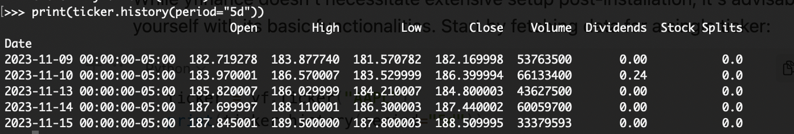

# Introduction

Yahoo Finance, established in 1997, has always been a central hub for retail investors and professionals alike. This platform provides a wealth of financial data, including stock quotes, financial reports, and breaking news. It's a go-to destination for real-time data and market insights that empowers millions to make informed investment decisions.

yfinance, often recognized as the "Yahoo Finance market data downloader," offers a robust Python interface to fetch this data. This library, not officially affiliated with Yahoo Finance, allows users to extract a plethora of financial data with simple Python commands, eliminating the need for manual downloads or web scraping.

Its introduction revolutionized the way data enthusiasts, from casual hobbyists to professional quant analysts, accessed and analyzed Yahoo Finance data. With a seamless integration into Python's ecosystem, yfinance provides access to historical market data, real-time data, options data, and more, bridging the gap between raw financial information and actionable insights.

# Understanding yfinance

yfinance, colloquially known as the "Yahoo Finance market data downloader", is a Python library that serves as a powerful interface to fetch financial data from Yahoo Finance. Its functionality isn't limited to fetching historical or real-time stock data. It extends to obtaining data on options, tickers, sustainability, dividends, and much more. Designed for ease of use, yfinance ensures that even those with minimal programming knowledge can download extensive datasets with just a few lines of Python code[1].

Its rise in popularity is attributable to several factors:

1. **Simplicity**: yfinance abstracts the complexities, allowing users to fetch vast amounts of data with concise commands.
2. **Versatility**: It offers a range of data points from historical price data to dividends, from sustainability metrics to options data.
3. **Efficiency**: Bypassing the need for an API key, it directly scrapes the data, saving time and effort.

Regarding costs, yfinance itself is open source and free to use[2]. However, potential users should be aware that while the library doesn't have inherent costs, excessive querying might lead to temporary IP bans due to Yahoo Finance's terms of service.

Pros of yfinance:

- **Ease of Use**: With a simple syntax, it caters to both novices and experts.
- **Comprehensive Data**: yfinance isn't limited to stock prices. It spans various financial metrics, making it a one-stop-shop for financial data.
- **No API Key Requirement**: It operates without necessitating an API key, streamlining the data fetching process.

Cons of yfinance:

- **Unofficial**: Since yfinance isn't an official product of Yahoo, any changes in Yahoo Finance's structure or policies might disrupt the library's functionality.
- **Rate Limiting Concerns**: Fetching data aggressively might lead to temporary IP bans.
- **Reliability**: Given its unofficial nature, there might be moments of downtime or inconsistencies.

In comparison to other alternatives:

- **RapidAPI**: RapidAPI offers a more structured and official way to access Yahoo Finance data. However, it often comes with associated costs, tiered plans, and requires handling API keys[3].
- **yahoo_fin**: Similar in spirit to yfinance, yahoo_fin is another Python wrapper that fetches data from Yahoo Finance. While both libraries have overlapping functionalities, their methodologies differ. yahoo_fin, for example, includes functions specific to scraping financial statements[4].

In conclusion, while yfinance offers a fantastic and straightforward way to access Yahoo Finance data, understanding its strengths, limitations, and alternatives empowers users to make more informed data-fetching decisions.

# Diving into the Installation

Installing yfinance is straightforward, and it is compatible with various Python environments. Whether you're a fan of `pip` or a `conda` enthusiast, we've got you covered.

**Using pip:**

For those who prefer the traditional pip package manager, executing the following command in your terminal or command prompt will install yfinance:

```bash
pip install yfinance --upgrade --no-cache-dir
```

The `--upgrade` flag ensures you're getting the latest version, and `--no-cache-dir` bypasses the cache, ensuring a fresh installation.

**Using Conda:**

If you're working within an Anaconda environment or prefer Conda for package management, you can install yfinance from the `conda-forge` channel:

```bash
conda install -c conda-forge yfinance
```

**Verifying the Installation:**

After installation, it's a good practice to verify that everything was set up correctly. Open your Python environment (this can be the Python REPL, Jupyter notebook, or any other IDE you use for Python scripting) and run the following:

```python
import yfinance as yf
print(yf.__version__)
```

This command will import yfinance and print its version. If you don't encounter any errors and see the version printed, you're good to go.

**Initial Setup:**

While yfinance doesn't necessitate extensive setup post-installation, it's advisable to familiarize yourself with its basic functionalities. Start by fetching data for a single ticker:

```python
ticker = yf.Ticker("AAPL")
print(ticker.history(period="5d"))
```



The above code retrieves the last five days of historical market data for Apple Inc. This quick test ensures yfinance is communicating correctly with Yahoo Finance's servers and fetching data.

To ensure the smoothest experience with yfinance, always refer to its official documentation or related forums if you encounter any hitches during the installation process.

# In-Depth Tutorials: Extracting Financial Data

## Historical Data Retrieval

Understanding how to fetch historical data is foundational when using yfinance. With its intuitive functions, acquiring market data from Yahoo Finance becomes a breeze. Here’s a dive into the ways you can fetch historical data:

**Single Ticker Extraction:**

To extract data for a single ticker, you'll use the `Ticker` object. This object provides an interface to query data about the particular stock or asset:

```python
import yfinance as yf

# Define the ticker symbol
ticker_symbol = "AAPL"

# Create a Ticker object
ticker = yf.Ticker(ticker_symbol)

# Fetch historical data
data = ticker.history(period="1y")
print(data)
```


This code fetches the historical data for Apple Inc. for the past year.

**Bulk Extraction for Multiple Tickers:**

If you need to extract data for multiple tickers simultaneously, `download` function is at your service. This function can handle requests for multiple tickers and return a consolidated DataFrame:

```python
tickers_list = ["AAPL", "MSFT", "GOOGL"]
data = yf.download(tickers_list, start="2020-01-01", end="2021-01-01")
print(data)
```


This fetches data for Apple, Microsoft, and Alphabet (Google) for the specified date range.

**Timeframes and Data Granularity:**

yfinance offers flexibility in terms of the timeframe and granularity of data you can retrieve. The `period` parameter in the `history` method allows you to specify timeframes like `1d` (1 day), `5d` (5 days), `1mo` (1 month), `1y` (1 year), etc.

Additionally, you can define granularity using the `interval` parameter, choosing values such as `1m` (1 minute), `1h` (1 hour), `1d` (1 day), etc.

```python
# Fetching 60 days of data with 1-hour granularity for Apple
data = ticker.history(period="60d", interval="1h")
print(data)
```


**Python Example:**

Here's a consolidated example that extracts historical data for three tickers over a specified date range with daily granularity:

```python
import yfinance as yf

# List of tickers
tickers_list = ["AAPL", "MSFT", "GOOGL"]

# Fetch data
data = yf.download(tickers_list, start="2020-01-01", end="2021-01-01", interval="1d")

# Display data
print(data.head())
```


Harnessing the power of yfinance for historical data retrieval not only simplifies the process but also ensures access to accurate and comprehensive data.

## Fetching Fundamental Data

When we speak of "fundamental data", it encapsulates the core financial metrics and information which is pivotal for investors and analysts to evaluate a company's financial health and potential for future growth. With `yfinance`, extracting this data is straightforward.

**Basic Financial Ratios:**

These are numerical values derived from a company's financial statements. They help analyze the company's performance and financial stability. With `yfinance`, you can retrieve ratios such as Price-to-Earnings (P/E), Debt-to-Equity, and more.

```python
import yfinance as yf

ticker = yf.Ticker("AAPL")
ratios = ticker.info

# Extracting P/E Ratio
pe_ratio = ratios['trailingPE']

# Extracting Debt-to-Equity Ratio
de_ratio = ratios['debtToEquity']

print(f"P/E Ratio: {pe_ratio}, Debt-to-Equity Ratio: {de_ratio}")
```


**Dividends, Earnings, and More:**

Historical dividends and stock splits can be fetched using the `dividends` and `splits` attributes respectively.

```python
dividends = ticker.dividends
print(dividends)

splits = ticker.splits
print(splits)
```


**Comparisons Across Tickers:**

To draw comparisons on fundamental metrics between different companies, one can structure the data retrieval in a loop:

```python
tickers_list = ["AAPL", "MSFT", "GOOGL"]
data = {}

for symbol in tickers_list:
    t = yf.Ticker(symbol)
    data[symbol] = {
        'P/E Ratio': t.info['trailingPE'],
        'Debt-to-Equity Ratio': t.info['debtToEquity']
    }

print(data)
```


**Python Example:**

For a quick insight, let's fetch the P/E Ratio and Debt-to-Equity Ratio for Apple Inc., Microsoft, and Alphabet.

```python
import yfinance as yf

tickers_list = ["AAPL", "MSFT", "GOOGL"]
fundamentals = {}

for symbol in tickers_list:
    t = yf.Ticker(symbol)
    fundamentals[symbol] = {
        'P/E Ratio': t.info.get('trailingPE', None),
        'Debt-to-Equity Ratio': t.info.get('debtToEquity', None),
        'Dividends': t.dividends.tolist()
    }

print(fundamentals)
```


Harnessing `yfinance` for fundamental data provides an efficient way to analyze and interpret a company's financial position, which is instrumental in investment decisions.

## Trading Data Extraction

Trading data is the lifeblood for traders, giving them essential insights into market dynamics, liquidity, and the broader sentiment surrounding a security. With `yfinance`, accessing these vital metrics is straightforward.

**Metrics: Market Cap, Volume, and Volatility:**

- **Market Cap**: Represents the total market value of a company's outstanding shares of stock. It's calculated by multiplying the company's share price by its total number of outstanding shares.
- **Volume**: Indicates the number of shares or contracts traded in a security or an entire market during a given period. It's a measure of liquidity and activity in the market.
- **Volatility**: Measures the price fluctuations of a security over time. A high volatility indicates that the price of the security can change dramatically over a short time period in either direction, while low volatility indicates that a security's price does not fluctuate dramatically.

Using `yfinance`, these metrics can be accessed as follows:

```python
import yfinance as yf

ticker = yf.Ticker("AAPL")
info = ticker.info

market_cap = info['marketCap']
volume = info['volume']
volatility = info['52WeekChange']

print(f"Market Cap: ${market_cap}, Volume: {volume}, 52-Week Change (as a proxy for volatility): {volatility*100}%")
```


**Python Example:**

Let's extract trading data for three tech giants: Apple Inc. (`AAPL`), Microsoft (`MSFT`), and Alphabet (`GOOGL`).

```python
tickers_list = ["AAPL", "MSFT", "GOOGL"]
trading_data = {}

for symbol in tickers_list:
    t = yf.Ticker(symbol)
    trading_data[symbol] = {
        'Market Cap': t.info['marketCap'],
        'Volume': t.info['volume'],
        '52-Week Change': t.info['52WeekChange']
    }

print(trading_data)
```


With `yfinance`, not only do traders get a window into the market dynamics of individual securities, but they can also swiftly compare and analyze data across multiple tickers, aiding in the development of comprehensive trading strategies.

## Advanced: Options Data

Options are financial derivatives that give buyers the right, but not the obligation, to buy or sell an underlying asset at an agreed-upon price before a certain date. They are versatile instruments and can be used for hedging, income generation, and directional trading, among other strategies.

When dealing with options, two primary classifications emerge:

1. **Calls**: Options that give the holder the right to buy an asset.
2. **Puts**: Options that give the holder the right to sell an asset.

For each type of option, there are expiration dates. The expiration date is the date after which the option is no longer valid and cannot be exercised.

`yfinance` provides a way to extract options data, including calls, puts, and their expiration dates, for a given ticker.

**Python Example**:

To retrieve options data for Apple Inc. (`AAPL`):

```python
import yfinance as yf

# Define the ticker
ticker = yf.Ticker("AAPL")

# Get options expiration dates
expiration_dates = ticker.options

# Print the first expiration date for demonstration
first_expiration = expiration_dates[0]
print(f"First expiration date: {first_expiration}")

# Fetch call and put option data for the first expiration date
calls_data = ticker.option_chain(first_expiration).calls
puts_data = ticker.option_chain(first_expiration).puts

print("\\nCalls Data for the first expiration date:")
print(calls_data.head())  # Displaying top 5 rows for brevity

print("\\nPuts Data for the first expiration date:")
print(puts_data.head())  # Displaying top 5 rows for brevity
```


This script will print the call and put options data for the first available expiration date of the Apple stock. The data includes important metrics like strike price, last traded price, bid, ask, volume, and implied volatility.

Using `yfinance`, traders and analysts can dive deep into the options market, evaluating contract specifications and assessing potential opportunities[5].

## Special Segment: Institutional Holders Analysis

Institutional holders, often referred to as "big players" in the finance world, are entities like mutual funds, pension funds, and insurance companies that manage large portfolios. Their investment decisions can significantly influence stock prices, given the sheer volume of shares they handle. Analyzing their positions and movements offers insights into potential market trends and stock attractiveness.

With `yfinance`, you can fetch data regarding these institutional holders for a given stock, including the percentage of shares held, and the total number of shares owned.

**Python Example**:

To retrieve institutional holders data for Apple Inc. (`AAPL`):

```python
import yfinance as yf

# Define the ticker
ticker = yf.Ticker("AAPL")

# Get institutional holders data
institutional_holders = ticker.institutional_holders

print(institutional_holders)
```


This script will display a table containing institutional holders of Apple stock, their holdings as a percentage of the total shares, and the total number of shares they own.

For a more detailed analysis, consider combining this data with historical stock price data, news sentiment, or earnings reports. By doing so, you can ascertain the potential correlation between institutional holder movements and stock price fluctuations, enhancing your trading or investment strategy[6].

# Visualizing and Analyzing Data

## Visualization Tools

Visual representation of financial data is a cornerstone for traders, investors, and analysts. While numbers and statistics can provide the details, charts offer a snapshot of market sentiment, price movements, and potential trends. Among various chart types, candlestick charts are one of the most favored in finance due to their ability to depict more information in a single graphic.

`yfinance` seamlessly retrieves data suitable for crafting these charts. For more sophisticated visualizations, integrating it with libraries like `finplot` and `matplotlib` augments the capability manifold.

**Crafting Candlestick Charts:**

Candlestick charts, originating from 17th century Japan, represent four key price points in a specified time frame: open, high, low, and close (OHLC). Each "candle" in the chart provides insights into the market's movement within that time frame.

While `yfinance` fetches the data, `matplotlib` and `finplot` transform it into visually appealing and informative charts.

**Python Example:**

To draw a candlestick chart for Apple Inc. (`AAPL`) over the last month:

```python
import yfinance as yf
import mplfinance as mpf

# Fetch data
data = yf.download("AAPL", start="2023-09-01", end="2023-10-01")

# Plotting using mplfinance
mpf.plot(data, type='candle', style='charles', title="AAPL Candlestick Chart for September 2023", ylabel="Price")
```


This script utilizes `mpl_finance`, a module in `matplotlib`, to create the candlestick chart.

**Changing OHLC Bar Sizes:**

The time frame for each bar or candle can be adjusted depending on your analysis requirements. Daily charts are common, but you might need hourly or even minutely data. By changing the `interval` parameter in the `yf.download()` method, you can adjust the granularity.

For example, to fetch hourly data, you'd modify the function call to:

```python
data = yf.download("AAPL", start="2023-09-01", end="2023-10-01", interval="1h")
```

**More Advanced Plotting Techniques:**

Beyond basic candlestick charts, consider integrating `finplot`, a dedicated financial plotting library[7]. It offers features like overlays for moving averages, zooming, panning, and more.

Remember, a visual representation not only simplifies data interpretation but can also highlight patterns that might get overlooked in tabulated data.

## Analysis Techniques

Financial analysis goes beyond mere data extraction. To extract value and insights from this data, several technical indicators and tools have been developed over the years. These indicators can help in identifying trends, predicting future price movements, and informing trading strategies.

**Indicators and Tools:**

1. **Moving Averages (MA)**: A widely-used tool to smoothen out short-term fluctuations and highlight longer-term trends. Two common types are Simple Moving Average (SMA) and Exponential Moving Average (EMA). The latter gives more weight to recent prices, reacting more quickly to price changes than the SMA.
2. **Bollinger Bands**: Consist of a middle band being an N-period simple moving average (SMA), an upper band at K times an N-period standard deviation above the middle band, and a lower band at K times an N-period standard deviation below the middle band. They can help in identifying the volatility and relative high or low of a price.
3. **Relative Strength Index (RSI)**: Measures the speed and change of price movements. RSI oscillates between zero and 100. Traditionally, and according to Wilder, RSI is considered overbought when above 70 and oversold when below 30.
4. **Moving Average Convergence Divergence (MACD)**: A trend-following momentum indicator that shows the relationship between two moving averages of a security’s price.

**Python Example:**

To calculate the 50-day Simple Moving Average and the Relative Strength Index for Apple Inc. (`AAPL`) over the last six months using `yfinance` and `pandas`:

```python
import yfinance as yf
import mplfinance as mpf

# Fetching data
data = yf.download("AAPL", start="2023-04-01", end="2023-10-01")

# Calculating 50-day Simple Moving Average
data['SMA50'] = data['Close'].rolling(window=50).mean()

# Calculating Relative Strength Index
delta = data['Close'].diff()
gain = (delta.where(delta > 0, 0)).fillna(0)
loss = (-delta.where(delta < 0, 0)).fillna(0)
avg_gain = gain.rolling(window=14).mean()
avg_loss = loss.rolling(window=14).mean()
rs = avg_gain / avg_loss
data['RSI'] = 100 - (100 / (1 + rs))

# Creating a figure and panels
apds = [mpf.make_addplot(data['SMA50']),  # For SMA
        mpf.make_addplot(data['RSI'], panel=1, color='orange', secondary_y=False)]  # For RSI

# Plotting the data with mplfinance
mpf.plot(data, type='ohlc', style='charles', addplot=apds, figratio=(10,8), 
         figscale=1.2, title='Apple Inc. Stock Analysis', volume=True,
         panel_ratios=(3,1), ylabel='Price', ylabel_lower='RSI')

# Note: The 'ohlc' type can be replaced with 'candle' for candlestick plots
```


In this example, the 50-day SMA provides a glimpse into the stock's underlying trend, while the RSI indicates potential overbought or oversold conditions[8]. Such indicators, when combined with other analysis techniques, can offer powerful insights into market dynamics.

# Best Practices and Tips

When utilizing `yfinance` for your financial data needs, efficiency and accuracy are paramount. Adopting best practices can not only enhance your user experience but also ensure the integrity of your data. Here's a roundup of some actionable tips to optimize your experience with `yfinance`.

1. **Smarter Scraping Techniques:**
    - **Throttling Requests**: While `yfinance` is designed to handle requests efficiently, it's advisable to introduce pauses between bulk data retrievals. This reduces the risk of IP bans and ensures smoother data extraction[9].
    - **Time Optimization**: Instead of pulling data daily, consider fetching weekly or monthly data if high granularity is not essential. This minimizes the number of requests and optimizes data transfer.
    - **Error Handling**: Introduce try-except blocks to manage potential errors during data retrieval. This can include exceptions for connectivity issues or if a particular ticker is not found.
2. **Managing Multi-level Columns and Data Structuring:**
    - **Flatten Multi-level Columns**: Sometimes, the data returned can have multi-level columns, especially when fetching data across various metrics. Use `pandas` to flatten these columns for easier data processing[10].
        
        ```python
        df.columns = [' '.join(col).strip() for col in df.columns.values]
        ```
        
    - **Data Type Consistency**: Ensure that the data types for columns remain consistent, especially when merging data from different sources. Use the `astype()` method in `pandas` to enforce consistent data types.
    - **Handling Missing Values**: Financial datasets can sometimes have missing values. Depending on the use-case, consider strategies like forward-fill, back-fill, or interpolation using `pandas` to handle such gaps.
3. **Timezone Considerations and Handling:**
    - **Awareness of Source Timezone**: Yahoo Finance provides data in the Eastern Time Zone (ET). Be aware of this when comparing data from different sources.
    - **Conversion**: If your analysis requires data in another timezone, use the `tz_convert()` function from `pandas` to adjust the timestamps[11].
        
        ```python
        df.index = df.index.tz_localize('EST').tz_convert('UTC')
        ```
        
    - **Daylight Saving**: When analyzing historical data, be cautious of daylight saving time changes. Time zone libraries like `pytz` can assist in handling these nuances.

While these best practices serve as a solid foundation, the evolving nature of both the finance world and the technology landscape means continuous learning and adaptation is essential. Always consult the official `yfinance` documentation and relevant forums for the most updated practices and methodologies.

# Real-Life Applications

The flexibility and depth of data provided by `yfinance` empower developers, traders, and financial analysts to build and execute a plethora of real-world applications. Here's how professionals are leveraging `yfinance` in their financial endeavors:

1. **Implementing Strategies Based on yfinance Data:**
    - **Backtesting**: Before deploying a trading strategy in the real market, it's essential to test its effectiveness on historical data. With `yfinance`, one can easily retrieve extensive datasets, enabling rigorous backtesting of trading algorithms.
    - **Market Analysis**: By fetching both historical and real-time data, analysts can study market trends, correlations, and volatilities to form market insights. This aids in making informed investment decisions.
    - **Risk Management**: With access to granular financial data, firms and individual investors can better assess the risk profile of their portfolios. Metrics such as Beta, standard deviation, and historical drawdowns become easily accessible.
    - **Portfolio Optimization**: By analyzing the historical returns and correlations of various assets, `yfinance` data aids in constructing efficient frontiers and maximizing the Sharpe ratio for portfolios.
2. **Integrating yfinance with Trading Bots and Algorithms:**
    - **Automated Data Feed**: Trading algorithms require a consistent and reliable feed of market data. `yfinance` seamlessly integrates with trading bots, ensuring they have the latest market information for decision-making.
    - **Signal Generation**: With the capability to fetch intricate details like stock splits, dividends, and earnings, trading bots can be programmed to act on specific events, generating buy or sell signals.
    - **Algorithmic Order Execution**: Once a trading decision is made, it can be automatically executed using integrated platforms. While `yfinance` provides the data, the actual trade order is often routed through broker-specific APIs.
    - **Real-time Monitoring and Alerts**: Integrating `yfinance` with monitoring tools allows traders to set up real-time alerts based on market conditions or specific stock movements, ensuring timely interventions when needed.

As the finance sector becomes more technologically driven, the utility of tools like `yfinance` will only increase. Whether you're a day trader looking for short-term opportunities or an analyst assessing long-term market dynamics, the applications built upon `yfinance` play a pivotal role in modern financial practices.

# Limitations and Precautions

While `yfinance` offers a plethora of benefits for financial data extraction, there are critical considerations that users should be aware of:

1. **When and When Not to Use yfinance**:
    - **Not For Live Trading**: While `yfinance` provides an extensive amount of data, its retrieval might experience occasional lags or downtimes. Relying on it for high-frequency or live trading scenarios can be risky, as even a slight delay in data can result in substantial financial implications.
    - **For Research and Analysis**: `yfinance` shines in research contexts where real-time data isn't strictly necessary. Whether it's backtesting trading strategies, conducting market research, or portfolio analysis, its utility is undeniable.
2. **Unofficial Nature of Yahoo Finance APIs**:
    - **Dependence on Third-Party Service**: It's essential to remember that `yfinance` isn't an official product from Yahoo Finance. Instead, it's an interface built by developers to ease access to Yahoo's financial data. This means that if Yahoo makes changes to its APIs or decides to restrict access, `yfinance` can become unusable until it adapts to these changes.
    - **Data Accuracy and Completeness**: While Yahoo Finance is a reputable source, the data might sometimes be inaccurate or not up-to-date. Always cross-check critical data points from multiple sources before making definitive decisions.
3. **Potential Errors and Their Solutions**:
    - **Rate Limit Errors**: Accessing data too frequently can result in being temporarily blocked by Yahoo Finance due to rate limits. Implementing pauses between requests or using proxies can help bypass this issue.
    - **Data Mismatches**: Occasionally, the data fetched might seem inconsistent, especially when looking at historical data. Re-fetching or checking the Yahoo Finance website directly can help ascertain its accuracy.
    - **Attribute Errors**: If you find that certain attributes or methods are not working as expected, it could be due to changes in Yahoo's API or the library's structure. Keeping `yfinance` updated and referring to the library's official documentation or community forums can guide users towards solutions.

It's crucial to approach `yfinance` with an understanding of its limitations and being proactive in mitigating potential risks. This ensures that users can harness its power while staying safeguarded against potential pitfalls.

# Community and Resources

In the vast ecosystem of open-source software, active communities and diverse resources often determine a tool's success and longevity. `yfinance` is no exception and benefits immensely from a robust community presence and rich resources available online:

1. **GitHub Repository**: The official [yfinance GitHub repository](https://github.com/ranaroussi/yfinance) is the primary hub for code, updates, and collaborative contributions. Developers can contribute to the project, open issues, and track progress directly from this repository. The README section offers comprehensive details about installation, usage, and advanced functionalities.
2. **Stack Overflow**: Numerous questions tagged under 'yfinance' are present on Stack Overflow, a global platform for developers to ask questions and get answers. Exploring this tag can provide solutions to many commonly faced challenges and offer insights into unique use-cases of the library.
3. **Reddit**: Communities like r/algotrading often discuss strategies, data sources, and tool integrations, with `yfinance` being a recurring topic. Engaging in these discussions can open doors to newer perspectives and foster innovative ideas.
4. **Medium & Personal Blogs**: Many developers and data enthusiasts share their experiences, tutorials, and projects involving `yfinance` on platforms like Medium. These write-ups often present real-world scenarios, making them invaluable for both beginners and seasoned professionals. For instance, there are comprehensive guides on using `yfinance` to build trading strategies, data visualization dashboards, and more.
5. **YouTube**: Video tutorials provide a hands-on experience, and there's no shortage of content about `yfinance` on YouTube. Whether it's a beginner's guide or a deep dive into advanced functionalities, these tutorials can be incredibly helpful for visual learners.
6. **Python Forums**: Websites like [PythonForums](https://python-forum.io/) and [PythonAnywhere](https://www.pythonanywhere.com/forums/) have dedicated discussions and threads that revolve around using, troubleshooting, and optimizing `yfinance`.

# Frequently Asked Questions

**Is yfinance an official product of Yahoo Finance?**

No, yfinance is not an official product of Yahoo Finance. It's a third-party Python library developed to help users access Yahoo Finance data, particularly after Yahoo discontinued its public API.

**How often is the data from yfinance updated?**

The data you retrieve via yfinance is as fresh as the data available on Yahoo Finance's website. For most stock market data, this is close to real-time during trading hours, with a slight delay. However, always verify critical data points directly from the source or other trusted platforms.

**Can I use yfinance for live trading?**

While yfinance provides updated data, it's essential to note that there might be slight delays or discrepancies. For live trading, especially high-frequency trading, you'd require more reliable, timely, and official data feeds. Always factor in potential errors or delays when using yfinance data for trading decisions.

**Are there any limitations on how many requests I can make?**

While yfinance doesn't impose specific rate limits, Yahoo Finance's underlying service might. If you make rapid, successive calls, you might face temporary IP bans or data fetch issues. It's advisable to introduce pauses or delays in your requests to avoid hitting any implicit rate limits.

**Does yfinance provide data for global stock exchanges?**

Yes, yfinance supports data from multiple global exchanges. However, always ensure the ticker symbols you're using correspond to the correct exchange and stock/security.

**I encountered an error while using yfinance. What should I do?**

Errors can occur for various reasons, such as network issues, changes in Yahoo Finance's structure, or excessive requests. First, check if the issue persists after some time. If it does, refer to the [official yfinance GitHub repository](https://github.com/ranaroussi/yfinance) for known issues, solutions, or to report new ones.

**How does yfinance compare to other data retrieval tools?**

yfinance is favored for its simplicity and direct access to Yahoo Finance data without needing an API key. Other tools might provide access to more diverse data sources, have different rate limits, or come with a cost. Always choose the tool that aligns best with your data needs and project requirements.

**Is there a cost associated with using yfinance?**

No, yfinance is a free-to-use library. However, remember that while the library is free, making financial decisions based on its data might have monetary implications.

**Can yfinance data be integrated with other Python libraries for analysis?**

Absolutely. yfinance data, typically fetched as Pandas DataFrames, can be used seamlessly with numerous Python libraries like Matplotlib, Seaborn, or even machine learning libraries for further analysis and visualization.

**How do I ensure I'm using the latest version of yfinance?**

Regularly check its [official GitHub repository](https://github.com/ranaroussi/yfinance) or use pip's functionalities to check for updates and install the latest version.

# Conclusion

Yahoo Finance has historically stood as one of the most trusted and comprehensive sources of financial information. The emergence of yfinance as an efficient Python interface to this treasure trove of data underscores the continuing relevance of Yahoo Finance and the dynamic nature of modern finance.

yfinance is not just a tool; it's an enabler. It empowers individual developers, traders, and researchers to extract, analyze, and visualize financial data with ease, bridging the gap between raw data and informed decision-making. Its simplicity, combined with the depth of data it provides, has made it an indispensable asset in the toolkit of many in the finance sector.

However, like all tools, yfinance is as powerful as the hands that wield it. While it offers vast potential, it's essential to understand its limitations, especially when making real-time trading decisions. It's a reminder that while automation and algorithms play an increasing role in finance, human judgment, diligence, and continuous learning remain paramount.

For those looking to deep dive deeper into yfinance or face challenges along the way, the [official yfinance GitHub repository](https://github.com/ranaroussi/yfinance) is a wealth of information, continuously updated by its developer community. Beyond this, various forums, like Stack Overflow and Reddit's r/algotrading, offer spaces for discussions, troubleshooting, and sharing experiences.

💡 **Read more:**

- Trading strategies papers with code on [Equities](https://wiki.paperswithbacktest.com/trading-strategies/equities), [Cryptocurrencies](https://wiki.paperswithbacktest.com/trading-strategies/cryptocurrencies), [Commodities](https://wiki.paperswithbacktest.com/trading-strategies/commodities), [Currencies](https://wiki.paperswithbacktest.com/trading-strategies/currencies), [Bonds](https://wiki.paperswithbacktest.com/trading-strategies/bonds), [Options](https://wiki.paperswithbacktest.com/trading-strategies/options)
- [A curated list](https://github.com/paperswithbacktest/awesome-systematic-trading) of awesome libraries, packages, strategies, books, blogs, and tutorials for systematic trading
- [A bunch of datasets](https://huggingface.co/paperswithbacktest) for quantitative trading
- [A website to help you](https://paperswithbacktest.com/) become a quant trader and achieve financial independence

# References & Further Reading

[1]: [yfinance GitHub Repository](https://github.com/ranaroussi/yfinance)

[2]: [PyPI - yfinance](https://pypi.org/project/yfinance/)

[3]: [RapidAPI Yahoo Finance Documentation](https://rapidapi.com/search/yahoo%20finance)

[4]: [yahoo_fin Documentation](http://theautomatic.net/yahoo_fin-documentation/)

[5]: [Options Trading](https://www.investopedia.com/options-basics-tutorial-4583012). Investopedia.

[6]: [Institutional Investors](https://www.investopedia.com/terms/i/institutionalinvestor.asp). Investopedia.

[7]: [finplot Documentation](https://pypi.org/project/finplot/)

[8]: [Technical Analysis: The Use of Trend](https://www.investopedia.com/university/technical/techanalysis8.asp)

[9]: [Web Scraping Best Practices](https://www.scraperapi.com/blog/web-scraping-best-practices/)

[10]: [Pandas Documentation: MultiIndex](https://pandas.pydata.org/pandas-docs/version/1.3.3/reference/api/pandas.MultiIndex.html)

[11]: [Pandas Documentation: Time Zone Handling](https://pandas.pydata.org/pandas-docs/stable/user_guide/timeseries.html#time-zone-handling)