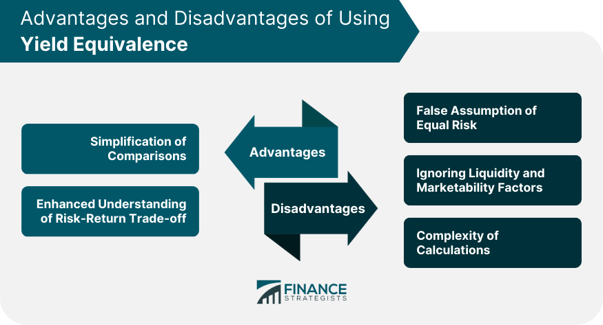

## Table of Contents

## What are yield-based options?

Yield-based options are a type of financial option where the payoff depends on the yield of an underlying asset, like a bond or a stock. Instead of focusing on the price of the asset, these options look at the income or dividends it generates. For example, if you have a yield-based option on a bond, the option's value might increase if the bond's yield goes up.

These options can be useful for investors who want to bet on or protect against changes in income from their investments. They are often used by people who own bonds or stocks that pay dividends. By using yield-based options, investors can manage the risk of their income changing due to market conditions. This makes them a helpful tool for planning and managing financial portfolios.

## How do yield-based options differ from traditional options?

Yield-based options and traditional options both give you the right to buy or sell something, but they focus on different things. Traditional options are all about the price of the thing you're buying or selling, like a stock or a commodity. If the price goes up or down, the value of the option changes. For example, if you have an option to buy a stock, you care about whether the stock's price will be higher when you use the option.

On the other hand, yield-based options care about the income the thing makes, not just its price. This could be the interest from a bond or the dividends from a stock. If the income goes up, the value of the yield-based option might go up too. So, if you have a yield-based option on a bond, you're more interested in whether the bond's [interest rate](/wiki/interest-rate-trading-strategies) will change than in the bond's price itself. This makes yield-based options useful for people who want to manage the risk of their income changing.

## What are the main types of yield-based options?

There are two main types of yield-based options: yield call options and yield put options. A yield call option gives you the right to buy something based on its yield. For example, if you have a yield call option on a bond, you can buy the bond if its yield goes up to a certain level. This can be good if you think the bond's yield will increase and you want to take advantage of that.

A yield put option, on the other hand, gives you the right to sell something based on its yield. If you have a yield put option on a stock that pays dividends, you can sell the stock if its dividend yield goes down to a certain level. This can be helpful if you want to protect yourself from a drop in the income you get from the stock. Both types of yield-based options help you manage the risk of changes in the income from your investments.

## Can you explain how dividend yield options work?

Dividend yield options are a type of yield-based option that focus on the dividends a stock pays out. When you buy a dividend yield call option, you're betting that the dividend yield of a stock will go up. If it does, you can use the option to buy the stock at a better price because the higher yield makes the stock more valuable to you. For example, if a company starts paying more dividends, the yield goes up, and your call option becomes more valuable.

On the other hand, a dividend yield put option works the opposite way. You buy this option if you think the dividend yield of a stock will go down. If it does, you can use the option to sell the stock at a better price. This can protect you if you're worried about the company cutting its dividends. So, if a company decides to pay less in dividends, the yield goes down, and your put option becomes more valuable, helping you manage the risk of losing income from the stock.

## What are the advantages of investing in yield-based options?

Investing in yield-based options can help you manage the risk of changes in your investment income. If you own stocks that pay dividends or bonds that pay interest, you might worry about these payments going up or down. Yield-based options let you protect yourself from these changes. For example, if you think a company might cut its dividends, you can buy a yield put option to sell the stock at a good price if the dividend yield drops. This way, you can plan better and feel more secure about your income.

Another advantage is that yield-based options can help you make money if you think the income from your investments will go up. If you believe a company will increase its dividends, you can buy a yield call option. If the dividend yield goes up, you can buy the stock at a better price and benefit from the higher income. This can be a smart way to take advantage of good news about a company's financial health. Overall, yield-based options give you more control over your investment income and help you make the most of your money.

## How can yield-based options provide income to investors?

Yield-based options can help investors earn more income by letting them take advantage of changes in the income their investments make. If you think a company will start paying more dividends, you can buy a yield call option. If the dividend yield goes up, you can use the option to buy the stock at a good price and then enjoy the higher dividends. This way, you can make more money from the stock's income than you would have without the option.

On the other hand, yield-based options can also protect your income if you're worried about it going down. If you think a company might cut its dividends, you can buy a yield put option. If the dividend yield drops, you can use the option to sell the stock at a good price before the income goes down. This helps you keep your income steady even when the company's dividends change. So, yield-based options can help you both make more money and keep your income safe.

## What are the potential risks and disadvantages of yield-based options?

Yield-based options can be tricky because they depend on things like dividends or interest rates, which can be hard to predict. If you guess wrong about whether a company will change its dividends, you might lose money on the option. For example, if you buy a yield call option thinking a company will raise its dividends but they don't, the option could become worthless. Also, these options can be less common than regular options, so they might be harder to buy and sell, which can make them riskier.

Another risk is that yield-based options can be more complicated than regular options. They need you to understand not just the price of a stock or bond, but also how its income might change. This can be confusing and might lead to mistakes. Plus, because they're less common, they might have bigger price swings, which can be scary if you're not used to it. So, while yield-based options can help you manage income risk, they come with their own set of challenges and potential downsides.

## How does the taxation of yield-based options compare to other investment vehicles?

The taxation of yield-based options can be different from other investments like stocks or bonds. When you make money from yield-based options, it's usually treated as capital gains. If you hold the option for less than a year, it's a short-term capital gain, which is taxed at your regular income tax rate. If you hold it for more than a year, it's a long-term capital gain, which often has a lower tax rate. This is similar to how stocks are taxed, but because yield-based options are less common, the rules can be a bit trickier to navigate.

Another thing to think about is that the income from the underlying asset, like dividends from a stock or interest from a bond, can also affect your taxes. If you get dividends or interest while holding a yield-based option, you'll need to pay taxes on that income too. This can make your overall tax situation more complicated compared to simpler investments like savings accounts, where you just pay tax on the interest you earn. So, while yield-based options can help you manage income risk, you need to be careful about how they might change your tax bill.

## What strategies can be used to maximize returns from yield-based options?

To maximize returns from yield-based options, you can use a strategy called "dividend capture." This means buying a stock just before it pays a dividend and then selling it after you get the dividend. If you think the dividend will go up, you can buy a yield call option on the stock. If the dividend does go up, you can use the option to buy the stock at a good price and then sell it after getting the higher dividend. This way, you can make more money from the dividend than you would have without the option.

Another strategy is to use yield-based options to protect your income. If you own a stock that pays dividends and you're worried the company might cut them, you can buy a yield put option. If the dividend yield drops, you can use the option to sell the stock at a good price before the income goes down. This helps you keep your income steady even when the company's dividends change. By using these strategies, you can both make more money and keep your income safe with yield-based options.

## How do market conditions affect the performance of yield-based options?

Market conditions can really change how well yield-based options do. If the market is doing well and companies are making more money, they might pay out bigger dividends. This can make yield call options more valuable because the dividend yield goes up. But if the market is not doing well and companies are cutting back on dividends, yield put options can become more valuable. This is because the dividend yield goes down, and you can use the option to sell the stock at a good price before the income drops.

It's also important to think about interest rates. If interest rates go up, the yield on bonds might go up too. This can make yield call options on bonds more valuable. But if interest rates go down, the yield on bonds might go down, making yield put options more valuable. So, keeping an eye on the market and interest rates can help you decide when to use yield-based options to make the most money or protect your income.

## What are some advanced techniques for hedging with yield-based options?

One advanced technique for hedging with yield-based options is to use a collar strategy. This means you buy a yield put option to protect against a drop in dividend yield and sell a yield call option to help pay for the put option. If the dividend yield goes down, the put option helps you sell the stock at a good price. If the dividend yield goes up, the call option might get used, but you still get some money from selling it. This way, you can protect your income without spending too much money on options.

Another technique is to use a spread strategy. This means you buy and sell different yield-based options at the same time. For example, you could buy a yield put option with a lower yield and sell a yield put option with a higher yield. If the dividend yield drops but stays above the lower yield, you lose money on the option you bought but make money on the option you sold. This can help you manage the risk of your income changing without losing too much money if things don't go as planned.

## How can an investor assess the suitability of yield-based options for their portfolio?

To figure out if yield-based options are right for your portfolio, you need to think about what you want from your investments. If you care a lot about the income you get from your stocks or bonds, like dividends or interest, then yield-based options might be good for you. They can help you make more money if you think the income will go up, or protect your income if you're worried it might go down. But you also need to think about how much risk you're okay with. Yield-based options can be tricky because they depend on things like dividends, which can be hard to predict. If you're not sure about these things, you might want to talk to a financial advisor.

Another thing to consider is how much you know about options. Yield-based options can be more complicated than regular options because they focus on income instead of just price. If you're new to options, you might want to start with simpler ones before trying yield-based options. Also, think about how much time you have to keep an eye on your investments. Yield-based options might need more attention because you need to watch things like dividend announcements and interest rate changes. If you can handle all of this, yield-based options could be a smart way to manage your investment income.

## References & Further Reading

[1]: Black, F., & Scholes, M. (1973). ["The Pricing of Options and Corporate Liabilities."](https://www.cs.princeton.edu/courses/archive/fall09/cos323/papers/black_scholes73.pdf) Journal of Political Economy, 81(3), 637-654.

[2]: Hull, J. C. (2012). ["Options, Futures, and Other Derivatives."](https://www.semanticscholar.org/paper/Options%2C-Futures%2C-and-Other-Derivatives-Hull/89bdee500c8623864fc9eb7a471546aa713acc44) Pearson Education.

[3]: Jarrow, R. A., & Turnbull, S. M. (1995). ["Pricing Derivatives on Financial Securities Subject to Credit Risk."](https://onlinelibrary.wiley.com/doi/abs/10.1111/j.1540-6261.1995.tb05167.x) The Journal of Finance, 50(1), 53-85.

[4]: Fabozzi, F. J. (1996). ["Bond Markets, Analysis, and Strategies."](https://archive.org/details/bondmarketsanaly00fabo) Prentice Hall.

[5]: Wilmott, P. (2006). ["Paul Wilmott Introduces Quantitative Finance."](https://www.amazon.com/Paul-Wilmott-Quantitative-Finance-Set/dp/0470018704) Wiley.

[6]: Chincarini, L. B., & Kim, D. (2006). ["Quantitative Equity Portfolio Management: An Active Approach to Portfolio Construction and Management."](https://archive.org/details/quantitativeequi0000chin_c9d6) McGraw-Hill.