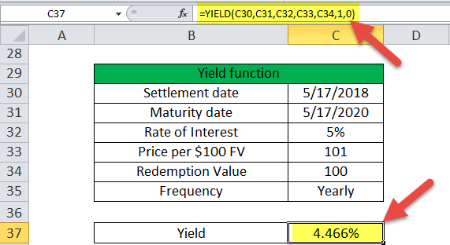

Understanding the dynamics and opportunities within financial markets is essential for investors aiming to maximize their returns. Over the decades, investment strategies have transformed, adopting complex methodologies and advanced technologies to adapt to the ever-evolving market landscape. This shift has opened up new avenues for investors to optimize their portfolios effectively. Key among these developments are yield basis strategies and algorithmic trading, two significant approaches that have gained prominence in recent years.

Yield basis strategies play a crucial role by focusing on the yield differentials across various financial instruments. These strategies allow investors to exploit the differences in yields to achieve better returns. For example, the carry trade, where investors borrow in a currency with low-interest rates and invest in one with higher returns, exemplifies how yield differentials can drive investment decisions. Understanding and efficiently utilizing these strategies can lead to substantial improvements in portfolio performance.



Algorithmic trading has revolutionized trading practices by enhancing the speed and precision of executing trades. With the advent of modern computing, algorithms analyze vast datasets to identify lucrative market opportunities, allowing trades to be executed at optimal prices. This approach not only increases efficiency but also minimizes human error, significantly influencing market dynamics. Algorithmic trading enables investors to respond swiftly to market changes, thereby improving investment outcomes.

The synergy between these two methodologies—yield basis strategies and algorithmic trading—presents a powerful opportunity for investors to maximize their returns. By integrating sophisticated yield assessments within algorithmic models, investors can further refine their strategies, aligning them with the dynamic nature of financial markets. This article explores these interconnected strategies, providing insights into optimizing investment portfolios.

As we examine key strategies, understanding their implications and potential can empower investors to incorporate these insights into their decision-making processes effectively. Moreover, recognizing the role of technology in enhancing investment outcomes is crucial for staying competitive in today's market environment. This exploration aims to shed light on the path forward, equipping investors to navigate the complex world of financial markets with confidence.

## Table of Contents

## The Structure of Financial Markets

Financial markets are complex systems where assets such as equities, bonds, and derivatives are traded, each providing distinctive opportunities for investment. These markets are primarily categorized into two types: primary and secondary markets. In primary markets, new securities are issued and sold to investors for the first time, facilitating [capital raising](/wiki/hedge-fund-capital-raising) for issuers, such as corporations or governments. Secondary markets, on the other hand, involve the trading of existing securities, providing liquidity and enabling price discovery as investors buy and sell shares based on prevailing market conditions.

Financial institutions and intermediaries play pivotal roles in market transactions. Institutions like banks, mutual funds, and pension funds act as major investors, while intermediaries such as brokers and dealers facilitate transactions by linking buyers and sellers. These entities ensure market efficiency by offering platforms for trade execution, thereby enhancing [liquidity](/wiki/liquidity-risk-premium) and reducing transaction costs.

The globalization of financial markets has transformed how these markets operate, significantly boosting interconnectedness and influencing investment patterns. This interconnectedness allows for capital flows across borders, increasing opportunities for diversification and risk management. It also means that events in one part of the world can quickly affect markets elsewhere.

Several key indicators influence market movements and investor behavior. Economic indicators like GDP growth rates, inflation, and employment figures provide insights into economic health, affecting investor sentiment and expectations. Market-specific indicators, such as corporate earnings reports, interest rates, and commodity prices, also play critical roles. By analyzing these indicators, investors can assess market conditions and make informed decisions, ultimately influencing asset prices and volatilities within financial markets.

## Investment Strategies: A Focus on Yield Basis

Yield basis strategies play a critical role in optimizing investment returns by leveraging differences in yield across various financial instruments and markets. Yield basis refers to the discrepancy between yields of two comparable financial instruments, which can be exploited to achieve added returns. Understanding and effectively implementing yield-based strategies can provide investors with the ability to enhance portfolio performance while managing associated risks.

### Different Yield-Based Strategies

1. **Carry Trade**: This strategy involves borrowing funds in a currency with a low interest rate and investing them in a currency offering a higher interest rate. The differential between the low borrowing costs and the high returns gained from the investment creates a profit margin, known as the carry. The basic premise is to "carry" the yield differential, benefiting from the spread over time.

2. **Duration Strategies**: These strategies focus on managing bond portfolios by aligning the duration of investments with anticipated changes in interest rates. Duration is a measure of a bond's sensitivity to interest rate changes. By managing duration, investors can optimize their bond portfolios to take advantage of expected interest rate movements, enhancing yield performance.

### Assessing Yield Differentials

The effective assessment of yield differentials enables investors to identify lucrative opportunities across various asset classes. Yield spreads between different bonds, for instance, can provide insights into market expectations on interest rates, inflation, and credit risk. A typical yield differential analysis involves comparing the yield on a particular bond to a benchmark rate or another bond. Positive yield spreads indicate potentially undervalued securities, whereas negative spreads might suggest overvaluation or higher risks.

#### Formula for Yield Spread
$$

\text{Yield Spread} = \text{Yield of Bond A} - \text{Yield of Bond B} 
$$

### Risk Management Techniques

Risk management is a crucial component of yield-based investment strategies to safeguard against potential losses due to yield fluctuation, [interest rate](/wiki/interest-rate-trading-strategies) changes, or currency risks. Several techniques can be applied:

- **Hedging**: Investors can use derivatives such as futures, options, or swaps to hedge against adverse movements that could impact their yield differential strategies. For instance, a currency swap might be used in a carry trade to mitigate foreign exchange risk.

- **Diversification**: Spreading investments across different asset classes, geographies, and sectors reduces unsystematic risk, thereby cushioning yield-based strategies against sector-specific downturns.

- **Stop-Loss Orders**: These orders can limit potential losses by triggering an automatic sale of securities when they fall below a predetermined price level.

### Case Studies of Successful Yield Basis Strategies

- **Case Study 1: The Japanese Yen Carry Trade**: Throughout the mid-2000s, the yen carry trade was a widely adopted strategy, driven by Japan's near-zero interest rates. Investors borrowed yen at minimal costs and invested in higher-yielding currencies like the Australian dollar, profiting from the interest differential. Despite currency volatility risks, many investors achieved significant gains due to the substantial interest rate differential.

- **Case Study 2: Duration Strategy in Bond Markets**: In anticipation of Federal Reserve interest rate adjustments, some investors effectively managed the duration of their bond portfolios. By shifting weights to bonds with durations matching anticipated rate shifts, they capitalized on interest rate movements, thereby optimizing yield.

### Conclusion

Incorporating yield basis strategies into investment portfolios allows investors to leverage yield differentials for optimizing returns. By understanding the various aspects of these strategies, including their inherent risks and how to manage them, investors can effectively navigate through global financial markets. As financial landscapes continue to evolve, staying informed about market changes and yield opportunities will remain vital for achieving sustained investment success.

## Algorithmic Trading: Transforming Investment Landscapes

Algorithmic trading, often referred to as algo trading, represents a significant shift in the traditional methods of securities transactions. Its evolution began in the late 20th century, as computing technology advanced, enabling traders to utilize programs to execute pre-defined trading strategies with greater efficiency and speed. The automated nature of [algorithmic trading](/wiki/algorithmic-trading) allows for the widespread execution of high-frequency trading ([HFT](/wiki/high-frequency-trading-strategies)) strategies, among others, fundamentally transforming the landscape of financial markets.

One of the greatest benefits of algorithmic trading lies in its speed, efficiency, and precision. Algorithms can process and respond to market fluctuations in microseconds, a feat unattainable by human traders. This capability not only maximizes profit potential by capturing fleeting market opportunities but also substantially lowers transaction costs. For example, an algorithm might execute trades based on statistical [arbitrage](/wiki/arbitrage) strategies, taking advantage of small price discrepancies in different markets or instruments.

Algorithms are crafted to swiftly identify and exploit market opportunities. They utilize complex models and calculations to make trading decisions based on a variety of factors, such as historical data, price trends, and market conditions. This can involve deploying [machine learning](/wiki/machine-learning) techniques to adapt strategies over time or employing pattern recognition to predict future price movements. A typical algorithmic trading strategy might use moving averages or other mathematical indicators to trigger buy or sell decisions.

Technology and data analytics play crucial roles in the functioning of modern trading algorithms. Advanced hardware and software solutions, along with big data analytics, empower traders to backtest strategies against historical data, refine models based on past performance, and optimize execution. Cloud computing has further democratized access to these technologies, enabling even small-scale traders to compete with larger institutions in the execution of algorithmic strategies.

However, algorithmic trading also faces several challenges and limitations. Market [volatility](/wiki/volatility-trading-strategies) can disrupt algorithmic strategies, leading to unintended consequences such as flash crashes. This was evidenced during the 2010 Flash Crash, where a massive sell-off was triggered partially due to algorithmic trades misfiring in the highly volatile market environment. Additionally, regulatory concerns continue to arise, as regulators strive to ensure that algorithmic trading does not lead to unfair market practices or systemic risks. The landscape is governed by regulations such as the Markets in Financial Instruments Directive (MiFID II) in Europe, mandating transparency and control algorithms to prevent misuse.

In conclusion, while algorithmic trading offers numerous advantages in terms of speed and efficiency, it must be approached with caution due to its associated risks and regulatory implications. As technology continues to advance, the evolution of algorithmic trading is expected to persist, promising further innovations in the way financial markets operate.

## Combining Yield Basis Strategies with Algorithmic Trading

Combining yield basis strategies with algorithmic trading offers a potent approach to optimizing investment outcomes. Yield basis strategies focus on exploiting differences in yield between various financial instruments, such as bonds, to maximize returns. These strategies can be effectively enhanced through the application of algorithmic trading, which utilizes complex algorithms to execute trades at high speed and precision.

### Techniques for Integrating Yield Basis Principles into Algorithmic Trading Models

Integrating yield basis principles into algorithmic trading involves the development of models that can dynamically assess yield differentials across various asset classes. This integration requires a deep understanding of both yield determinant factors and algorithmic trading technology.

For instance, a common technique involves setting up rules-based trading algorithms that automatically adjust portfolios based on movements in yield spreads. This is achieved by coding algorithms to analyze real-time data feeds from multiple sources, such as interest rate changes, credit spreads, and macroeconomic indicators. The algorithms could use methods like regression analysis to predict future yield movements and automatically execute trades to capitalize on anticipated changes.

### Examples of Automation in Yield-Focused Strategies

Automation significantly boosts the efficiency of implementing yield-focused strategies. An example is the use of machine learning algorithms to identify optimal timing for trades by analyzing historical and real-time data patterns. By training models on historical yield spread data, these algorithms can predict favorable entry and [exit](/wiki/exit-strategy) points, reducing human error and emotional bias.

Consider a Python-based algorithm that uses historical yield data:

```python
import numpy as np
from sklearn.linear_model import LinearRegression

# Simulating historical yield data
time = np.arange(0, 10, 0.1)
yield_spread = np.sin(time) + np.random.normal(size=len(time))

# Training a simple regression model
model = LinearRegression()
X = time.reshape(-1, 1)
y = yield_spread
model.fit(X, y)

# Predicting future yield spreads
future_time = np.arange(10, 20, 0.1).reshape(-1, 1)
predicted_yield_spread = model.predict(future_time)
```

In this example, the regression model attempts to forecast future yield spreads, which an algorithmic trading system could use to influence purchase or sell decisions automatically.

### Evaluating Effectiveness Through Historical Data Analysis

Assessing the effectiveness of combining yield basis strategies with algorithmic trading involves historical data [backtesting](/wiki/backtesting). This process includes running algorithms on past market data to evaluate performance, examining key metrics such as Sharpe ratio, drawdown, and total return. This analysis also allows investors to refine algorithms by identifying historical conditions under which the strategy succeeded or failed, thereby iterating model improvements.

### Future Trends and Innovations

As technology advances, the combination of yield basis strategies with algorithmic trading is expected to evolve. Innovations such as incorporating [artificial intelligence](/wiki/ai-artificial-intelligence) and deeper learning techniques have the potential to further enhance predictive capabilities and operational efficiency. Future trends may also include the development of multi-asset class strategies where algorithms simultaneously account for yield opportunities in diverse markets, such as foreign exchange, commodities, and equities, providing more robust investment frameworks.

Continuous developments in blockchain technology and decentralized finance (DeFi) could lead to novel ways of executing yield basis strategies with enhanced transparency and reduced overhead costs. Additionally, as computing power and data analytics become more sophisticated, we can expect a move toward real-time adaptive algorithms that continuously learn from new data, improving their accuracy and performance in assessing yield basis opportunities.

## The Role of Risk Management in Algorithmic and Yield-Based Strategies

Risk management is a critical component of both algorithmic and yield-based investment strategies, ensuring that the pursuit of returns is balanced against potential risks. Effective risk management requires a thorough understanding of both market conditions and the specific vulnerabilities of the strategies employed. 

Risk assessment in these strategies involves a variety of tools and methodologies. Algorithmic trading relies on quantitative models that incorporate statistical methods, such as Value at Risk (VaR) and stress testing, to analyze potential market movements and estimate the likelihood of significant losses. These models help traders define parameters that dictate when to enter or exit trades, thereby minimizing exposure to adverse market conditions. Similarly, yield-based strategies often use duration analysis and yield curve modeling to assess interest rate risk and its impact on bond portfolios.

To mitigate potential losses and enhance portfolio resilience, several strategies are employed. Algorithms can be programmed to include stop-loss orders, which automatically sell an asset when its price falls below a predefined level, thus limiting losses. In yield-based strategies, diversification across different maturities and credit qualities can reduce the impact of interest rate changes on portfolio value. Moreover, the use of hedging instruments such as derivatives allows investors to offset potential losses by taking an opposite position in related markets.

Defensive strategies and risk-adjusted performance metrics are also integral to these investment approaches. Beta and standard deviation are common metrics used to evaluate the volatility and systematic risk associated with a portfolio. The Sharpe ratio, which measures the excess return per unit of risk, is a widely used performance metric that helps investors understand the risk-return trade-off of a strategy.

Regulatory compliance and ethical considerations play a significant role in managing risk. Algorithmic traders must ensure their systems comply with financial regulations, such as those imposed by the Securities and Exchange Commission (SEC) or the European Securities and Markets Authority (ESMA), to avoid fines and sanctions. They must also consider the potential for unethical behavior, such as market manipulation through high-frequency trading tactics. Yield-based investors must adhere to disclosure requirements and due diligence processes to maintain transparency and accountability in their investment practices.

In summary, robust risk management is essential for both algorithmic and yield-based strategies. By utilizing appropriate tools and strategies, investors can better safeguard their portfolios against the inherent uncertainties of the financial markets while respecting regulatory and ethical standards.

## Conclusion

In reviewing the intricate tapestry of financial markets, we have examined both traditional investment strategies, such as yield basis approaches, and the transformative role of algorithmic trading. This analysis underscores the need for investors to remain adaptable, continuously refining their methods to optimize outcomes in an ever-evolving financial landscape.

Adaptability is crucial in navigating the complexities of modern financial markets. As market conditions fluctuate, investors must be willing to reassess their strategies, integrating new insights and methodologies. This dynamic environment demands a flexible approach to investment, where learning and adaptation are not just beneficial but necessary for success.

Technological advancements have reshaped the investment landscape, offering tools and opportunities that were unimaginable a few decades ago. Incorporating these advancements, such as algorithmic trading, into investment strategies can enhance decision-making processes, allowing investors to execute trades with greater speed and precision. By leveraging technology, investors can ensure they remain competitive and responsive to market changes.

Looking towards the future, financial markets are poised for further growth and innovation. Emerging technologies like artificial intelligence and blockchain promise to redefine the ways in which markets operate, potentially unlocking new avenues for investment. Investors should keep a watchful eye on these developments, as early adoption and strategic positioning can lead to substantial advantages.

In conclusion, the journey toward investment success is ongoing, and the path is paved with continuous learning and exploration. Investors are encouraged to stay informed, embracing new tools and strategies to enhance their portfolios. By doing so, they can position themselves to capitalize on opportunities as they arise and achieve sustainable growth in an increasingly complex financial world.

## References & Further Reading

[1]: Bergstra, J., Bardenet, R., Bengio, Y., & Kégl, B. (2011). ["Algorithms for Hyper-Parameter Optimization."](https://papers.nips.cc/paper/4443-algorithms-for-hyper-parameter-optimization) Advances in Neural Information Processing Systems 24.

[2]: ["Advances in Financial Machine Learning"](https://www.amazon.com/Advances-Financial-Machine-Learning-Marcos/dp/1119482089) by Marcos Lopez de Prado

[3]: ["Evidence-Based Technical Analysis: Applying the Scientific Method and Statistical Inference to Trading Signals"](https://www.amazon.com/Evidence-Based-Technical-Analysis-Scientific-Statistical/dp/0470008741) by David Aronson

[4]: ["Machine Learning for Algorithmic Trading"](https://github.com/stefan-jansen/machine-learning-for-trading) by Stefan Jansen

[5]: ["Quantitative Trading: How to Build Your Own Algorithmic Trading Business"](https://www.amazon.com/Quantitative-Trading-Build-Algorithmic-Business/dp/1119800064) by Ernest P. Chan