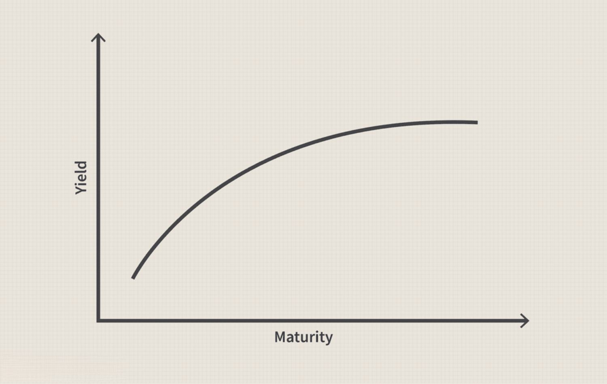

Investment strategies are pivotal in navigating the complex world of finance, providing structured approaches to maximizing returns while effectively managing risk. These strategies are formulated to help investors achieve their financial goals by choosing an appropriate mix of financial instruments. A key aspect of successful investment strategy is understanding market dynamics, which is where financial analysis plays a critical role. By thoroughly evaluating financial data, investors can make informed decisions, identifying potential opportunities and risks that the market presents.

A fundamental component of financial analysis is the yield curve, a graphical representation showing the relationship between interest rates and the maturity lengths of debt securities, typically government bonds. The yield curve is instrumental in gauging economic conditions and forecasting interest rate movements. It serves as a barometer for future economic activities; for instance, a normal yield curve, where longer-term debt instruments have higher yields than short-term ones, generally indicates economic growth. Conversely, an inverted yield curve, where short-term yields are higher, can be a predictor of an upcoming recession.



In recent years, the advent of algorithmic trading, often referred to as algo trading, has significantly transformed the landscape of investment. This approach utilizes computer algorithms to execute trades automatically based on pre-defined criteria, enhancing both the capability and efficiency of trading operations. Algorithmic trading reduces the manual intervention required in trading, thereby minimizing human errors and allowing for faster execution speeds. Central to this process is the ability to analyze large datasets and adapt to real-time market conditions, making algorithmic trading an indispensable tool for modern investors.

As technology continues to evolve, the integration of these elements—investment strategies, financial analysis, yield curve insights, and algorithmic trading—offers increasingly sophisticated solutions for optimizing investment outcomes. By leveraging these interconnected tools, investors can better navigate market complexities and stay ahead in the fast-paced world of finance.

## Table of Contents

## Understanding Investment Strategies

Investment strategies are structured plans that help investors select an appropriate portfolio of securities to meet their financial objectives. These strategies provide a framework for making informed investment decisions by considering various financial instruments and market conditions. 

Growth investing aims to identify companies that exhibit signs of above-average growth, even if their current share prices appear expensive based on standard valuation metrics. Growth investors often focus on companies with potential for substantial earnings expansion, reinvestment of profits, or those at the forefront of innovation. The preference here is for capital gains over income, making it suitable for investors with a longer time horizon and higher risk tolerance.

Value investing, on the other hand, is focused on purchasing securities that appear undervalued based on intrinsic worth, often gauged through financial ratios like the Price-to-Earnings (P/E) ratio or Price-to-Book (P/B) ratio. Value investors seek companies whose stock prices do not fully reflect their fundamental value, possibly due to market inefficiencies or short-term issues. This strategy is generally favored by investors who have a moderate to high-risk tolerance and a medium to long-term time frame.

Income investing prioritizes generating regular income from investments, typically through dividends from stocks or interest payments from bonds. This strategy tends to appeal to those seeking a stable cash flow, such as retirees. Income investors often prioritize reliable, high-quality securities, which may include dividend-paying stocks and high-yield bonds, aligning their investments with a lower risk profile and varying time horizons.

Indexing involves creating a portfolio that mirrors the composition of a market index, such as the S&P 500. This passive investment strategy aims to replicate the returns of the chosen index, minimizing costs associated with active management. Indexing suits investors who prefer exposure to broad market movements with reduced emphasis on individual security selection. Typically, this approach is used by those with a moderate risk tolerance and a long-term investment outlook.

Risk tolerance, time horizon, and financial objectives play critical roles in shaping an individual's investment strategy. Risk tolerance refers to the investor's capacity to endure market [volatility](/wiki/volatility-trading-strategies) and potential losses. Investors with high risk tolerance might opt for strategies like growth investing, while those with lower tolerance might prefer income investing. The time horizon signifies the duration an investor plans to hold investments before cashing out. Longer time horizons often allow for a higher risk-taking approach, potentially increasing the allocation in growth-focused securities.

In summary, the choice of an investment strategy is informed by the investor's risk appetite, financial goals, and the expected time frame for investment. Tailoring strategies to these factors can enhance the likelihood of meeting financial targets while aligning with personal investment characteristics.

## Yield Curve Analysis

The yield curve is a graphical representation that depicts the relationship between the interest rates of bonds having equal credit quality but differing maturity dates. It serves as an essential analytical tool for understanding various economic conditions, offering insights into future [interest rate](/wiki/interest-rate-trading-strategies) changes and economic activity.

Typically, there are three main types of yield curves: normal, inverted, and flat. A normal yield curve, characterized by an upward slope, indicates that long-term interest rates are higher than short-term rates. This is often interpreted as a sign of economic expansion, suggesting that investors expect growth and possibly higher inflation in the future.

Conversely, an inverted yield curve occurs when short-term interest rates exceed long-term rates, forming a downward slope. This scenario suggests that investors anticipate a downturn or recession. Historically, an inverted yield curve has been regarded as a precursor to an economic slowdown, as it reflects expectations for lower interest rates in response to weaker future economic conditions.

A flat or humped yield curve arises when there is little difference between short-term and long-term rates, typically signaling economic uncertainty. In such cases, investors may expect rates to stabilize or are indecisive about the direction of future economic movements.

The analysis of yield curves enables investors and policymakers to gauge the economic outlook, influencing decisions related to investment and monetary policy. By observing shifts in the yield curve shape, stakeholders can make informed predictions regarding potential changes in economic conditions and interest rates. These insights are crucial in helping investors manage risk and optimize returns in their investment strategies.

## Role of Financial Analysis in Investment

Financial analysis is an indispensable tool in the investment landscape, serving as the foundation for making informed decisions. By evaluating financial data, investors gain insights into a company's performance and future potential, which directly impacts stock and bond valuations.

A comprehensive financial analysis typically employs several key tools. Ratio analysis is fundamental and involves assessing a company's financial statements to understand its financial health. Common ratios include the debt-to-equity ratio, which measures a firm's financial leverage; the current ratio, indicating [liquidity](/wiki/liquidity-risk-premium); and the return on equity, which evaluates profitability. Mathematical expressions for some important ratios are:

$$
\text{Debt-to-Equity Ratio} = \frac{\text{Total Liabilities}}{\text{Shareholders' Equity}}
$$

$$
\text{Current Ratio} = \frac{\text{Current Assets}}{\text{Current Liabilities}}
$$

$$
\text{Return on Equity (ROE)} = \frac{\text{Net Income}}{\text{Average Shareholders' Equity}}
$$

Trend analysis is another vital aspect, identifying patterns in financial performance over time. This analysis helps in forecasting future earnings, cash flow, and growth prospects by examining past performance. For example, if a company's revenue has been growing at an average rate of 5% per year, an investor might project similar growth moving forward, barring significant market changes.

Liquidity assessments are crucial for determining a company's ability to meet short-term obligations. Investors analyze the liquidity position to ensure that a company can sustain operations during financial downturns. Metrics like the quick ratio, which focuses on the most liquid assets, provide insights:

$$
\text{Quick Ratio} = \frac{\text{Current Assets} - \text{Inventory}}{\text{Current Liabilities}}
$$

The outcomes of financial analyses are instrumental in determining stock and bond valuations. A robust financial picture with favorable ratios and trends typically leads to higher valuations, reflecting investor confidence in a company's future prospects. Conversely, a poor financial performance can lead to undervaluation, presenting potential opportunities or signals of risk.

In conclusion, financial analysis utilizes a combination of quantitative tools to assess corporate performance and future growth potential. By analyzing financial data through ratio assessments, trend recognition, and liquidity analysis, investors arm themselves with the insights needed to make strategic investment decisions.

## Algorithmic Trading

Algorithmic trading is a sophisticated method of executing trades using computer programs that automatically follow predefined criteria. This cutting-edge approach allows for precise, high-frequency trading, greatly enhancing execution speed and minimizing human error. Modern algorithms can process vast amounts of data rapidly, making split-second decisions that capitalize on market fluctuations.

One of the primary advantages of [algorithmic trading](/wiki/algorithmic-trading) is its ability to significantly increase the speed of trade execution. By removing manual processes, trading decisions are made much faster than humans can achieve, allowing traders to capitalize on even the smallest market movements. Additionally, by reducing the need for human intervention, the likelihood of error decreases, resulting in more consistent and reliable trading outcomes.

Algorithmic trading also enables extensive [backtesting](/wiki/backtesting) of strategies. Traders can assess the viability of a strategy by applying it to historical data, providing insights into its potential performance in different market conditions. This helps in refining strategies and improving their effectiveness before deploying them in live markets.

Common strategies in algorithmic trading include trend-following, [arbitrage](/wiki/arbitrage), and [market making](/wiki/market-making). Trend-following strategies identify and exploit market trends, leveraging [momentum](/wiki/momentum)-based indicators to predict price movements. This approach can be implemented using simple moving averages or more complex [machine learning](/wiki/machine-learning) models. Here's a basic example in Python using moving averages:

```python
import pandas as pd

# Assume 'data' is a pandas DataFrame with historical price data
data['short_mavg'] = data['Close'].rolling(window=40, min_periods=1).mean()
data['long_mavg'] = data['Close'].rolling(window=100, min_periods=1).mean()

# Generate trading signals
data['signal'] = 0
data['signal'][40:] = np.where(data['short_mavg'][40:] > data['long_mavg'][40:], 1, 0)
data['positions'] = data['signal'].diff()
```

Arbitrage involves profiting from price discrepancies of the same asset in different markets or forms. Algorithmic systems can efficiently identify and exploit these opportunities, executing trades quickly across multiple platforms to lock in gains.

Market making strategies aim to provide liquidity to the market by simultaneously placing buy and sell orders for a financial instrument. This allows market makers to profit from the bid-ask spread while ensuring that the markets remain efficient.

Algorithmic trading, despite its advantages, requires robust infrastructure and constant monitoring. The complexity of markets, coupled with the rapid pace of trading, means that even minor errors in algorithm logic or data handling can lead to significant financial loss. Thus, while algorithmic trading provides a powerful tool for executing trading strategies with speed and accuracy, it demands rigorous development, testing, and maintenance processes to mitigate risks.

## Integrating Yield Curve Analysis with Algo Trading

Yield curve analysis plays a pivotal role in informing algorithmic trading strategies, primarily due to its capability to indicate potential changes in interest rates and economic conditions. The yield curve illustrates the relationship between interest rates and the time to maturity of debt for a given borrower in a given currency. A typical yield curve scenario consists of a normal upward slope, which reflects an economy expecting future interest rate increases due to growth and inflation, an inverted curve that often signals economic downturns, and a flat curve that may indicate a transition between the two states. Understanding and leveraging these signals can provide significant trading advantages.

Integrating yield curve analysis with algorithmic trading involves several crucial steps. Algorithmic models inherently rely on data-driven decision-making processes. Therefore, predicting interest rate changes using yield curve dynamics is substantial in optimizing these algorithms for bond and stock trading strategies. When a yield curve inversion is detected, an algorithm might reduce equity exposure due to recession fears or increase investments in long-term bonds that are expected to appreciate as interest rates decline. Conversely, in a steepening curve environment, the strategy might shift towards equities and shorter-duration bonds in anticipation of rising rates accompanying economic expansion.

Advanced technologies such as [artificial intelligence](/wiki/ai-artificial-intelligence) (AI) can further enhance these strategies. AI models, particularly machine learning algorithms, have the ability to analyze vast datasets to uncover patterns and trends that might not be immediately evident through traditional methods. By training AI models on historical yield curve data alongside economic indicators, traders can improve the predictive accuracy of future economic conditions and interest rate trajectories. This can be illustrated through the deployment of neural networks to time-series forecasting tasks. For example, a recurrent [neural network](/wiki/neural-network) (RNN) or its variant, Long Short-Term Memory (LSTM), could be utilized to model the sequential nature of yield curves and predict their future states.

Here is a basic implementation example in Python using the LSTM network in TensorFlow:

```python
import pandas as pd
import numpy as np
from sklearn.preprocessing import MinMaxScaler
from tensorflow.keras.models import Sequential
from tensorflow.keras.layers import LSTM, Dense

# Assuming 'yield_curve_data' is a DataFrame with historical yield curve values
data = yield_curve_data['yield_curve']
scaler = MinMaxScaler(feature_range=(0, 1))
data_scaled = scaler.fit_transform(data.values.reshape(-1, 1))

# Preparing data for LSTM
def create_dataset(data, time_step=1):
    X, Y = [], []
    for i in range(len(data) - time_step - 1):
        a = data[i:(i + time_step), 0]
        X.append(a)
        Y.append(data[i + time_step, 0])
    return np.array(X), np.array(Y)

time_step = 10
X, y = create_dataset(data_scaled, time_step)
X = X.reshape(X.shape[0], X.shape[1], 1)

# Building the LSTM model
model = Sequential()
model.add(LSTM(units=50, return_sequences=True, input_shape=(time_step, 1)))
model.add(LSTM(units=50, return_sequences=False))
model.add(Dense(units=1))
model.compile(optimizer='adam', loss='mean_squared_error')

# Training the model
model.fit(X, y, epochs=100, batch_size=32, verbose=1)
```

In this code snippet, historical yield curve data is pre-processed and scaled to a range suitable for neural network training. The LSTM model is constructed to predict the next yield curve value based on a sequence of past values. Once trained, this model can be integrated into trading algorithms to dynamically adjust strategies based on shifting yield curve patterns.

In conclusion, effectively integrating yield curve analysis with algorithmic trading involves leveraging both the insights provided by yield curves and the power of AI-driven models. This combination can enhance the precision and responsiveness of trading strategies, adapting them to evolving economic indicators and market conditions.

## Best Practices and Challenges

Maintaining up-to-date, high-quality data is indispensable for the efficacy of algorithmic and financial analysis. Data accuracy ensures that algorithms operate on reliable inputs, yielding more precise predictions and investment decisions. Inconsistent or outdated data can lead to incorrect conclusions, adversely affecting trading strategies.

Over-reliance on models can lead to errors. Algorithmic models, while powerful, are not infallible. They are based on historical data and assumptions that may not always hold true. Consequently, continuous monitoring and adjustment are essential to adapt to evolving market conditions. For instance, changes in market volatility or unexpected economic shifts may require immediate recalibration of models. This iterative process helps align model outputs with real-world market dynamics.

Algorithmic trading also necessitates a thorough consideration of transaction costs and market impact. Transaction costs, including commissions, slippage, and fees, can erode potential profits. Algorithms must be designed to minimize these costs by optimizing trade execution. A simple way to calculate the impact of transaction costs is to incorporate them into the algorithm's cost function, optimizing for net returns:

```python
def compute_net_return(gross_return, transaction_cost):
    return gross_return - transaction_cost

net_returns = compute_net_return(gross_returns, transaction_costs)
```

Market impact, the effect of a trade on the asset's price, is another critical [factor](/wiki/factor-investing). Large trades can move markets, leading to unfavorable price changes. Strategies like slicing large orders into smaller ones can be implemented to mitigate this effect. Balancing trade size with execution speed helps maintain market integrity and enhances the effectiveness of trading strategies.

In conclusion, for algorithmic trading to be successful, it is imperative to maintain high-quality data, continuously monitor and adjust models, and account for transaction costs and market impacts. By adhering to these best practices, investors can better navigate the complexities of financial markets and improve their decision-making processes.

## Conclusion

Investment strategies, financial analysis, yield curve insights, and algorithmic trading are interconnected tools that guide investors toward informed decision-making. Each component plays a unique role in shaping a comprehensive approach to investment management. Investment strategies provide a roadmap for achieving financial goals, balancing the trade-off between risk and return. Financial analysis offers critical evaluations of economic and market conditions, assisting investors in identifying opportunities and potential pitfalls.

The yield curve serves as a key indicator of economic health and interest rate expectations. By interpreting its structure, investors can glean insights into future economic conditions and adjust their portfolios accordingly. Algorithmic trading, leveraging the power of modern computing, automates decision-making processes and trade executions, enhancing both efficiency and accuracy.

As technology continues to advance, the integration of these elements is poised to deliver progressively sophisticated financial solutions. The confluence of big data analytics, machine learning, and artificial intelligence is likely to revolutionize traditional models. Algorithms that can adapt in real-time to changes in market dynamics provide a competitive edge, offering predictive insights drawn from vast datasets.

Successfully leveraging these tools requires continuous learning and adaptability. Markets evolve, and so must strategies and technologies. Investors and analysts must stay informed about emerging trends, regulatory changes, and technological advancements to remain competitive. Embracing innovation with a clear understanding of risk and strategy will be essential in navigating the evolving financial landscape. Thus, the synergy between investment strategies, financial analysis, yield curve insights, and algorithmic trading will continue to shape the future of investing, empowering smart decision-making in complex markets.

## References & Further Reading

[1]: Fabozzi, F. J., & Drake, P. P. (2009). ["The Basics of Financial Econometrics: Tools, Concepts, and Asset Management Applications"](https://onlinelibrary.wiley.com/doi/book/10.1002/9781118856406). Wiley.

[2]: Chordia, T., Sarkar, A., & Subrahmanyam, A. (2005). ["An Empirical Analysis of Stock and Bond Market Liquidity."](https://www.jstor.org/stable/3598068) The Review of Financial Studies, 18(1), 85-129.

[3]: Ang, A., & Piazzesi, M. (2003). ["A No-Arbitrage Vector Autoregression of Term Structure Dynamics with Macroeconomic and Latent Variables."](https://www.sciencedirect.com/science/article/pii/S0304393203000321) The Journal of Financial Economics, 16(4), 1018-1041.

[4]: Engle, R. F., & Rangel, J. G. (2008). ["The Spline-GARCH Model for Low-Frequency Volatility and Its Global Macroeconomic Causes."](https://www.jstor.org/stable/40056848) The Review of Financial Studies, 21(3), 1187-1222.

[5]: Rouwenhorst, K. G. (1998). ["International Momentum Strategies."](https://onlinelibrary.wiley.com/doi/abs/10.1111/0022-1082.95722) The Journal of Finance, 53(1), 267-284.