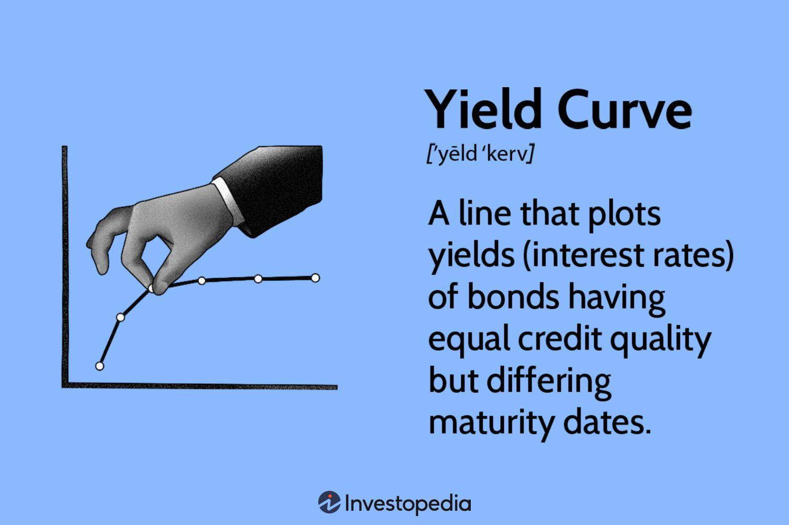

## Table of Contents

## What is a yield curve?

A yield curve is a graph that shows the interest rates on bonds with different lengths of time until they mature. It usually shows the interest rates for government bonds, like those issued by the U.S. Treasury. The curve is important because it helps people see what investors think about the future of the economy. If the curve goes up, it means long-term bonds have higher interest rates than short-term bonds, which is normal and shows that people expect the economy to grow.

Sometimes, the yield curve can be flat or even go down. A flat yield curve means that short-term and long-term interest rates are about the same. An inverted yield curve, where short-term rates are higher than long-term rates, is unusual and can be a warning sign. It might mean that investors think the economy will slow down or go into a recession soon. Watching the yield curve helps people make decisions about investing and planning for the future.

## How is a yield curve constructed?

To make a yield curve, you start by gathering information about different bonds. These bonds can be from the government or other places, but usually, people use government bonds because they are safe. You look at bonds that will pay back money at different times in the future, like in one year, two years, five years, and so on up to thirty years. For each of these bonds, you find out the interest rate, which is called the yield. The yield is what the bond pays you every year until it matures.

Once you have all the yields, you can draw the yield curve on a graph. On the graph, the horizontal line shows the time until the bond matures, and the vertical line shows the yield. You put a dot on the graph for each bond's yield and then connect the dots with a line. This line is the yield curve. If the line goes up as you move to the right, it means longer-term bonds have higher yields. If it's flat or goes down, it means the yields are the same or lower for longer-term bonds.

## What are the different types of yield curves?

There are a few different types of yield curves that people talk about. The most common one is the normal yield curve. This is when the line on the graph goes up as you move to the right. It means that bonds that take longer to pay back have higher interest rates. People like to see a normal yield curve because it usually means the economy is doing okay and is expected to keep growing.

Another type is the flat yield curve. This happens when the line on the graph stays about the same from left to right. It means that short-term and long-term bonds have about the same interest rates. A flat yield curve can happen when people are not sure about what will happen with the economy. It might mean things are changing or that there is not much difference between short-term and long-term expectations.

The last type is the inverted yield curve. This is when the line on the graph goes down as you move to the right. It means that short-term bonds have higher interest rates than long-term bonds. An inverted yield curve is unusual and can be a warning sign. It often means that people think the economy might slow down or go into a recession soon.

## What does the shape of a yield curve indicate about the economy?

The shape of a yield curve can tell us a lot about what people think will happen with the economy. When the yield curve is normal, it goes up as you look at bonds that will pay back in the future. This means that longer-term bonds have higher interest rates. A normal yield curve shows that people expect the economy to keep growing. They think that things will be stable and that it's worth waiting longer for a bit more money.

If the yield curve is flat, it means that short-term and long-term bonds have about the same interest rates. This can happen when people are not sure about the economy. They might think that things could change soon, but they're not sure if it will be good or bad. A flat yield curve shows that people are waiting to see what happens next.

An inverted yield curve is when short-term bonds have higher interest rates than long-term bonds. This is unusual and can be a warning sign. It often means that people think the economy might slow down or go into a recession soon. When they see an inverted yield curve, people start to worry and might change how they invest their money.

## How does the yield curve relate to interest rates?

The yield curve shows the relationship between the interest rates of bonds that will pay back at different times. When you look at a yield curve, you see the interest rates for short-term bonds on the left side and the rates for long-term bonds on the right side. If the line on the graph goes up from left to right, it means that long-term bonds have higher interest rates than short-term bonds. This is a normal yield curve and it shows that people expect the economy to do well in the future. They are willing to wait longer for a bit more money because they think things will be stable.

Sometimes, the yield curve can be flat, which means that the interest rates for short-term and long-term bonds are about the same. This can happen when people are not sure about what will happen with the economy. They might think that things could change, but they're not sure if it will be good or bad. A flat yield curve shows that people are waiting to see what happens next. If the yield curve goes down from left to right, it's called an inverted yield curve. This means that short-term bonds have higher interest rates than long-term bonds. An inverted yield curve is a warning sign that people think the economy might slow down or go into a recession soon.

## What is the significance of an inverted yield curve?

An inverted yield curve happens when the interest rates for short-term bonds are higher than the rates for long-term bonds. This is unusual and can be a warning sign for the economy. When people see an inverted yield curve, it often means they think the economy might slow down or go into a recession soon. They might start to worry and change how they invest their money.

This happens because investors expect lower interest rates in the future due to economic slowdown. They are willing to lock in current higher short-term rates, thinking that long-term rates will fall. An inverted yield curve has been a good predictor of recessions in the past, so it gets a lot of attention from people who watch the economy. When they see it, they start to plan for tough times ahead.

## How can the yield curve be used to predict economic recessions?

The yield curve can help predict economic recessions because it shows what people think about the future of the economy. When the yield curve is normal, it goes up as you look at bonds that will pay back in the future. This means that longer-term bonds have higher interest rates, and people expect the economy to keep growing. But if the yield curve starts to go down and becomes inverted, it's a warning sign. An inverted yield curve happens when short-term bonds have higher interest rates than long-term bonds. This shows that people think the economy might slow down or go into a recession soon.

Historically, an inverted yield curve has been a good sign that a recession is coming. It has happened before many of the past recessions in the United States. When investors see an inverted yield curve, they start to worry and might change how they invest their money. They expect that interest rates will go down in the future because of a slowing economy, so they want to lock in the higher short-term rates now. This behavior can help people and businesses get ready for tough times ahead.

## What are the limitations of using the yield curve as an economic indicator?

The yield curve is a helpful tool for understanding the economy, but it's not perfect. One big problem is that it doesn't tell us exactly when a recession will happen. Sometimes, the yield curve can invert, but a recession might not come for a while. This means that people might start worrying and changing their plans too early. Also, the yield curve can give false signals. There have been times when the yield curve inverted, but no recession happened. This can make it hard for people to trust the yield curve as a sure sign of what's coming.

Another limitation is that the yield curve can be affected by things that have nothing to do with the economy. For example, if the government changes its policies or if there are big changes in other countries, these things can change the yield curve without meaning a recession is coming. Also, the yield curve only looks at one part of the economy, which is the bond market. It doesn't show everything that's happening in the whole economy, like what's going on with jobs, spending, or other important parts. So, while the yield curve is a good tool, it's best to use it along with other signs to get a full picture of the economy.

## How do central banks use the yield curve in monetary policy?

Central banks, like the Federal Reserve in the U.S., watch the yield curve to help them make decisions about monetary policy. They look at the yield curve to understand what people think about the future of the economy. If the yield curve is normal and going up, it means people expect the economy to keep growing. In this case, the central bank might decide to keep interest rates the same or raise them a little to make sure the economy doesn't grow too fast. But if the yield curve starts to flatten or invert, it can be a warning sign that people think the economy might slow down or go into a recession. When this happens, the central bank might lower interest rates to help the economy stay strong.

Central banks also use the yield curve to see if their policies are working. If they raise interest rates and the yield curve stays normal, it's a good sign that their policies are helping the economy. But if the yield curve starts to flatten or invert after they change interest rates, it might mean they need to do something different. The yield curve helps central banks understand how their actions affect the economy and what they should do next to keep things stable.

## What advanced statistical methods are used to analyze yield curves?

To understand yield curves better, people use advanced math and statistics. One way they do this is by using something called principal component analysis (PCA). PCA helps break down the yield curve into different parts. It can show that most of the changes in the yield curve come from just a few big things, like changes in the overall level of interest rates, the slope of the curve, or how curved it is. By looking at these parts, people can see what's really driving changes in the yield curve and make better guesses about what might happen next.

Another method is called vector autoregression (VAR). VAR looks at how different parts of the economy, like interest rates, inflation, and the yield curve, affect each other over time. By using VAR, people can see patterns and predict how changes in one part of the economy might change the yield curve. There are also more complex models like term structure models, which try to explain why the yield curve looks the way it does by looking at things like expected future interest rates and how much people want to be paid for taking risks. These models help people understand the yield curve in a deeper way and make smarter decisions about money and the economy.

## How do yield curves differ across various financial markets globally?

Yield curves can look different in different countries because each country's economy and financial system is unique. In the United States, people often look at the yield curve for U.S. Treasury bonds. This curve is important because it shows what investors think about the future of the U.S. economy. In other countries, like Japan or Germany, the yield curves might be based on their own government bonds. Sometimes, these curves can be flatter or even negative, especially in countries with very low interest rates. This happens when investors are willing to accept lower or even negative returns on long-term bonds because they think the economy might not grow much or might even shrink.

Even though yield curves can differ, they all show the same basic idea: the relationship between interest rates and the time until a bond pays back. But the shape of the yield curve can tell different stories in different places. For example, in emerging markets like Brazil or India, the yield curve might be steeper because people expect higher inflation or faster economic growth. This means long-term bonds have much higher interest rates than short-term bonds. On the other hand, in countries with stable economies and low inflation, like Switzerland, the yield curve might be very flat or even inverted, showing that people expect the economy to stay the same or slow down. By looking at yield curves from different countries, people can get a better picture of what's happening in the global economy.

## What are the latest research findings on the predictive power of yield curves?

Recent research has shown that yield curves are still good at predicting economic downturns, but they're not perfect. A study from the Federal Reserve Bank of San Francisco in 2020 found that the yield curve has predicted every U.S. recession since 1955 with just one false alarm. This means that when the yield curve inverts, it's a strong sign that a recession might be coming soon. However, the same study also pointed out that the time between an inverted yield curve and a recession can be different each time. Sometimes, it can take a year or more for a recession to start after the yield curve inverts, which makes it hard to know exactly when to start worrying.

Another important finding is that the yield curve's predictive power can change depending on what's happening in the world. For example, a 2021 study by the Bank for International Settlements looked at yield curves in different countries and found that global factors, like what's happening in other big economies, can affect how well the yield curve predicts a recession in a specific country. This means that while the yield curve is a helpful tool, it's best to use it along with other signs to get a full picture of the economy. By looking at many different things, people can make better guesses about what might happen next.

## What is the role of financial analysis in investment?

Financial analysis is an indispensable tool in the investment landscape, serving as the foundation for making informed decisions. By evaluating financial data, investors gain insights into a company's performance and future potential, which directly impacts stock and bond valuations.

A comprehensive financial analysis typically employs several key tools. Ratio analysis is fundamental and involves assessing a company's financial statements to understand its financial health. Common ratios include the debt-to-equity ratio, which measures a firm's financial leverage; the current ratio, indicating [liquidity](/wiki/liquidity-risk-premium); and the return on equity, which evaluates profitability. Mathematical expressions for some important ratios are:

$$
\text{Debt-to-Equity Ratio} = \frac{\text{Total Liabilities}}{\text{Shareholders' Equity}}
$$

$$
\text{Current Ratio} = \frac{\text{Current Assets}}{\text{Current Liabilities}}
$$

$$
\text{Return on Equity (ROE)} = \frac{\text{Net Income}}{\text{Average Shareholders' Equity}}
$$

Trend analysis is another vital aspect, identifying patterns in financial performance over time. This analysis helps in forecasting future earnings, cash flow, and growth prospects by examining past performance. For example, if a company's revenue has been growing at an average rate of 5% per year, an investor might project similar growth moving forward, barring significant market changes.

Liquidity assessments are crucial for determining a company's ability to meet short-term obligations. Investors analyze the liquidity position to ensure that a company can sustain operations during financial downturns. Metrics like the quick ratio, which focuses on the most liquid assets, provide insights:

$$
\text{Quick Ratio} = \frac{\text{Current Assets} - \text{Inventory}}{\text{Current Liabilities}}
$$

The outcomes of financial analyses are instrumental in determining stock and bond valuations. A robust financial picture with favorable ratios and trends typically leads to higher valuations, reflecting investor confidence in a company's future prospects. Conversely, a poor financial performance can lead to undervaluation, presenting potential opportunities or signals of risk.

In conclusion, financial analysis utilizes a combination of quantitative tools to assess corporate performance and future growth potential. By analyzing financial data through ratio assessments, trend recognition, and liquidity analysis, investors arm themselves with the insights needed to make strategic investment decisions.

## References & Further Reading

[1]: Fabozzi, F. J., & Drake, P. P. (2009). ["The Basics of Financial Econometrics: Tools, Concepts, and Asset Management Applications"](https://onlinelibrary.wiley.com/doi/book/10.1002/9781118856406). Wiley.

[2]: Chordia, T., Sarkar, A., & Subrahmanyam, A. (2005). ["An Empirical Analysis of Stock and Bond Market Liquidity."](https://www.jstor.org/stable/3598068) The Review of Financial Studies, 18(1), 85-129.

[3]: Ang, A., & Piazzesi, M. (2003). ["A No-Arbitrage Vector Autoregression of Term Structure Dynamics with Macroeconomic and Latent Variables."](https://www.sciencedirect.com/science/article/pii/S0304393203000321) The Journal of Financial Economics, 16(4), 1018-1041.

[4]: Engle, R. F., & Rangel, J. G. (2008). ["The Spline-GARCH Model for Low-Frequency Volatility and Its Global Macroeconomic Causes."](https://www.jstor.org/stable/40056848) The Review of Financial Studies, 21(3), 1187-1222.

[5]: Rouwenhorst, K. G. (1998). ["International Momentum Strategies."](https://onlinelibrary.wiley.com/doi/abs/10.1111/0022-1082.95722) The Journal of Finance, 53(1), 267-284.