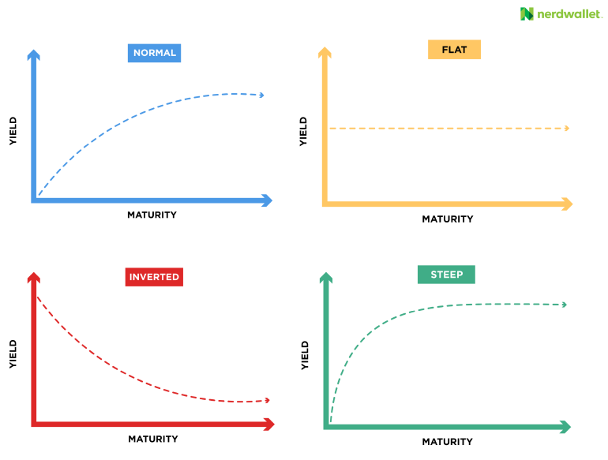

## Table of Contents

## What is a yield curve?

A yield curve is a graph that shows the interest rates on bonds of different lengths of time until they mature. It's like a picture that helps people see how much they can earn from bonds that will pay back in a few months, a few years, or even many years from now. Usually, the longer you have to wait for your money back, the more interest you get, so the yield curve often slopes upward.

Sometimes, the yield curve can look different. If people think the economy might not do well soon, they might want to get their money back quicker, so they'll buy short-term bonds even if they pay less interest. This can make the yield curve flat or even turn it upside down, which is called an inverted yield curve. When this happens, it can be a sign that people are worried about the future of the economy.

## What is yield curve risk?

Yield curve risk is the chance that changes in the shape of the yield curve could hurt the value of your investments. Imagine you own a bunch of bonds. If the yield curve moves around, it can make your bonds worth more or less money. This happens because the yield curve shows how much interest you can get from different bonds, and if that changes, people might want to buy or sell bonds, which changes their price.

For example, if the yield curve gets steeper, it means the difference between short-term and long-term interest rates is getting bigger. If you have long-term bonds, they might lose value because new long-term bonds are being sold with higher interest rates, making your old bonds less attractive. On the other hand, if the yield curve flattens or inverts, short-term bonds might lose value because people start wanting long-term bonds more. So, yield curve risk is about how these changes can affect what your bonds are worth.

## How does yield curve risk affect investors?

Yield curve risk can make things tricky for investors. If the yield curve changes shape, it can change how much money investors can make from their bonds. For example, if the yield curve gets steeper, it means the difference between short-term and long-term interest rates is getting bigger. If an investor has long-term bonds, those bonds might lose value because new long-term bonds are being sold with higher interest rates. This makes the old bonds less attractive to other people who might want to buy them.

On the other hand, if the yield curve flattens or even inverts, it can affect short-term bonds. When this happens, people might start wanting long-term bonds more because they think the economy might not do well soon. This can make short-term bonds lose value. So, investors need to keep an eye on the yield curve because it can change what their bonds are worth and how much money they can make from them.

## What are the different types of yield curve risk?

There are a few types of yield curve risk that investors need to know about. One type is called "reinvestment risk." This happens when interest rates go down, and investors have to put their money back into new bonds that pay less interest than the old ones. It's like getting less juice from a new orange than you got from the one you just finished. Another type is "price risk," which is when the value of bonds goes up or down because of changes in interest rates. If rates go up, the price of existing bonds goes down, and if rates go down, the price of existing bonds goes up.

Another type of yield curve risk is "yield curve twist risk." This is when the shape of the yield curve changes, like when it gets steeper or flatter. If the yield curve gets steeper, long-term bonds might lose value because new bonds with higher interest rates are more attractive. If it gets flatter or inverts, short-term bonds might lose value because people start wanting long-term bonds more. All these types of risk can affect how much money investors make from their bonds, so it's important to understand them.

## Can you explain interest rate risk in relation to the yield curve?

Interest rate risk is about how changes in interest rates can affect the value of bonds. When interest rates go up, the price of existing bonds usually goes down. This happens because new bonds are being sold with higher interest rates, making the old bonds less attractive to buyers. So, if you own a bond and interest rates rise, you might find that your bond is worth less money if you want to sell it. On the other hand, if interest rates go down, the price of existing bonds usually goes up because they are paying more interest than new bonds being sold.

The yield curve shows how interest rates change over different lengths of time for bonds. When the yield curve moves, it can change the interest rates for short-term and long-term bonds differently. This movement can create interest rate risk for investors. For example, if the yield curve gets steeper, it means the difference between short-term and long-term interest rates is getting bigger. If you have long-term bonds, they might lose value because new long-term bonds are being sold with higher interest rates. So, the shape of the yield curve and how it changes can really affect the interest rate risk that investors face.

## What is yield curve twist risk and how does it impact bond portfolios?

Yield curve twist risk is when the shape of the yield curve changes, like when it gets steeper or flatter. Imagine the yield curve as a line on a graph that shows how much interest you can get from bonds that will pay back in different amounts of time. If the line gets steeper, it means the difference between short-term and long-term interest rates is getting bigger. If it gets flatter, the difference is getting smaller. This twist can happen because of changes in the economy or what people think will happen in the future.

When the yield curve twists, it can really affect bond portfolios. If the yield curve gets steeper, long-term bonds might lose value because new bonds with higher interest rates are more attractive to buyers. This means if you own long-term bonds, they might be worth less money. On the other hand, if the yield curve gets flatter or even inverts, short-term bonds might lose value because people start wanting long-term bonds more. So, investors need to keep an eye on the yield curve because its twists can change how much money they can make from their bonds.

## How does yield curve flattening or steepening affect different securities?

When the yield curve flattens, it means the difference between short-term and long-term interest rates is getting smaller. This can happen if people think the economy might slow down, so they want to buy long-term bonds to lock in higher interest rates before they go down. If you own short-term bonds, they might lose value because people are more interested in long-term bonds. On the other hand, if you own long-term bonds, they might keep their value or even go up a bit because more people want them. This can be good for people who have long-term bonds in their portfolio, but not so good for those with short-term bonds.

When the yield curve steepens, it means the difference between short-term and long-term interest rates is getting bigger. This can happen if people think the economy will do well, so they want to buy short-term bonds to take advantage of rising interest rates. If you own long-term bonds, they might lose value because new long-term bonds are being sold with higher interest rates, making your old bonds less attractive. But if you own short-term bonds, they might keep their value or even go up because more people want them. This can be good for people who have short-term bonds in their portfolio, but not so good for those with long-term bonds.

## What are some strategies to manage yield curve risk?

One way to manage yield curve risk is by using a strategy called laddering. This means you buy bonds that will pay back at different times, like some in a year, some in two years, and some in five years. By spreading out when your bonds will pay back, you can lower the risk that changes in the yield curve will hurt all your bonds at the same time. If the yield curve changes and some of your bonds lose value, others might still be doing okay. This can help keep your overall investment more stable.

Another strategy is to use interest rate swaps. This is a bit more complicated, but it's like making a deal with someone else to swap the interest payments on your bonds. If you think interest rates might go up and hurt your long-term bonds, you can swap those payments for payments from short-term bonds. This way, if the yield curve gets steeper, you're protected because you're getting payments from the short-term bonds that might be doing better. It's like having a safety net for your investments when the yield curve moves around.

## How can duration and convexity be used to assess yield curve risk?

Duration and convexity are two tools that help investors understand how changes in the yield curve might affect their bond investments. Duration measures how sensitive a bond's price is to changes in interest rates. It's like a way to see how much the price of a bond will go up or down if interest rates change. If a bond has a high duration, its price will change a lot with small changes in interest rates. So, if you're worried about the yield curve getting steeper, you might want to look at the duration of your long-term bonds because they could lose value if interest rates go up.

Convexity adds another layer of understanding by showing how the duration of a bond changes as interest rates move. It's a bit more complicated, but it helps investors see how the price of a bond might react to big changes in interest rates. If a bond has high convexity, its price won't drop as much when interest rates go up, and it might even go up more when interest rates go down. So, by looking at both duration and convexity, investors can get a better idea of how their bond portfolio might be affected by twists in the yield curve and plan their investments more wisely.

## What role do macroeconomic factors play in yield curve risk?

Macroeconomic factors are big things that affect the whole economy, like how fast the economy is growing, what the inflation rate is, and what the central bank is doing with interest rates. These factors can change the shape of the yield curve, which is the line that shows how much interest you can get from bonds that will pay back at different times. For example, if the economy is growing really fast, people might think that interest rates will go up soon. This can make the yield curve steeper because people want to buy short-term bonds to take advantage of the rising rates.

On the other hand, if people think the economy might slow down or even go into a recession, they might want to buy long-term bonds to lock in higher interest rates before they go down. This can make the yield curve flatter or even turn it upside down, which is called an inverted yield curve. When the yield curve changes because of these big economic factors, it can create risks for investors who own bonds. If you have long-term bonds and the yield curve gets steeper, your bonds might lose value. But if you have short-term bonds and the yield curve flattens, those bonds might lose value instead. So, keeping an eye on these macroeconomic factors can help investors manage their yield curve risk better.

## How do central bank policies influence yield curve risk?

Central bank policies, like setting interest rates or buying and selling bonds, can really change the shape of the yield curve. When a central bank decides to raise interest rates, it usually makes short-term interest rates go up faster than long-term rates. This can make the yield curve steeper because the difference between short-term and long-term rates gets bigger. On the other hand, if the central bank lowers interest rates, it can make the yield curve flatter because the difference between short-term and long-term rates gets smaller. Sometimes, central banks also buy long-term bonds to keep long-term interest rates low, which can flatten the yield curve even more.

These changes in the yield curve because of central bank policies can create risks for people who own bonds. If the yield curve gets steeper because the central bank raises rates, long-term bonds might lose value because new bonds with higher interest rates are more attractive. But if the yield curve flattens because the central bank lowers rates or buys long-term bonds, short-term bonds might lose value because people start wanting long-term bonds more. So, investors need to pay attention to what the central bank is doing because it can affect how much money they can make from their bonds.

## What advanced models are used to predict and manage yield curve risk?

To predict and manage yield curve risk, people use something called the Nelson-Siegel model. This model helps them guess what the yield curve might look like in the future. It does this by looking at how the yield curve has changed in the past and using math to figure out what might happen next. The model breaks down the yield curve into different parts, like short-term, medium-term, and long-term rates, and then it tries to predict how these parts will move. This can help investors see if the yield curve might get steeper or flatter, which can affect the value of their bonds.

Another model that's used is the Dynamic Nelson-Siegel model. This one is a bit more complicated because it takes into account that the economy is always changing. It looks at things like how fast the economy is growing, what the inflation rate is, and what the central bank is doing with interest rates. By using all this information, the Dynamic Nelson-Siegel model can make better guesses about how the yield curve might change. This can help investors manage their bond portfolios better because they can see how different economic factors might affect their investments.

## References & Further Reading

[1]: ["The Econometrics of the Yield Curve"](https://direct.mit.edu/rest/article/90/1/182/58639/The-Yield-Curve-as-a-Predictor-of-Growth-Long-Run) by Franck Jovanovic and Christophe Hurlin, Journal of Econometrics.

[2]: ["Interest Rate Swaps and Other Derivatives"](https://www.investopedia.com/terms/i/interestrateswap.asp) by Howard Corb

[3]: ["Risk Management and Financial Institutions"](https://www.amazon.com/Management-Financial-Institutions-Wiley-Finance/dp/1119932483) by John C. Hull

[4]: ["Algorithmic Trading: Winning Strategies and Their Rationale"](https://www.amazon.com/Algorithmic-Trading-Winning-Strategies-Rationale-ebook/dp/B00CY5HC0U) by Ernest P. Chan

[5]: ["Yield Curve Modeling and Forecasting"](https://www.sas.upenn.edu/~fdiebold/papers/paper109/EIRLintro.pdf) by Francis X. Diebold and Glenn D. Rudebusch