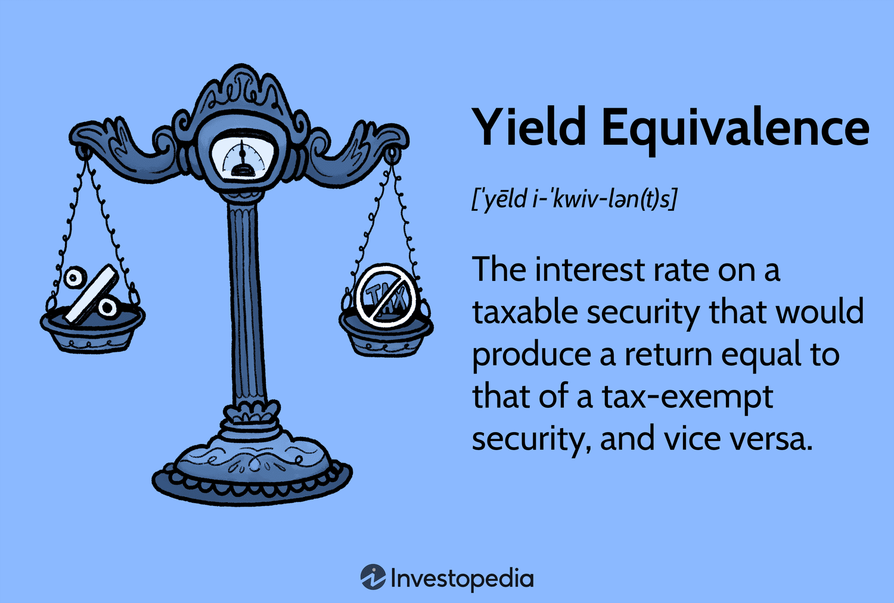

In recent years, the financial sector has been transformed by significant technological advancements, particularly with the advent of algorithmic trading and the concept of yield finance equivalence. These developments have dramatically influenced the methods by which investments are analyzed and directed, leading to enhanced decision-making processes and optimization of investment strategies. 

Algorithmic trading employs sophisticated computer algorithms to execute trades with precision and speed based on predefined criteria. It enhances liquidity and reduces transaction costs, allowing market participants to analyze vast datasets efficiently and make informed decisions in real-time. This technology has not only increased the efficiency of financial markets but also broadened access to complex strategies that were previously available only to seasoned traders.



On the other hand, yield finance equivalence is a fundamental concept for investors dealing with fixed-income securities, such as bonds. It enables the comparison between tax-exempt and taxable securities by assessing the interest rate required from a taxable security to yield a return equivalent to that of a tax-exempt security. By utilizing this concept, investors can make more informed decisions regarding their bond portfolios, ensuring that they maximize after-tax returns.

The integration of yield finance equivalence with algorithmic trading represents a contemporary approach to investment strategy that leverages both tax considerations and technological prowess. This synthesis allows for a more nuanced understanding of market dynamics and aids in the development of strategies that are both innovative and responsive to ever-changing financial conditions. By combining these theories, traders and financial professionals are better equipped to navigate the complexities of modern markets, ultimately aiming to enhance financial performance amidst a backdrop of increasing technical and regulatory challenges. 

This article will explore the principles, benefits, and challenges associated with this integration, providing insights that are crucial for optimizing investment strategies in today's financial landscape.

## Table of Contents

## Understanding Yield Finance Equivalence

Yield equivalence is a fundamental concept for investors, especially those involved in bond trading. This concept comes into play primarily when comparing tax-exempt and taxable securities. Yield equivalence provides a way to equate the yields from different types of securities by accounting for the tax implications that might affect their returns. This calculation is essential for investors who seek to maximize their after-tax returns.

### Yield Equivalence Formula

The yield equivalence formula allows investors to determine the [interest rate](/wiki/interest-rate-trading-strategies) on a taxable security that would result in the same after-tax return as a tax-exempt security. It is particularly useful for evaluating municipal bonds (typically tax-exempt) against corporate bonds (taxable).

The general formula for yield equivalence is expressed as follows:

$$
T = \frac{r}{1 - t}
$$

Where:
- $T$ is the taxable equivalent yield.
- $r$ is the tax-exempt yield (interest rate of the tax-free bond).
- $t$ is the investor's marginal tax rate.

This formula helps in comparing whether an investor should prefer a tax-exempt bond or its taxable equivalent depending on which offers a higher post-tax return. 

### Application Example

Consider an investor deciding between a municipal bond with a yield of 3% and a corporate bond with a yield of 4%. Suppose the investor's marginal tax rate is 25%.

1. Calculate the taxable equivalent yield using the formula:

$$
T = \frac{0.03}{1 - 0.25} = \frac{0.03}{0.75} = 0.04 \, \text{or} \, 4\%
$$

2. In this case, the taxable equivalent yield of the municipal bond is 4%, which is the same as that of the corporate bond, making them equally attractive in terms of after-tax returns.

### Evaluating Bond Investments 

Investors use yield equivalence to make informed decisions about bond investments, especially in a diversified portfolio. By comparing yields across different bond types, investors can select securities that better align with their tax strategies and financial goals. This approach not only optimizes returns but also ensures tax-efficient investing.

Utilization of this principle is critical for balancing portfolios in light of tax policies and individual tax liabilities, guiding investors towards more beneficial financial outcomes.

## Basics of Algorithmic Trading

Algorithmic trading uses computer algorithms to execute trades at high frequencies and speeds, surpassing human capabilities. These algorithms are designed with pre-defined instructions, enabling the automation of trading strategies and increasing market [liquidity](/wiki/liquidity-risk-premium). By analyzing multiple market variables, algorithms can make decisions based on complex mathematical models and statistical analysis.

Typically, [algorithmic trading](/wiki/algorithmic-trading) strategies incorporate several types of algorithms, each with specific functions. Common strategies include trend-following, [arbitrage](/wiki/arbitrage), and market-making. Trend-following algorithms capitalize on statistical patterns by executing trades aligned with market [momentum](/wiki/momentum). Arbitrage algorithms exploit price discrepancies across different markets or securities, while market-making algorithms enhance liquidity by continuously quoting buy and sell prices.

One of the main advantages of algorithmic trading is its ability to minimize the emotional and psychological biases that can affect human traders. Algorithms can execute orders in fractions of a second, making decisions based on quantitative data without human intervention. This speed allows for the exploitation of short-lived trading opportunities, improving overall efficiency and effectiveness.

Algorithmic trading has a significant impact on financial markets. It increases market efficiency by narrowing bid-ask spreads and reducing transaction costs. However, it also introduces challenges such as increased market [volatility](/wiki/volatility-trading-strategies) and the potential for systemic risks if algorithms behave unexpectedly. Additionally, the reliance on technology necessitates robust systems to manage and monitor algorithm performance continuously.

In summary, algorithmic trading automates trade execution through sophisticated algorithms, enhancing market liquidity and efficiency while presenting unique challenges that require careful management. As computing power and data analytics continue to advance, the role of algorithmic trading in financial markets is likely to expand further.

## Integrating Yield Equivalence with Algorithmic Trading

Combining yield equivalence with algorithmic trading can significantly enhance investment strategies by seamlessly incorporating tax considerations into algorithmic models. This integration allows for more informed decision-making, enabling algorithms to react effectively to changes in yield and optimize returns for investors.

Yield finance equivalence is a critical concept used by investors to evaluate the attractiveness of different bond investment options by comparing the yields of taxable and tax-exempt securities. Employing this concept within algorithmic trading involves embedding yield equivalence calculations into trading algorithms, allowing them to consider after-tax yields when executing trades. By doing so, traders can optimize portfolios to account for both market conditions and tax implications, ultimately aiming for optimal financial outcomes.

To practically integrate yield equivalence with algorithmic trading, consider the following basic formula used to calculate the taxable equivalent yield (TEY) of a tax-exempt bond:

$$
\text{TEY} = \frac{\text{Tax-Exempt Yield}}{1 - \text{Tax Rate}}
$$

This formula allows investors to equate the yield of a tax-exempt bond to that of a taxable one by adjusting for the investor's tax rate, providing a basis for algorithmic comparison and decision-making.

In practice, a trading algorithm can be designed to incorporate this yield equivalence formula to optimize bond trading strategies. For instance, an algorithm could be written in Python to scan a universe of available bonds and prioritize trades based on the best taxable equivalent yields. Here's a pseudocode example:

```python
def calculate_taxable_equivalent_yield(tax_exempt_yield, tax_rate):
    return tax_exempt_yield / (1 - tax_rate)

def select_optimal_bonds(available_bonds, tax_rate):
    for bond in available_bonds:
        bond['TEY'] = calculate_taxable_equivalent_yield(bond['tax_exempt_yield'], tax_rate)
    sorted_bonds = sorted(available_bonds, key=lambda x: x['TEY'], reverse=True)
    return sorted_bonds[:5]  # Select top 5 bonds based on TEY

# Example usage
bonds_list = [
    {'name': 'Bond A', 'tax_exempt_yield': 0.03},
    {'name': 'Bond B', 'tax_exempt_yield': 0.04},
    # More bonds...
]

optimal_bonds = select_optimal_bonds(bonds_list, tax_rate=0.25)
print(optimal_bonds)
```

This Python pseudocode illustrates how yield equivalence can guide algorithmic decision-making in bond selection. By systematically calculating and comparing the taxable equivalent yields of available bonds, algorithms can prioritize trades that maximize returns based on the investor's tax circumstances.

Case studies in real-time applications demonstrate the efficacy of this approach. For example, investment firms employing yield equivalence strategies within their algorithmic trading systems report improved after-tax returns by dynamically responding to tax-related adjustments, like changes in tax laws or rates. These systems are designed to [exit](/wiki/exit-strategy) and enter positions in response to the relative yield advantages of taxable versus tax-exempt securities, considering the investor's current and projected tax liabilities.

Overall, integrating yield equivalence with algorithmic trading represents a sophisticated strategy in modern finance, leveraging computational power and tax considerations to enhance portfolio performance in increasingly complex and competitive markets.

## Statistical Methods and Tools

Statistical tools and programming languages like Python play an essential role in implementing yield finance equivalence and algorithmic trading strategies. These technologies simplify the complex computations necessary for evaluating bond yields and executing trades with precision.

Python is widely favored for its extensive libraries and frameworks that facilitate financial analysis and algorithmic trading. Libraries like NumPy, pandas, and SciPy offer robust functionalities to handle large datasets and perform intricate mathematical calculations required for yield equivalence. For instance, the calculation of the yield equivalence of a bond involves determining the taxable yield that equates the after-tax return of a tax-exempt bond. The formula for yield equivalence can be expressed as:

$$
\text{Taxable Equivalent Yield} = \frac{\text{Tax-Exempt Yield}}{1 - \text{Tax Rate}}
$$

Python's pandas library can efficiently manage data related to bond yields and tax rates, executing calculations to derive taxable equivalent yields. Here is a simple pseudocode example to illustrate this computation:

```python
import pandas as pd

def taxable_equivalent_yield(tax_exempt_yield, tax_rate):
    return tax_exempt_yield / (1 - tax_rate)

# Example Data
data = {'Tax-Exempt Yield': [0.03, 0.04],
        'Tax Rate': [0.25, 0.30]}

df = pd.DataFrame(data)
df['Taxable Equivalent Yield'] = df.apply(lambda row: taxable_equivalent_yield(row['Tax-Exempt Yield'], row['Tax Rate']), axis=1)

print(df)
```

In addition to yield calculations, programming languages enable the development of sophisticated algorithmic trading models. Libraries such as TA-Lib or PyAlgoTrade provide ready-to-use tools for constructing and [backtesting](/wiki/backtesting) trading strategies. These libraries offer a diverse range of indicators and analytical tools to create algorithms that can adapt to real-time market data, react to changing yields, and optimize overall portfolio returns.

Moreover, other essential tools include statistical packages like R, which can complement Python in performing advanced statistical analyses and visualizations, crucial for backtesting and strategy validation. R's powerful packages like quantmod and PerformanceAnalytics offer comprehensive solutions for quantitative traders to analyze financial data and assess strategy performance.

The utilization of these statistical tools and programming languages not only improves computational efficiency but also allows investors and traders to maintain agility in rapidly changing markets. By employing these technologies, finance professionals can effectively integrate yield equivalence into algorithmic trading strategies, driving improved financial performance.

## Challenges and Considerations

In the integration of yield equivalence and algorithmic trading, several challenges must be addressed to maintain strategy robustness and ensure effective risk management. One of the foremost challenges is the regulatory landscape. Various regions have distinct rules governing algorithmic trading and tax treatments, which can significantly impact the implementation of investment strategies that leverage yield equivalence. For example, the Markets in Financial Instruments Directive II (MiFID II) in the European Union imposes extensive reporting requirements and transparency standards that can affect algorithmic trading operations. Adhering to such regulations is crucial, and failure to comply can result in legal and financial repercussions.

Market volatility is another pivotal challenge that investors face when applying yield-focused algorithmic trading strategies. Sudden market swings can lead to mispricing of securities, which algorithms may not be equipped to handle effectively without robust risk management protocols in place. To mitigate the effects of volatility, algorithms can be designed to include stop-loss orders and volatility filters. These mechanisms can either pause trading or adjust strategy parameters automatically during periods of high market fluctuations to protect against unwanted losses.

Technological dependency presents a distinct set of challenges. Algorithmic trading relies heavily on the stability and speed of technological infrastructure. Network latency, software bugs, and hardware failures can all impact the performance of trading algorithms. Regular system audits and adopting failover strategies are essential to minimize the risk of technological disruptions. Moreover, the implementation of [machine learning](/wiki/machine-learning) techniques for predictive analysis and anomaly detection can enhance the system's resilience against unexpected issues.

Risk management is integral to addressing these challenges. Employing statistical methods such as Value at Risk (VaR) and stress testing can provide insights into potential exposures. For instance, VaR calculates the maximum expected loss over a specified time frame at a given confidence level, enabling investors to gauge risk under normal market conditions. Stress testing, on the other hand, evaluates the impact of extreme scenarios, ensuring that strategies remain robust amidst severe market disruptions.

In conclusion, by acknowledging and strategically addressing regulatory constraints, market volatility, and technological dependencies, investors can enhance the resilience and effectiveness of their yield-focused algorithmic trading strategies. Successful navigation of these challenges necessitates a combination of sound regulatory knowledge, advanced technological solutions, and rigorous risk management practices.

## Conclusion and Future Directions

The integration of yield equivalence with algorithmic trading exemplifies a powerful combination that can significantly enhance investment strategies. Yield equivalence provides a mathematical foundation for comparing different securities, particularly in assessing tax implications on returns. By incorporating this concept into algorithmic trading, investors can make more informed decisions that consider both the tax advantages and the immediate market conditions.

One of the primary benefits of this integration is the ability to automate trading strategies that are sensitive to tax considerations, potentially leading to higher after-tax returns. Algorithmic systems can adjust trading strategies in real-time based on the yield equivalence calculations, optimizing portfolio performance by swiftly reallocating investments between taxable and tax-exempt securities as market conditions change.

Looking towards the future, the potential of these concepts continues to expand. Advances in machine learning and [artificial intelligence](/wiki/ai-artificial-intelligence) are likely to refine algorithmic trading systems, making them more adept at predicting market movements and adapting strategies for better financial outcomes. The continuous development of robust data analytics tools will further enable the fine-tuning of trading algorithms to integrate yield equivalence more effectively.

Market complexities and advancements in financial technologies pose both opportunities and challenges. Financial professionals must remain vigilant, continuously updating their strategies to leverage cutting-edge tools and methodologies. Staying informed on regulatory changes is also crucial, as new policies might impact both yield equivalence and algorithmic trading practices.

In conclusion, the intersection of yield equivalence and algorithmic trading represents a frontier with great promise for optimal investment performance. As technology continues to evolve, these concepts will play an increasingly vital role in sophisticated trading strategies, empowering investors to achieve superior financial outcomes amidst dynamic market landscapes.

## References & Further Reading

[1]: ["Advances in Financial Machine Learning"](https://www.amazon.com/Advances-Financial-Machine-Learning-Marcos/dp/1119482089) by Marcos Lopez de Prado

[2]: ["Evidence-Based Technical Analysis: Applying the Scientific Method and Statistical Inference to Trading Signals"](https://www.amazon.com/Evidence-Based-Technical-Analysis-Scientific-Statistical/dp/0470008741) by David Aronson

[3]: ["Machine Learning for Algorithmic Trading"](https://github.com/stefan-jansen/machine-learning-for-trading) by Stefan Jansen

[4]: ["Quantitative Trading: How to Build Your Own Algorithmic Trading Business"](https://www.amazon.com/Quantitative-Trading-Build-Algorithmic-Business/dp/1119800064) by Ernest P. Chan

[5]: ["Yield Curve Modeling and Forecasting: The Dynamic Nelson-Siegel Approach"](https://www.tandfonline.com/doi/full/10.1080/14697688.2015.1005351) by Francis X. Diebold and Glenn D. Rudebusch