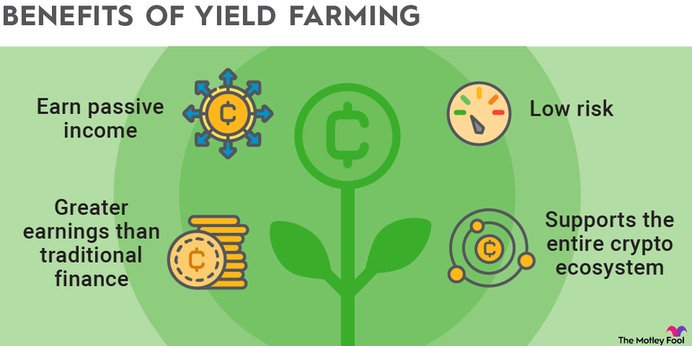

The world of cryptocurrency is continually evolving, offering investors a plethora of strategies to enhance their returns. Among these strategies, yield farming has gained prominence as part of the decentralized finance (DeFi) ecosystem. Yield farming is characterized by the lending or staking of cryptocurrency assets to generate high returns, typically through decentralized platforms. However, this strategy carries significant risks due to the volatility of the crypto markets and potential regulatory issues.

To understand yield farming, it is essential to explore how it functions as a cryptocurrency investment strategy, its potential benefits, and inherent risks. Through lending and staking, investors can earn rewards, but they must also be aware of market dynamics and regulatory frameworks that could impact these earnings. 



Additionally, algorithmic trading plays a crucial role in the crypto investment landscape. It automates decisions and actions, optimizing strategies and potentially increasing returns while simultaneously mitigating risks. Combining yield farming with algorithmic trading can create a sophisticated investment approach, leveraging data-driven insights and automation to navigate the complex crypto markets. As such, understanding the interplay between yield farming and algorithmic trading is vital for those seeking to maximize returns while managing risks in the cryptocurrency sphere.

## Table of Contents

## What is Yield Farming?

Yield farming is a strategy used in the decentralized finance (DeFi) ecosystem to maximize returns on cryptocurrency holdings by leveraging various blockchain-based protocols. This method consists of lending or staking crypto assets on DeFi platforms, primarily in the form of liquidity provision, with the aim of earning rewards.

In yield farming, participants lend their assets to decentralized exchanges (DEXs) or other platforms. In return, they receive interest, fees, or reward tokens, which are generated from transaction fees incurred on the platform. This process often involves the use of smart contracts, which automate transactions and agreements on the blockchain.

The underlying principle of yield farming is akin to providing liquidity. When participants provide liquidity, they contribute a pair of tokens in a pool, enabling others to trade these assets without reliance on traditional order [books](/wiki/algo-trading-books). The liquidity providers are compensated with a portion of the trading fees generated by trades within the pool.

Yield farming can yield significant returns, especially when the value of the reward tokens appreciates. However, the practice carries risks predominantly associated with the [volatility](/wiki/volatility-trading-strategies) of cryptocurrencies, the potential for impermanent loss, and regulatory scrutiny. Impermanent loss occurs when the price of the pooled tokens changes, leading to a potential discrepancy in the value of the staked assets compared to just holding the tokens.

Moreover, the regulatory landscape for yield farming remains largely undefined, which exposes participants to abrupt legal or regulatory changes that may impact the viability or profitability of yield farming strategies. The dynamic nature of [cryptocurrency](/wiki/cryptocurrency) values, coupled with the still-developing legal frameworks, necessitates a cautious approach for those participating in yield farming. 

Overall, while yield farming can be a lucrative pursuit, participants must be cognizant of the inherent risks, diligently research the platforms they consider, and stay informed about potential regulatory developments.

## How Yield Farming Works

Yield farming functions by deploying cryptocurrency coins or tokens within a decentralized exchange (DEX), hence enabling [liquidity](/wiki/liquidity-risk-premium) for various token pairs. This strategy takes advantage of the decentralized finance (DeFi) ecosystem, where investors serve as liquidity providers (LPs). By contributing their assets, they facilitate trading on platforms like Uniswap, Aave, and Pancakeswap, which are prominently used for yield farming activities.

In this process, investors earn returns in the form of interest or trading fees. These rewards are generated from the activities that occur within the liquidity pools—essentially, any trading executed within these pools contributes a small fee that is distributed proportionally to the LPs based on their share of the liquidity pool.

The automation of this process is facilitated by smart contracts. Within yield farming, smart contracts are self-executing contracts with the terms of the agreement directly written into lines of code. These smart contracts autonomously manage the logistics of liquidity provision, reward generation, and distribution, minimizing human intervention and transaction inefficiencies.

The mathematical principles underlying yield farming can be distilled into a few core ideas. Let’s consider a simple calculation of expected returns from yield farming: 

If $R_i$ is the reward rate for an investor providing $L_i$ amount of liquidity to a pool with a total pool liquidity $L_t$, the investor's expected reward $R_e$ can be expressed as:

$$
R_e = \frac{L_i}{L_t} \times R_i
$$

This formula emphasizes that an investor's reward is proportional to their contribution to the total liquidity. However, actual yields can vary due to a range of factors including changes in pool liquidity, fluctuations in asset prices, and varying levels of trading activity within the pool.

Protocols like Uniswap, Aave, and Pancakeswap are structurally different but share a common thread in facilitating yield farming. Uniswap, for example, operates on the Automated Market Maker (AMM) model, where liquidity providers earn fees from trades facilitated by their deposit in smart contracts. Aave, on the other hand, allows users to lend and borrow assets, providing returns through interest. Pancakeswap, similar to Uniswap, functions on AMM but primarily deals with assets on Binance Smart Chain, offering liquidity providers incentives through its native CAKE tokens.

Smart contracts across these platforms ensure seamless transaction execution, reward distribution, and are critical in handling variations in market conditions, thus underscoring their fundamental role in the yield farming ecosystem. Investors engage with these tools with the aim of maximizing their returns while navigating the intricacies and risks inherent in DeFi platforms.

## Tools and Strategies in Yield Farming

Yield farming, a prominent strategy within the decentralized finance landscape, enables investors to optimize returns through a variety of tools and tactics. This section explores the strategies employed by yield farmers to maximize their potential gains.

One of the primary techniques used by yield farmers is compounding interest by reinvesting earnings. This strategy involves taking the returns earned from yield farming activities and plowing them back into the same or different yield-generating opportunities. By doing so, farmers can benefit from compound interest, exponentially increasing their overall returns over time. The process can be visualized through the formula for compound interest:

$$
A = P \left(1 + \frac{r}{n}\right)^{nt}
$$

Where:
- $A$ is the amount of money accumulated after n years, including interest.
- $P$ is the principal amount (initial investment).
- $r$ is the annual interest rate (decimal).
- $n$ is the number of times that interest is compounded per year.
- $t$ is the time the money is invested for in years.

In the context of yield farming, more frequent compounding can lead to significantly higher returns.

Another strategy involves swapping reward tokens for different assets. Yield farmers earn various tokens as rewards from different protocols. These reward tokens can be volatile, so farmers often swap them for more stable or promising assets that align with their investment goals. This tactic can help mitigate risk and stabilize returns, adapting to market conditions and portfolio objectives.

Algorithmic trading plays a crucial role in supporting these strategies by automating decisions and actions. This involves leveraging algorithms to execute trades and manage investment portfolios, enhancing efficiency and effectiveness in yield farming. By utilizing algorithms, yield farmers can set predefined criteria for buying or selling assets, ensuring timely and accurate execution without constant manual intervention. A basic example of such automation can be demonstrated in Python using libraries like Pandas and NumPy:

```python
import pandas as pd
import numpy as np

# Example data: rewards and prices
data = {
    'time': pd.date_range(start='2023-01-01', periods=5, freq='D'),
    'reward_tokens': [100, 105, 98, 110, 108],
    'token_prices': [10, 12, 8, 11, 9]
}

# Creating a DataFrame
df = pd.DataFrame(data)

# Calculating daily portfolio value
df['portfolio_value'] = df['reward_tokens'] * df['token_prices']

# Example of automated decision: Swap when the price drops below 10
df['swap_decision'] = np.where(df['token_prices'] < 10, 'Swap', 'Hold')

print(df)
```

This code snippet automates the decision process of swapping reward tokens based on predefined price conditions, demonstrating how [algorithmic trading](/wiki/algorithmic-trading) can optimize yield farming strategies.

In conclusion, yield farming strategies include a blend of reinvestment techniques and asset management, enhanced by algorithmic trading. These strategies aim to optimize profitability, leveraging technology for efficiency and strategic decision-making.

## Roles and Functions in Yield Farming

Yield farming encompasses various roles that investors can assume, each with distinct responsibilities and risk profiles. Understanding these roles is crucial for yield farmers who aim to optimize returns while managing potential downsides effectively.

**Liquidity Providers:** In the yield farming ecosystem, liquidity providers play a pivotal role by supplying liquidity to decentralized exchanges (DEXs). These individuals or entities deposit their cryptocurrency assets into liquidity pools, which are essential for enabling trading activities on DEX platforms. In exchange for their contributions, liquidity providers earn a portion of the transaction fees generated within these pools. Despite the lucrative potential, liquidity provision is not without its risks, including impermanent loss, which occurs when the relative value of deposited tokens changes unfavorably compared to holding them outright.

**Lenders and Borrowers:** Yield farming often involves lending and borrowing activities facilitated through smart contracts on DeFi platforms. Lenders supply their crypto assets to lending pools, earning interest from borrowers who utilize these funds for various purposes, including leveraged trading or meeting liquidity needs. The primary risk for lenders is the potential default of borrowers, although this is mitigated by over-collateralization requirements in many protocols. Conversely, borrowers can leverage their existing crypto holdings to secure loans, providing collateral that typically exceeds the borrowed amount, thereby managing the lender's risk.

**Stakers:** Stakers lock their cryptocurrency in staking mechanisms associated with proof-of-stake (PoS) or delegated proof-of-stake (DPoS) blockchains. Staking supports network operations such as transaction validation and security maintenance. In return, stakers receive rewards proportional to the number of coins staked and the duration of the staking period. The staking role is less complex than active liquidity provision but comes with its own set of risks, including the possibility of slashing, a penalty for malicious actions or network failures affecting validator nodes.

While these roles in yield farming offer opportunities for profit, they require a comprehensive understanding of associated risks and the operational mechanics of the specific DeFi platforms involved. As yield farmers navigate this multifaceted landscape, they must remain vigilant and informed about the changing market conditions and the evolving regulatory environment surrounding cryptocurrency investments.

## Risks of Yield Farming

Yield farming, as an investment strategy within the cryptocurrency sector, involves substantial risks that investors need to address to safeguard their assets. The most significant risks pertain to market volatility, regulatory changes, and potential 'rug pulls' by developers.

Market volatility is inherent in the cryptocurrency ecosystem, where asset prices can fluctuate dramatically over short periods. This volatility can affect the value of cryptocurrencies used in yield farming, potentially leading to substantial losses. For example, if a yield farmer provides liquidity in a pool involving volatile token pairs, a sharp drop in prices can erode the initial investment's value, even if the farmer earns yield in the form of transaction fees or tokens. Therefore, understanding historical price trends and market behavior is crucial for managing this risk.

Regulatory changes pose another critical risk to yield farming. As governments and regulatory bodies worldwide continue to scrutinize and develop frameworks for cryptocurrency, legislative changes can directly impact DeFi platforms. This could result in restrictions on certain activities, unforeseen taxation policies, or even the banning of a specific platform or asset, adversely affecting the investments within those platforms. Investors need to stay informed about global regulatory developments to anticipate potential impacts on their yield farming endeavors.

The threat of 'rug pulls' represents a unique risk associated with yield farming. A 'rug pull' occurs when developers of a DeFi protocol unexpectedly withdraw support or deliberately scam liquidity providers by draining the liquidity pool, leaving investors with worthless assets. This can happen in projects lacking transparency and with unaudited smart contracts. Due diligence, such as researching the team behind a protocol, examining the codebase if available, and seeking platforms with third-party audits, is essential to mitigate the risk of falling victim to such scams.

Investors must remain vigilant regarding the protocols they choose to engage with. Evaluating the smart contracts' security measures, the team’s credibility maintaining the platform, and the overall community trust are vital components of this vigilance. Additionally, assessing the stability and sustainability of the returns promised can help in identifying overly aggressive or unrealistic yield offers, which might indicate higher risk. Implementing diversified strategies, keeping abreast of technological advancements, and leveraging robust analytical tools can assist investors in navigating these complexities and reducing potential risks.

## Yield Farming vs. Other Investment Strategies

Yield farming, staking, and traditional crypto trading each present unique strategies for investors seeking different risk-reward scenarios in the dynamic landscape of cryptocurrency investments. Understanding these strategies' nuances and interdependencies can aid in optimizing investment portfolios.

Yield farming involves providing liquidity to decentralized exchanges or lending platforms, incentivizing participants with high returns but exposing them to significant risks, such as market volatility and smart contract vulnerabilities. The ability to earn yield from transaction fees and token rewards makes yield farming attractive, but its complexity and risk levels are notable.

In contrast, staking involves locking up cryptocurrencies in a proof-of-stake (PoS) blockchain to help secure the network and validate transactions, [earning](/wiki/earning-announcement) rewards in return. Staking typically offers lower returns compared to yield farming but comes with reduced risk, as it is less exposed to market influences and relies on the stability of the staked blockchain. The deterministic nature of staking rewards as a function of network participation and block validation provides a more predictable income stream for investors.

Traditional crypto trading involves buying and selling cryptocurrencies on exchanges to profit from fluctuating asset prices. While offering high liquidity and flexibility, this strategy is heavily influenced by market trends and requires investors to have a deep understanding of market dynamics and technical analysis. This can be high-risk but also provides opportunities for substantial returns based on market timing.

Algorithmic trading serves as a critical tool across these strategies, leveraging data-driven insights and automation to enhance decision-making and execution efficiency. Algorithms can evaluate a vast amount of market data in real-time to identify opportunities and optimize trading or yield farming strategies. They can execute trades or manage staked assets based on predefined criteria, minimizing human error and emotional decision-making. 

For instance, in yield farming, algorithms can dynamically adjust liquidity positions based on market conditions or optimize token compounding strategies for maximum returns. In staking, they can reallocate staked assets across different blockchain networks to optimize for yield differences. Finally, in traditional trading, algorithms can execute high-frequency trades or implement complex strategies like [arbitrage](/wiki/arbitrage) or [trend following](/wiki/trend-following) with precision.

In Python, such algorithmic strategies might be implemented using libraries like `ccxt` for exchange interactions or `web3.py` for blockchain transactions. Here's a simple Python snippet demonstrating a basic trading algorithm framework:

```python
import ccxt

def simple_trading_strategy(exchange, symbol, amount, buy_price, sell_price):
    ticker = exchange.fetch_ticker(symbol)

    if ticker['last'] < buy_price:
        order = exchange.create_limit_buy_order(symbol, amount, buy_price)
        print(f"Buying {amount} of {symbol} at {buy_price}. Order ID: {order['id']}")

    elif ticker['last'] > sell_price:
        order = exchange.create_limit_sell_order(symbol, amount, sell_price)
        print(f"Selling {amount} of {symbol} at {sell_price}. Order ID: {order['id']}")

# Example usage (replace with actual API keys)
exchange = ccxt.binance({
    'apiKey': 'YOUR_API_KEY',
    'secret': 'YOUR_API_SECRET'
})

simple_trading_strategy(exchange, 'ETH/USDT', 0.01, 1800, 2000)
```

In conclusion, yield farming, staking, and traditional crypto trading offer diverse opportunities necessitating different levels of engagement and risk tolerance. Algorithmic trading streamlines these strategies, offering enhanced efficiency and potential profitability through technology and data analysis. As with any investment venture, comprehensive due diligence and risk management are paramount.

## Conclusion

Yield farming remains a notable yet high-risk investment strategy within the cryptocurrency landscape. This investment method allows participants to earn returns by lending or staking their crypto assets on decentralized finance (DeFi) platforms. While yield farming can offer impressive returns, it is essential to understand that it is also fraught with complexities and instability.

The potential for significant returns attracts many investors to yield farming; however, success in this domain requires the ability to navigate the multifaceted nature of the strategy effectively. Among the challenges are understanding the technical operations of decentralized exchanges (DEXs), managing the risks of impermanent loss, and evaluating the credibility of various DeFi protocols.

Moreover, prospective investors must approach yield farming with diligence. Conducting thorough research into the underlying protocols and staying informed about changes in the regulatory landscape is crucial. The regulatory environment around cryptocurrency and DeFi is continuously evolving, and any changes can significantly impact yield farming operations.

The full understanding of the mechanisms and the regulatory framework is indispensable for making informed decisions and optimizing returns while minimizing risks. Hence, yield farming is more suited for those who are careful, observant, and ready to delve into the intricacies of cryptocurrency investments. Consequently, thorough due diligence and vigilance regarding regulatory updates are vital components of a successful yield farming strategy.

## References & Further Reading

[1]: Muneeza, A., Arshad, N. A., & Kadir, N. A. A. (2021). ["Cryptocurrencies and DeFi: A Systematic Review on Security Risks."](https://www.semanticscholar.org/paper/The-Application-of-Blockchain-Technology-in-Towards-Muneeza-Arshad/fffc9f8191197053bdc051968cded7cecfec8edf) arXiv preprint arXiv:2106.14201.

[2]: Harwick, C. (2016). ["Cryptocurrency and the Problem of Intermediation."](https://www.independent.org/pdf/tir/tir_20_04_05_harwick.pdf) Mercatus Center Research Papers.

[3]: Ethereum Foundation. ["Uniswap Protocol Documentation."](https://docs.uniswap.org/) Uniswap.org.

[4]: Aave Protocol. ["Aave Documentation."](https://aave.com/docs) Aave.com.

[5]: Binance Research. (2020). ["Yield Farming in DeFi: The Rocket Fuel for a Bull Market."](https://academy.binance.com/en/articles/what-is-yield-farming-in-decentralized-finance-defi) Binance.com.

[6]: Nguyen, P. H., & Bernales, A. J. G. (2021). ["Smart Contracts in Blockchain Platforms: An Empirical Study of Tricks and Pitfalls."](https://www.mdpi.com/2078-2489/14/2/117) IEEE Access.

[7]: Chohan, U. W. (2021). ["Decentralized Finance (DeFi): An Emerging Alternative Financial System."](https://papers.ssrn.com/sol3/papers.cfm?abstract_id=3791921) Social Science Research Network (SSRN).

[8]: Lopez de Prado, M. (2018). ["Advances in Financial Machine Learning."](https://www.amazon.com/Advances-Financial-Machine-Learning-Marcos/dp/1119482089) Wiley.