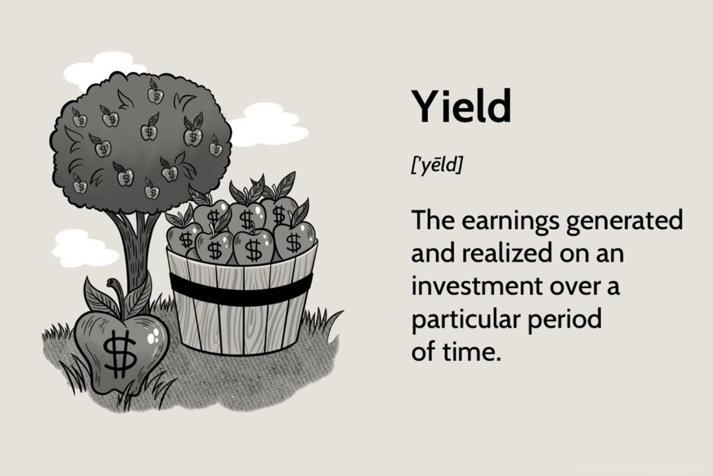

In today's fast-paced financial markets, the pursuit of yield and the implementation of algorithmic trading have become central themes for investors and traders globally. Yield investment strategies focus on generating consistent income, which is often achieved through interest or dividends from various investment vehicles such as stocks, bonds, and real estate. The allure of yield investment lies in its potential to provide a steady income stream, bolstering investor confidence amidst the volatility often characteristic of equity markets.

Algorithmic trading, on the other hand, has transformed the trading landscape by employing advanced computer algorithms to execute trades based on pre-determined criteria. This technological innovation allows for high-frequency trading, enabling the capture of minute price discrepancies that occur across markets more rapidly and efficiently than is conceivable for human traders. The precision and speed afforded by these algorithms reduce human error and emotion, aspects that can detrimentally impact trading performance.



The integration of yield investment and algorithmic trading creates a synergistic approach that can offer enhanced portfolio optimization for those seeking to maximize returns while leveraging technological advancements. By merging the income-generating potential of yield investments with the efficiency and analytical insights provided by algorithmic trading, investors can potentially attain a more refined strategy that balances risk and return.

This article explores how these investment strategies intersect, providing modern investors with innovative pathways to enhance their financial outcomes. The combination of steady yield and algorithmic precision offers a compelling framework for navigating the complexities of contemporary financial markets.

## Table of Contents

## Understanding Yield Investment

Yield investment focuses on generating a steady stream of income from investments, mainly through dividends or interest payments. This strategy is popular among investors seeking consistent returns over capital appreciation. Common yield-bearing assets encompass stocks, bonds, and real estate, each presenting unique benefits and risks.

1. **Stocks**: Dividend-paying stocks provide income through periodic cash distributions, typically from the company's profits. These stocks appeal to investors favoring equity ownership while enjoying regular income. Although dividend yields can be attractive, stock prices are inherently volatile, affecting the total return.

2. **Bonds**: Bonds offer income via fixed interest payments, known as coupons, and are often regarded as relatively stable income sources compared to stocks. The security of bond yields is counterbalanced by credit risk (the risk of issuer default) and interest rate risk (the risk of fluctuating interest rates affecting bond values).

3. **Real Estate**: Income from real estate investments is usually derived from rental payments, providing investors with tangible assets and potential tax advantages. However, real estate investments require substantial capital and entail risks like property value fluctuations and changes in market demand.

Investment platforms like IG often express yield as a percentage of the investment's value, furnishing a clear metric for potential returns. This measure, known as the yield percentage, allows investors to compare different investment options effectively. The formula for calculating yield is:

$$
\text{Yield} = \frac{\text{Income from investment}}{\text{Initial investment value}} \times 100\%
$$

Diversification across asset types is a common strategy to manage risk and enhance yield potential. By allocating capital into different yield-bearing assets, investors can mitigate exposure to specific risks while benefiting from varied income sources.

A crucial step in yield investment is assessing personal risk tolerance and financial goals. Investors must determine an appropriate balance between income and risk, considering factors such as investment horizon, [liquidity](/wiki/liquidity-risk-premium) needs, and market conditions. Establishing a well-defined yield strategy involves aligning investment choices with individual financial objectives and risk appetites, allowing for informed decision-making and optimized returns.

## The Rise of Algorithmic Trading

Algorithmic trading has fundamentally transformed financial markets by using sophisticated algorithms and computer programs to automate the trading process. These systems execute trades based on predefined criteria, allowing for rapid responses to market movements. This capability enables high-frequency trading, where a large number of orders are executed at incredibly fast speeds, capturing minute price discrepancies across various markets. Such automation not only accelerates trading operations but also significantly reduces human-induced errors and emotional biases that can affect trading decisions. By minimizing these factors, [algorithmic trading](/wiki/algorithmic-trading) streamlines trading processes, potentially leading to improved outcomes.

Several strategies have emerged within the realm of algorithmic trading, among which [trend following](/wiki/trend-following), [arbitrage](/wiki/arbitrage) opportunities, and market index rebalancing are particularly prominent. Trend following algorithms are designed to identify and capitalize on market trends. These algorithms employ techniques such as moving averages to determine entry and [exit](/wiki/exit-strategy) points. Arbitrage strategies, on the other hand, seek to exploit price differentials of the same asset across different markets or forms, thereby ensuring profits with minimal risk. Market index rebalancing involves adjusting the composition of investment portfolios to align with a particular market index, which is efficiently handled by algorithmic systems.

The increasing adoption of algorithmic trading can be attributed to its precision and efficiency, making it attractive to both institutional and retail investors. Institutional investors, with their substantial resources, have traditionally led the way in employing these technologies. However, the democratization of technology has enabled retail investors to access these sophisticated trading tools as well. This egalitarian access has been facilitated by the widespread availability of trading platforms offering algorithmic trading options, along with educational resources that help users create and manage their own algorithms.

The rise of algorithmic trading not only reflects technological advancements but also signifies a shift in how trading strategies are perceived and executed. By harnessing the power of automation, traders and investors can leverage real-time data analysis to make informed and timely investment decisions, paving the way for more strategic and calculated approaches to trading in today’s fast-paced markets.

## Integrating Yield Investment with Algorithmic Trading

Combining yield investment with algorithmic trading can enhance portfolio performance by leveraging technology-driven insights with income-generating assets. Yield-generating securities, such as dividend stocks or bonds, have specific entry and exit points that can be optimized using algorithms to increase profitability. Algorithms designed for this purpose may incorporate statistical models or [machine learning](/wiki/machine-learning) techniques to predict favorable market conditions more accurately.

Algorithmic strategies can be employed to balance yield and growth targets within a portfolio. For example, a portfolio optimization algorithm might use linear programming or other quantitative methods to determine the optimal mix of assets that maximizes expected return while minimizing risk. By automatically adjusting the portfolio composition in response to market changes, investors can maintain an optimal yield-to-growth ratio.

Furthermore, data-driven algorithms provide tactical advantages in yield investment decision-making by analyzing vast amounts of historical and real-time data. These algorithms may utilize techniques such as time-series analysis or regression models to identify trends and patterns that inform buy or sell decisions. An example of a simple time-series prediction model in Python could be:

```python
import pandas as pd
import numpy as np
from sklearn.model_selection import train_test_split
from sklearn.ensemble import GradientBoostingRegressor

# Load historical yield data
data = pd.read_csv('yield_data.csv')
X = data.drop('yield', axis=1)
y = data['yield']

# Split data into training and test sets
X_train, X_test, y_train, y_test = train_test_split(X, y, test_size=0.2, random_state=42)

# Train a Gradient Boosting Regressor model
model = GradientBoostingRegressor(n_estimators=100, learning_rate=0.1, max_depth=3, random_state=42)
model.fit(X_train, y_train)

# Predict future yields
y_pred = model.predict(X_test)
```

For effective implementation, investors should ensure they possess the technological infrastructure and expertise required for these integrated strategies. This includes having access to powerful computing resources, robust data feeds, and secure trading platforms. Regular monitoring and updating of trading algorithms are essential to adapt to evolving market conditions and maintain portfolio performance. Additionally, investors might need to collaborate with data scientists or financial engineers to refine algorithmic models continuously, ensuring they align with broader financial objectives.

## Challenges and Risks

Integrating algorithmic trading with yield investment presents several challenges and risks that investors must carefully consider before implementation. One of the primary challenges lies in the complexity of designing accurate algorithms. Crafting these algorithms requires a profound understanding of market behavior and adeptness in advanced computational techniques. Investors must be able to analyze vast datasets, identify patterns, and develop models that can predict potential market movements with reasonable accuracy. This complexity can be compounded by the need to continually update and refine algorithms in response to changing market conditions.

Moreover, algorithmic trading is heavily dependent on technology, and this brings inherent risks. Software failures, connectivity issues, and system outages can disrupt trading processes, potentially leading to significant financial losses. For example, an unexpected system failure during a critical trading period might prevent the execution of profitable trades or exacerbate losses during adverse market conditions. Therefore, robust technological infrastructure and reliable contingency plans are essential to mitigate these risks.

Market [volatility](/wiki/volatility-trading-strategies) and unforeseen events, such as black swan incidents, are another layer of risk for algorithmically managed portfolios. These rare and unpredictable events can lead to extreme market conditions, which even the most sophisticated algorithms may struggle to navigate effectively. The financial crisis of 2008 is often cited as a black swan event that caught many investors off guard. Algorithms, typically designed to function under normal market conditions, may require manual intervention or significant adjustment during such periods of heightened volatility.

Investors must also navigate the complex regulatory landscape associated with algorithmic trading. Regulatory requirements can vary significantly across different jurisdictions and may impact both algorithm design and execution. Regulations often address issues such as market fairness, transparency, and the prevention of manipulative trading practices. Investors must stay abreast of current regulations and ensure compliance to avoid potential legal and financial penalties. Additionally, regulatory changes can necessitate significant adjustments to existing algorithmic strategies, impacting their overall effectiveness and profitability.

In summary, while the integration of algorithmic trading with yield investment offers numerous advantages, investors need to be acutely aware of the inherent challenges and risks associated with technology, market unpredictability, and regulatory constraints. Careful planning and a comprehensive risk management strategy are vital components for successfully harnessing the potential of these methods.

## Conclusion

Integrating yield investment strategies with algorithmic trading could provide significant benefits for modern investors. This integration capitalizes on the efficiency and precision that algorithms offer, combined with the steady income focus of yield investments, creating a balanced financial strategy that caters to diverse investment goals.

The primary advantage lies in the technological efficiency of algorithmic trading. By automating trade executions based on predefined parameters, algorithms can exploit market opportunities with high speed and accuracy, which can enhance the return potential of yield investments. This synergy allows for real-time adjustments to portfolio compositions, optimizing for varying market conditions and interest rates. As shown in current financial trends, the ongoing advancement in financial technology is fostering enhanced capabilities in algorithmic trading systems, bolstering the effectiveness of yield investment strategies.

However, successful adoption requires investors to engage in continuous learning. Keeping abreast of technological developments and regulatory changes is crucial for maintaining a competitive edge. For instance, investors need to understand the underlying mechanisms of algorithmic models and stay informed about updates in financial regulations that could affect automated trading operations. This vigilance ensures not only compliance but also the ability to adapt strategies to evolving market dynamics.

Python, a popular programming language, offers a robust platform for developing and testing algorithmic trading strategies. Investors and developers can employ Python libraries such as `pandas` for data manipulation and `numpy` for numerical operations, making it suitable for [backtesting](/wiki/backtesting) yield-focused algorithms. This technical aptitude, paired with strategic financial planning, underscores the importance of aligning technological solutions with financial objectives.

The seamless integration of yield investment strategies with algorithmic trading ultimately hinges on thoughtful planning and strategic execution. Investors must ensure that their overall financial objectives align with their chosen methodologies, fostering a holistic approach to portfolio management. By striking the right balance between technological tools and financial insight, investors can potentially craft a well-rounded strategy that is capable of navigating both current market conditions and future uncertainties.

## References & Further Reading

[1]: Marcos López de Prado. ["Advances in Financial Machine Learning"](https://www.amazon.com/Advances-Financial-Machine-Learning-Marcos/dp/1119482089). Wiley, 2018.

[2]: David Aronson. ["Evidence-Based Technical Analysis: Applying the Scientific Method and Statistical Inference to Trading Signals"](https://www.amazon.com/Evidence-Based-Technical-Analysis-Scientific-Statistical/dp/0470008741). Wiley, 2006.

[3]: Stefan Jansen. ["Machine Learning for Algorithmic Trading"](https://github.com/stefan-jansen/machine-learning-for-trading). Packt Publishing, 2020.

[4]: Ernest P. Chan. ["Quantitative Trading: How to Build Your Own Algorithmic Trading Business"](https://www.amazon.com/Quantitative-Trading-Build-Algorithmic-Business/dp/0470284889). Wiley, 2008.

[5]: Jensen, M. C. (1969). ["Risk, the Pricing of Capital Assets, and the Evaluation of Investment Portfolios"](https://www.semanticscholar.org/paper/Risk%2C-the-Pricing-of-Capital-Assets%2C-and-the-of-Jensen/76b41c1e35d592ebc5929e5f8709013ebb73974f). The Journal of Business, 42(2), 167–247.

[6]: Narang, R. K. ["Inside the Black Box: The Simple Truth About Quantitative Trading"](https://www.amazon.com/Inside-Black-Box-Quantitative-Trading/dp/0470432063). Wiley, 2013.