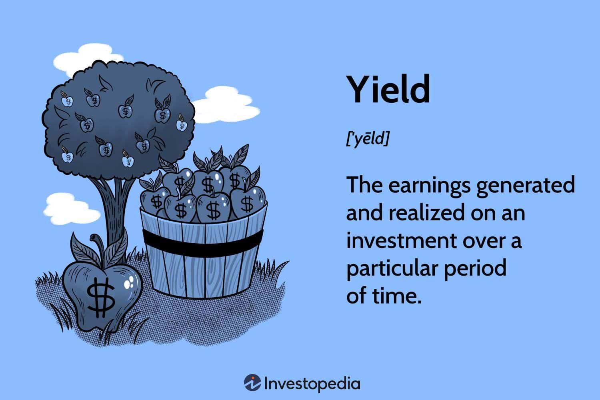

## Table of Contents

## What is yield in the context of finance and investment?

Yield in finance and investment is a measure of the income an investment generates over a specific period, usually expressed as a percentage. It's like the return you get from your investment, showing how much money you earn from it. For example, if you have a bond that pays you $50 a year and you bought it for $1,000, the yield would be 5% because you're earning 5% of your initial investment every year.

There are different types of yield, depending on the investment. For bonds, the yield can be the coupon rate, which is the interest paid annually divided by the bond's face value. For stocks, the yield might refer to the dividend yield, which is the annual dividend payment divided by the stock's price. Understanding yield helps investors compare different investments and see which one might give them a better return for their money.

## How is yield calculated for different types of investments?

For bonds, yield is calculated by dividing the annual interest payment by the bond's current market price. Let's say you have a bond that pays $50 every year and it's currently selling for $1,000. You would divide $50 by $1,000 to get a yield of 5%. This is called the current yield. Sometimes, people also talk about the yield to maturity, which is a bit more complicated because it takes into account the bond's price, its face value, the interest payments, and how long until the bond matures.

For stocks, yield usually means the dividend yield. This is calculated by dividing the annual dividend per share by the stock's current price per share. If a company pays a yearly dividend of $2 per share and the stock is trading at $40, the dividend yield would be $2 divided by $40, which equals 5%. This tells you how much income you're getting from the stock as a percentage of its price. It's a way to see how much return you're getting from the dividends alone, without considering any changes in the stock's price.

## What is the difference between yield and return?

Yield and return are both important for investors, but they measure different things. Yield tells you how much money you're earning from an investment each year, usually as a percentage of what you paid for it. It's like the regular income you get from your investment, whether it's interest from a bond or dividends from a stock. For example, if you buy a bond that pays $50 a year and you paid $1,000 for it, the yield is 5% because you're getting $50 every year for every $1,000 you invested.

Return, on the other hand, looks at the total gain or loss from an investment over a period of time. It includes not just the income you get, like interest or dividends, but also any changes in the value of the investment itself. If you buy a stock for $100 and it goes up to $120 in a year, and you also get $5 in dividends, your total return would be 25% because you made $25 in total ($20 from the price increase and $5 from dividends) on your $100 investment. So, while yield focuses on the income part, return gives you the whole picture of how your investment performed.

## Can you explain the concept of yield to maturity (YTM) for bonds?

Yield to maturity (YTM) for bonds is a way to figure out the total return you would get if you held the bond until it matures. It's like looking at the whole picture of what you'll earn, including all the interest payments and the difference between the price you paid for the bond and what you'll get back when it matures. YTM takes into account the bond's current market price, its face value, the coupon payments you'll receive, and how long until the bond matures. It's a bit more complicated than just looking at the interest rate because it considers the time value of money, which means a dollar today is worth more than a dollar in the future.

To calculate YTM, you need to solve for the interest rate that makes the present value of all future cash flows (interest payments and the bond's face value at maturity) equal to the bond's current market price. This calculation can be tricky and usually requires a financial calculator or a computer program. But the main thing to remember is that YTM gives you a single number that represents the average annual return you can expect if you hold the bond until it matures. It's a useful tool for comparing different bonds and understanding what kind of return you might get over the life of the bond.

## How does dividend yield affect stock investments?

Dividend yield is important for people who invest in stocks because it shows how much money they can get back every year just from the dividends. If a stock has a high dividend yield, it means you're getting a bigger piece of the company's profits without selling the stock. This can be really good for people who want to earn some steady income from their investments, like retirees. But, a high dividend yield might also mean the stock's price has gone down a lot, which could be a sign that the company is not doing well.

On the other hand, a low dividend yield might mean the stock's price is high or the company is choosing to use its profits in other ways, like growing the business or buying back its own shares. This can be good for investors who are looking for the stock price to go up over time. So, when you're thinking about buying a stock, looking at the dividend yield can help you decide if it fits with your goals. Are you looking for regular income, or are you hoping the stock's value will increase? The dividend yield can give you a clue about which way to go.

## What role does yield play in fixed income securities?

Yield is really important when you're looking at fixed income securities, like bonds. It tells you how much money you'll earn from the bond every year, usually as a percentage of what you paid for it. If you buy a bond for $1,000 and it pays you $50 every year, the yield is 5%. This helps you figure out if the bond is a good deal compared to other investments. A higher yield might mean more money in your pocket, but it can also mean the bond is riskier.

Yield also helps you understand what you can expect from your investment over time. For example, the yield to maturity (YTM) tells you the total return you might get if you keep the bond until it matures. This includes all the interest payments you'll get and any difference between the price you paid and what you'll get back at the end. Knowing the yield helps you decide if a fixed income security fits with your plans for earning money, whether you're looking for regular income or saving up for the future.

## How can yield be used to compare the performance of different investments?

Yield is a helpful tool for comparing how well different investments are doing. It tells you how much money you're making from each investment every year, usually as a percentage of what you paid for it. For example, if you're looking at two bonds, one with a yield of 3% and another with a yield of 5%, the second bond is giving you more money every year for each dollar you invested. This can help you decide which bond is a better deal. But remember, a higher yield might also mean the investment is riskier, so you need to think about that too.

When you compare stocks, yield can mean how much you're getting from dividends. If one stock has a dividend yield of 2% and another has a yield of 4%, the second stock is giving you more money back in dividends every year. This can be really important if you're looking for regular income from your investments. But, just like with bonds, a higher yield might mean the stock's price has gone down a lot, which could be a sign of trouble. So, yield is a great way to see how much money you're earning, but you should look at the whole picture before deciding where to put your money.

## What are the risks associated with high-yield investments?

High-yield investments can seem really attractive because they offer the chance to earn more money, but they come with bigger risks. One big risk is that the company or the bond might not be able to pay you back. This is called default risk. If a company is struggling to make money, it might not be able to pay its debts or dividends, and you could lose your investment. High-yield bonds, often called junk bonds, are more likely to have this problem because they are issued by companies that are not as financially strong.

Another risk is that the value of your investment might go down a lot. When interest rates go up, the prices of existing bonds usually go down. This means if you need to sell your high-yield bond before it matures, you might get less money back than you paid for it. Also, if the stock market gets worried about a company's future, its stock price can drop, making the dividend yield look high but also making your investment worth less. So, while high-yield investments can give you more money, they can also be more likely to lose value or even fail completely.

## How do interest rates impact yield in various investment vehicles?

Interest rates have a big effect on the yield of different investments. When interest rates go up, the yield on new bonds also goes up because new bonds need to offer more interest to attract buyers. But this makes the price of existing bonds go down. If you own a bond that pays 3% and new bonds are paying 4%, your bond isn't as attractive, so its price drops. This means if you want to sell your bond before it matures, you might get less money back than you paid for it. For savings accounts and CDs, higher interest rates mean you can earn more money from them, which is good news for savers.

For stocks, interest rates can also change the yield. When interest rates rise, borrowing money becomes more expensive for companies. This can make it harder for them to grow or even pay their bills, which might hurt their profits. If a company's profits go down, it might not be able to pay as big a dividend, which means the dividend yield could go down. On the other hand, if interest rates fall, companies can borrow more easily, which might help them grow and pay bigger dividends, making the yield go up. So, keeping an eye on interest rates can help you understand how the yield on your investments might change.

## What is the relationship between yield and bond prices?

The relationship between yield and bond prices is like a seesaw. When the yield goes up, the price of the bond goes down. This happens because if new bonds are being sold with higher yields, the old bonds that pay less interest become less attractive. So, if you want to sell your old bond, you have to lower the price to make it more appealing to buyers. On the other hand, when the yield goes down, the price of the bond goes up. If new bonds are paying less interest, your old bond that pays more looks better, so you can ask for a higher price when selling it.

This relationship is important for investors because it helps them understand how changes in interest rates can affect their investments. When interest rates rise, new bonds have higher yields, which pushes down the prices of existing bonds. When interest rates fall, new bonds have lower yields, making existing bonds with higher yields more valuable. So, if you're thinking about buying or selling bonds, keeping an eye on interest rates and how they might change the yield can help you make smarter choices.

## How can investors use yield curves to predict economic activity?

A yield curve shows how the yields of bonds change over different lengths of time. It usually slopes upward, meaning longer-term bonds have higher yields than shorter-term ones. But when the yield curve starts to flatten or even invert, it can be a sign that people are worried about the future. An inverted yield curve, where short-term yields are higher than long-term ones, has often been a warning sign that a recession might be coming. This is because it shows that investors think the economy will slow down, so they want to lock in higher yields now before they go down.

Investors can use the shape of the yield curve to guess what might happen to the economy. If the curve is steep, with a big difference between short-term and long-term yields, it might mean that people expect the economy to grow and inflation to go up. But if the curve flattens or inverts, it could mean that investors are worried about a slowdown or even a recession. By watching how the yield curve changes, investors can try to predict economic trends and adjust their investments accordingly, like moving money into safer investments if they think a downturn is coming.

## What advanced strategies can investors employ to optimize yield in a portfolio?

Investors can use a few smart tricks to make the most out of the money they earn from their investments, called yield. One way is to use a strategy called laddering, which means buying bonds that mature at different times. This helps because when interest rates change, you can reinvest the money from the bonds that mature into new bonds with better rates. Another trick is to look for dividend aristocrats, which are companies that have raised their dividends every year for a long time. These companies are often stable and can help you earn more money over time.

Another strategy is to use a technique called bond swapping. This means selling a bond you own and buying another one with a higher yield. It's like trading in an old car for a new one that gets better gas mileage. You have to be careful though, because selling a bond before it matures might mean you get less money back than you paid for it. Lastly, investors can also look into preferred stocks, which often have higher yields than regular stocks. These stocks act a bit like bonds because they pay fixed dividends, but they can also give you a chance to earn more if the company does well. By mixing these strategies, investors can try to get the best yield possible while still keeping their money safe.

## What is Understanding Yield Investment?

Yield investment focuses on generating a steady stream of income from investments, mainly through dividends or interest payments. This strategy is popular among investors seeking consistent returns over capital appreciation. Common yield-bearing assets encompass stocks, bonds, and real estate, each presenting unique benefits and risks.

1. **Stocks**: Dividend-paying stocks provide income through periodic cash distributions, typically from the company's profits. These stocks appeal to investors favoring equity ownership while enjoying regular income. Although dividend yields can be attractive, stock prices are inherently volatile, affecting the total return.

2. **Bonds**: Bonds offer income via fixed interest payments, known as coupons, and are often regarded as relatively stable income sources compared to stocks. The security of bond yields is counterbalanced by credit risk (the risk of issuer default) and interest rate risk (the risk of fluctuating interest rates affecting bond values).

3. **Real Estate**: Income from real estate investments is usually derived from rental payments, providing investors with tangible assets and potential tax advantages. However, real estate investments require substantial capital and entail risks like property value fluctuations and changes in market demand.

Investment platforms like IG often express yield as a percentage of the investment's value, furnishing a clear metric for potential returns. This measure, known as the yield percentage, allows investors to compare different investment options effectively. The formula for calculating yield is:

$$
\text{Yield} = \frac{\text{Income from investment}}{\text{Initial investment value}} \times 100\%
$$

Diversification across asset types is a common strategy to manage risk and enhance yield potential. By allocating capital into different yield-bearing assets, investors can mitigate exposure to specific risks while benefiting from varied income sources.

A crucial step in yield investment is assessing personal risk tolerance and financial goals. Investors must determine an appropriate balance between income and risk, considering factors such as investment horizon, [liquidity](/wiki/liquidity-risk-premium) needs, and market conditions. Establishing a well-defined yield strategy involves aligning investment choices with individual financial objectives and risk appetites, allowing for informed decision-making and optimized returns.

## References & Further Reading

[1]: Marcos López de Prado. ["Advances in Financial Machine Learning"](https://www.amazon.com/Advances-Financial-Machine-Learning-Marcos/dp/1119482089). Wiley, 2018.

[2]: David Aronson. ["Evidence-Based Technical Analysis: Applying the Scientific Method and Statistical Inference to Trading Signals"](https://www.amazon.com/Evidence-Based-Technical-Analysis-Scientific-Statistical/dp/0470008741). Wiley, 2006.

[3]: Stefan Jansen. ["Machine Learning for Algorithmic Trading"](https://github.com/stefan-jansen/machine-learning-for-trading). Packt Publishing, 2020.

[4]: Ernest P. Chan. ["Quantitative Trading: How to Build Your Own Algorithmic Trading Business"](https://www.amazon.com/Quantitative-Trading-Build-Algorithmic-Business/dp/0470284889). Wiley, 2008.

[5]: Jensen, M. C. (1969). ["Risk, the Pricing of Capital Assets, and the Evaluation of Investment Portfolios"](https://www.semanticscholar.org/paper/Risk%2C-the-Pricing-of-Capital-Assets%2C-and-the-of-Jensen/76b41c1e35d592ebc5929e5f8709013ebb73974f). The Journal of Business, 42(2), 167–247.

[6]: Narang, R. K. ["Inside the Black Box: The Simple Truth About Quantitative Trading"](https://www.amazon.com/Inside-Black-Box-Quantitative-Trading/dp/0470432063). Wiley, 2013.