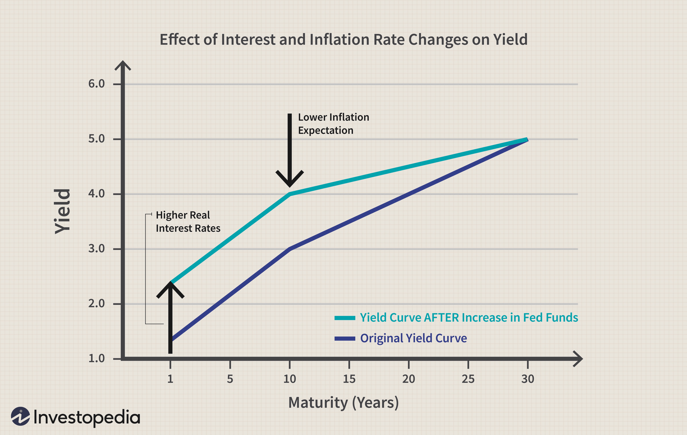

In a rapidly evolving financial landscape, the terms yield, interest rate, financial comparison, and algo trading have gained significant traction. Understanding these concepts is crucial for anyone involved in the financial markets. The increasing complexity of financial instruments and the sophistication of trading platforms necessitate a deep comprehension of how these elements interact. Yield and interest rates are fundamental to investment decisions, influencing not just returns but also risk evaluations. Financial comparison serves as a bridge, enabling investors to weigh different options and strategies against each other, thereby optimizing their portfolios.

Algorithmic trading has emerged as a key player in modern finance, leveraging computational power to analyze data and execute trades with speed and precision impossible for human traders. Recognizing the interconnectedness of yield, interest rates, financial comparison, and algo trading can unlock new avenues for maximizing returns while minimizing risk. This article dissects these concepts, offering insights into their roles and relationships. For investors eager to harness the benefits of algorithmic trading, understanding these foundational elements is not just beneficial—it is essential.



By exploring how these aspects influence investment returns and decision-making processes, the article aims to provide valuable insights for both novice and experienced traders. With algorithmic trading strategies reliant on accurate data input and market comprehension, the synergy between these components can be pivotal. As the financial world continues to advance, staying informed and adaptable to these changes is not just recommended but required for continued success and growth in the market.

## Table of Contents

## Understanding Yield and Interest Rates

Yield and interest rates are fundamental concepts in financial markets, influencing decisions across various investment avenues. Yield refers to the income returned on an investment, expressed as an annual percentage based on the investment's cost, current market value, or face value. Interest rates, on the other hand, represent the cost of borrowing money, often set by central banks, and significantly impact economic activities. Both these components are crucial in determining the attractiveness and profitability of different financial instruments.

### Types of Yields and Interest Rates

Different types of yields exist, each relevant to specific financial instruments:

1. **Current Yield**: This is the annual income (interest or dividends) divided by the current price of the security. It's commonly used in bond markets.
$$
   \text{Current Yield} = \frac{\text{Annual Interest Payment}}{\text{Current Market Price}}

$$

2. **Yield to Maturity (YTM)**: This yield measure estimates the total return anticipated on a bond if the bond is held until it matures. It considers both current income and capital gains or losses.

Interest rates vary according to purpose and duration:

1. **Nominal Interest Rate**: The rate before adjusting for inflation. It is the interest rate quoted on loans and deposits.
2. **Real Interest Rate**: This is the nominal rate adjusted for inflation, providing a more accurate measure of purchasing power.
3. **Federal Funds Rate**: The interest rate at which depository institutions trade federal funds with each other overnight. It is primarily a short-term interest rate.

### Influence of Interest Rates on Yields

Interest rates have a direct influence on yields, particularly in bond markets. As interest rates rise, the prices of existing bonds fall, leading to higher yields on those bonds. Conversely, when interest rates drop, existing bonds with higher interest payouts become more attractive, lowering their yields. This inverse relationship is crucial for investors looking to maximize returns or manage risk.

Beyond bonds, interest rates affect yields on other instruments like savings accounts and certificates of deposit (CDs). Higher interest rates typically result in higher yields for depositors, incentivizing savings over spending.

### Economic Factors Driving Changes

Several economic factors influence changes in yield and interest rates, including:

- **Inflation**: Central banks may raise interest rates to curb inflation, leading to adjustments in yields across the financial market.
- **Monetary Policy**: Decisions by central banks regarding rate adjustments can significantly impact financial markets, influencing lending, borrowing, and investment yields.
- **Economic Growth**: In periods of robust economic growth, interest rates might increase to prevent overheating, while slower growth can lead to reduced rates to encourage borrowing and investment.

### Historical Context

Historically, the trajectory of interest rates and yields has been shaped by macroeconomic events. For example, the United States experienced a period of high interest rates in the late 1970s and early 1980s as the Federal Reserve sought to control high inflation. More recently, in response to the 2008 financial crisis and subsequent economic challenges, central banks worldwide, including the Federal Reserve and the European Central Bank, adopted an accommodative monetary policy, maintaining historically low-interest rates to stimulate economic activity.

Understanding the interaction between yields and interest rates provides investors with insights into market conditions, guiding strategic investment decisions. This knowledge is crucial for optimizing investment portfolios in line with economic trends and monetary policies.

## Importance of Financial Comparison

Financial comparison is a critical analytical process employed by investors to evaluate and contrast various investment opportunities. This comparative analysis is crucial for making informed investment decisions by weighing the potential risks and returns associated with different options. Financial comparison typically involves assessing metrics such as yield and interest rates, which are vital indicators of an investment's performance and risk profile.

Several tools and methods are utilized for effective financial comparison. Benchmarking is one key approach, which involves comparing an investment's performance against a standard or a group of comparable investments, such as industry averages or indices like the S&P 500. This can help investors identify whether an investment is outperforming or underperforming the market. Ratio analysis is another tool used in financial comparison, where key financial ratios, such as the price-to-earnings ratio or the current ratio, are calculated to assess an investment's financial health and operational efficiency.

Yield and interest rates are pivotal in helping investors make informed decisions during the financial comparison. Yield, often expressed as a percentage, represents the income generated by an investment over a particular period. Interest rates, meanwhile, determine the cost of borrowing money. By comparing the yields and interest rates of different securities, investors can assess relative profitability and choose investments that align with their objectives and risk tolerance. For instance, an investor comparing bonds might prefer those offering higher yield spreads over the prevailing interest rates, indicating potentially higher returns.

To illustrate financial comparison in action, consider a historical example where investors compared government bonds with corporate bonds during a period of economic uncertainty. In such scenarios, government bonds typically offer lower yields but come with lower risk, whereas corporate bonds might offer higher yields coupled with higher risk. By analyzing the yield spreads between these bond types, investors can decide whether the additional risk of corporate bonds is justified by the higher potential returns, depending on their risk appetite.

Ignoring financial comparison in an investment strategy can lead to significant pitfalls. Without a comparative framework, investors might overlook critical factors affecting an investment's performance, such as changes in interest rates or market conditions. This oversight can result in suboptimal investment choices, exposing investors to higher risks or missed opportunities for profit. By neglecting to compare investment options, investors might also fail to align their portfolios with their financial goals, resulting in a mismatch of investment strategies and objectives.

In conclusion, financial comparison serves as an indispensable tool in the investor's arsenal, enabling a nuanced assessment of potential investment opportunities. By leveraging methods such as benchmarking and yield analysis, investors can make more informed decisions, optimizing their portfolios for both risk management and return maximization.

## Algorithmic Trading and Its Impact

Algorithmic trading, often referred to as algo trading, involves using computer algorithms to automate the trading process. These algorithms make trading decisions based on predefined criteria, which can include price, timing, or any mathematical model. Over the past few decades, algo trading has gained substantial prominence in financial markets due to its ability to process vast amounts of data and execute trades more quickly and accurately than humans.

Algo trading systems utilize yield and [interest rate](/wiki/interest-rate-trading-strategies) data extensively. These financial metrics are crucial inputs in many trading algorithms, as they help in valuing assets, projecting returns, and assessing risks. For instance, changes in interest rates can impact bond yields, which may alter asset valuation models used within an algorithm. Traders often encode rules within their algorithms to modify trading strategies dynamically, based on shifts in interest rates or yield spreads.

One of the key advantages of [algorithmic trading](/wiki/algorithmic-trading) is its speed and efficiency. Algorithms can operate at speeds that are imperceptible to humans, often executing millions of transactions per second. This high-frequency trading allows market participants to capitalize on fleeting market opportunities, thereby enhancing precision in trade executions. Additionally, algorithms reduce the emotional and cognitive biases often seen in human trading, providing a more systematic and disciplined approach.

Despite its advantages, algorithmic trading is subject to misconceptions and challenges. A common misconception is that all algo trading strategies guarantee profits. In reality, the profitability of algo trading depends heavily on the design and implementation of the algorithm. Furthermore, market [volatility](/wiki/volatility-trading-strategies) and the complexity of financial instruments can present significant challenges, requiring constant monitoring and adaptation of the algorithms. Additionally, algo trading systems are highly reliant on technology, where any glitch or delay can have catastrophic financial implications.

Successful algo trading strategies often incorporate financial comparison techniques. For example, relative value [arbitrage](/wiki/arbitrage) strategies compare yields or interest rates between two closely related financial instruments to identify pricing inefficiencies. If an algorithm detects that the yield spread between two bonds diverges from a historical norm, it might trigger a series of trades designed to exploit this disparity, expecting the spread to revert to its mean.

In conclusion, algorithmic trading represents a significant evolution in financial markets, offering unparalleled speed, efficiency, and precision. By effectively integrating yield and interest rate data, as well as employing robust financial comparison strategies, traders can leverage algorithms to enhance decision-making and optimize returns. However, the challenges and risks associated with algo trading demand careful consideration and sophisticated risk management practices.

## Integrating Yield, Interest Rates, and Algo Trading

To effectively integrate yield and interest rates into algorithmic trading models, it's crucial to first understand how these financial metrics function as inputs. Yield reflects the income generated and realized on an investment over a specific period, expressed as a percentage. Interest rates, conversely, are the cost of borrowing money, often set by central banks, impacting both the economy and financial markets.

### Input of Yield and Interest Rates in Algorithmic Models

Algorithmic trading systems leverage yield and interest rate data to execute trades based on pre-defined criteria, increasing the chances of profitable outcomes. Historical data on yields and interest rates are analyzed to forecast potential market movements, determine the intrinsic value of financial instruments, and evaluate macroeconomic factors influencing market conditions. Quantitative analysis methods, such as regression analysis and [machine learning](/wiki/machine-learning) models, are often employed to identify patterns and correlations within this data.

### Synergy Between Financial Comparison and Algo Trading

Financial comparison is vital in algo trading for identifying profitable trading opportunities by assessing different investment options. In algorithmic trading, financial comparison translates to evaluating multiple securities and strategies based on metrics such as expected yield, risk, [liquidity](/wiki/liquidity-risk-premium), and interest rate impact. This comparative approach allows traders to optimize their decision-making processes, ensuring that the most favorable and efficient strategies are executed.

### Setting Up a Basic Algo Trading Strategy

A fundamental algorithmic trading strategy that incorporates yield and interest rate analysis might involve the following steps:

1. **Data Collection**: Gather historical and real-time data on yields and interest rates from reliable financial data providers.

2. **Data Analysis**: Use statistical tools to analyze historical data to understand trends and correlations. For instance, using Python's pandas and numpy libraries can facilitate data manipulation and analysis.

   ```python
   import pandas as pd
   import numpy as np

   # Assuming df is a dataframe containing yield and interest rate data
   df['yield_change'] = df['yield'].pct_change()
   df['rate_change'] = df['interest_rate'].pct_change()
   correlation = np.corrcoef(df['yield_change'].dropna(), df['rate_change'].dropna())
   print("Correlation between yield changes and rate changes:", correlation[0, 1])
   ```

3. **Model Development**: Utilize machine learning algorithms to build predictive models for market behavior based on yield and interest rate changes. Libraries like scikit-learn can be used for implementing various models.

4. **Backtesting**: Test the model using historical data to evaluate its performance. Adjust the algorithm parameters to optimize the strategy.

5. **Execution**: Implement the trading strategy using automated trading platforms to execute trades based on model outputs.

### Case Studies of Successful Integration

Numerous firms have successfully integrated these elements. For example, Renaissance Technologies, known for its Medallion Fund, has reportedly used complex algo trading strategies incorporating diverse financial metrics, including yields and interest rates, achieving significant returns. Another example is AQR Capital Management, which uses quantitative models that synthesize fundamental financial data with interest rate trends to inform their trading decisions.

### Emerging Trends and Technologies

Current trends in this integration include the development of more sophisticated machine learning models such as [deep learning](/wiki/deep-learning) and [reinforcement learning](/wiki/reinforcement-learning), which enhance the predictive accuracy of trading strategies. Additionally, the advent of quantum computing promises to revolutionize data processing speeds, allowing for more efficient analysis of complex datasets, which is vital for high-frequency algorithmic trading environments. Enhanced connectivity and data acquisition technologies, like APIs, streamline the integration of live yield and interest rate data into trading systems, providing traders with real-time insights crucial for decision-making.

In conclusion, the integration of yield, interest rates, and algo trading can substantially enhance trading effectiveness by leveraging data-driven insights for informed strategy execution. As technological innovations continue to unfold, the symbiotic relationship between these elements will likely deepen, offering increased opportunities for traders worldwide.

## Risks and Considerations

In the complex and fast-paced world of algorithmic trading, understanding the risks associated with yield and interest rate fluctuations is crucial. These fluctuations can significantly impact trading outcomes, affecting profitability and leading to potential financial losses. Managing these risks effectively is vital for maintaining a robust trading strategy.

### Potential Risks

1. **Yield and Interest Rate Fluctuations**: Algo trading relies on precise calculations and predictions. Yield and interest rate changes can alter the investment landscape, potentially rendering models inaccurate. For instance, unexpected interest rate hikes by central banks can affect bond prices and yields, influencing trading algorithms that rely on stable market conditions.

2. **Data Accuracy**: Algo trading systems are heavily dependent on accurate and timely data. Inaccurate or outdated data can lead to erroneous trading decisions, resulting in significant losses. Ensuring data integrity and synchronization is essential for effective algo trading.

3. **Technology Reliability**: Algorithmic systems rely on complex software and hardware infrastructure. Any technological failure can disrupt trading operations. This includes server crashes, software bugs, and connectivity issues, all of which can lead to missed opportunities or unintended trades.

4. **Market Volatility**: High volatility can lead to rapid and unpredictable movements in market prices, challenging the efficiency of algorithms designed for stable conditions. Algorithms must be built to handle such volatility, employing strategies such as stop-loss orders to minimize potential losses.

### Risk Management in Algorithmic Trading

Effective risk management in algorithmic trading involves several key strategies:

- **Diversification**: Spreading investments across different assets can mitigate the impact of adverse movements in any single market or asset class.

- **Automated Risk Controls**: Implementing automated systems that monitor market conditions and execute predefined actions, such as halting trading if certain risk thresholds are exceeded, can safeguard against severe losses.

- **Backtesting and Stress Testing**: Rigorous testing of algorithms using historical data and hypothetical scenarios ensures they can handle a range of market conditions. Stress testing helps in understanding how strategies perform under extreme market conditions.

- **Continuous Monitoring and Adjustment**: Regularly reviewing and updating algorithms in response to market changes ensures they remain effective. This includes adjusting for changes in yield curves or interest rate forecasts.

### Best Practices for Mitigating Risks

1. **Robust System Design**: Design systems with redundancy and fail-safes to prevent total system failure. Distributed systems and regular system audits are recommended.

2. **Real-time Data Feeds**: Utilize reliable real-time data providers with contingency plans in case of data feed interruptions. Redundancy in data providers can prevent critical failures.

3. **Stop-loss Mechanisms**: Incorporate stop-loss orders to limit potential losses. These automated orders sell an asset if its price falls below a predetermined level, providing a safety net in volatile markets.

4. **Regular Strategy Reviews**: Periodic evaluation and adjustment of trading strategies to align with current market dynamics and firm-specific risk tolerance.

### Continual Learning and Adaptation

The financial markets are ever-changing, necessitating continual learning and adaptation for anyone involved in algorithmic trading. Traders should:

- Stay informed about global economic events and policy changes that could affect interest rates and market yields.
- Engage in ongoing education and training to understand advancements in trading technologies and methodologies.
- Attend industry conferences and workshops to share insights and learn from peers.

By proactively addressing these risks and maintaining a vigilant approach to market changes, algorithmic traders can safeguard their investments and capitalize on opportunities in an ever-evolving landscape.

## Conclusion

In summary, the exploration of yield, interest rates, financial comparison, and algorithmic trading has underlined their interconnectedness and crucial role in modern investments. Yield and interest rates are fundamental elements that influence investment returns. A thorough understanding of these concepts is vital for investors aiming to optimize returns and effectively manage risks. Financial comparison serves as a powerful tool for evaluating investment options, guiding investors in making informed decisions that can enhance profitability.

Algorithmic trading, with its emphasis on speed, efficiency, and precision, is reshaping financial markets. By integrating data on yield and interest rates, algo trading systems can execute strategies that capitalize on market inefficiencies. This field is poised for significant growth and innovation, driven by advancements in technology and data analytics. Investors and traders who leverage these tools are better positioned to seize opportunities and navigate market volatility.

Staying updated on market trends and technological developments is essential for maintaining a competitive edge. As financial landscapes continue to evolve, continuous learning and adaptation are crucial. For those interested in deepening their understanding of these topics, resources such as Khan Academy's courses on financial markets, Investopedia's comprehensive guides, and academic journals on financial studies can provide valuable insights and knowledge. Embracing these concepts and tools will empower investors to make more strategic and informed decisions, fostering success in the complex world of finance.

## References & Further Reading

[1]: Bergstra, J., Bardenet, R., Bengio, Y., & Kégl, B. (2011). ["Algorithms for Hyper-Parameter Optimization."](https://papers.nips.cc/paper/4443-algorithms-for-hyper-parameter-optimization) Advances in Neural Information Processing Systems 24.

[2]: ["Advances in Financial Machine Learning"](https://www.amazon.com/Advances-Financial-Machine-Learning-Marcos/dp/1119482089) by Marcos Lopez de Prado

[3]: ["Evidence-Based Technical Analysis: Applying the Scientific Method and Statistical Inference to Trading Signals"](https://www.amazon.com/Evidence-Based-Technical-Analysis-Scientific-Statistical/dp/0470008741) by David Aronson

[4]: ["Machine Learning for Algorithmic Trading"](https://github.com/stefan-jansen/machine-learning-for-trading) by Stefan Jansen

[5]: ["Quantitative Trading: How to Build Your Own Algorithmic Trading Business"](https://www.amazon.com/Quantitative-Trading-Build-Algorithmic-Business/dp/1119800064) by Ernest P. Chan