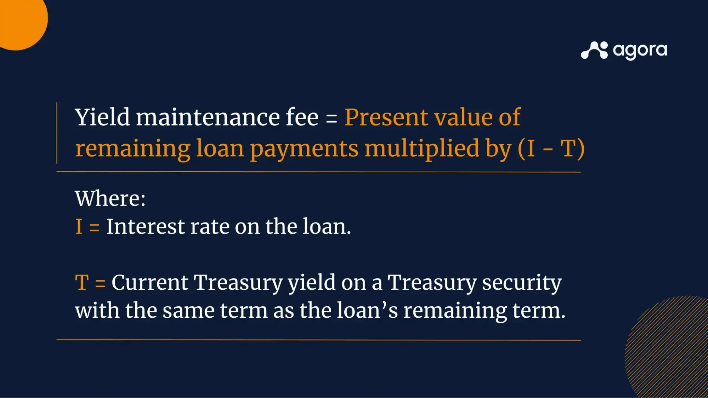

## Table of Contents

## What is yield maintenance in financial agreements?

Yield maintenance is a type of prepayment penalty that borrowers might have to pay if they pay off a loan early. It is often used in commercial real estate loans. The idea is to make sure the lender gets the same amount of interest they would have earned if the loan was paid off on time. This is calculated by figuring out the present value of the remaining interest payments on the loan.

The calculation for yield maintenance can be a bit tricky. It involves using a discount rate, which is usually based on the U.S. Treasury rate, to find the present value of the future interest payments. This means the borrower has to pay a lump sum that makes up for the interest the lender would have gotten. This helps protect the lender's expected earnings, but it can make it more expensive for the borrower to pay off the loan early.

## How does yield maintenance differ from other prepayment penalties?

Yield maintenance is different from other prepayment penalties because it aims to give the lender the same amount of interest they would have gotten if the loan was paid off on time. It does this by calculating the present value of all the future interest payments the lender would have received. This means the borrower has to pay a big lump sum that covers all that interest. It's like the borrower is buying back the loan from the lender at a price that keeps the lender's earnings the same.

Other prepayment penalties, like a flat fee or a percentage of the remaining loan balance, are simpler but don't always make up for the lender's lost interest in the same way. For example, a flat fee might be a set amount of money the borrower pays if they pay off the loan early. A percentage penalty might be a certain percent of the loan's remaining balance. These penalties are easier to figure out but might not protect the lender's expected earnings as well as yield maintenance does.

## Why is yield maintenance important for lenders?

Yield maintenance is important for lenders because it helps them keep the money they were expecting to make from the loan. When a borrower pays off a loan early, the lender loses out on the interest payments they were counting on. Yield maintenance makes sure the lender gets a big payment that covers all that lost interest. This way, the lender's earnings stay the same, even if the loan is paid off early.

This is especially helpful for lenders who have planned their finances based on getting those interest payments over time. Without yield maintenance, if a lot of borrowers paid off their loans early, the lender could end up with less money than they expected. Yield maintenance protects the lender's financial plans and makes sure they can still meet their own financial goals, even if borrowers decide to pay off their loans sooner than planned.

## What are the key components of a yield maintenance calculation?

The main parts of figuring out yield maintenance are the remaining interest payments on the loan and a discount rate, usually based on the U.S. Treasury rate. The remaining interest payments are all the interest the lender would have gotten if the borrower paid off the loan on time. To find these, you look at the loan's interest rate and how much of the loan is left to be paid.

The discount rate is used to find the present value of those future interest payments. This rate is often the yield of a U.S. Treasury security that matches the time left on the loan. By using this rate, you can figure out how much money today is worth the same as all those future interest payments. This helps make sure the lender gets the same amount of money they were expecting, even if the loan is paid off early.

## How is the yield maintenance penalty calculated?

To figure out the yield maintenance penalty, you first need to know the remaining interest payments on the loan. These are the interest payments the lender would have gotten if the borrower paid off the loan on time. You find these by looking at the loan's interest rate and the amount of the loan that's still left to be paid. This tells you how much money the lender was expecting to get in interest.

Next, you need a discount rate, which is usually the yield of a U.S. Treasury security that matches the time left on the loan. This rate helps you find the present value of all those future interest payments. You use this rate to figure out how much money today is worth the same as all the interest the lender was expecting to get. The yield maintenance penalty is then the amount of money the borrower has to pay today to make up for all that future interest.

## Can you provide an example of a yield maintenance clause in a loan agreement?

In a loan agreement, a yield maintenance clause might look like this: "If the Borrower pays off the Loan before the due date, they must pay a yield maintenance penalty. This penalty will be the present value of all the interest the Lender would have earned if the Loan was paid off on time. The present value will be calculated using the yield of a U.S. Treasury security with a term closest to the remaining term of the Loan."

Here's how it works in simple terms: Let's say you borrowed $100,000 at a 5% interest rate for 10 years, but you want to pay it off after 5 years. If the U.S. Treasury rate for a 5-year term is 2%, the yield maintenance penalty would be the present value of the interest you would have paid for the next 5 years, discounted at that 2% rate. This makes sure the lender gets the same amount of money they were expecting, even though you paid off the loan early.

## What are the implications of yield maintenance for borrowers?

Yield maintenance can make it more expensive for borrowers to pay off their loans early. If a borrower decides to pay off the loan before it's due, they have to pay a big penalty. This penalty is calculated to give the lender the same amount of interest they were expecting to get if the loan was paid off on time. This means the borrower has to pay a lump sum that covers all the interest the lender would have earned in the future. It can be a lot of money and might make the borrower think twice about paying off the loan early.

On the other hand, knowing about yield maintenance can help borrowers plan better. If they understand that paying off the loan early will cost them a lot in penalties, they might decide to keep the loan until it's due or look for other loans without such penalties. This way, they can avoid the extra cost and make a smarter financial decision. It's important for borrowers to read their loan agreements carefully and understand the terms, including any yield maintenance clauses, before they sign.

## How does yield maintenance affect the refinancing decisions of a borrower?

Yield maintenance can make borrowers think twice about refinancing their loans. If a borrower wants to refinance to get a lower interest rate or better terms, they have to think about the yield maintenance penalty. This penalty is a big lump sum they have to pay if they pay off the old loan early. It's meant to make up for all the interest the lender would have gotten if the loan was paid off on time. So, even if refinancing could save money in the long run, the immediate cost of the yield maintenance penalty might make it not worth it.

Borrowers need to do the math to see if refinancing makes sense when there's a yield maintenance clause. They have to compare the savings from the new loan with the cost of the penalty. If the penalty is too high, it might be better to stick with the old loan until it's due. Understanding yield maintenance helps borrowers make smarter choices about when and if to refinance, so they can avoid unexpected costs and plan their finances better.

## What are the legal considerations surrounding yield maintenance agreements?

Yield maintenance agreements have to follow the rules set by the laws in the place where the loan is made. These rules can change from one place to another, so it's important for both the lender and the borrower to know the local laws. Some places might have rules about how much a prepayment penalty can be or when it can be charged. If the yield maintenance penalty is too high or not calculated right, it might not be allowed under the law. This is why it's a good idea for both sides to have a lawyer look over the loan agreement to make sure it follows the law.

Also, the terms of the yield maintenance clause need to be clear and easy to understand. If the clause is confusing or not explained well, it could lead to disagreements between the lender and the borrower. Courts might not enforce a clause that's too hard to understand or that seems unfair. So, it's important for the loan agreement to spell out exactly how the yield maintenance penalty is calculated and when it has to be paid. This helps avoid legal problems and makes sure both sides know what they're agreeing to.

## How do market conditions influence the application of yield maintenance?

Market conditions can change how yield maintenance is used in loan agreements. When interest rates are going up, lenders might want to use yield maintenance more often. This is because if borrowers pay off their loans early, the lenders lose out on the higher interest rates they could be getting from new loans. So, yield maintenance helps lenders make sure they still get the same amount of money they were expecting, even if the loan is paid off early.

On the other hand, when interest rates are going down, borrowers might want to pay off their loans early to take advantage of lower rates. But the yield maintenance penalty can make it more expensive to do this. Borrowers have to think about whether the savings from a new loan with a lower rate are worth paying the big penalty. So, market conditions can make both lenders and borrowers think carefully about how yield maintenance affects their decisions.

## What strategies can borrowers use to mitigate the impact of yield maintenance penalties?

Borrowers can look at the loan agreement carefully before signing to see if there's a yield maintenance clause. If there is, they should try to understand how it works and how much it might cost if they pay off the loan early. Knowing this can help them plan better. They might decide to stick with the loan until it's due, or they might look for other loans that don't have these penalties. Talking to a financial advisor can also help them figure out the best way to handle the loan and any penalties.

Another strategy is to negotiate with the lender. Sometimes, borrowers can talk to the lender and see if they can lower the penalty or change the terms of the loan. This might not always work, but it's worth trying. If the borrower has a good relationship with the lender or if market conditions are in their favor, the lender might be willing to make a deal. Planning ahead and understanding the loan terms can help borrowers avoid big surprises and make smarter financial choices.

## How have recent trends in financial markets affected the use of yield maintenance in agreements?

Recent trends in financial markets, especially the ups and downs in interest rates, have changed how often yield maintenance is used in loan agreements. When interest rates are going up, lenders want to use yield maintenance more to make sure they don't lose out on the higher interest they could be getting from new loans if borrowers pay off their loans early. This helps lenders keep the money they were expecting to make. On the other hand, when interest rates are going down, borrowers might want to pay off their loans early to get a better deal, but the yield maintenance penalty can make this more expensive. So, both lenders and borrowers have to think carefully about how these penalties affect their decisions based on what's happening in the market.

Another trend that's affecting yield maintenance is the push for clearer and fairer loan terms. Borrowers are getting smarter about reading their loan agreements and understanding what they're signing. This means they're more likely to question or negotiate terms they don't like, including yield maintenance clauses. Lenders are responding by making their agreements easier to understand and sometimes offering more flexible terms. This can help avoid legal problems and make sure both sides know what they're agreeing to. Overall, these market trends are making lenders and borrowers think more about how to use yield maintenance in a way that works for everyone.

## What is Yield Maintenance in Financial Agreements?

Yield maintenance is a financial mechanism designed to protect lenders from the losses associated with early loan repayment, effectively ensuring that they receive the full expected yield or return on a long-term loan. This provision is especially pertinent in the context of fixed-rate loans, where the lender anticipates a steady income stream over a specified period. If a borrower chooses to pay off the loan ahead of schedule—often due to favorable interest rate changes—this can disrupt the lender’s expected yield, potentially leading to financial losses.

In financial agreements, yield maintenance fees function as a prepayment penalty. They are calculated to mirror the lost interest income that the lender would have earned had the loan been held to maturity. The typical formula for calculating a yield maintenance fee involves the difference between the loan's [interest rate](/wiki/interest-rate-trading-strategies) and the current market rate for a treasury bond with a similar maturity date. This difference is then applied to the outstanding loan balance to determine the penalty amount. Mathematically, it can be expressed as:

$$
\text{Yield Maintenance Fee} = ( \text{Present Value of Remaining Payments} ) - ( \text{Present Value of Payments at Current Rate} )
$$

Yield maintenance is crucial for long-term financial contracts, as it provides lenders with compensation for anticipated future interest earnings that are forgone due to early loan termination. This is particularly important in environments where interest rates fluctuate, making the security of predictable returns more valuable.

Common financial agreements where yield maintenance provisions are applied include commercial real estate loans and mortgage-backed securities. These instruments often involve significant capital investments and are structured with the expectation of generating fixed periodic returns over extended durations. By incorporating yield maintenance, lenders can better manage financial risks and maintain an income stream that aligns with their initial financial projections.

However, the application of yield maintenance provisions presents both benefits and challenges. For lenders, the primary advantage is the assurance of financial protection against interest rate risk and prepayment uncertainty, facilitating more stable cash flow forecasting. Conversely, challenges arise in ensuring the penalty is accurately aligned with market conditions, as overly punitive measures could deter borrowers from future engagement or lead to reputational risks.

From the borrower’s perspective, yield maintenance fees can be a significant constraint, potentially dissuading early refinancing or repayment strategies that could otherwise be financially advantageous in a declining interest rate environment. Structuring financial agreements to strike an adequate balance between the interests of lenders and borrowers thus remains a critical consideration in the application of yield maintenance.

## References & Further Reading

[1]: McKnight, J., & Davidson, A. (2004). ["Prepayment Penalties: Useful Tools or Abusive Practices?"](https://quizlet.com/712627518/unfair-deceptive-or-abusive-acts-or-practices-udaap-flash-cards/) The Brookings Institution.

[2]: Fabozzi, F. J., & Vink, D. (2012). ["Fixed Income Analysis."](https://books.google.com/books/about/Fixed_Income_Analysis.html?id=lujLawVLS3YC) CFA Institute Investment Series.

[3]: Narang, R. K. (2013). ["Inside the Black Box: A Simple Guide to Quantitative and High-Frequency Trading."](https://www.amazon.com/Inside-Black-Box-Quantitative-Frequency/dp/1118362411) Wiley.

[4]: J.P. Morgan Asset Management. (2019). ["A Guide to Algorithmic Trading."](https://en.wikipedia.org/wiki/Capital_One) 

[5]: Vayanos, D., & Woolley, P. (2013). ["An Institutional Theory of Momentum and Reversal."](https://www.nber.org/papers/w14523) The Review of Financial Studies.