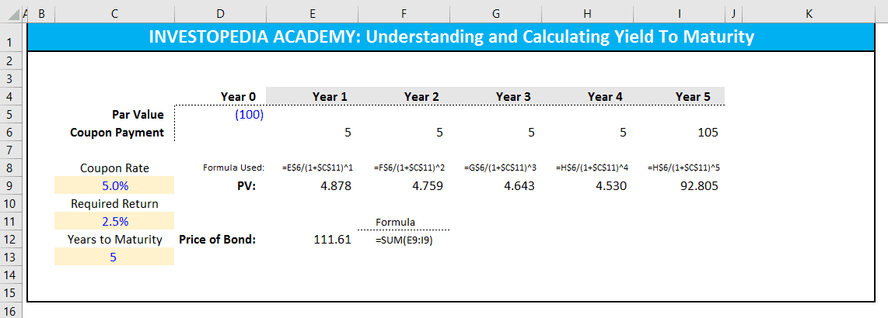

Investing encompasses a wide range of metrics and strategies that help evaluate performance and optimize returns. Among these, Yield on Cost (YOC), dividend yield, and algorithmic trading stand out as fundamental concepts for investors. Each plays a unique role in understanding investment performance and enhancing strategic decisions.

Yield on Cost (YOC) offers a perspective on dividend yield in relation to the original purchase price of an investment. This metric differs from the current dividend yield by focusing on the income generated based on initial investment costs, providing insights into long-term performance. Investors particularly favor YOC for monitoring the income performance of dividend-paying assets over time.



Dividend yield, representing the return received from dividends relative to the stock's price, is crucial for income-focused investors. It provides insights into a company's dividend payment practices and stability, helping investors infer the potential for regular cash flows from their investments. Together with YOC, dividend yield allows for a comprehensive evaluation of dividend-generating assets.

Algorithmic trading, often referred to as algo trading, employs computer algorithms to automate trading decisions. This approach utilizes financial formulas such as YOC and dividend yield, among other metrics, to make real-time trading choices. Algorithmic trading promises enhanced speed and precision, reducing human error and optimizing investment strategies.

By exploring Yield on Cost, dividend yield, and algorithmic trading, this article aims to clarify their significance and demonstrate how these concepts intersect to enrich investment strategies. Understanding these elements is essential for achieving successful investment outcomes, maximizing returns, and setting a solid foundation for sustainable growth in the finance world.

## Table of Contents

## Understanding Yield on Cost (YOC)

Yield on Cost (YOC) is a financial metric that provides investors with a perspective on the income generated by an investment, specifically focusing on dividends, in relation to the original cost of acquiring the asset. This approach to yield calculation contrasts with the current dividend yield, which is based on the prevailing market price of a security.

To clarify the concept, YOC is calculated by dividing the annual dividends received by the original purchase price of the investment. Mathematically, it is expressed as:

$$
\text{YOC} = \left( \frac{\text{Annual Dividends}}{\text{Original Investment Cost}} \right) \times 100
$$

This measure allows investors to assess the effectiveness of their initial investment decision over time. As companies potentially increase their dividend payouts, the YOC can grow, providing evidence of successful long-term investment performance. An increase in YOC indicates that the dividends relative to the original investment are growing, enhancing income returns from the asset without additional capital outlay.

Investors commonly use Yield on Cost to evaluate dividend-growth investments. By monitoring changes in YOC, they can gauge whether the income generated by their portfolio is increasing in line with expectations. This metric is particularly useful for those focused on income generation from investments, such as retirees or income-driven portfolios, as it showcases how the income aspect of their investment evolves over time.

The focus on the initial cost basis offers a unique perspective compared to current yield metrics, helping investors maintain a long-term view of their investment strategy. YOC emphasizes the historical cost, thus reinforcing the importance of when an investment was made and highlighting the benefits of early and strategic asset purchases.

## The Role of Dividend Yield

Dividend yield represents a fundamental metric in evaluating the financial health and attractiveness of a stock to income-focused investors. It reflects the annual dividends paid by a company divided by its current stock price. This measure is expressed as a percentage and is calculated using the formula:

$$
\text{Dividend Yield} = \left(\frac{\text{Annual Dividends per Share}}{\text{Price per Share}}\right) \times 100
$$

This metric provides vital insights into a company's dividend payment patterns and potential stability. A higher dividend yield might indicate that a company is returning more cash to its shareholders relative to its stock price, which can be particularly attractive for investors seeking regular income streams. However, it is essential to assess the sustainability of dividend payments, as an unusually high yield might also signal underlying financial distress or a decline in stock price.

Income-focused investors prioritize dividend yields as they aim for consistent cash flows from their investments. For such investors, evaluating dividend yield involves not only looking at the percentage itself but also considering factors such as the company’s historical dividend performance, payout ratio, and any announcements regarding future dividend strategies. Companies that consistently maintain or increase dividends over time are often seen as financially stable and potentially less volatile.

Furthermore, dividend yield helps compare investment opportunities across different companies and sectors. Investors may choose stocks with yields that match their income requirements and investment philosophies, whether prioritizing high yields for immediate income or reinvesting dividends in lower-yielding stocks with growth potential.

In summary, dividend yield serves as an essential tool for assessing the attractiveness and reliability of dividend-paying stocks. It aids investors in constructing portfolios that align with their income needs while understanding the risk and sustainability of dividend payments.

## Investment Performance and Yield Metrics

Investment performance assessment relies heavily on yield metrics such as dividend yield, bond yield, and yield to maturity (YTM). Each of these metrics provides critical insights into potential returns and risks associated with different asset classes. Understanding these metrics and their applications can enhance the effectiveness of investment strategies and improve risk management.

**Dividend Yield** is calculated by dividing a company’s annual dividend payments by its current share price:

$$
\text{Dividend Yield} = \frac{\text{Annual Dividends per Share}}{\text{Price per Share}}
$$

This metric reflects the cash flow an investor can expect in relation to the stock's market value. A higher dividend yield may indicate better income potential, making it particularly attractive to income-focused investors. However, it is also crucial to analyze the sustainability of these dividends. A very high dividend yield might suggest that a company’s stock price is depressed and could denote financial distress.

**Bond Yield** typically refers to the yield of an individual bond or a portfolio of bonds. It considers the annual income generated by the bond investments relative to the cost or current market price of the bonds. The most common bond yield used is the current yield, calculated as follows:

$$
\text{Current Yield} = \frac{\text{Annual Coupon Payment}}{\text{Current Market Price of the Bond}}
$$

This metric helps investors understand the annual income return relative to the bond's current market price. However, it does not consider the capital gains or losses that may result from holding the bond to maturity. 

**Yield to Maturity (YTM)** is a more comprehensive bond yield metric. It accounts for the total returns an investor can expect to receive if the bond is held to maturity, including interest payments and any capital gain or loss incurred between the purchase price and the maturity value. YTM is calculated using the formula involving present value:

$$
\text{YTM} = \frac{C + \frac{F - P}{n}}{\frac{F + P}{2}}
$$

Where:
- $C$ = Coupon payment
- $F$ = Face value of the bond
- $P$ = Price of the bond
- $n$ = Years to maturity

Incorporating diverse yield metrics into an investment strategy allows investors to optimize portfolio performance by balancing income generation and risk exposure. For example, higher dividend yields can enhance a portfolio's income component, while YTM provides a longer-term view of bond performance. This balanced approach aids in achieving desired financial goals while maintaining a preferred risk level. Furthermore, these metrics can help in diversifying the investment portfolio, thereby managing and mitigating the inherent risks associated with investing in different asset classes.

 to Algorithmic Trading

Algorithmic trading, commonly referred to as algo trading, involves the utilization of computer algorithms to execute trading decisions automatically. By leveraging pre-defined criteria, algorithms facilitate trading at speeds and frequencies that are beyond human capabilities, thereby offering a competitive edge. The automation of trading decisions leads to improved efficiency, enhanced precision, and a reduction in manual errors.

One of the fundamental advantages of [algorithmic trading](/wiki/algorithmic-trading) is its capacity to incorporate financial formulas like Yield on Cost (YOC) and other yield data. These metrics allow trading algorithms to assess investment opportunities in real-time, providing timely insights that can be translated into actionable trades. By using mathematical models and statistical analyses, algorithms can swiftly evaluate market conditions and execute trades based on predetermined parameters.

For example, an algorithm might be designed to buy a stock when its dividend yield exceeds a certain threshold, indicating a potentially undervalued stock compared to its historical yield performance. This strategy requires the algorithm to continuously monitor stock prices and dividend declarations, instantly executing trades when conditions are met. Additionally, these algorithms can adapt to changes in market data, ensuring that trading strategies align with current financial environments.

The precision offered by algorithmic trading arises from its ability to minimize human errors typically associated with manual trading, such as input mistakes or delayed execution. Automated systems, unaffected by emotional biases and fatigue, execute pre-programmed strategies reliably and consistently. Furthermore, algorithmic trading enhances investment strategies by allowing for [backtesting](/wiki/backtesting)—running the algorithm through historical data to evaluate its potential effectiveness and refine strategies before deploying them in live markets.

In summary, algorithmic trading revolutionizes investment management by combining speed, precision, and strategic insights. By embedding financial formulas like YOC and real-time yield data into trading algorithms, investors can achieve more informed and effective trading decisions, thereby optimizing portfolio performance while substantially reducing risk.

## Integrating YOC and Yield in Algorithmic Strategies

Integrating Yield on Cost (YOC) and various yield metrics into algorithmic strategies can enhance trading by enabling more informed decision-making. Algorithms utilize these metrics to evaluate and compare the profitability of different investment opportunities rapidly and accurately.

### YOC and Algorithmic Efficiency

Yield on Cost serves as a crucial metric for assessing the income produced relative to the initial investment cost. When implemented in trading algorithms, YOC aids in identifying assets that are increasing in yield, signifying a potentially fruitful long-term investment. Algorithms can continuously monitor YOC and adjust investment portfolios accordingly, which is particularly useful in dynamic market conditions.

### Yield Metrics as Decision Tools

Algorithms that incorporate dividend yield and other yield types offer a robust framework for evaluating the stability and potential return of investments. Dividend yield, calculated as:

$$
\text{Dividend Yield} = \frac{\text{Annual Dividends per Share}}{\text{Price per Share}}
$$

provides a snapshot of the income-producing potential relative to the current stock price. By integrating such formulas, algorithms can filter out stocks or assets that align with specific income targets, ensuring that only those meeting the desired criteria are selected for investment.

### Synergy and Outcome Improvement

The synergy between YOC, various yield metrics, and algorithmic trading allows for enhanced portfolio management. This integration optimizes the selection and timing of trades, maximizing returns while minimizing risks. Trading algorithms can back-test strategies and tweak them based on historical data, leveraging these yield metrics to predict future performance and make informed decisions in real-time.

Algorithms that dynamically adjust based on yield performance enable investors to optimize their returns systematically. The rapid processing power of these algorithms ensures that decisions take into account the most current and relevant data, improving investment outcomes consistently and providing a competitive edge over traditional methods.

## Conclusion

Yield on Cost (YOC) and dividend yield insights form essential components of a robust investment strategy when combined with algorithmic trading. These tools enable investors to not only measure performance but also optimize their portfolios for sustainable growth. YOC provides a long-term view of income relative to the initial cost, allowing investors to track the performance of dividend-generating assets consistently. By understanding and leveraging this metric, investors can hold onto investments that demonstrate increasing income generation potential over time.

On the other hand, the dividend yield offers immediate insights into dividend stability and the return on investment relative to the current stock price. This is particularly helpful for those seeking regular income streams, as a stable or increasing dividend yield can indicate a healthy company paying consistent dividends.

When these yield metrics are integrated into algorithmic trading, the advantages are amplified. Algorithmic trading allows for rapid analysis and decision-making based on real-time market data, effectively reducing human error and enabling precision in trade executions. By incorporating YOC and dividend yield into algorithmic models, investors can automate the evaluation of potential investment opportunities and enhance their decision-making processes.

For example, a Python code snippet could be designed to automatically calculate YOC and dividend yield for a list of investments, updating in real-time to inform trading decisions:

```python
import numpy as np

def calculate_yoc(initial_price, current_dividend):
    return (current_dividend / initial_price) * 100

def calculate_dividend_yield(current_price, current_dividend):
    return (current_dividend / current_price) * 100

# Example data
investments = [
    {'name': 'Stock A', 'initial_price': 50, 'current_price': 60, 'current_dividend': 3},
    {'name': 'Stock B', 'initial_price': 30, 'current_price': 35, 'current_dividend': 1.5}
]

for investment in investments:
    yoc = calculate_yoc(investment['initial_price'], investment['current_dividend'])
    dividend_yield = calculate_dividend_yield(investment['current_price'], investment['current_dividend'])
    print(f"Investment: {investment['name']}, YOC: {yoc:.2f}%, Dividend Yield: {dividend_yield:.2f}%")
```

Staying informed about the evolving landscape of these financial metrics and integrating them into investment strategies can provide a significant competitive advantage. By using these tools effectively, investors can better navigate the complexities of the financial markets, optimize returns, and achieve sustainable growth in their investment portfolios.

## References & Further Reading

[1]: ["The Intelligent Investor: The Definitive Book on Value Investing"](https://www.amazon.com/Intelligent-Investor-Definitive-Investing-Essentials/dp/0060555661) by Benjamin Graham

[2]: ["Algorithmic Trading and DMA: An Introduction to Direct Access Trading Strategies"](https://www.amazon.com/Algorithmic-Trading-DMA-introduction-strategies/dp/0956399207) by Barry Johnson

[3]: ["The Little Book of Common Sense Investing: The Only Way to Guarantee Your Fair Share of Stock Market Returns"](https://www.amazon.com/Little-Book-Common-Sense-Investing/dp/1119404509) by John C. Bogle

[4]: ["A Random Walk Down Wall Street: The Time-Tested Strategy for Successful Investing"](https://www.amazon.com/Random-Walk-Down-Wall-Street/dp/0393358380) by Burton G. Malkiel

[5]: Bloomberg Terminals and Financial News Platforms: Access to real-time financial data and algorithmic trading news.