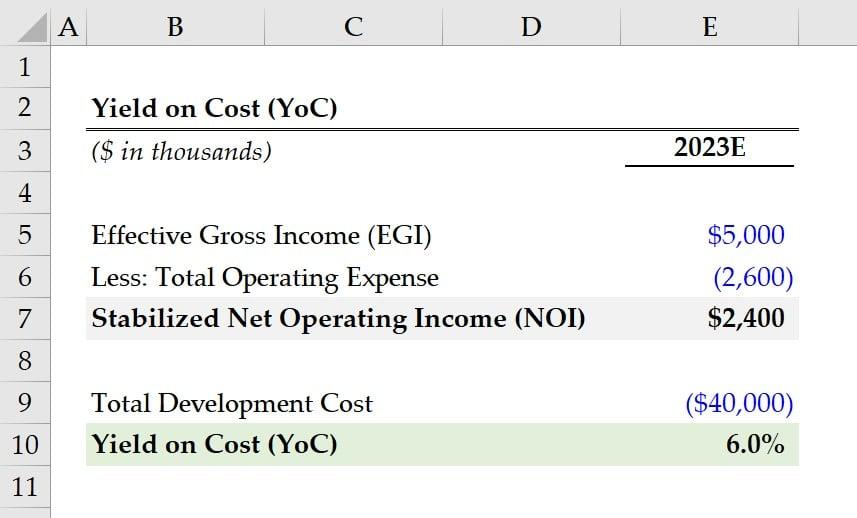

## Table of Contents

## What is Yield on Cost (YOC)?

Yield on Cost (YOC) is a way to measure how much money you are making from an investment, like stocks or real estate, based on what you originally paid for it. It's calculated by dividing the yearly income you get from the investment by the amount you initially spent to buy it. For example, if you bought a stock for $100 and it now pays you $5 a year in dividends, your YOC would be 5%.

YOC is useful because it helps you see the growth in your investment's income over time. If the company increases its dividend, your YOC goes up even though you didn't spend any more money. This can be really helpful for long-term investors who want to know how their investment is performing compared to what they paid for it. It's different from the current yield, which looks at the income based on the stock's current price, not what you originally paid.

## How is Yield on Cost calculated?

To calculate Yield on Cost, you need to know two things: the yearly income from your investment and the original amount you paid for it. Let's say you bought a stock for $100 and now it pays you $5 every year in dividends. To find the Yield on Cost, you divide the yearly income ($5) by the original cost ($100). So, $5 divided by $100 gives you a Yield on Cost of 5%.

Yield on Cost is helpful because it shows how your investment's income has grown since you bought it. If the company starts paying more dividends over time, your Yield on Cost will go up without you spending any more money. For example, if the same stock later pays $7 a year in dividends, your new Yield on Cost would be $7 divided by $100, which is 7%. This way, you can see how much better your investment is doing compared to what you paid for it at the start.

## Why is Yield on Cost important for investors?

Yield on Cost is important for investors because it helps them see how well their investments are doing over time. When you buy a stock or a piece of real estate, you want to know if it's making more money for you than when you first bought it. Yield on Cost shows this by looking at the yearly income you get from your investment and comparing it to what you originally paid. This way, you can see if your investment is getting better or worse at making money for you.

For long-term investors, Yield on Cost is really helpful because it shows the growth in income from their investments. If a company starts paying more dividends over the years, your Yield on Cost goes up without you spending any more money. This can make your investment more valuable over time, even if the price of the stock doesn't change. It's a good way to see if holding onto your investments for a long time is paying off.

## Can you provide a simple example of how to calculate Yield on Cost?

Let's say you bought a stock for $100, and it pays you $5 every year in dividends. To find the Yield on Cost, you divide the yearly income ($5) by the original cost ($100). So, $5 divided by $100 gives you a Yield on Cost of 5%.

This means that for every $100 you spent on the stock, you're getting $5 back every year. If the company later increases the dividend to $7 a year, your new Yield on Cost would be $7 divided by $100, which is 7%. This shows how your investment is doing better over time, even though you didn't spend any more money.

## How does Yield on Cost differ from current yield?

Yield on Cost and current yield are two different ways to look at how much money you're making from an investment, like a stock. Yield on Cost is calculated by taking the yearly income you get from the investment and dividing it by how much you originally paid for it. This shows you how your investment's income has grown since you bought it. For example, if you bought a stock for $100 and it pays $5 a year in dividends, your Yield on Cost is 5%. If the dividend goes up to $7 a year later, your Yield on Cost becomes 7%, even though you didn't spend any more money.

Current yield, on the other hand, looks at the yearly income you get from the investment, but it divides it by the stock's current price, not what you paid for it. This gives you an idea of what the yield would be if you bought the stock at today's price. Using the same example, if the stock's price goes up to $125 and it's still paying $5 a year in dividends, the current yield would be $5 divided by $125, which is 4%. So, current yield can change as the stock's price changes, while Yield on Cost stays the same unless the dividend changes.

## What are the limitations of using Yield on Cost as an investment metric?

Using Yield on Cost as an investment metric has some limitations. One big problem is that it only looks at the income part of your investment, like dividends from stocks. It doesn't tell you anything about how the price of the stock is doing. So, if the stock's price goes down a lot, your investment might be worth less, even if the Yield on Cost looks good because the dividends are high.

Another limitation is that Yield on Cost can make you focus too much on holding onto investments for a long time, even if they're not the best choice anymore. If a company stops growing or starts doing worse, the stock might not be a good investment anymore, but you might keep it because the Yield on Cost is high. This can stop you from selling the stock and finding a better investment.

## How can Yield on Cost be used in dividend growth investing?

Yield on Cost is really helpful for people who invest in stocks that grow their dividends over time. When you buy a stock that keeps increasing its dividend, your Yield on Cost goes up without you spending any more money. This is good because it means you're getting more income every year from the same investment. For example, if you bought a stock for $100 and it paid $5 a year in dividends at first, your Yield on Cost would be 5%. If the company increases the dividend to $7 a year, your Yield on Cost becomes 7%. This shows how much better your investment is doing over time, even if the stock's price doesn't change.

But, it's important to remember that Yield on Cost isn't perfect. It only looks at the dividends you get, not how the stock's price is doing. If the stock's price goes down a lot, your investment might be worth less, even though the Yield on Cost looks good. Also, if you focus too much on Yield on Cost, you might keep holding onto a stock even if the company isn't doing well anymore. It's always a good idea to look at other things too, like how the company is growing and what the stock's price is doing, to make sure you're making the best choices for your investments.

## What impact do dividend increases have on Yield on Cost over time?

When a company increases its dividends, your Yield on Cost goes up over time. This is good because it means you're getting more money from your investment without spending any more. For example, if you bought a stock for $100 and it paid $5 a year in dividends at first, your Yield on Cost would be 5%. If the company later increases the dividend to $7 a year, your new Yield on Cost would be 7%. This shows that your investment is doing better and better, even if the stock's price doesn't change.

But, it's important to remember that Yield on Cost only looks at the dividends you get, not how the stock's price is doing. If the stock's price goes down a lot, your investment might be worth less, even though the Yield on Cost looks good. Also, if you focus too much on Yield on Cost, you might keep holding onto a stock even if the company isn't doing well anymore. It's always a good idea to look at other things too, like how the company is growing and what the stock's price is doing, to make sure you're making the best choices for your investments.

## How does reinvesting dividends affect Yield on Cost?

When you reinvest your dividends, it means you use the money you get from dividends to buy more shares of the same stock. This can make your Yield on Cost go up over time because you're getting dividends from more shares than you started with. For example, if you bought 100 shares of a stock for $100 each and it pays $5 per share every year, your original Yield on Cost is 5%. If you reinvest those dividends and buy more shares, you'll get dividends from those new shares too, which can make your total yearly income from the stock higher.

But, even though reinvesting dividends can make your Yield on Cost go up, it doesn't change the fact that Yield on Cost is based on what you originally paid for the stock. If the company keeps increasing its dividends, your Yield on Cost will go up whether you reinvest or not. The big difference is that reinvesting can help your investment grow faster because you're using the dividends to buy more shares, which can lead to even more dividends in the future.

## Can Yield on Cost be applied to other types of investments besides stocks?

Yes, Yield on Cost can be used for other types of investments like real estate and bonds. For real estate, if you buy a property for $200,000 and it gives you $10,000 a year in rent, your Yield on Cost would be 5%. If you later raise the rent to $12,000 a year, your Yield on Cost goes up to 6%. This shows how the income from your property is growing compared to what you paid for it.

For bonds, if you buy a bond for $1,000 that pays $50 a year in interest, your Yield on Cost is 5%. If the bond issuer increases the interest payments to $60 a year, your Yield on Cost becomes 6%. Just like with stocks, Yield on Cost helps you see how the income from your bond is doing over time, based on what you originally paid for it.

## What are some advanced strategies for maximizing Yield on Cost?

One way to maximize your Yield on Cost is to focus on buying stocks that have a history of increasing their dividends. These companies are often stable and growing, which means they can keep paying more dividends over time. When you buy these stocks, your Yield on Cost can go up every year without you spending any more money. It's like getting more and more money back from the same investment. Another strategy is to reinvest your dividends. When you do this, you use the money you get from dividends to buy more shares of the same stock. This way, you get dividends from more shares, which can make your total yearly income from the stock higher and your Yield on Cost even better.

Another advanced strategy is to look for companies that might be undervalued but have the potential to increase their dividends. Sometimes, a company's stock price might be low because of short-term problems, but if you believe in their long-term growth, buying their stock at a lower price can lead to a higher Yield on Cost when they start increasing their dividends. Also, diversifying your investments can help. By spreading your money across different stocks that all increase their dividends, you can build a portfolio where the overall Yield on Cost keeps growing. This way, even if one stock doesn't do well, the others can help keep your total Yield on Cost high.

## How can investors track and monitor their Yield on Cost over time?

Investors can track and monitor their Yield on Cost over time by keeping a record of their investments and the dividends they receive. They can do this using a simple spreadsheet or a financial tracking app. In the spreadsheet, they would list the original cost of each investment, the yearly dividends received, and calculate the Yield on Cost each year. Every time a dividend payment comes in, they update the spreadsheet to see how the Yield on Cost has changed. This way, they can easily see if their investments are getting better at making money over time.

Another way to monitor Yield on Cost is by using investment platforms or brokerage accounts that offer tools to track dividend income and investment performance. Many of these platforms automatically calculate the Yield on Cost for you and update it whenever there's a change in dividends. By regularly checking these tools, investors can keep an eye on how their Yield on Cost is growing and make adjustments to their investment strategy if needed. It's important to check these numbers often to make sure your investments are doing well and to see if you need to make any changes.

## What is Understanding Yield on Cost (YOC)?

Yield on Cost (YOC) is a financial metric that provides investors with a perspective on the income generated by an investment, specifically focusing on dividends, in relation to the original cost of acquiring the asset. This approach to yield calculation contrasts with the current dividend yield, which is based on the prevailing market price of a security.

To clarify the concept, YOC is calculated by dividing the annual dividends received by the original purchase price of the investment. Mathematically, it is expressed as:

$$
\text{YOC} = \left( \frac{\text{Annual Dividends}}{\text{Original Investment Cost}} \right) \times 100
$$

This measure allows investors to assess the effectiveness of their initial investment decision over time. As companies potentially increase their dividend payouts, the YOC can grow, providing evidence of successful long-term investment performance. An increase in YOC indicates that the dividends relative to the original investment are growing, enhancing income returns from the asset without additional capital outlay.

Investors commonly use Yield on Cost to evaluate dividend-growth investments. By monitoring changes in YOC, they can gauge whether the income generated by their portfolio is increasing in line with expectations. This metric is particularly useful for those focused on income generation from investments, such as retirees or income-driven portfolios, as it showcases how the income aspect of their investment evolves over time.

The focus on the initial cost basis offers a unique perspective compared to current yield metrics, helping investors maintain a long-term view of their investment strategy. YOC emphasizes the historical cost, thus reinforcing the importance of when an investment was made and highlighting the benefits of early and strategic asset purchases.

## What is the Role of Dividend Yield?

Dividend yield represents a fundamental metric in evaluating the financial health and attractiveness of a stock to income-focused investors. It reflects the annual dividends paid by a company divided by its current stock price. This measure is expressed as a percentage and is calculated using the formula:

$$
\text{Dividend Yield} = \left(\frac{\text{Annual Dividends per Share}}{\text{Price per Share}}\right) \times 100
$$

This metric provides vital insights into a company's dividend payment patterns and potential stability. A higher dividend yield might indicate that a company is returning more cash to its shareholders relative to its stock price, which can be particularly attractive for investors seeking regular income streams. However, it is essential to assess the sustainability of dividend payments, as an unusually high yield might also signal underlying financial distress or a decline in stock price.

Income-focused investors prioritize dividend yields as they aim for consistent cash flows from their investments. For such investors, evaluating dividend yield involves not only looking at the percentage itself but also considering factors such as the company’s historical dividend performance, payout ratio, and any announcements regarding future dividend strategies. Companies that consistently maintain or increase dividends over time are often seen as financially stable and potentially less volatile.

Furthermore, dividend yield helps compare investment opportunities across different companies and sectors. Investors may choose stocks with yields that match their income requirements and investment philosophies, whether prioritizing high yields for immediate income or reinvesting dividends in lower-yielding stocks with growth potential.

In summary, dividend yield serves as an essential tool for assessing the attractiveness and reliability of dividend-paying stocks. It aids investors in constructing portfolios that align with their income needs while understanding the risk and sustainability of dividend payments.

## What are the key aspects of Investment Performance and Yield Metrics?

Investment performance assessment relies heavily on yield metrics such as dividend yield, bond yield, and yield to maturity (YTM). Each of these metrics provides critical insights into potential returns and risks associated with different asset classes. Understanding these metrics and their applications can enhance the effectiveness of investment strategies and improve risk management.

**Dividend Yield** is calculated by dividing a company’s annual dividend payments by its current share price:

$$
\text{Dividend Yield} = \frac{\text{Annual Dividends per Share}}{\text{Price per Share}}
$$

This metric reflects the cash flow an investor can expect in relation to the stock's market value. A higher dividend yield may indicate better income potential, making it particularly attractive to income-focused investors. However, it is also crucial to analyze the sustainability of these dividends. A very high dividend yield might suggest that a company’s stock price is depressed and could denote financial distress.

**Bond Yield** typically refers to the yield of an individual bond or a portfolio of bonds. It considers the annual income generated by the bond investments relative to the cost or current market price of the bonds. The most common bond yield used is the current yield, calculated as follows:

$$
\text{Current Yield} = \frac{\text{Annual Coupon Payment}}{\text{Current Market Price of the Bond}}
$$

This metric helps investors understand the annual income return relative to the bond's current market price. However, it does not consider the capital gains or losses that may result from holding the bond to maturity. 

**Yield to Maturity (YTM)** is a more comprehensive bond yield metric. It accounts for the total returns an investor can expect to receive if the bond is held to maturity, including interest payments and any capital gain or loss incurred between the purchase price and the maturity value. YTM is calculated using the formula involving present value:

$$
\text{YTM} = \frac{C + \frac{F - P}{n}}{\frac{F + P}{2}}
$$

Where:
- $C$ = Coupon payment
- $F$ = Face value of the bond
- $P$ = Price of the bond
- $n$ = Years to maturity

Incorporating diverse yield metrics into an investment strategy allows investors to optimize portfolio performance by balancing income generation and risk exposure. For example, higher dividend yields can enhance a portfolio's income component, while YTM provides a longer-term view of bond performance. This balanced approach aids in achieving desired financial goals while maintaining a preferred risk level. Furthermore, these metrics can help in diversifying the investment portfolio, thereby managing and mitigating the inherent risks associated with investing in different asset classes.

 to Algorithmic Trading

Algorithmic trading, commonly referred to as algo trading, involves the utilization of computer algorithms to execute trading decisions automatically. By leveraging pre-defined criteria, algorithms facilitate trading at speeds and frequencies that are beyond human capabilities, thereby offering a competitive edge. The automation of trading decisions leads to improved efficiency, enhanced precision, and a reduction in manual errors.

One of the fundamental advantages of [algorithmic trading](/wiki/algorithmic-trading) is its capacity to incorporate financial formulas like Yield on Cost (YOC) and other yield data. These metrics allow trading algorithms to assess investment opportunities in real-time, providing timely insights that can be translated into actionable trades. By using mathematical models and statistical analyses, algorithms can swiftly evaluate market conditions and execute trades based on predetermined parameters.

For example, an algorithm might be designed to buy a stock when its dividend yield exceeds a certain threshold, indicating a potentially undervalued stock compared to its historical yield performance. This strategy requires the algorithm to continuously monitor stock prices and dividend declarations, instantly executing trades when conditions are met. Additionally, these algorithms can adapt to changes in market data, ensuring that trading strategies align with current financial environments.

The precision offered by algorithmic trading arises from its ability to minimize human errors typically associated with manual trading, such as input mistakes or delayed execution. Automated systems, unaffected by emotional biases and fatigue, execute pre-programmed strategies reliably and consistently. Furthermore, algorithmic trading enhances investment strategies by allowing for [backtesting](/wiki/backtesting)—running the algorithm through historical data to evaluate its potential effectiveness and refine strategies before deploying them in live markets.

In summary, algorithmic trading revolutionizes investment management by combining speed, precision, and strategic insights. By embedding financial formulas like YOC and real-time yield data into trading algorithms, investors can achieve more informed and effective trading decisions, thereby optimizing portfolio performance while substantially reducing risk.

## How can YOC and Yield be integrated into algorithmic strategies?

Integrating Yield on Cost (YOC) and various yield metrics into algorithmic strategies can enhance trading by enabling more informed decision-making. Algorithms utilize these metrics to evaluate and compare the profitability of different investment opportunities rapidly and accurately.

### YOC and Algorithmic Efficiency

Yield on Cost serves as a crucial metric for assessing the income produced relative to the initial investment cost. When implemented in trading algorithms, YOC aids in identifying assets that are increasing in yield, signifying a potentially fruitful long-term investment. Algorithms can continuously monitor YOC and adjust investment portfolios accordingly, which is particularly useful in dynamic market conditions.

### Yield Metrics as Decision Tools

Algorithms that incorporate dividend yield and other yield types offer a robust framework for evaluating the stability and potential return of investments. Dividend yield, calculated as:

$$
\text{Dividend Yield} = \frac{\text{Annual Dividends per Share}}{\text{Price per Share}}
$$

provides a snapshot of the income-producing potential relative to the current stock price. By integrating such formulas, algorithms can filter out stocks or assets that align with specific income targets, ensuring that only those meeting the desired criteria are selected for investment.

### Synergy and Outcome Improvement

The synergy between YOC, various yield metrics, and algorithmic trading allows for enhanced portfolio management. This integration optimizes the selection and timing of trades, maximizing returns while minimizing risks. Trading algorithms can back-test strategies and tweak them based on historical data, leveraging these yield metrics to predict future performance and make informed decisions in real-time.

Algorithms that dynamically adjust based on yield performance enable investors to optimize their returns systematically. The rapid processing power of these algorithms ensures that decisions take into account the most current and relevant data, improving investment outcomes consistently and providing a competitive edge over traditional methods.

## References & Further Reading

[1]: ["The Intelligent Investor: The Definitive Book on Value Investing"](https://www.amazon.com/Intelligent-Investor-Definitive-Investing-Essentials/dp/0060555661) by Benjamin Graham

[2]: ["Algorithmic Trading and DMA: An Introduction to Direct Access Trading Strategies"](https://www.amazon.com/Algorithmic-Trading-DMA-introduction-strategies/dp/0956399207) by Barry Johnson

[3]: ["The Little Book of Common Sense Investing: The Only Way to Guarantee Your Fair Share of Stock Market Returns"](https://www.amazon.com/Little-Book-Common-Sense-Investing/dp/1119404509) by John C. Bogle

[4]: ["A Random Walk Down Wall Street: The Time-Tested Strategy for Successful Investing"](https://www.amazon.com/Random-Walk-Down-Wall-Street/dp/0393358380) by Burton G. Malkiel

[5]: Bloomberg Terminals and Financial News Platforms: Access to real-time financial data and algorithmic trading news.