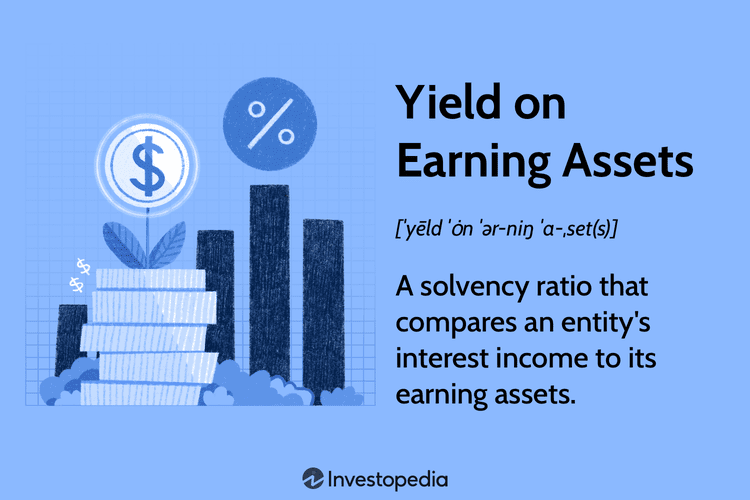

## Table of Contents

## What is the basic definition of 'Yield on Earning Assets'?

Yield on Earning Assets is a financial term that measures how much income an asset generates compared to its cost. It's like figuring out how much money you earn from an investment relative to what you paid for it. This is important for banks and other financial institutions because it helps them see how well they are using their money to make more money.

For example, if a bank has loans and securities that it uses to earn money, the yield on these earning assets shows how effective those investments are. A higher yield means the bank is doing a good job turning its assets into income. This measure is crucial for understanding the performance and profitability of financial institutions.

## How is 'Yield on Earning Assets' calculated?

To calculate the Yield on Earning Assets, you start by finding out how much income the assets made over a certain time, like a year. This income could be from interest on loans, dividends from stocks, or any other earnings from the assets. Then, you take that total income and divide it by the average value of the earning assets during that same time. The average value is usually found by adding the value of the assets at the start and end of the period, then dividing by two.

Once you have the result from dividing the income by the average value of the assets, you multiply that number by 100 to turn it into a percentage. This percentage is the Yield on Earning Assets. It shows you how much money the assets are making compared to how much they are worth. For example, if the assets earned $5,000 and their average value was $100,000, the yield would be 5% because $5,000 divided by $100,000 is 0.05, and 0.05 times 100 is 5.

## What types of financial institutions typically use 'Yield on Earning Assets' as a key metric?

Banks are the main type of financial institution that use 'Yield on Earning Assets' as a key metric. They use it to see how well they are doing at making money from the loans and investments they have. It's important for them because it shows if they are earning enough from their assets to cover their costs and make a profit.

Credit unions also use this metric a lot. They are similar to banks but are owned by their members. They want to know how much they are earning from the money they lend out or invest, so they can make sure they are managing their members' money well and keeping the credit union strong.

Some investment firms might also look at 'Yield on Earning Assets' if they deal with assets that generate income, like bonds or dividend-paying stocks. It helps them compare different investments and see which ones are giving the best return for the money they have invested.

## Why is 'Yield on Earning Assets' important for assessing a bank's performance?

'Yield on Earning Assets' is important for assessing a bank's performance because it shows how well the bank is using its money to make more money. Banks use their money to give out loans or buy investments like bonds, and they earn money from the interest on these loans and investments. The yield tells the bank how much money they are making from these assets compared to how much the assets are worth. If the yield is high, it means the bank is doing a good job at turning its assets into income, which is good for the bank's profitability.

This metric is also useful for comparing how well different banks are doing. If one bank has a higher yield than another, it might mean that the first bank is better at choosing which loans and investments to make. This can help investors and customers decide which bank is performing better. Also, by looking at the yield over time, a bank can see if its strategies for earning money are working well or if they need to be changed.

## Can you explain the difference between 'Yield on Earning Assets' and 'Return on Assets'?

'Yield on Earning Assets' and 'Return on Assets' are both important measures for a bank, but they look at different things. 'Yield on Earning Assets' focuses on how much income the bank makes from its earning assets, like loans and investments, compared to how much those assets are worth. It's like checking how much money the bank is earning from the money it has put into loans or investments. This helps the bank see if it's doing a good job at making money from these specific assets.

On the other hand, 'Return on Assets' looks at the overall performance of the bank by comparing its total income to its total assets. This includes not just the earning assets but also other things like buildings and equipment. 'Return on Assets' gives a broader picture of how well the bank is using all its resources to make money. It's a way to see if the bank is profitable when you consider everything it owns, not just the parts that directly bring in income.

## How does 'Yield on Earning Assets' affect a bank's net interest margin?

'Yield on Earning Assets' is important for a bank's net interest margin because it shows how much money the bank makes from the loans and investments it has. The net interest margin is the difference between the interest income the bank earns and the interest it pays out to depositors. If the 'Yield on Earning Assets' is high, it means the bank is earning a lot of interest from its loans and investments. This can help make the net interest margin bigger because the bank is bringing in more money from its earning assets.

But, the net interest margin also depends on how much the bank has to pay out in interest to its depositors. If the 'Yield on Earning Assets' goes up but the interest paid to depositors stays the same or goes down, the net interest margin will get bigger. On the other hand, if the bank has to pay more interest to depositors, even if the 'Yield on Earning Assets' is high, the net interest margin might not grow as much. So, the 'Yield on Earning Assets' is a big part of figuring out the net interest margin, but it's not the only thing that matters.

## What factors can influence the 'Yield on Earning Assets' for a financial institution?

Several things can change the 'Yield on Earning Assets' for a bank or other financial institution. One big factor is the interest rates set by the central bank, like the Federal Reserve in the U.S. When interest rates go up, the bank can charge more interest on loans, which can make the yield go up. But if rates go down, the bank earns less from loans, and the yield might go down too. Another factor is the credit quality of the borrowers. If a bank lends to people or businesses that are more likely to pay back their loans, it can charge higher interest rates, boosting the yield.

The types of assets the bank chooses to invest in also matter a lot. For example, if a bank puts more money into high-yield bonds or riskier loans, the yield on its earning assets might go up. But, this comes with more risk. On the other hand, if the bank sticks to safer assets like government bonds, the yield might be lower but more stable. The competition in the market can also affect the yield. If there are many banks fighting for the same customers, they might have to lower their interest rates on loans to attract borrowers, which could lower the yield.

Lastly, the overall economic environment plays a role. In good economic times, more people and businesses want to borrow money, and banks can charge higher interest rates, leading to a higher yield. But in bad economic times, fewer people want to borrow, and the bank might have to lower rates to get any business at all, which can bring down the yield. So, the 'Yield on Earning Assets' can change because of many different things, and banks need to keep an eye on all of them to manage their earnings well.

## How can a bank improve its 'Yield on Earning Assets'?

A bank can improve its 'Yield on Earning Assets' by focusing on getting more income from the money it has lent out or invested. One way to do this is by increasing the interest rates on loans. If the economy is doing well, the bank might be able to charge more interest because more people and businesses want to borrow money. Another way is by choosing to invest in assets that pay higher interest, like riskier bonds or loans to borrowers with good credit scores. But the bank needs to be careful because higher interest rates or riskier investments can also mean more chance of not getting the money back.

Another thing the bank can do is to find ways to lower the costs of the money it uses to make loans or investments. This means trying to pay less interest to the people who put their money in the bank. If the bank can borrow money at a lower rate, it can keep more of the interest it earns from loans and investments. Also, the bank can work on making its loan and investment choices smarter. By using data and technology to pick the best loans and investments, the bank can get a better return on its money. So, by balancing the risks and looking for ways to earn more and spend less, a bank can improve its 'Yield on Earning Assets'.

## What are the potential risks associated with focusing too heavily on increasing 'Yield on Earning Assets'?

Focusing too much on increasing the 'Yield on Earning Assets' can lead to some big problems for a bank. One big risk is that the bank might start making loans to people or businesses that are more likely to not pay back the money. This is because to get a higher yield, the bank might have to charge higher interest rates, and often, the only way to do that is by lending to riskier borrowers. If too many of these loans don't get paid back, the bank could lose a lot of money and even go out of business.

Another risk is that the bank might put too much of its money into risky investments, like high-yield bonds or other assets that promise big returns but come with big risks. If these investments don't work out, the bank could lose a lot of money. Also, if everyone knows the bank is trying to get a higher yield, it might scare away customers who think the bank is being too risky. So, while trying to increase the 'Yield on Earning Assets' can help the bank make more money, it has to be careful not to take too many risks that could hurt it in the long run.

## How does 'Yield on Earning Assets' relate to the overall profitability and risk management of a bank?

'Yield on Earning Assets' is important for a bank's overall profitability because it shows how much money the bank makes from its loans and investments. When the yield is high, it means the bank is doing a good job at turning its money into more money. This helps the bank make more profit because the money coming in from loans and investments is bigger than the money going out to pay interest to depositors. But, the bank needs to be smart about how it tries to increase the yield. If it focuses too much on getting a higher yield, it might take too many risks, like making loans to people who might not pay them back or investing in risky assets. This can hurt the bank's profits if things go wrong.

Risk management is also tied to the 'Yield on Earning Assets'. Banks have to balance the desire for a higher yield with the need to keep their risks under control. If a bank chases a higher yield by lending to riskier borrowers or investing in high-risk assets, it could face big losses if those loans or investments don't work out. On the other hand, if the bank is too cautious and only goes for safe, low-yield investments, it might miss out on making more money. So, good risk management means finding the right balance. The bank needs to keep an eye on its yield and make sure it's not taking too many risks that could harm its overall health and profitability.

## What are some advanced strategies banks use to optimize their 'Yield on Earning Assets'?

Banks use a few smart strategies to make their 'Yield on Earning Assets' better. One way is by using data and technology to pick the best loans and investments. They look at lots of information about people and businesses to see who is likely to pay back their loans. This helps them charge higher interest rates to those who are less risky but still want to borrow money. Another thing banks do is change their loan and investment mix based on what's happening in the economy. If the economy is doing well, they might lend more money at higher rates. If things are tough, they might be more careful and stick to safer investments, even if the yield is lower.

Another strategy is to use financial tools called derivatives to manage risk and boost yield. Derivatives are like bets on what will happen to interest rates or other things that affect the bank's earnings. By using these tools, banks can protect themselves from big losses if interest rates change suddenly, and they can also find ways to earn a bit more money from their assets. Banks also try to keep their costs down by borrowing money at the lowest possible rates. This way, they can keep more of the interest they earn from loans and investments, which helps their yield. By balancing these strategies, banks can work to get a better 'Yield on Earning Assets' without taking too many risks.

## How does the regulatory environment impact the management of 'Yield on Earning Assets'?

The rules that banks have to follow can make a big difference in how they manage their 'Yield on Earning Assets'. Banks have to follow rules set by government groups like the Federal Reserve. These rules are there to keep the banks safe and make sure they don't take too many risks. For example, there are rules about how much money a bank has to keep in reserve and how much risk it can take with its loans and investments. If the rules are strict, banks might have to be more careful with their money, which can make it harder to get a high yield. But if the rules are relaxed, banks might be able to take more risks and try to earn more money from their assets.

Even though rules can limit what banks do, they can also help banks manage their 'Yield on Earning Assets' better. Banks have to report a lot of information to the people who make the rules, and this can help them see where they can do better. For example, if a bank sees that it's not earning enough from its loans, it might change its strategy to focus on different kinds of loans or investments. Also, knowing the rules well can help banks find smart ways to work within them and still get a good yield. So, the regulatory environment can both limit and guide how banks manage their 'Yield on Earning Assets'.

## What are the key aspects of understanding yield financial metrics?

Yield financial metrics serve as essential tools for assessing the profitability and efficiency of financial investments. These metrics primarily focus on the relationship between interest income and [earning](/wiki/earning-announcement) assets, offering a clear view of an asset's income-generating capabilities. By comparing the interest income to the value of earning assets, investors can evaluate how effectively these assets are utilized.

$$
\text{Yield} = \frac{\text{Interest Income}}{\text{Earning Assets}}
$$

A high yield is indicative of proficient asset use, suggesting that the investments are generating substantial income relative to their worth. This efficiency is crucial not only for income generation but also for ensuring the capability to meet short-term financial obligations. In essence, higher yields imply that an investor is getting a better return on each unit of currency invested in earning assets.

Analyzing yield metrics enables investors to distinguish between well-performing and underperforming assets. By monitoring and comparing yields across different types of investments, investors can identify which assets contribute most effectively to overall profitability. This analysis aids in making informed decisions about portfolio adjustments, focusing resources on investments with the highest potential returns.

Yield metrics are particularly useful when comparing different financial instruments with similar risk profiles. They provide a unified framework to assess whether certain assets or strategies are meeting financial performance expectations. Thus, yield metrics not only highlight the efficiency of existing investments but also guide strategic planning for future resource allocation.

## What is the Role of Earning Assets?

Earning assets play a pivotal role in generating income for financial institutions and individual investors. These are productive assets that yield returns through interest payments or dividends, typically encompassing securities like bonds, equities, and loans. The primary characteristic of earning assets is their ability to produce regular income, making them integral to the calculation and analysis of yield financial metrics.

Yield financial metrics, such as the yield on assets (YOA), involve comparing the generated income to the value of earning assets. This relationship is often expressed by the formula:

$$
\text{Yield on Assets (YOA)} = \frac{\text{Interest or Dividend Income}}{\text{Total Earning Assets}}
$$

By focusing on earning assets, financial institutions can gauge their income-generating efficiency and overall profitability. These institutions often leverage earning assets to ensure [liquidity](/wiki/liquidity-risk-premium)—a crucial [factor](/wiki/factor-investing) for maintaining operations and fulfilling short-term obligations. Liquidity, particularly, refers to the ease with which an asset can be converted into cash without affecting its market price. Earning assets usually offer a balance between liquidity and return, enabling institutions to invest strategically while remaining financially agile.

Moreover, the effective management of earning assets is essential for capitalizing on investment opportunities. By scrutinizing the performance of such assets, investors can make informed decisions, optimizing their portfolios to maximize returns while controlling risk exposure. This involves routine monitoring and realignment of the asset mix in response to changing market conditions, [interest rate](/wiki/interest-rate-trading-strategies) fluctuations, and economic forecasts.

The strategic selection and management of earning assets thus form the backbone of a successful financial strategy, ensuring sustained profitability and competitive advantage in the dynamic landscape of financial markets.

## What are the Key Performance Metrics for Trading Algorithms?

When evaluating the effectiveness and reliability of [algorithmic trading](/wiki/algorithmic-trading) strategies, several key performance metrics are commonly used. These metrics not only assess the potential returns but also gauge the risk and stability of the trading strategies employed.

One of the principal metrics is the **Sharpe Ratio**, which measures risk-adjusted returns. It is calculated by taking the difference between the return of the investment and the risk-free rate, then dividing by the standard deviation of the investment’s return. Mathematically, it is expressed as:

$$

\text{Sharpe Ratio} = \frac{E[R_p - R_f]}{\sigma_p}
$$

where $E[R_p]$ is the expected portfolio return, $R_f$ is the risk-free rate, and $\sigma_p$ is the standard deviation of the portfolio's excess return. A higher Sharpe Ratio indicates a more favorable risk-return trade-off.

Another important metric is the **Maximum Drawdown**, which measures the largest peak-to-trough decline before a new peak is achieved. This metric provides insights into the worst loss experienced over a specific time period, helping to evaluate the risk of significant losses in a trading strategy. The formula for Maximum Drawdown is:

$$

\text{Maximum Drawdown} = \frac{\text{Peak Value - Trough Value}}{\text{Peak Value}}
$$

Besides, **Volatility** metrics are used to assess the degree of variation in trading strategies over time, often using the standard deviation of returns. High [volatility](/wiki/volatility-trading-strategies) can imply higher potential returns but also increased risk.

Real-time tracking of these performance metrics is crucial. Advanced trading algorithms are capable of monitoring these metrics in real-time, allowing for continuous adjustment and refinement of strategies. For instance, a Python implementation could automate the calculation and logging of these metrics, aiding in their continuous evaluation and realignment of trading strategies. Here's a simple Python function to calculate the Sharpe Ratio, given an array of returns:

```python
import numpy as np

def calculate_sharpe_ratio(returns, risk_free_rate):
    excess_returns = returns - risk_free_rate
    return np.mean(excess_returns) / np.std(excess_returns)

# Example usage
returns = np.array([0.01, 0.02, 0.015, -0.005, 0.03])
risk_free_rate = 0.005
sharpe_ratio = calculate_sharpe_ratio(returns, risk_free_rate)
```

Such real-time capability enhances a strategy’s adaptability to the dynamic nature of financial markets, ultimately driving improvements in performance and competitive edge.

## References & Further Reading

[1]: Bergstra, J., Bardenet, R., Bengio, Y., & Kégl, B. (2011). ["Algorithms for Hyper-Parameter Optimization."](https://dl.acm.org/doi/10.5555/2986459.2986743) Advances in Neural Information Processing Systems 24.

[2]: ["Advances in Financial Machine Learning"](https://www.amazon.com/Advances-Financial-Machine-Learning-Marcos/dp/1119482089) by Marcos Lopez de Prado

[3]: ["Evidence-Based Technical Analysis: Applying the Scientific Method and Statistical Inference to Trading Signals"](https://www.amazon.com/Evidence-Based-Technical-Analysis-Scientific-Statistical/dp/0470008741) by David Aronson

[4]: ["Machine Learning for Algorithmic Trading"](https://github.com/stefan-jansen/machine-learning-for-trading) by Stefan Jansen

[5]: ["Quantitative Trading: How to Build Your Own Algorithmic Trading Business"](https://www.amazon.com/Quantitative-Trading-Build-Algorithmic-Business/dp/1119800064) by Ernest P. Chan