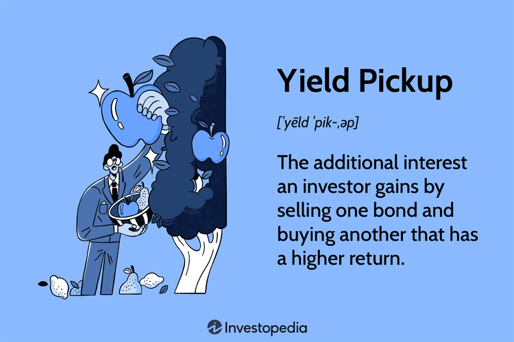

The yield pickup strategy is an essential mechanism for investors aiming to enhance the return profiles of their bond portfolios. At its core, this strategy involves the replacement of lower-yielding bonds with those offering higher yields, ultimately seeking to increase overall income from investments. This strategic approach is widely acknowledged within the financial community for its potential to boost risk-adjusted returns.

The financial landscape is rife with opportunities and risks, particularly in the context of yield pickup. While the promise of higher returns is appealing, it is essential to recognize the associated challenges, including interest rate risk and credit risk. Longer maturity and lower credit quality bonds tend to offer higher yields, but they also introduce additional risk factors that can impact the value and stability of an investment portfolio.



As the financial sector continues to evolve, algorithmic trading has emerged as a pivotal force that enhances execution capabilities for yield pickup strategies. Algorithms have the capability to process vast amounts of financial data, enabling the swift identification of yield pickup opportunities. This rapid data analysis allows investors to exploit market inefficiencies and optimize their portfolios effectively.

In conclusion, understanding the delicate balance between the opportunities and risks presented by the yield pickup strategy is crucial for investors. Equipped with knowledge of both the potential rewards and the inherent challenges, investors can make informed and strategic decisions, leveraging advanced technologies like algorithmic trading to capitalize on market dynamics.

## Table of Contents

## What Is Yield Pickup?

Yield pickup is the additional yield an investor earns by exchanging lower-yielding bonds for those offering higher yields. Essentially, this strategy involves adjusting a bond portfolio to achieve better returns by leveraging variations in bond yields across different maturities, credit qualities, or sector types. The approach is pivotal for enhancing the risk-adjusted returns of an investment portfolio, as it allows investors to optimize their income while considering the associated risks.

In practice, yield pickup serves as a critical strategy for both institutional and individual investors operating in the bond market. Institutional investors, such as pension funds or insurance companies, often employ yield pickup strategies to meet their long-term liabilities by securing higher yields. Similarly, individual investors seeking to maximize their bond portfolio's income potential may turn to yield pickup strategies to achieve their financial goals.

To illustrate how yield pickup works, consider an investor who holds a portfolio comprising primarily government bonds with an average yield of 2%. By selling these and purchasing corporate bonds yielding 4%, the investor achieves a yield pickup of 2%. This additional yield, however, must be weighed against the implications of increased credit risk and potential [interest rate](/wiki/interest-rate-trading-strategies) fluctuations. Yield pickup is essentially a calculated risk, where the potential for enhanced returns is balanced against these increased risks.

## How Yield Pickup Strategy Works

Yield pickup involves a strategic exchange of bonds within an investment portfolio, primarily aiming to replace lower-yielding instruments with those offering higher returns. This process often entails trading bonds with shorter maturities for those with longer maturities. This approach can potentially enhance return on investment due to the commonly observed yield curve, where longer-term bonds typically offer higher yields to compensate for increased duration risk.

However, while yield pickup can amplify returns, it introduces investors to a heightened level of risk. When opting for bonds with longer maturities, investors become more exposed to interest rate risk—the risk that bond prices will fall as interest rates rise. This sensitivity is quantified by a bond’s duration: the greater the duration, the more sensitive the bond is to interest rate changes. For instance, if interest rates rise by 1%, a bond with a duration of 10 years could see its price drop by approximately 10%.

Moreover, yield pickup strategies can involve bonds with lower credit quality, further introducing credit risk into the portfolio. Higher-yielding bonds might have a greater likelihood of default, which could diminish potential returns if the issuer fails to meet financial obligations.

Investors typically undertake yield pickup transactions to capitalize on market inefficiencies, where some bonds may be temporarily mispriced due to market anomalies. By identifying and acting upon these discrepancies, traders can capture additional yield that is not aligned with the bond’s risk profile, thereby optimizing returns.

This approach requires a sound understanding of market trends and conditions, as well as meticulous analysis to ensure that the potential benefits outweigh the additional risks incurred. The balance between the anticipated yield increase and the associated risks is crucial for the successful implementation of yield pickup strategies.

## Financial Risks in Yield Pickup

Yield pickup strategies inherently involve several financial risks, primarily due to the interest rate sensitivity of longer maturity bonds. Longer-dated bonds are more susceptible to interest rate fluctuations, leading to significant price [volatility](/wiki/volatility-trading-strategies). This is derived from the inverse relationship between bond prices and interest rates. According to the bond pricing formula:

$$
P = \frac{C}{(1 + r)^1} + \frac{C}{(1 + r)^2} + \cdots + \frac{C + F}{(1 + r)^n}
$$

where $P$ is the bond price, $C$ is the coupon payment, $r$ is the yield or market interest rate, and $F$ is the face value of the bond.

For longer-term bonds, the present value calculations of future cash flows are more affected by rate changes, thus leading to larger price swings. This heightened sensitivity increases potential losses if interest rates rise, a risk known as interest rate risk.

Higher-yielding bonds often come with decreased credit quality. These bonds, typically issued by less creditworthy entities, possess a higher probability of default, thereby increasing credit risk. Investors face a trade-off where the lure of higher yields potentially masks the risk of significant capital loss due to default.

To determine if the potential yield increase justifies the additional risks, investors need to perform a detailed risk-return analysis. This can involve calculating metrics like the yield spread, defined as:

$$
\text{Yield Spread} = Y_{\text{high}} - Y_{\text{low}}
$$

where $Y_{\text{high}}$ is the yield of the high-yield bond and $Y_{\text{low}}$ is the yield of the lower-yield bond. A larger spread might compensate for higher risk, but this needs to be weighed against possible default and interest rate shifts.

In conclusion, yield pickup strategies require careful evaluation of both interest rate sensitivity and default probabilities. While they offer opportunities for enhanced returns, the accompanying risks necessitate a balanced approach, underpinned by rigorous financial analysis and mindful of evolving market conditions.

## Algorithmic Trading in Yield Pickup

Algorithmic trading plays a crucial role in enhancing yield pickup strategies by swiftly identifying mispriced bonds. The automation and speed offered by algorithms facilitate the rapid analysis of vast quantities of financial data, which is essential for identifying yield pickup opportunities efficiently. These systems can scan the bond market for discrepancies between a bond's yield and its risk profile, enabling investors to make informed decisions quickly.

Algorithms utilize complex mathematical models and statistical methods to evaluate a multitude of variables such as interest rates, credit ratings, and market trends. For example, a [machine learning](/wiki/machine-learning) model could be employed to predict bond price movements based on historical data and identified patterns. This allows traders to identify bonds that might be overlooked by traditional analysis due to their [volume](/wiki/volume-trading-strategy) or complexity.

Python, a popular programming language in finance, offers several libraries that are useful for implementing [algorithmic trading](/wiki/algorithmic-trading) strategies. Libraries such as `Pandas` and `NumPy` assist in data manipulation and analysis, while `scikit-learn` can be used for predictive modeling. The following is a simplified example demonstrating how Python can be used to identify yield differences between similar bonds:

```python
import pandas as pd

# Example bond data
bond_data = pd.DataFrame({
    'Bond': ['Bond A', 'Bond B', 'Bond C'],
    'Yield': [2.5, 3.1, 2.8],
    'Maturity': [5, 10, 5],
    'Credit_Rating': ['AA', 'A', 'AA']
})

# Identifying potential yield pickup opportunities
yield_threshold = 0.5

# Group by maturity and credit rating to find mispriced bonds
potential_opportunities = bond_data.groupby(['Maturity', 'Credit_Rating']).apply(
    lambda group: group if group['Yield'].max() - group['Yield'].min() > yield_threshold else None
).dropna()

print(potential_opportunities)
```

This script sorts bonds by maturity and credit rating, identifying those with significant yield differences which may present yield pickup opportunities.

Automated trading mechanisms also reduce the likelihood of errors associated with human interpretation, allowing for seamless execution of trades based on pre-defined criteria. This is particularly advantageous in volatile markets where decision-making speed and accuracy are paramount.

In summary, algorithmic trading enhances yield pickup strategies by leveraging technology to exploit market inefficiencies. This approach ensures investors can optimize the risk-adjusted returns on their bond portfolios more effectively than with traditional methods alone.

## Strategies to Implement Yield Pickup

The pure yield pickup swap strategy involves exchanging mispriced bonds to take advantage of short-term pricing anomalies. This method focuses on identifying bonds that are undervalued or overvalued in the market, allowing investors to gain additional yield without necessarily increasing risk substantially. By carefully analyzing bond prices and their corresponding yields, investors can determine if trading certain bonds will lead to an improved return profile for their portfolio. This strategy is particularly effective when discrepancies in bond pricing result from temporary market inefficiencies rather than fundamental credit issues.

Investors may also adopt a mixed strategy that combines yield pickup with other bond trading approaches, such as sector rotation. Sector rotation involves reallocating investments among different sectors to capitalize on varying economic cycles. This complementary strategy allows investors to not only focus on improving yields but also to benefit from potential growth in specific sectors, thereby enhancing overall portfolio performance. By integrating yield pickup with broader market strategies, investors can adjust their portfolio to reflect changes in economic conditions and interest rates, optimizing their returns while managing risk.

Thorough analysis and timing play a critical role in successfully leveraging the yield pickup strategy. Investors must conduct detailed evaluations of bond yields, credit ratings, and market conditions to identify viable yield pickup opportunities. This process often involves using financial models and statistical tools to assess the risk-return profile of potential bond trades. Precise timing is equally important, as market conditions can change rapidly, impacting the potential for yield pickup. Investors need to be adept at entering and exiting positions to maximize yield gains without exposing their portfolios to undue risks.

Overall, implementing a yield pickup strategy requires a combination of astute market analysis, strategic planning, and timely execution. By doing so, investors can enhance the yield of their bond portfolios while balancing the associated risks. As financial markets continue to evolve, leveraging sophisticated tools, such as algorithmic trading and data analytics, can further refine yield pickup strategies and improve their effectiveness.

## Conclusion

Yield pickup remains a nuanced yet rewarding strategy for bond investors seeking to optimize their portfolios. The strategy involves swapping lower-yielding bonds for higher-yielding ones, and while it offers the potential for improved returns, it also necessitates comprehensive risk assessment and management. Successful application of the yield pickup strategy calls for a keen understanding of dynamic market conditions, including interest rate trends and credit market movements.

Balancing risks and rewards in yield pickup is critical, as investors need to evaluate whether the additional yield compensates adequately for the associated risks such as interest rate risk and credit risk. Longer maturity bonds, for instance, may offer higher yields but are more sensitive to interest rate fluctuations, which can lead to considerable price volatility. Similarly, higher-yielding bonds may imply lower credit quality, heightening the risk of default. Investors are required to judiciously weigh these factors, possibly employing quantitative models to determine the risk-adjusted returns.

As technologies like algorithmic trading evolve, new efficiencies and opportunities continue to emerge in the yield pickup landscape. Algorithmic trading can enhance the precision and speed of executing yield pickup strategies by employing sophisticated algorithms to identify and capitalize on mispriced bonds swiftly. These technologies have the capability to process vast and complex datasets to uncover yield pickup opportunities, minimizing the limitations inherent in manual trading processes. Moreover, the real-time analysis capabilities of algorithmic systems provide a significant advantage in rapidly changing market environments, allowing investors to respond to market inefficiencies more effectively.

In conclusion, while the yield pickup strategy offers promising avenues for increasing portfolio returns, it requires a thoughtful approach to risk management and strategic execution. By incorporating algorithmic trading tools, investors can improve the accuracy and efficiency of their strategies, harnessing modern innovations to navigate the complexities of the bond market effectively.

## References & Further Reading

[1]: ["Yield Curve Modeling and Forecasting"](https://www.sas.upenn.edu/~fdiebold/papers/paper109/EIRLintro.pdf) by Francis X. Diebold and Glenn D. Rudebusch

[2]: ["The Handbook of Fixed Income Securities"](https://www.amazon.com/Handbook-Fixed-Income-Securities-Ninth/dp/1260473899) by Frank J. Fabozzi

[3]: Litterman, R.B., & Scheinkman, J. (1991). ["Common Factors Affecting Bond Returns."](https://www.semanticscholar.org/paper/Common-Factors-Affecting-Bond-Returns-Litterman-Scheinkman/e658700adb896ffcea646027d0bd673097811746) The Journal of Fixed Income

[4]: ["Algorithmic Trading: Winning Strategies and Their Rationale"](https://www.amazon.com/Algorithmic-Trading-Winning-Strategies-Rationale-ebook/dp/B00CY5HC0U) by Ernie Chan

[5]: ["Bond Markets, Analysis, and Strategies"](https://www.amazon.com/Bond-Markets-Analysis-Strategies-tenth/dp/026204627X) by Frank J. Fabozzi

[6]: Ang, A., & Piazzesi, M. (2003). ["A No-Arbitrage Vector Autoregression of Term Structure Dynamics with Macroeconomic and Latent Variables."](https://www.sciencedirect.com/science/article/pii/S0304393203000321) The Review of Financial Studies

[7]: ["Principles of Corporate Finance"](https://en.wikipedia.org/wiki/Principles_of_Corporate_Finance) by Richard A. Brealey and Stewart C. Myers