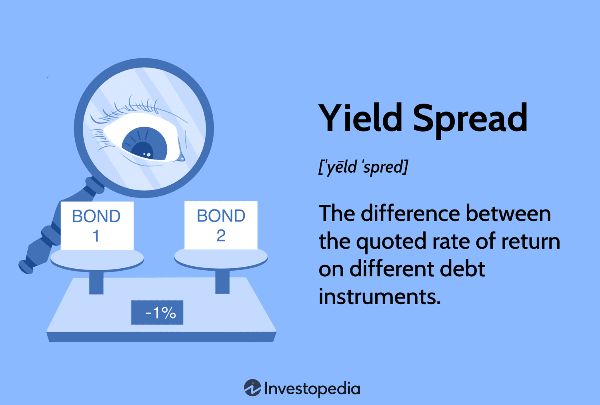

Understanding the concept of spreads is crucial in the financial and investment sectors, providing essential insights into the health of the economy and the risk/reward profiles of different debt instruments. Spreads act as vital indicators, helping investors and analysts gauge market conditions and make informed decisions.

In financial markets, spreads generally refer to the difference between two prices, rates, or yields. Notably, yield spreads, financial spreads, and bond spreads serve as primary tools for measuring market sentiment and economic factors. Yield spreads are particularly critical, indicating the difference in yields between securities with varying maturities or credit qualities. Such spreads can highlight perceived risk levels associated with specific investments and potential market volatility.

This article aims to explore these spreads comprehensively, providing a detailed breakdown of their definitions, various types, and their implications for financial markets. Recognizing different types of spreads—such as the zero-volatility spread or the credit spread—is essential for understanding underlying credit risks and formulating strategic investment decisions.

In addition, this article will examine the significant role algorithmic trading plays in utilizing these spreads to optimize trade executions. Algorithmic trading, with its reliance on real-time data analysis, leverages spreads to identify arbitrage opportunities and streamline liquidity provision processes. This practice underscores the importance of spread analysis in achieving efficient trading outcomes.

Our exploration will incorporate practical examples and real-world use cases to illustrate the application and significance of spreads in today's economic landscape. By doing so, readers will gain a holistic understanding of how these financial metrics influence investment strategies, market assessments, and ultimately, economic planning.

## Table of Contents

## What is a Yield Spread?

A yield spread is the quantitative difference between the yields of various debt instruments, commonly expressed in basis points or percentage points. Yield spreads provide insights into the variation in several characteristics of debt instruments, including credit ratings, maturity dates, issuers, and associated risk levels. These spreads are crucial metrics for bond investors assessing the cost and potential returns of various bonds.

### Key Concepts of Yield Spreads

**Credit Spreads**: This reflects the difference in yield between a risk-free government bond, such as a U.S. Treasury security, and another bond with the same maturity but issued by a different entity, typically a corporation. Credit spreads indicate the additional interest rate investors require to compensate for the increased risk of default associated with the corporate bond.

**Zero-Volatility Spreads (Z-spreads)**: This spread measures the constant yield spread added to the yield curve that would make the present value of a bond’s cash flows equal to its market price. The Z-spread accounts for the bond’s cash flows occurring at different times, making it a valuable tool for comparing bonds with embedded options or different risk characteristics.

**High-Yield Bond Spreads**: These spreads indicate the yield difference between high-yield (also known as junk) bonds and investment-grade bonds. High-yield spreads are often tracked to assess market sentiment toward riskier investments; widening spreads usually suggest increased risk aversion among investors.

**Option-Adjusted Spreads (OAS)**: This spread adjusts the yield spread to account for bonds with embedded options, such as callable or putable bonds. The OAS is crucial for evaluating the true yield spread after considering the influence of optionality on a bond’s price and yield.

### Economic and Market Indicators

Yield spreads act as primary indicators of economic or market changes. A narrowing yield spread often suggests decreasing risk, improving economic conditions, or a declining default probability. Conversely, widening yield spreads typically indicate increasing risk aversion, potential economic slowdown, or heightened default risk. For instance, a rapidly widening credit spread can alert investors to deteriorating economic conditions or fiscal stress within corporations. Yield spreads, therefore, not only assess relative value but also serve as a barometer for broader economic health and market dynamics.

In summary, yield spreads are integral to understanding the risk and reward profiles of debt instruments and provide valuable foresight into economic trends and market sentiment. These spreads offer investors a framework for making informed decisions regarding bond investments and portfolio strategies.

## How Yield Spreads Work

Yield spreads serve as a critical tool for evaluating the costs associated with bond investments. They effectively measure the yield differential between various debt instruments, helping investors gauge market sentiments and associated risk factors. When bond yields fluctuate, these spreads provide insights into the expected return on investment and the associated risk, revealing the health and stability of financial markets.

Bond yields are influenced by several market dynamics, including [interest rate](/wiki/interest-rate-trading-strategies) changes, inflation expectations, and the creditworthiness of issuers. For example, when economic conditions are stable, yield spreads may narrow as investors exhibit confidence, leading to a reduced perception of risk. Conversely, in times of economic uncertainty or distress, yield spreads tend to widen, signaling increased risk aversion and a preference for safer investments.

The expansion or contraction of yield spreads can signal broader economic trends. An expansion, or widening of spreads, often suggests increasing concern over the financial health of issuers or an anticipation of economic downturns. This is particularly evident when the spread between corporate bonds and government securities increases, highlighting a flight to quality. In contrast, a contraction, or narrowing of these spreads, may indicate improving economic conditions or enhanced investor confidence in higher-risk investments.

Yield spreads also play a predictive role in forecasting market trends, including recessions and recoveries. Historically, a sharp increase in the yield spread between long-term government bonds and short-term treasuries, commonly referred to as the yield curve, has been a precursor to economic recessions. This phenomenon occurs because investors anticipate future rate cuts aimed at stimulating economic growth, prompting a shift toward long-dated securities.

To illustrate the practical impact of changes in yield spreads, consider a scenario where the spread between 10-year Treasury notes and 2-year Treasury notes narrows. This can indicate an impending economic expansion, driven by expectations of short-term interest rate hikes as monetary policy aims to cool an overheating economy.

In conclusion, the insights gleaned from yield spreads are integral for investors and financial analysts seeking to optimize their portfolios and predict economic shifts. Understanding these dynamics ensures informed investment decisions, aiding in the assessment and management of financial risk.

## Types of Yield Spreads

Different types of yield spreads exist, each providing distinct insights into the risk and return dynamics of bonds. Among the prominent ones are zero-[volatility](/wiki/volatility-trading-strategies) spreads (Z-spreads), credit spreads, option-adjusted spreads (OAS), and high-yield bond spreads. Understanding these spreads is crucial for investors aiming to evaluate credit risks and leverage investment opportunities.

### Zero-Volatility Spreads (Z-Spreads)

The zero-volatility spread measures the constant spread over a benchmark yield curve, typically the risk-free rate, required to discount a bond's cash flows to its present market price. It incorporates all the expected cash flows under the assumption that interest rates are non-volatile. The Z-spread is distinct from the nominal spread because it adjusts for term structure differences. It offers investors a clearer picture of the bond's yield when considering the entire yield curve instead of just comparing it to a single point on the curve.

### Credit Spreads

Credit spreads denote the yield difference between a corporate bond and a government bond of comparable maturity, most often a U.S. Treasury security. Calculated as:

$$
\text{Credit Spread} = \text{Yield}_{\text{corporate}} - \text{Yield}_{\text{Treasury}}
$$

Credit spreads reflect the additional risk investors assume for holding corporate bonds over risk-free government bonds. They serve as a critical indicator of the issuer's credit quality and are influenced by factors such as economic outlook, company performance, and overall market sentiment.

### Option-Adjusted Spreads (OAS)

Option-adjusted spreads account for embedded options within a bond, such as call or put features. They adjust the Z-spread further by quantifying how these options affect bond valuation. The OAS analysis involves calculating the spread needed to justify the bond's price while accounting for these features. It effectively refines the Z-spread by subtracting the value that options add to expected cash flows, offering a purer measure of credit risk. Thus, OAS is particularly valuable for comparing bonds that have different option characteristics.

### High-Yield Bond Spreads

High-yield bond spreads, often referred to as junk bond spreads, measure the yield difference between high-yield (speculative-grade) bonds and sovereign bonds of similar maturity. These spreads are broader due to the greater risk of default associated with high-yield securities. Investors demand higher returns for assuming increased risk, which is reflected in wider spreads. The movement of these spreads is an economic barometer, often widening in times of economic uncertainty and tightening as market conditions improve.

### Implications on Pricing and Risk Evaluation

Yield spreads have significant implications for bond pricing and risk evaluation. Narrowing spreads typically signal improving economic conditions or a reduced perceived risk in the bond sector, whereas widening spreads may indicate economic stress or rising credit risk. Understanding the characteristics and computations of yield spreads allows investors to make informed decisions, helping them price bonds accurately and assess the embedded risks effectively. An appreciation of spreads aids in evaluating the attractiveness of potential investments and managing bond portfolio risks.

## Yield Spread vs. Credit Spread

A bond credit spread is defined as the yield difference between a treasury bond and a corporate bond with the same maturity. This distinction is significant for investors aiming for precise risk assessment and forecasting market trends. A credit spread is specifically focused on the risk associated with a particular issuer, above and beyond the risk-free rate provided by government securities such as U.S. Treasury bonds.

The U.S. Treasury bond is regarded as the standard benchmark in this comparison due to its perceived safety and [liquidity](/wiki/liquidity-risk-premium). Essentially, the spread reflects the additional yield an investor demands as compensation for taking on the added risk of a corporate bond over a government bond. This risk premium is crucial for understanding the market's perception of the creditworthiness of the corporate entity.

Understanding the nuances between yield spreads in general and credit spreads, in particular, is valuable for financial evaluation. Yield spreads encompass a broader range of comparisons, including differences between bonds of varying maturities or between two bonds of different issuers, which reflects not only credit risk but also factors like maturity or liquidity preferences.

Credit spreads are key indicators of market confidence and economic conditions. A widening credit spread often signals increasing risk aversion in the market, suggesting that investors demand greater compensation for perceived higher risks associated with corporate bonds. Conversely, narrowing spreads can indicate enhanced market confidence and a bullish economic outlook.

A practical example of how credit spreads function as economic indicators can be seen during financial crises. Typically, credit spreads widen significantly as investors become more risk-averse, signaling potential economic slowdowns or heightened financial instability. For instance, during the 2008 financial crisis, credit spreads widened sharply as market participants demanded higher yields to compensate for the increased risk of corporate defaults.

In summary, differentiating between yield spreads and credit spreads allows for a deeper understanding of market dynamics. While both measure yield differences, the scope and implications differ significantly. Yield spreads provide a broad view of bond market conditions, while credit spreads zoom in on credit quality and issuer-specific risk assessments, serving as a thermometer of market sentiment and economic health.

## Spreads in Algorithmic Trading

Algorithmic trading leverages yield spreads to execute high-speed trading strategies by incorporating sophisticated algorithms that identify and exploit [arbitrage](/wiki/arbitrage) opportunities. These opportunities arise when there is a temporary discrepancy between the prices of related financial instruments. Yield spreads, which denote the difference in yields between two bonds of differing maturities, can signal when such discrepancies exist. Algorithms capitalize on these signals by executing trades across multiple markets to capture profits from transient inefficiencies.

One primary application in [algorithmic trading](/wiki/algorithmic-trading) is in the field of liquidity provision and [market making](/wiki/market-making). Algorithms utilize yield spread information to determine the optimal bid-ask spreads for trading securities. By continually adjusting these spreads based on real-time market data, algorithmic traders can provide liquidity to the markets while simultaneously minimizing risk exposure and maximizing profit margins.

Real-time data analytics play a crucial role in enhancing trading efficiency. Algorithms are designed to process vast quantities of market data in milliseconds, allowing them to adjust strategies and respond to market movements instantaneously. This capability is essential for maintaining a competitive edge in markets characterized by rapid fluctuations and high volatility. Automated platforms equipped with real-time analytics can execute large volumes of trades with precision, significantly reducing the time required to execute manual trading strategies.

The impact of fintech solutions on spread trading strategies is profound. Fintech innovations have introduced advanced tools and platforms that facilitate the management and implementation of algorithmic trading strategies based on yield spreads. These solutions enable traders to fine-tune their algorithms, backtest strategies against historical data, and deploy them in live markets with advanced monitoring and risk management features. Python, a prevalent language in fintech, offers libraries such as Pandas and NumPy for handling data and quantitative analysis, while frameworks like TensorFlow and PyTorch can enhance algorithmic models through [machine learning](/wiki/machine-learning), improving the prediction and execution of trades based on yield spread movements.

Overall, the integration of yield spreads in algorithmic trading strategies underscores the necessity for advanced technological adoption by financial market participants, ensuring swift adaptation to market changes and optimizing investment outcomes.

## Conclusion

Understanding yield spreads, financial spreads, and bond spreads is essential for participants in financial markets. These spreads provide insights not only into individual investment opportunities but also into the broader economic landscape. They help investors, traders, and financial analysts evaluate risk, return potential, and market sentiment.

Various types of spreads act as barometers of economic health and market conditions. For instance, a widening credit spread may indicate growing economic uncertainty or perceivable increases in credit risk. Conversely, a narrowing spread can signify improving economic conditions or enhanced investor confidence. By systematically analyzing spread movements, financial analysts can derive valuable insights into future economic trends and assess the likelihood of different economic scenarios.

Algorithmic trading has revolutionized the way spreads are analyzed and leveraged. Accurate spread analysis allows algorithms to identify arbitrage opportunities and execute trades with high precision and efficiency. This is particularly effective in high-frequency trading environments, where speed and accuracy are paramount. The ability to process large volumes of data in real time ensures that trading strategies are always optimized based on the most current information.

The rapid advancements in financial technology (fintech) and algorithmic trading continue to refine how spreads are utilized in trading activities. Innovations such as machine learning, [artificial intelligence](/wiki/ai-artificial-intelligence), and advanced data analytics enhance the capacity to analyze complex spread structures and implement sophisticated trading strategies. These technologies enable traders to gain deeper insights into market dynamics and optimize their portfolios effectively.

Ultimately, a comprehensive understanding of spreads is crucial for making informed investment decisions and managing financial risks. As the financial markets become increasingly complex and interconnected, the role of spreads as key indicators of market conditions and economic health will only grow. Investors and financial professionals who effectively integrate spread analysis into their decision-making process will be better equipped to navigate the challenges and opportunities of the modern financial landscape.

## References & Further Reading

[1]: ["Fixed Income Analysis" (CFA Institute Investment Series)](https://www.amazon.com/Fixed-Income-Analysis-Barbara-Petitt/dp/1119850541) by Frank J. Fabozzi

[2]: ["Interest Rate Markets: A Practical Approach to Fixed Income" (Wiley Finance)](https://www.wiley.com/en-us/Interest+Rate+Markets%3A+A+Practical+Approach+to+Fixed+Income-p-9780470932209) by Siddhartha Jha

[3]: ["The Basics of Financial Econometrics: Tools, Concepts, and Asset Management Applications"](https://onlinelibrary.wiley.com/doi/book/10.1002/9781118856406) by Frank J. Fabozzi, Sergio M. Focardi, Svetlozar T. Rachev, and Bala G. Arshanapalli

[4]: ["Algorithmic Trading: Winning Strategies and Their Rationale"](https://www.wiley.com/en-us/Algorithmic+Trading%3A+Winning+Strategies+and+Their+Rationale-p-9781118460146) by Ernie Chan

[5]: ["Interest Rate Swaps and Other Derivatives" (Wiley Finance)](https://www.wiley.com/en-us/Interest+Rate+Swaps+and+Their+Derivatives%3A+A+Practitioner%27s+Guide-p-9780470443941) by Howard Corb