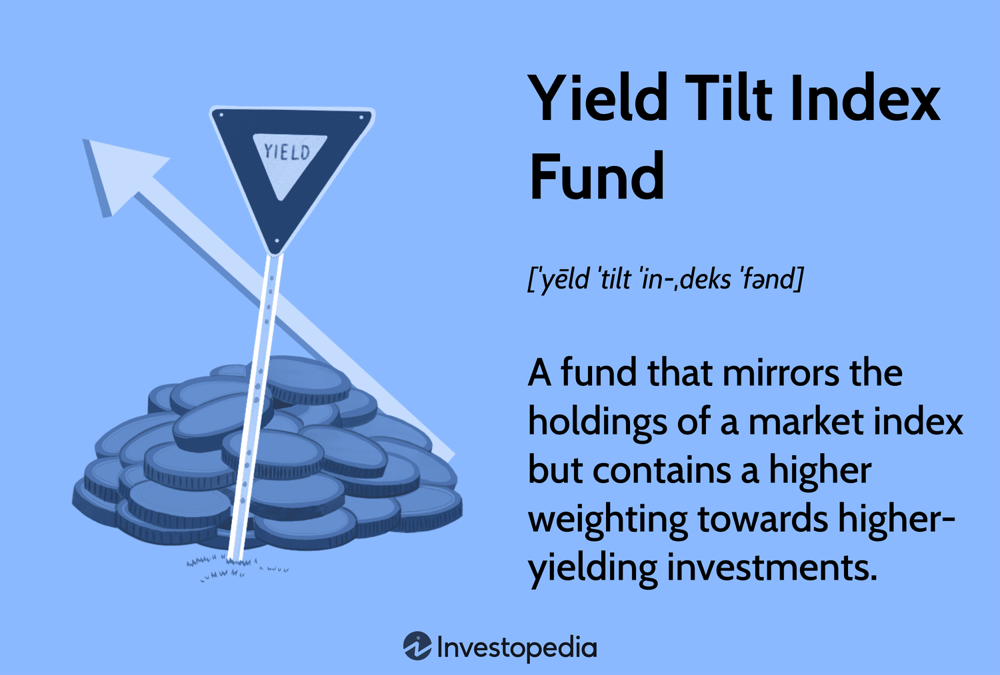

## Table of Contents

## What is a Yield Tilt Index Fund?

A Yield Tilt Index Fund is a type of investment fund that focuses on stocks that pay higher dividends. Dividends are payments companies make to their shareholders from their profits. By tilting towards stocks with higher yields, the fund aims to provide investors with a higher income stream compared to a regular index fund.

These funds are based on an index, which is a collection of stocks that represent a particular market or sector. The "tilt" means the fund adjusts its holdings to include more of the high-yield stocks than what the original index might have. This strategy can be attractive for investors looking for regular income, but it also comes with risks, as high-yield stocks can sometimes be riskier or less stable.

## How does a Yield Tilt Index Fund differ from a traditional index fund?

A Yield Tilt Index Fund is different from a traditional index fund because it focuses on stocks that pay higher dividends. A traditional index fund tries to match the performance of a broad market index, like the S&P 500, by holding all the stocks in that index in the same proportions. On the other hand, a Yield Tilt Index Fund changes the mix of stocks to include more of those that offer higher dividend payments. This means it doesn't just copy the index but adjusts it to focus on income.

This difference in focus can lead to different investment outcomes. A traditional index fund aims to give investors a return that closely follows the overall market. It's about getting a broad exposure to the market's performance. A Yield Tilt Index Fund, however, is designed to provide investors with a higher income from dividends. While this can be good for people looking for regular income, it might also mean the fund performs differently from the market as a whole, and it could be riskier because high-yield stocks can sometimes be less stable.

## What are the benefits of investing in a Yield Tilt Index Fund?

One big benefit of investing in a Yield Tilt Index Fund is that it can give you more money from dividends. These funds pick stocks that pay higher dividends, so you get more income from your investment. This can be really helpful if you need regular money coming in, like if you're retired or saving for something specific.

Another benefit is that these funds still give you a broad spread of investments, just like a regular index fund. This means you're not putting all your eggs in one basket. Even though the fund focuses on high-yield stocks, it's still based on a big index, so you get to own a piece of many different companies. This can help lower your risk compared to [picking](/wiki/asset-class-picking) individual stocks.

Lastly, Yield Tilt Index Funds can be a good way to balance growth and income. While you get more dividends, you're also still invested in the market, which can grow over time. This mix can be a smart way to build wealth while also getting some regular income.

## What are the potential risks associated with Yield Tilt Index Funds?

One risk of investing in a Yield Tilt Index Fund is that it might not grow as much as the overall market. These funds focus on stocks that pay high dividends, but those stocks might not be the ones that grow the fastest. So, if the market goes up a lot, your fund might not go up as much because it's tilted towards different kinds of stocks.

Another risk is that high-yield stocks can sometimes be riskier. Companies that pay big dividends might be doing it because they're not growing much or because they're in trouble. If those companies run into problems, their stock prices could drop a lot, which would hurt your fund's value. This means your investment could be more up and down than a regular index fund.

Lastly, there's the risk of [interest rate](/wiki/interest-rate-trading-strategies) changes. When interest rates go up, high-yield stocks can become less attractive because people can get better returns from safer investments like bonds. If investors start moving their money out of high-yield stocks and into bonds, the value of your Yield Tilt Index Fund could go down.

## How is the yield tilt implemented in these funds?

Yield tilt in these funds is done by changing the mix of stocks in the fund. Instead of just copying a big index like the S&P 500, the fund managers pick more stocks that pay high dividends. They do this by looking at how much each company pays in dividends and then putting more money into the ones that pay a lot. This means the fund ends up with a different mix of stocks than the original index, with more focus on the ones that give out bigger dividends.

This tilting can be done in different ways. Some funds might just add a bit more of the high-yield stocks, while others might go all in on them. The idea is to keep the fund based on a broad index but to shift it so that it gives investors more income from dividends. By doing this, the fund tries to give you the best of both worlds: a spread of investments like a regular index fund, but with more money coming in from dividends.

## What types of assets are typically included in a Yield Tilt Index Fund?

A Yield Tilt Index Fund usually includes stocks from big companies that pay high dividends. These companies can be from different industries like energy, utilities, or finance. The fund picks more of these high-yield stocks than what you'd find in a regular index, so it's still based on a broad market index but with a focus on income.

The stocks in the fund are chosen because they give out bigger dividends. This means the fund might have more stocks from sectors known for paying good dividends, like utilities or real estate investment trusts (REITs). Even though the fund tilts towards these high-yield stocks, it still tries to keep a mix of different types of companies to spread out the risk.

## How does the performance of a Yield Tilt Index Fund compare to other types of funds?

The performance of a Yield Tilt Index Fund can be different from other types of funds because it focuses on stocks that pay high dividends. Compared to a regular index fund, a Yield Tilt Index Fund might give you more money from dividends, but it might not grow as fast as the overall market. This is because the stocks that pay big dividends are often not the ones that grow the quickest. So, if the market goes up a lot, your Yield Tilt Index Fund might not go up as much.

When you compare it to funds that focus on growth, like growth stock funds, the difference can be even bigger. Growth stock funds aim to pick stocks that will increase in value a lot, but they usually don't pay big dividends. So, a Yield Tilt Index Fund might give you more income, but it might not grow as much as a growth fund. It's all about what you want from your investment - more income now or more growth over time.

Lastly, compared to bond funds, Yield Tilt Index Funds can be riskier but might offer higher returns. Bond funds are usually safer and give you steady income, but they don't grow as much as stocks. A Yield Tilt Index Fund, with its focus on high-yield stocks, can give you more income than a bond fund, but it also comes with more ups and downs. So, it depends on how much risk you're willing to take for the chance of higher income and some growth.

## What should investors consider before investing in a Yield Tilt Index Fund?

Before investing in a Yield Tilt Index Fund, investors should think about what they want from their investment. These funds focus on stocks that pay high dividends, so they can give you more money coming in regularly. This can be good if you need income now, like if you're retired. But, these funds might not grow as fast as the overall market because they pick stocks that pay big dividends, and those stocks might not be the ones that grow the quickest. So, if you're looking for your investment to grow a lot over time, a Yield Tilt Index Fund might not be the best choice.

Investors should also think about how much risk they're okay with. High-yield stocks can be riskier because the companies paying big dividends might be in trouble or not growing much. This means the value of your investment could go up and down more than with a regular index fund. Also, if interest rates go up, people might move their money to safer investments like bonds, which could make the value of your Yield Tilt Index Fund go down. So, it's important to think about how much risk you can handle and if the extra income from dividends is worth it for you.

## How do Yield Tilt Index Funds manage their portfolios to maximize yield?

Yield Tilt Index Funds manage their portfolios by picking more stocks that pay high dividends. They start with a big index like the S&P 500, but then they change the mix of stocks to include more of the ones that give out bigger dividends. This means they might have more stocks from companies in industries like energy, utilities, or finance, which are known for paying good dividends. By doing this, the fund tries to give investors more money from dividends than they would get from a regular index fund.

To maximize yield, these funds keep a close eye on how much each company pays in dividends. They might add a bit more of the high-yield stocks or go all in on them, depending on their strategy. The goal is to keep the fund based on a broad market index but shift it to focus on income. This way, the fund can still give investors a spread of investments to lower risk, but with the added benefit of more income from dividends.

## What are the tax implications of investing in a Yield Tilt Index Fund?

Investing in a Yield Tilt Index Fund can have tax implications because of the dividends you get. Dividends are payments from companies to their shareholders, and they are usually taxed as income. This means that the money you get from dividends in a Yield Tilt Index Fund will be added to your other income, and you'll have to pay taxes on it. The tax rate can depend on how much money you make overall and where you live, so it's good to check with a tax advisor to know exactly what you'll owe.

Another thing to think about is capital gains. If you sell your shares in the fund for more than you paid for them, you'll have to pay taxes on the profit. This is called a capital gain. The tax rate on capital gains can be different from the tax rate on dividends, and it can also depend on how long you held the shares before selling them. If you held them for more than a year, you might pay a lower tax rate on the gain. It's important to keep these tax rules in mind when you're thinking about investing in a Yield Tilt Index Fund.

## How do regulatory changes affect Yield Tilt Index Funds?

Regulatory changes can have a big impact on Yield Tilt Index Funds. These funds focus on stocks that pay high dividends, and if the government changes the rules about how companies can pay dividends or how much tax investors have to pay on them, it can change how much money the fund makes. For example, if new rules make it harder for companies to pay big dividends, the fund might not get as much income from its investments. Also, if the government changes the tax rules on dividends, it could mean investors get to keep less of the money they earn from the fund.

Another way regulatory changes can affect these funds is through changes in the rules about what kinds of stocks the fund can invest in. If new laws make it harder for the fund to buy certain high-yield stocks, it might have to change its strategy. This could mean the fund has to pick different stocks or adjust how much it tilts towards high-yield stocks. All these changes can make the fund perform differently than before, so it's important for investors to keep an eye on what's happening with regulations.

## What advanced strategies can be used to optimize returns in a Yield Tilt Index Fund?

To optimize returns in a Yield Tilt Index Fund, one strategy is to use dividend reinvestment. This means taking the money you get from dividends and using it to buy more shares of the fund. Over time, this can help your investment grow faster because you're getting more shares without spending extra money. Another strategy is to keep an eye on the fund's performance and the market. If the fund isn't doing well compared to other funds, you might want to switch to a different Yield Tilt Index Fund that's doing better. This can help you get the best returns possible.

Another way to optimize returns is to pay attention to the sectors the fund invests in. Some sectors, like utilities or real estate, are known for paying good dividends. If you think these sectors will do well in the future, you might want to pick a Yield Tilt Index Fund that focuses more on them. Also, it's smart to think about the fees you're paying. Some funds charge higher fees than others, and these fees can eat into your returns. Picking a fund with lower fees can help you keep more of your money over time.

## References & Further Reading

[1]: Bergstra, J., Bardenet, R., Bengio, Y., & Kégl, B. (2011). ["Algorithms for Hyper-Parameter Optimization."](https://dl.acm.org/doi/10.5555/2986459.2986743) Advances in Neural Information Processing Systems 24.

[2]: ["Advances in Financial Machine Learning"](https://www.amazon.com/Advances-Financial-Machine-Learning-Marcos/dp/1119482089) by Marcos Lopez de Prado

[3]: ["Evidence-Based Technical Analysis: Applying the Scientific Method and Statistical Inference to Trading Signals"](https://www.amazon.com/Evidence-Based-Technical-Analysis-Scientific-Statistical/dp/0470008741) by David Aronson

[4]: ["Machine Learning for Algorithmic Trading"](https://github.com/stefan-jansen/machine-learning-for-trading) by Stefan Jansen

[5]: ["Quantitative Trading: How to Build Your Own Algorithmic Trading Business"](https://www.amazon.com/Quantitative-Trading-Build-Algorithmic-Business/dp/1119800064) by Ernest P. Chan