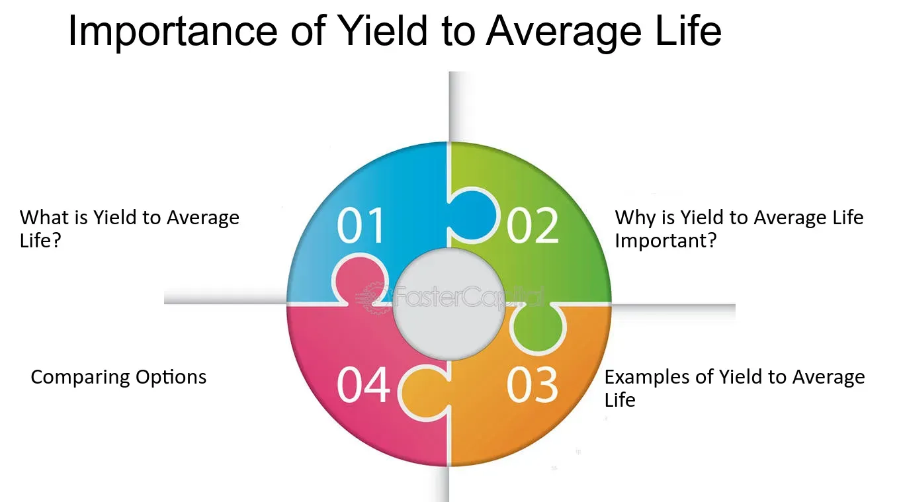

## Table of Contents

## What is 'Yield to Average Life' and why is it important?

'Yield to Average Life' is a financial term used to measure the return on a bond if it is held until its average life, rather than its maturity date. The average life of a bond is the average time it takes for the bond's principal to be repaid. This is different from the maturity date, which is when the bond officially ends. Yield to Average Life is especially useful for bonds that can be paid off early, like mortgage-backed securities.

This measure is important because it gives investors a more accurate idea of what they might earn from a bond that could be paid off before its maturity date. If a bond is likely to be paid off early, the yield to maturity might not be a good measure of the bond's return. By using yield to average life, investors can better understand the potential returns and risks of their investment, helping them make smarter choices about which bonds to buy.

## How is 'Yield to Average Life' calculated?

To calculate 'Yield to Average Life', you need to know the bond's price, its coupon payments, and the schedule of principal repayments. First, you figure out the average life of the bond. This is done by taking the total time until all principal is paid back, weighted by the amount of principal paid at each time. For example, if half the principal is paid back in year 2 and the other half in year 4, the average life would be (2 * 0.5) + (4 * 0.5) = 3 years.

Once you have the average life, you can calculate the yield to average life. This is similar to calculating yield to maturity, but you use the average life instead of the maturity date. You find the [interest rate](/wiki/interest-rate-trading-strategies) that makes the present value of all future cash flows (coupon payments and principal repayments) equal to the bond's current price. This interest rate is the yield to average life. It tells you what return you would get if you held the bond until its average life, not its maturity date.

## What are the key components needed to determine 'Yield to Average Life'?

To figure out 'Yield to Average Life', you need to know a few important things about the bond. First, you need the bond's price, which is how much it costs to buy the bond. Second, you need to know the coupon payments, which are the regular interest payments the bond makes. Third, you need the schedule of when the bond's principal, or the money you lent, will be paid back. This schedule is important because it helps you find the average life of the bond.

The average life is calculated by looking at when the principal is paid back and weighting it by how much is paid at each time. For example, if half the principal is paid back in year 2 and the other half in year 4, the average life would be 3 years. Once you have the average life, you can find the yield to average life. This is done by finding the interest rate that makes the total value of all future payments (coupon payments and principal) equal to the bond's current price. This interest rate is the yield to average life, which shows the return you would get if you held the bond until its average life, not its maturity date.

## Can you explain the difference between 'Yield to Average Life' and 'Yield to Maturity'?

'Yield to Average Life' and 'Yield to Maturity' are two ways to figure out how much money you might make from a bond. 'Yield to Maturity' is the total return you would get if you held the bond until it reaches its maturity date, which is when the bond officially ends. This calculation includes all the interest payments you get along the way and the final payment of the bond's principal. It's a good measure for bonds that will definitely be paid back at the end of their term.

'Yield to Average Life' is different because it looks at what happens if the bond is paid off before its maturity date. This is important for bonds like mortgage-backed securities, where the principal might be paid back early. To find the 'Yield to Average Life', you calculate the average time it takes for the bond's principal to be paid back, and then figure out the return based on that time. This gives you a better idea of what you might earn if the bond doesn't last until its maturity date.

## In what types of investments is 'Yield to Average Life' most commonly used?

'Yield to Average Life' is most commonly used in investments where the principal can be paid back early, like mortgage-backed securities. These are bonds that are backed by home loans. When people pay off their mortgages early, the money comes back to the investors sooner than expected. So, it's helpful to know the average time it takes to get the money back, not just when the bond officially ends.

This measure helps investors understand what they might earn if the bond is paid off before its maturity date. It's not as useful for regular bonds that will definitely be paid back at the end of their term. But for things like mortgage-backed securities, 'Yield to Average Life' gives a better picture of the potential return and helps investors make smarter choices about where to put their money.

## How does 'Yield to Average Life' affect investment decisions?

'Yield to Average Life' helps investors make better choices about where to put their money, especially when they're looking at bonds that might be paid off early. For example, if you're thinking about buying a mortgage-backed security, you want to know how much money you might make if people pay off their mortgages sooner than expected. 'Yield to Average Life' gives you that information by showing the return you'd get if you held the bond until the average time it takes for the principal to be paid back. This can be different from the bond's official end date, so it's a more accurate way to figure out what you might earn.

Knowing the 'Yield to Average Life' can change how you see the risks and rewards of an investment. If the yield is high, it might mean the bond could be paid off quickly, which could be good if you want your money back sooner. But it also means you need to think about what you'll do with that money next. If the yield is low, it might mean the bond will take longer to pay back, which could be okay if you're looking for a steady income over time. Either way, 'Yield to Average Life' helps you plan better and pick investments that fit your goals.

## What are the limitations of using 'Yield to Average Life' as a metric?

One big problem with using 'Yield to Average Life' is that it's based on guesses about when the bond's principal will be paid back. If those guesses are wrong, the yield you calculate won't be right either. For example, if people pay off their mortgages faster or slower than expected, the actual return you get from a mortgage-backed security could be different from what 'Yield to Average Life' tells you.

Another issue is that 'Yield to Average Life' doesn't tell you everything about the risks of the bond. It focuses on the timing of when you get your money back, but it doesn't say much about other risks, like if the people who owe the money might not be able to pay it back at all. So, while 'Yield to Average Life' can help you understand one part of your investment, you need to look at other things too to get the full picture.

## How can 'Yield to Average Life' be used to compare different investment options?

When you want to compare different investment options, 'Yield to Average Life' can help you see which one might give you a better return if the money comes back to you sooner than expected. For example, if you're looking at two mortgage-backed securities, you can use 'Yield to Average Life' to figure out which one would give you more money if people pay off their mortgages early. This way, you can pick the investment that fits your plan for getting your money back and using it again.

But remember, 'Yield to Average Life' is just one piece of the puzzle. It's good for understanding how much you might earn if the bond is paid off early, but it doesn't tell you everything about the risks. So, when you're comparing investments, you should also look at other things like how likely it is that the people who owe the money will be able to pay it back. By looking at all these factors together, you can make a smarter choice about where to put your money.

## What are some real-world examples where 'Yield to Average Life' has been a critical factor in investment analysis?

In the world of finance, 'Yield to Average Life' has been really important for people investing in mortgage-backed securities. These are bonds that are backed by home loans. When people pay off their mortgages early, it changes how much money investors get back and when they get it. For example, during times when interest rates were low, a lot of people refinanced their homes to get better rates. This meant that the money from mortgage-backed securities came back to investors faster than expected. By using 'Yield to Average Life', investors could figure out what they might earn if this happened, helping them decide if these securities were a good investment.

Another real-world example is when investors look at bonds from companies that might pay off their debt early. If a company is doing well and decides to pay back its bonds before they're due, 'Yield to Average Life' helps investors understand what they might earn in that situation. This was important during economic recoveries when companies had extra money and chose to pay off their debts early. By knowing the 'Yield to Average Life', investors could better compare these bonds with other investment options and make smarter choices about where to put their money.

## How does the concept of 'Yield to Average Life' apply to bonds with sinking fund provisions?

Bonds with sinking fund provisions are a bit like mortgage-backed securities because they can be paid off early. A sinking fund is a way for a company to set aside money to pay off its bonds before they're due. This means that the bond might not last until its maturity date, just like a mortgage-backed security might not last if people pay off their homes early. 'Yield to Average Life' is really helpful here because it tells investors what they might earn if the bond is paid off early through the sinking fund.

When you're looking at a bond with a sinking fund, 'Yield to Average Life' helps you figure out the return you'd get if the bond is paid off at different times. This is important because it gives you a better idea of what to expect from your investment. If the company uses the sinking fund to pay off the bond sooner than expected, 'Yield to Average Life' shows you what that would mean for your money. This way, you can compare these bonds with other investments and decide if they're a good fit for your plans.

## What advanced techniques can be used to refine the calculation of 'Yield to Average Life'?

One way to make the calculation of 'Yield to Average Life' better is by using more detailed data about when the bond's principal might be paid back. Instead of just guessing, you can use computer models that look at past data and current trends to predict when the money will come back. For example, if you're looking at mortgage-backed securities, you can use information about how quickly people are paying off their mortgages right now to make a better guess about the future. This can help you get a more accurate idea of the bond's average life and what you might earn from it.

Another advanced technique is to use something called Monte Carlo simulations. This is a fancy way of saying that you run a lot of different scenarios to see what might happen. You can use a computer to pretend that the bond's principal is paid back at different times and in different amounts, and then see what the 'Yield to Average Life' would be in each case. By looking at all these different possibilities, you can get a better sense of the risks and rewards of the bond. This helps you make smarter investment choices because you can see a range of outcomes, not just one guess.

## How might changes in interest rates impact the 'Yield to Average Life' of an investment?

When interest rates change, it can affect the 'Yield to Average Life' of an investment like a bond. If interest rates go down, people might pay off their loans early to get a better rate. This means the money from bonds like mortgage-backed securities could come back to investors sooner than expected. When this happens, the 'Yield to Average Life' might go up because you're getting your money back faster. But if interest rates go up, people might not pay off their loans as quickly, so the money comes back slower. This could make the 'Yield to Average Life' go down because you're waiting longer to get your money back.

Understanding how interest rates affect 'Yield to Average Life' is important for making smart investment choices. If you think interest rates will go down, you might want to invest in bonds that could be paid off early, because the 'Yield to Average Life' could be higher. But if you think interest rates will go up, you might look for other investments where the timing of getting your money back isn't as important. By keeping an eye on interest rates, you can better predict what might happen to your investment and plan accordingly.

## References & Further Reading

[1]: Fisher, L. (1996). ["The Price-Varying Call Option in Callable Bonds."](https://www.jstor.org/stable/pdf/2353198.pdf) The Journal of Finance, 51(4), 1417-1434.

[2]: ["Fixed Income Analysis"](https://en.wikipedia.org/wiki/Fixed_income_analysis) by CFA Institute

[3]: Fabozzi, F. J. (2005). ["The Handbook of Fixed Income Securities."](https://www.amazon.com/Handbook-Fixed-Income-Securities-Ninth/dp/1260473899) McGraw-Hill Education.

[4]: ["Algorithmic Trading: Winning Strategies and Their Rationale"](https://www.wiley.com/en-us/Algorithmic+Trading%3A+Winning+Strategies+and+Their+Rationale-p-9781118746912) by Ernie Chan

[5]: ["The Handbook of Mortgage-Backed Securities"](https://www.amazon.com/Handbook-Mortgage-Backed-Securities-7th/dp/0198785771) by Frank J. Fabozzi

[6]: ["Algorithmic and High-Frequency Trading"](https://assets.cambridge.org/97811070/91146/frontmatter/9781107091146_frontmatter.pdf) by Álvaro Cartea, Sebastian Jaimungal, and Jose Penalva